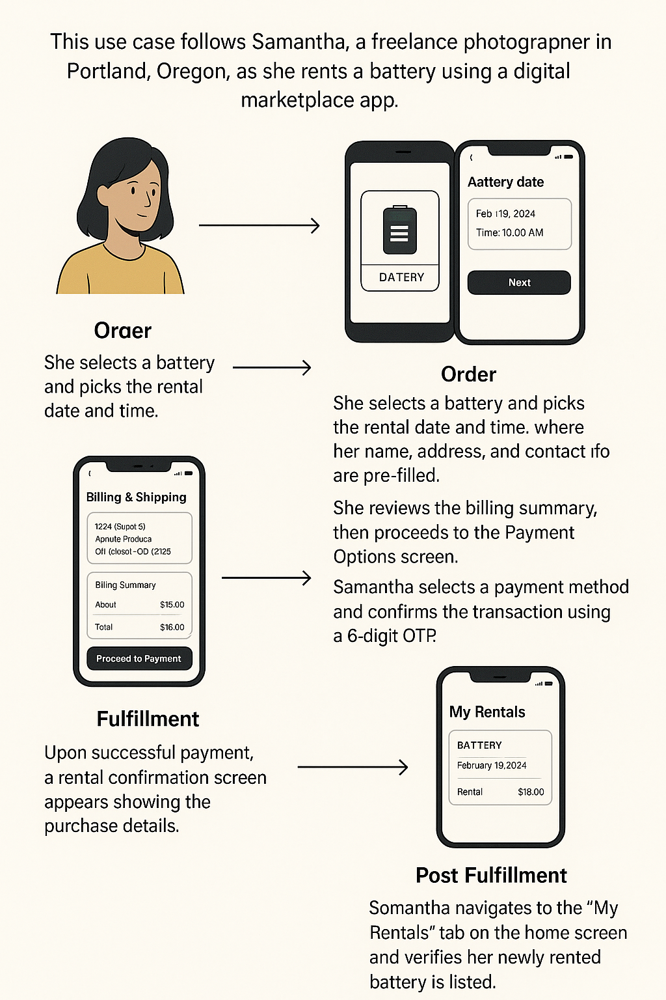

# UEI Implementation Guide - Battery Rental

#### Version 1.0

## Version History

| Date       | Version | Description     |
| ---------- | ------- | --------------- |
| 15-04-2025 | 1.0     | Initial Version |

## Introduction

This document provides example JSONs for the Energy: Battery Rental use case.

## Structure of the document

This document has the following parts:

1. Outcome Visualization - This is a pictorial or descriptive representation of the different use cases that are supported by the network.
2. API Calls and Schema - This section provides details on the API calls and the schema of the message that is sent in the form of sample schemas.

## Outcome Visualization

<!--  -->

### Use case - Discovery, order and fulfillment of Battery Rental services

This use case follows Samantha, a freelance photographer in Portland, Oregon, as she rents a battery using a digital marketplace app.

Discovery:
Samantha opens the app and taps on ‘Battery Rental’.
She uses the search box to explore all available rental batteries.

Order:
She selects a battery and picks the rental date and time.
The app redirects her to the Billing & Shipping page, where her name, address, and contact info are pre-filled.
She reviews the billing summary, then proceeds to the Payment Options screen.
Samantha selects a payment method and confirms the transaction using a 6-digit OTP.

Fulfillment:
Upon successful payment, a rental confirmation screen appears showing the purchase details.

Post Fulfillment:
Samantha navigates to the ‘My Rentals’ tab on the home screen
and verifies her newly rented battery is listed.

## API Calls and Schema

### search

```
{
    "context": {
        "domain": "deg:rental",
        "bap_id": "bap-ps-network-dev.becknprotocol.io",
        "action": "search",
        "bap_uri": "https://bap-ps-network-dev.becknprotocol.io",
        "version": "1.1.0",
        "transaction_id": "924dd6fb-8896-476e-9918-b0faf06d3e77",
        "message_id": "62cb31f3-c675-4a5b-a315-4835d2adccfd",
        "location": {
            "country": {
                "name": "United States",
                "code": "USA"
            }
        },
        "ttl": "PT10M",
        "timestamp": "2025-04-15T15:48:13.783Z"
    },
    "message": {
        "intent": {
            "item": {
                "descriptor": {
                    "name": "battery"
                }
            },
            "location": {
                "circle": {
                    "radius": {
                        "type": "CONSTANT",
                        "value": "5",
                        "unit": "km"
                    }
                }
            }
        }
    }
}
```

### on_search

```
 {
            "context": {
                "domain": "deg:rental",
                "action": "on_search",
                "version": "1.1.0",
                "bpp_id": "bpp-ps-network-strapi2-dev.becknprotocol.io",
                "bpp_uri": "http://bpp-ps-network-strapi2-dev.becknprotocol.io",
                "location": {
                    "country": {
                        "name": "United States",
                        "code": "USA"
                    }
                },
                "bap_id": "bap-ps-network-dev.becknprotocol.io",
                "bap_uri": "https://bap-ps-network-dev.becknprotocol.io",
                "transaction_id": "924dd6fb-8896-476e-9918-b0faf06d3e77",
                "message_id": "62cb31f3-c675-4a5b-a315-4835d2adccfd",
                "ttl": "PT10M",
                "timestamp": "2025-04-15T15:48:14.481Z"
            },
            "message": {
                "catalog": {
                    "descriptor": {
                        "name": "UrjaKart",
                        "code": "UrjaKart",
                        "short_desc": "A seller platform for energy solutions, enabling seamless transactions of batteries, solar panels, and other renewable energy products."
                    },
                    "providers": [
                        {
                            "id": "299",
                            "descriptor": {
                                "name": "Detroit Public School's Battery",
                                "short_desc": "Battery",
                                "long_desc": "Battery",
                                "additional_desc": {
                                    "url": "www.becknprotocol.io"
                                },
                                "images": [
                                    {
                                        "url": "https://m.media-amazon.com/images/I/51D9ZUF9W-L._AC_SX679_.jpg",
                                        "size_type": "sm"
                                    },
                                    {
                                        "url": "https://m.media-amazon.com/images/I/51D9ZUF9W-L._AC_SX679_.jpg",
                                        "size_type": "sm"
                                    }
                                ]
                            },
                            "categories": [
                                {
                                    "id": "33",
                                    "descriptor": {
                                        "name": "BATTERY RENTAL",
                                        "code": "BATTERY_RENTAL"
                                    }
                                }
                            ],
                            "rating": "4",
                            "fulfillments": [
                                {
                                    "id": "569",
                                    "type": "RENTAL_START",
                                    "rating": "4",
                                    "rateable": true,
                                    "state": {
                                        "descriptor": {
                                            "code": "timestamp",
                                            "name": "1744734600"
                                        }
                                    }
                                },
                                {
                                    "id": "570",
                                    "type": "RENTAL_END",
                                    "rating": "4",
                                    "rateable": true,
                                    "state": {
                                        "descriptor": {
                                            "code": "timestamp",
                                            "name": "1744806600"
                                        }
                                    }
                                },
                                {
                                    "id": "571",
                                    "type": "RENTAL_START",
                                    "rating": "4",
                                    "rateable": true,
                                    "state": {
                                        "descriptor": {
                                            "code": "timestamp",
                                            "name": "1744734600"
                                        }
                                    }
                                },
                                {
                                    "id": "572",
                                    "type": "RENTAL_END",
                                    "rating": "4",
                                    "rateable": true,
                                    "state": {
                                        "descriptor": {
                                            "code": "timestamp",
                                            "name": "1744806600"
                                        }
                                    }
                                }
                            ],
                            "rateable": true,
                            "items": [
                                {
                                    "id": "420",
                                    "descriptor": {
                                        "name": "STARMAX GC STCR-305 – 6-Volt Deep Cycle Flooded Battery",
                                        "code": "Battery",
                                        "short_desc": "STARMAX GC STCR-305 – 6-Volt Deep Cycle Flooded Battery, 305Ah X 8",
                                        "long_desc": "Experience unmatched power storage with our premium Battery Rental service, designed for efficient electric energy management.\n                  Our flexible Battery for Rent options ensure you always have access to reliable power storage when you need it.\n                  Choose to Rent a Battery today and harness a cost-effective solution tailored to your energy needs.",
                                        "images": [
                                            {
                                                "url": "https://m.media-amazon.com/images/I/51D9ZUF9W-L._AC_SX679_.jpg"
                                            }
                                        ]
                                    },
                                    "rateable": true,
                                    "rating": "null",
                                    "price": {
                                        "value": "10",
                                        "currency": "USD"
                                    },
                                    "quantity": {
                                        "available": {
                                            "count": 1000
                                        }
                                    },
                                    "fulfillment_ids": [
                                        "569",
                                        "570"
                                    ]
                                },
                                {
                                    "id": "421",
                                    "descriptor": {
                                        "name": "STARMAX GC STCR-305 ^– 6-Volt Deep Cycle Flooded Battery",
                                        "code": "Battery",
                                        "short_desc": "STARMAX GC STCR-305 ^– 6-Volt Deep Cycle Flooded Battery, 305Ah X 8",
                                        "long_desc": "Experience unmatched power storage with our premium Battery Rental service, designed for efficient electric energy management.\n                  Our flexible Battery for Rent options ensure you always have access to reliable power storage when you need it.\n                  Choose to Rent a Battery today and harness a cost-effective solution tailored to your energy needs.",
                                        "images": [
                                            {
                                                "url": "https://m.media-amazon.com/images/I/51D9ZUF9W-L._AC_SX679_.jpg"
                                            }
                                        ]
                                    },
                                    "rateable": true,
                                    "rating": "null",
                                    "price": {
                                        "value": "10",
                                        "currency": "USD"
                                    },
                                    "quantity": {
                                        "available": {
                                            "count": 1000
                                        }
                                    },
                                    "fulfillment_ids": [
                                        "571",
                                        "572"
                                    ]
                                }
                            ]
                        },
                        {
                            "id": "277",
                            "descriptor": {
                                "name": "Detroit Public School's Battery",
                                "short_desc": "Battery",
                                "long_desc": "Battery",
                                "additional_desc": {
                                    "url": "www.becknprotocol.io"
                                },
                                "images": [
                                    {
                                        "url": "https://m.media-amazon.com/images/I/51D9ZUF9W-L._AC_SX679_.jpg",
                                        "size_type": "sm"
                                    }
                                ]
                            },
                            "categories": [
                                {
                                    "id": "33",
                                    "descriptor": {
                                        "name": "BATTERY RENTAL",
                                        "code": "BATTERY_RENTAL"
                                    }
                                }
                            ],
                            "rating": "5",
                            "fulfillments": [
                                {
                                    "id": "567",
                                    "type": "RENTAL_START",
                                    "rating": "4",
                                    "rateable": true,
                                    "state": {
                                        "descriptor": {
                                            "code": "timestamp",
                                            "name": "1744731000"
                                        }
                                    }
                                },
                                {
                                    "id": "568",
                                    "type": "RENTAL_END",
                                    "rating": "4",
                                    "rateable": true,
                                    "state": {
                                        "descriptor": {
                                            "code": "timestamp",
                                            "name": "1744821000"
                                        }
                                    }
                                }
                            ],
                            "rateable": true,
                            "items": [
                                {
                                    "id": "419",
                                    "descriptor": {
                                        "name": "STARMAX GC STCR-305 – 6-Volt Deep Cycle Flooded Battery",
                                        "code": "Battery",
                                        "short_desc": "STARMAX GC STCR-305 – 6-Volt Deep Cycle Flooded Battery, 305Ah X 8",
                                        "long_desc": "Experience unmatched power storage with our premium Battery Rental service, designed for efficient electric energy management.\n                  Our flexible Battery for Rent options ensure you always have access to reliable power storage when you need it.\n                  Choose to Rent a Battery today and harness a cost-effective solution tailored to your energy needs.",
                                        "images": [
                                            {
                                                "url": "https://m.media-amazon.com/images/I/51D9ZUF9W-L._AC_SX679_.jpg"
                                            }
                                        ]
                                    },
                                    "rateable": true,
                                    "rating": "null",
                                    "price": {
                                        "value": "10",
                                        "currency": "USD"
                                    },
                                    "quantity": {
                                        "available": {
                                            "count": 1000
                                        }
                                    },
                                    "fulfillment_ids": [
                                        "567",
                                        "568"
                                    ]
                                }
                            ]
                        }
                    ]
                }
            }
        }
```

### select

```
{
    "context": {
        "domain": "deg:rental",
        "bpp_id": "bpp-ps-network-strapi2-dev.becknprotocol.io",
        "bpp_uri": "http://bpp-ps-network-strapi2-dev.becknprotocol.io",
        "bap_id": "bap-ps-network-dev.becknprotocol.io",
        "action": "select",
        "bap_uri": "https://bap-ps-network-dev.becknprotocol.io",
        "version": "1.1.0",
        "transaction_id": "487b234d-7bed-422e-8306-e11b0f2d20df",
        "message_id": "b66c199f-d529-4609-9df5-13f272614fe2",
        "location": {
            "country": {
                "name": "United States",
                "code": "USA"
            }
        },
        "ttl": "PT10M",
        "timestamp": "2025-04-15T15:51:35.713Z"
    },
    "message": {
        "order": {
            "items": [
                {
                    "id": "420",
                    "fulfillment_ids": [
                        "569",
                        "570"
                    ]
                }
            ],
            "provider": {
                "id": "299"
            },
            "fulfillments": [
                "stops: [
                  {
                    "id": "569",
                    "type": "RENTAL_START",
                    "time": {
                        "timestamp": "1744734601"
                    }
                  },
                  {
                    "id": "570",
                    "type": "RENTAL_END",
                    "time": {
                        "timestamp": "1744738200"
                    }
                  }
                ]
            ]
        }
    }
}
```

### on_select

```
{
    "context": {
        "domain": "deg:rental",
        "action": "on_select",
        "version": "1.1.0",
        "bpp_id": "bpp-ps-network-strapi2-dev.becknprotocol.io",
        "bpp_uri": "http://bpp-ps-network-strapi2-dev.becknprotocol.io",
        "location": {
            "country": {
                "name": "United States",
                "code": "USA"
            }
        },
        "bap_id": "bap-ps-network-dev.becknprotocol.io",
        "bap_uri": "https://bap-ps-network-dev.becknprotocol.io",
        "transaction_id": "487b234d-7bed-422e-8306-e11b0f2d20df",
        "message_id": "b66c199f-d529-4609-9df5-13f272614fe2",
        "ttl": "PT10M",
        "timestamp": "2025-04-15T15:51:36.130Z"
    },
    "message": {
        "order": {
            "provider": {
                "id": "299",
                "descriptor": {
                    "name": "Detroit Public School's Battery",
                    "short_desc": "Battery",
                    "long_desc": "Battery",
                    "images": [
                        {
                            "url": "https://m.media-amazon.com/images/I/51D9ZUF9W-L._AC_SX679_.jpg",
                            "size_type": "sm"
                        }
                    ]
                },
                "categories": [
                    {
                        "id": "33",
                        "descriptor": {
                            "name": "BATTERY RENTAL"
                        }
                    }
                ],
                "rating": "4",
                "fulfillments": [
                    {
                        "id": "569",
                        "type": "RENTAL_START",
                        "rating": "4",
                        "rateable": true,
                        "state": {
                            "descriptor": {
                                "code": "timestamp",
                                "name": "1744734600"
                            }
                        }
                    },
                    {
                        "id": "570",
                        "type": "RENTAL_END",
                        "rating": "4",
                        "rateable": true,
                        "state": {
                            "descriptor": {
                                "code": "timestamp",
                                "name": "1744806600"
                            }
                        }
                    },
                    {
                        "id": "569",
                        "type": "RENTAL_START",
                        "rating": "4",
                        "rateable": true,
                        "state": {
                            "descriptor": {
                                "code": "timestamp",
                                "name": "1744734600"
                            }
                        }
                    },
                    {
                        "id": "570",
                        "type": "RENTAL_END",
                        "rating": "4",
                        "rateable": true,
                        "state": {
                            "descriptor": {
                                "code": "timestamp",
                                "name": "1744806600"
                            }
                        }
                    }
                ],
                "rateable": true
            },
            "items": [
                {
                    "id": "420",
                    "descriptor": {
                        "name": "STARMAX GC STCR-305 – 6-Volt Deep Cycle Flooded Battery",
                        "code": "Battery",
                        "short_desc": "STARMAX GC STCR-305 – 6-Volt Deep Cycle Flooded Battery, 305Ah X 8",
                        "long_desc": "Experience unmatched power storage with our premium Battery Rental service, designed for efficient electric energy management.\n                  Our flexible Battery for Rent options ensure you always have access to reliable power storage when you need it.\n                  Choose to Rent a Battery today and harness a cost-effective solution tailored to your energy needs.",
                        "images": [
                            {
                                "url": "https://m.media-amazon.com/images/I/51D9ZUF9W-L._AC_SX679_.jpg",
                                "size_type": "sm"
                            }
                        ]
                    },
                    "rating": "null",
                    "rateable": true,
                    "price": {
                        "value": "10",
                        "currency": "USD"
                    },
                    "quantity": {
                        "available": {
                            "count": 1000
                        }
                    },
                    "fulfillment_ids": [
                        "569",
                        "570"
                    ],
                    "xinput": {
                        "form": {
                            "mime_type": "text/html"
                        }
                    }
                }
            ],
            "quote": {
                "price": {
                    "value": "10",
                    "currency": "USD"
                },
                "breakup": [
                    {
                        "title": "BASE PRICE",
                        "price": {
                            "currency": "USD",
                            "value": "10"
                        },
                        "item": {
                            "id": "420"
                        }
                    },
                    {
                        "title": "TAXES",
                        "price": {
                            "currency": "USD",
                            "value": "0.6"
                        },
                        "item": {
                            "id": "420"
                        }
                    }
                ]
            },
            "categories": {
                "id": "33",
                "value": "BATTERY RENTAL",
                "createdAt": "2025-02-17T04:12:15.707Z",
                "updatedAt": "2025-02-17T04:12:15.707Z",
                "publishedAt": "2025-02-17T04:12:15.702Z",
                "category_code": "BATTERY_RENTAL"
            },
            "fulfillments": [
                {
                    "id": "569",
                    "type": "RENTAL_START",
                    "rating": "4",
                    "rateable": true,
                    "state": {
                        "descriptor": {
                            "code": "timestamp",
                            "name": "1744734600"
                        }
                    }
                },
                {
                    "id": "570",
                    "type": "RENTAL_END",
                    "rating": "4",
                    "rateable": true,
                    "state": {
                        "descriptor": {
                            "code": "timestamp",
                            "name": "1744806600"
                        }
                    }
                }
            ]
        }
    }
}
```

### init

```
{
    "context": {
        "domain": "deg:rental",
        "bpp_id": "bpp-ps-network-strapi2-dev.becknprotocol.io",
        "bpp_uri": "http://bpp-ps-network-strapi2-dev.becknprotocol.io",
        "bap_id": "bap-ps-network-dev.becknprotocol.io",
        "action": "init",
        "bap_uri": "https://bap-ps-network-dev.becknprotocol.io",
        "version": "1.1.0",
        "transaction_id": "487b234d-7bed-422e-8306-e11b0f2d20df",
        "message_id": "a56aad14-90b1-44da-a2ce-8eecbde53d77",
        "location": {
            "country": {
                "name": "United States",
                "code": "USA"
            }
        },
        "ttl": "PT10M",
        "timestamp": "2025-04-15T15:53:32.711Z"
    },
    "message": {
        "order": {
            "provider": {
                "id": "299"
            },
            "items": [
                {
                    "id": "420",
                    "quantity": {
                        "selected": {
                            "count": 1
                        }
                    },
                    "fulfillment_ids": [
                        "569",
                        "570",
                        "569",
                        "570"
                    ]
                }
            ],
            "fulfillments": [
                {
                    "id": "569",
                    "type": "RENTAL_START",
                    "customer": {
                        "person": {
                            "name": "Detroit Public School"
                        },
                        "contact": {
                            "phone": "8635345630"
                        }
                    },
                    "stops": [
                        {
                            "location": {
                                "address": "5890 W Vernor Hwy, Detroit, Michigan",
                                "city": {
                                    "name": "Bengaluru"
                                },
                                "state": {
                                    "name": "Karnataka"
                                },
                                "country": {
                                    "code": "IND"
                                }
                            },
                            "contact": {
                                "phone": "8635345630",
                                "email": "lisayrt12@gmail.com"
                            }
                        }
                    ]
                },
                {
                    "id": "570",
                    "type": "RENTAL_END",
                    "customer": {
                        "person": {
                            "name": "Detroit Public School"
                        },
                        "contact": {
                            "phone": "8635345630"
                        }
                    },
                    "stops": [
                        {
                            "location": {
                                "address": "5890 W Vernor Hwy, Detroit, Michigan",
                                "city": {
                                    "name": "Bengaluru"
                                },
                                "state": {
                                    "name": "Karnataka"
                                },
                                "country": {
                                    "code": "IND"
                                }
                            },
                            "contact": {
                                "phone": "8635345630",
                                "email": "lisayrt12@gmail.com"
                            }
                        }
                    ]
                }
            ],
            "billing": {
                "name": "Detroit Public School",
                "phone": "8635345630",
                "address": "5890 W Vernor Hwy, Detroit, Michigan",
                "email": "lisayrt12@gmail.com",
                "city": {
                    "name": "Bengaluru"
                },
                "state": {
                    "name": "Karnataka"
                }
            }
        }
    }
}
```

### on_init

```
        {
            "context": {
                "domain": "deg:rental",
                "action": "on_init",
                "version": "1.1.0",
                "bpp_id": "bpp-ps-network-strapi2-dev.becknprotocol.io",
                "bpp_uri": "http://bpp-ps-network-strapi2-dev.becknprotocol.io",
                "location": {
                    "country": {
                        "name": "United States",
                        "code": "USA"
                    }
                },
                "bap_id": "bap-ps-network-dev.becknprotocol.io",
                "bap_uri": "https://bap-ps-network-dev.becknprotocol.io",
                "transaction_id": "487b234d-7bed-422e-8306-e11b0f2d20df",
                "message_id": "a56aad14-90b1-44da-a2ce-8eecbde53d77",
                "ttl": "PT10M",
                "timestamp": "2025-04-15T15:53:34.313Z"
            },
            "message": {
                "order": {
                    "provider": {
                        "id": "299",
                        "descriptor": {
                            "name": "Detroit Public School's Battery",
                            "short_desc": "Battery",
                            "long_desc": "Battery",
                            "images": [
                                {
                                    "url": "https://m.media-amazon.com/images/I/51D9ZUF9W-L._AC_SX679_.jpg",
                                    "size_type": "sm"
                                }
                            ]
                        },
                        "categories": [
                            {
                                "id": "33",
                                "descriptor": {
                                    "name": "BATTERY RENTAL"
                                }
                            }
                        ],
                        "rating": "4",
                        "fulfillments": [
                            {
                                "id": "569",
                                "type": "RENTAL_START",
                                "stops": [
                                    {
                                        "location": {
                                            "address": "5890 W Vernor Hwy, Detroit, Michigan",
                                            "city": {
                                                "name": "Bengaluru"
                                            },
                                            "state": {
                                                "name": "Karnataka"
                                            },
                                            "country": {
                                                "code": "IND"
                                            }
                                        },
                                        "contact": {
                                            "phone": "8635345630",
                                            "email": "lisayrt12@gmail.com"
                                        }
                                    }
                                ]
                            },
                            {
                                "id": "570",
                                "type": "RENTAL_END",
                                "stops": [
                                    {
                                        "location": {
                                            "address": "5890 W Vernor Hwy, Detroit, Michigan",
                                            "city": {
                                                "name": "Bengaluru"
                                            },
                                            "state": {
                                                "name": "Karnataka"
                                            },
                                            "country": {
                                                "code": "IND"
                                            }
                                        },
                                        "contact": {
                                            "phone": "8635345630",
                                            "email": "lisayrt12@gmail.com"
                                        }
                                    }
                                ]
                            },
                            {
                                "id": "569",
                                "type": "RENTAL_START",
                                "rating": "4",
                                "rateable": true,
                                "state": {
                                    "descriptor": {
                                        "code": "timestamp",
                                        "name": "1744734600"
                                    }
                                }
                            },
                            {
                                "id": "570",
                                "type": "RENTAL_END",
                                "rating": "4",
                                "rateable": true,
                                "state": {
                                    "descriptor": {
                                        "code": "timestamp",
                                        "name": "1744806600"
                                    }
                                }
                            },
                            {
                                "id": "569",
                                "type": "RENTAL_START",
                                "rating": "4",
                                "rateable": true,
                                "state": {
                                    "descriptor": {
                                        "code": "timestamp",
                                        "name": "1744734600"
                                    }
                                }
                            },
                            {
                                "id": "570",
                                "type": "RENTAL_END",
                                "rating": "4",
                                "rateable": true,
                                "state": {
                                    "descriptor": {
                                        "code": "timestamp",
                                        "name": "1744806600"
                                    }
                                }
                            }
                        ],
                        "rateable": true
                    },
                    "items": [
                        {
                            "id": "420",
                            "descriptor": {
                                "name": "STARMAX GC STCR-305 – 6-Volt Deep Cycle Flooded Battery",
                                "code": "Battery",
                                "short_desc": "STARMAX GC STCR-305 – 6-Volt Deep Cycle Flooded Battery, 305Ah X 8",
                                "long_desc": "Experience unmatched power storage with our premium Battery Rental service, designed for efficient electric energy management.\n                  Our flexible Battery for Rent options ensure you always have access to reliable power storage when you need it.\n                  Choose to Rent a Battery today and harness a cost-effective solution tailored to your energy needs.",
                                "images": [
                                    {
                                        "url": "https://m.media-amazon.com/images/I/51D9ZUF9W-L._AC_SX679_.jpg",
                                        "size_type": "sm"
                                    }
                                ]
                            },
                            "rating": "null",
                            "rateable": true,
                            "price": {
                                "value": "10",
                                "currency": "USD"
                            },
                            "quantity": {
                                "available": {
                                    "count": 1000
                                }
                            },
                            "fulfillment_ids": [
                                "569",
                                "570"
                            ],
                            "xinput": {
                                "form": {
                                    "mime_type": "text/html",
                                    "url": "https://link-to-the-form"
                                }
                            }
                        }
                    ],
                    "quote": {
                        "price": {
                            "value": "10",
                            "currency": "USD"
                        },
                        "breakup": [
                            {
                                "title": "BASE PRICE",
                                "price": {
                                    "currency": "USD",
                                    "value": "10"
                                },
                                "item": {
                                    "id": "420"
                                }
                            },
                            {
                                "title": "TAXES",
                                "price": {
                                    "currency": "USD",
                                    "value": "0.6"
                                },
                                "item": {
                                    "id": "420"
                                }
                            }
                        ]
                    },
                    "billing": {
                        "name": "Detroit Public School",
                        "phone": "8635345630",
                        "address": "5890 W Vernor Hwy, Detroit, Michigan",
                        "email": "lisayrt12@gmail.com",
                        "city": {
                            "name": "Bengaluru"
                        },
                        "state": {
                            "name": "Karnataka"
                        }
                    },
                    "categories": [
                        {
                            "id": "33",
                            "value": "BATTERY RENTAL",
                            "createdAt": "2025-02-17T04:12:15.707Z",
                            "updatedAt": "2025-02-17T04:12:15.707Z",
                            "publishedAt": "2025-02-17T04:12:15.702Z",
                            "category_code": "BATTERY_RENTAL"
                        }
                    ],
                    "fulfillments": [
                        {
                            "id": "569",
                            "type": "RENTAL_START",
                            "stops": [
                                {
                                    "location": {
                                        "address": "5890 W Vernor Hwy, Detroit, Michigan",
                                        "city": {
                                            "name": "Bengaluru"
                                        },
                                        "state": {
                                            "name": "Karnataka"
                                        },
                                        "country": {
                                            "code": "IND"
                                        }
                                    },
                                    "contact": {
                                        "phone": "8635345630",
                                        "email": "lisayrt12@gmail.com"
                                    }
                                }
                            ]
                        },
                        {
                            "id": "570",
                            "type": "RENTAL_END",
                            "stops": [
                                {
                                    "location": {
                                        "address": "5890 W Vernor Hwy, Detroit, Michigan",
                                        "city": {
                                            "name": "Bengaluru"
                                        },
                                        "state": {
                                            "name": "Karnataka"
                                        },
                                        "country": {
                                            "code": "IND"
                                        }
                                    },
                                    "contact": {
                                        "phone": "8635345630",
                                        "email": "lisayrt12@gmail.com"
                                    }
                                }
                            ]
                        },
                        {
                            "id": "569",
                            "type": "RENTAL_START",
                            "rating": "4",
                            "rateable": true,
                            "state": {
                                "description": "1744734600",
                                "descriptor": {
                                    "code": "timestamp",
                                    "name": "1744734600"
                                }
                            }
                        },
                        {
                            "id": "570",
                            "type": "RENTAL_END",
                            "rating": "4",
                            "rateable": true,
                            "state": {
                                "description": "1744806600",
                                "descriptor": {
                                    "code": "timestamp",
                                    "name": "1744806600"
                                }
                            }
                        }
                    ],
                    "payments": [
                        {
                            "collected_by": "BPP",
                            "params": {
                                "price": "10",
                                "currency": "USD"
                            },
                            "status": "PAID",
                            "type": "PRE-ORDER"
                        },
                        {
                            "collected_by": "BPP",
                            "params": {
                                "bank_account_name": "UEI Wallet Bank Name",
                                "bank_account": "UEI Wallet Payment Bank Account Number",
                                "bank_code": "UEI Wallet Bank Code",
                                "price": "10",
                                "currency": "USD"
                            },
                            "status": "PAID",
                            "type": "PRE-ORDER"
                        }
                    ]
                }
            }
        }
```

### confirm

```
{
    "context": {
        "domain": "deg:rental",
        "bpp_id": "bpp-ps-network-strapi2-dev.becknprotocol.io",
        "bpp_uri": "http://bpp-ps-network-strapi2-dev.becknprotocol.io",
        "bap_id": "bap-ps-network-dev.becknprotocol.io",
        "action": "confirm",
        "bap_uri": "https://bap-ps-network-dev.becknprotocol.io",
        "version": "1.1.0",
        "transaction_id": "487b234d-7bed-422e-8306-e11b0f2d20df",
        "location": {
            "country": {
                "name": "United States",
                "code": "USA"
            }
        },
        "ttl": "PT10M",
        "timestamp": "2025-04-15T15:55:09.100Z"
    },
    "message": {
        "order": {
            "provider": {
                "id": "299"
            },
            "items": [
                {
                    "id": "420",
                    "code": "Battery",
                    "name": "STARMAX GC STCR-305 – 6-Volt Deep Cycle Flooded Battery",
                    "short_desc": "STARMAX GC STCR-305 – 6-Volt Deep Cycle Flooded Battery, 305Ah X 8",
                    "long_desc": "Experience unmatched power storage with our premium Battery Rental service, designed for efficient electric energy management.\\n                  Our flexible Battery for Rent options ensure you always have access to reliable power storage when you need it.\\n                  Choose to Rent a Battery today and harness a cost-effective solution tailored to your energy needs.",
                    "images": [
                        {
                            "url": "https://m.media-amazon.com/images/I/51D9ZUF9W-L._AC_SX679_.jpg",
                            "size_type": "sm"
                        }
                    ],
                    "price": {
                        "value": "10",
                        "currency": "USD"
                    },
                    "rating": "null",
                    "rateable": true,
                    "quantity": {
                        "selected": {
                            "count": 1
                        }
                    },
                    "fulfillments": [
                        {
                            "id": "569",
                            "type": "RENTAL_START"
                        },
                        {
                            "id": "570",
                            "type": "RENTAL_END"
                        },
                        {
                            "id": "569",
                            "type": "RENTAL_START",
                            "rating": "4",
                            "state": {
                                "code": "timestamp",
                                "name": "1744734600"
                            }
                        },
                        {
                            "id": "570",
                            "type": "RENTAL_END",
                            "rating": "4",
                            "state": {
                                "code": "timestamp",
                                "name": "1744806600"
                            }
                        },
                        {
                            "id": "569",
                            "type": "RENTAL_START",
                            "rating": "4",
                            "state": {
                                "code": "timestamp",
                                "name": "1744734600"
                            }
                        },
                        {
                            "id": "570",
                            "type": "RENTAL_END",
                            "rating": "4",
                            "state": {
                                "code": "timestamp",
                                "name": "1744806600"
                            }
                        }
                    ]
                }
            ],
            "fulfillments": [
                {
                    "id": "6",
                    "type": "RENTAL_START",
                    "state": {
                        "descriptor": {
                            "code": "timestamp",
                            "name": "1744734601"
                        }
                    }
                },
                {
                    "id": "7",
                    "type": "RENTAL_END",
                    "state": {
                        "descriptor": {
                            "code": "timestamp",
                            "name": "1744738200"
                        }
                    }
                }
            ],
            "billing": {
                "name": "Detroit Public School",
                "phone": "8635345630",
                "address": "5890 W Vernor Hwy, Detroit, Michigan",
                "email": "lisayrt12@gmail.com",
                "city": {
                    "name": "Bengaluru"
                },
                "state": {
                    "name": "Karnataka"
                }
            },
            "payments": [
                {
                    "params": {
                        "amount": "10.60",
                        "currency": "USD"
                    },
                    "status": "PAID",
                    "type": "ON-FULFILLMENT"
                    "url": "https://payment-url?id=343rcrr3?amount=10.60USD"
                }
            ]
        }
    }
}
```

### on_confirm

```
{
    "context": {
        "domain": "deg:rental",
        "action": "on_confirm",
        "version": "1.1.0",
        "bpp_id": "bpp-ps-network-strapi2-dev.becknprotocol.io",
        "bpp_uri": "http://bpp-ps-network-strapi2-dev.becknprotocol.io",
        "location": {
            "country": {
                "name": "United States",
                "code": "USA"
            }
        },
        "bap_id": "bap-ps-network-dev.becknprotocol.io",
        "bap_uri": "https://bap-ps-network-dev.becknprotocol.io",
        "transaction_id": "487b234d-7bed-422e-8306-e11b0f2d20df",
        "message_id": "88820a6f-6346-4574-adba-91b9eeab2445",
        "ttl": "PT10M",
        "timestamp": "2025-04-15T16:10:46.889Z"
    },
    "message": {
        "order": {
            "id": "3714",
            "provider": {
                "id": "299",
                "descriptor": {
                    "name": "Detroit Public School's Battery",
                    "short_desc": "Battery",
                    "long_desc": "Battery",
                    "images": [
                        {
                            "url": "https://m.media-amazon.com/images/I/51D9ZUF9W-L._AC_SX679_.jpg",
                            "size_type": "sm"
                        }
                    ]
                },
                "categories": [
                    {
                        "id": "33",
                        "descriptor": {
                            "name": "BATTERY RENTAL"
                        }
                    }
                ],
                "rating": "4",
                "fulfillments": [
                    {
                        "id": "6",
                        "type": "RENTAL_START",
                        "state": {
                            "descriptor": {
                                "name": "1744734601"
                            }
                        }
                    },
                    {
                        "id": "7",
                        "type": "RENTAL_END",
                        "state": {
                            "descriptor": {
                                "name": "1744738200"
                            }
                        }
                    },
                    {
                        "id": "569",
                        "type": "RENTAL_START",
                        "rating": "4",
                        "rateable": true,
                        "state": {
                            "descriptor": {
                                "code": "timestamp",
                                "name": "1744734600"
                            }
                        }
                    },
                    {
                        "id": "570",
                        "type": "RENTAL_END",
                        "rating": "4",
                        "rateable": true,
                        "state": {
                            "descriptor": {
                                "code": "timestamp",
                                "name": "1744806600"
                            }
                        }
                    }
                ],
                "rateable": true
            },
            "items": [
                {
                    "id": "420",
                    "descriptor": {
                        "name": "STARMAX GC STCR-305 – 6-Volt Deep Cycle Flooded Battery",
                        "code": "Battery",
                        "short_desc": "STARMAX GC STCR-305 – 6-Volt Deep Cycle Flooded Battery, 305Ah X 8",
                        "long_desc": "Experience unmatched power storage with our premium Battery Rental service, designed for efficient electric energy management.\n                  Our flexible Battery for Rent options ensure you always have access to reliable power storage when you need it.\n                  Choose to Rent a Battery today and harness a cost-effective solution tailored to your energy needs.",
                        "images": [
                            {
                                "url": "https://m.media-amazon.com/images/I/51D9ZUF9W-L._AC_SX679_.jpg",
                                "size_type": "sm"
                            }
                        ]
                    },
                    "rating": "null",
                    "rateable": true,
                    "price": {
                        "value": "10",
                        "currency": "USD"
                    },
                    "quantity": {
                        "available": {
                            "count": 1000
                        },
                        "selected": {
                            "count": 1
                        }
                    },
                    "fulfillment_ids": [
                        "569",
                        "570"
                    ]
                }
            ],
            "quote": {
                "price": {
                    "value": "10.6",
                    "currency": "USD"
                },
                "breakup": [
                    {
                        "title": "BASE PRICE",
                        "price": {
                            "currency": "USD",
                            "value": "10"
                        },
                        "item": {
                            "id": "420"
                        }
                    },
                    {
                        "title": "TAXES",
                        "price": {
                            "currency": "USD",
                            "value": "0.6"
                        },
                        "item": {
                            "id": "420"
                        }
                    }
                ]
            },
            "billing": {
                "name": "Detroit Public School",
                "phone": "8635345630",
                "address": "5890 W Vernor Hwy, Detroit, Michigan",
                "email": "lisayrt12@gmail.com",
                "city": {
                    "name": "Bengaluru"
                },
                "state": {
                    "name": "Karnataka"
                }
            },
            "fulfillments": [
                {
                    "id": "6",
                    "type": "RENTAL_START",
                    "state": {
                        "descriptor": {
                            "code": "timestamp",
                            "short_desc": "1744734601"
                        },
                        "updated_at": "2025-04-15T16:10:46.813Z"
                    }
                },
                {
                    "id": "7",
                    "type": "RENTAL_END",
                    "state": {
                        "descriptor": {
                            "code": "timestamp",
                            "short_desc": "1744738200"
                        },
                        "updated_at": "2025-04-15T16:10:46.827Z"
                    }
                }
            ],
            "payments": [
                {
                    "collected_by": "BPP",
                    "params": {
                        "price": "10",
                        "currency": "USD"
                    },
                    "status": "PAID",
                    "type": "PRE-ORDER"
                },
                {
                    "collected_by": "BPP",
                    "params": {
                        "bank_account_name": "UEI Wallet Bank Name",
                        "bank_account": "UEI Wallet Payment Bank Account Number",
                        "bank_code": "UEI Wallet Bank Code",
                        "price": "10",
                        "currency": "USD"
                    },
                    "status": "PAID",
                    "type": "PRE-ORDER"
                }
            ]
        }
    }
}
```

### status

```
{
    "context": {
        "domain": "deg:retail",
        "bpp_id": "bpp-ps-network-strapi2-dev.becknprotocol.io",
        "bpp_uri": "http://bpp-ps-network-strapi2-dev.becknprotocol.io",
        "bap_id": "bap-ps-network-dev.becknprotocol.io",
        "action": "status",
        "bap_uri": "https://bap-ps-network-dev.becknprotocol.io",
        "version": "1.1.0",
        "transaction_id": "61faaf40-7c18-4099-a6f7-a47d7905f261",
        "message_id": "b1efe63f-9856-4aae-98b8-825623b19239",
        "location": {
            "country": {
                "name": "India",
                "code": "IND"
            }
        },
        "ttl": "PT10M",
        "timestamp": "2025-04-15T16:06:40.803Z"
    },
    "message": {
        "order_id": "3710"
    }
}
```

### on_status

```
{
    "context": {
        "domain": "deg:retail",
        "action": "on_status",
        "version": "1.1.0",
        "bpp_id": "bpp-ps-network-strapi2-dev.becknprotocol.io",
        "bpp_uri": "http://bpp-ps-network-strapi2-dev.becknprotocol.io",
        "location": {
            "country": {
                "name": "India",
                "code": "IND"
            }
        },
        "bap_id": "bap-ps-network-dev.becknprotocol.io",
        "bap_uri": "https://bap-ps-network-dev.becknprotocol.io",
        "transaction_id": "61faaf40-7c18-4099-a6f7-a47d7905f261",
        "message_id": "b1efe63f-9856-4aae-98b8-825623b19239",
        "ttl": "PT10M",
        "timestamp": "2025-04-15T16:06:41.065Z"
    },
    "message": {
        "order": {
            "id": "3710",
            "created_at": "2025-04-15T15:31:09.948Z",
            "provider": {
                "id": "104",
                "descriptor": {
                    "name": "STARMAX",
                    "short_desc": "Battery",
                    "long_desc": "Battery",
                    "images": [
                        {
                            "url": "https://encrypted-tbn0.gstatic.com/images?q=tbn:ANd9GcS59reL7gFrAuwvUJfVteNazOPfcdrlTM7WtQ&s",
                            "size_type": "sm"
                        }
                    ]
                },
                "categories": [
                    {
                        "id": "17",
                        "descriptor": {
                            "name": "DEG_RETAIL_1"
                        }
                    }
                ],
                "rating": "4",
                "short_desc": "Battery",
                "rateable": true
            },
            "items": [
                {
                    "id": "283",
                    "descriptor": {
                        "name": "STARMAX GC STCR-305 – 6-Volt Deep Cycle Flooded Battery",
                        "code": "Battery",
                        "short_desc": "STARMAX GC STCR-305 – 6-Volt Deep Cycle Flooded Battery, 305Ah X 8",
                        "long_desc": "Deep Cycle Flooded Battery\nBattery cell composition: lead_acid\nCompatible with vehicle type: Golf Cart\nItem weight: 121.03 pounds\nVoltage: 6.0",
                        "images": [
                            {
                                "url": "https://m.media-amazon.com/images/I/51D9ZUF9W-L._AC_SX679_.jpg",
                                "size_type": "sm"
                            }
                        ]
                    },
                    "rating": "4.2",
                    "rateable": true,
                    "price": {
                        "value": "35000",
                        "currency": "USD"
                    },
                    "quantity": {
                        "selected": {
                            "count": 1
                        }
                    },
                    "fulfillment_ids": [
                        "3"
                    ]
                }
            ],
            "price": {
                "value": "35000",
                "currency": "USD"
            },
            "fulfillments": [
                {
                    "id": "3",
                    "state": {
                        "descriptor": {
                            "code": "ORDER_DELIVERED",
                            "short_desc": "ORDER DELIVERED"
                        },
                        "updated_at": "2025-04-15T15:31:09.978Z"
                    },
                    "customer": {
                        "contact": {
                            "email": "dps1289@gmail.com",
                            "phone": "9944110000"
                        },
                        "person": {
                            "name": "Detroit"
                        }
                    },
                    "stops": [
                        {
                            "type": "start",
                            "location": {
                                "gps": "42.30043209999999,-83.1166438",
                                "address": "5890 W Vernor Hwy, Detroit, Michigan",
                                "city": {
                                    "name": "Detroit"
                                },
                                "country": {
                                    "code": "IND"
                                },
                                "area_code": "48209",
                                "state": {
                                    "name": "Michigan"
                                }
                            },
                            "contact": {
                                "phone": "9944110000"
                            }
                        }
                    ],
                    "agent": {
                        "person": {
                            "name": "Freddy Joshua"
                        }
                    },
                    "rating": "4.3",
                    "rateable": true
                }
            ],
            "billing": {
                "name": "Detroit Public School",
                "address": "5890 W Vernor Hwy, Detroit, Michigan",
                "state": {
                    "name": "Michigan"
                },
                "city": {
                    "name": "Detroit"
                },
                "email": "dps1289@gmail.com",
                "phone": "9944110000"
            },
            "quote": {
                "price": {
                    "value": "35320",
                    "currency": "USD"
                },
                "breakup": [
                    {
                        "title": "Item Price",
                        "price": {
                            "currency": "USD",
                            "value": "33018.87"
                        },
                        "item": {
                            "id": "283"
                        }
                    },
                    {
                        "title": "Sales Tax @ 6%",
                        "price": {
                            "currency": "USD",
                            "value": "1981.13"
                        },
                        "item": {
                            "id": "283"
                        }
                    },
                    {
                        "title": "Delivery Charge",
                        "price": {
                            "currency": "USD",
                            "value": "20"
                        },
                        "item": {
                            "id": "283"
                        }
                    }
                ]
            },
            "status": "ACTIVE"
        }
    }
}
```
