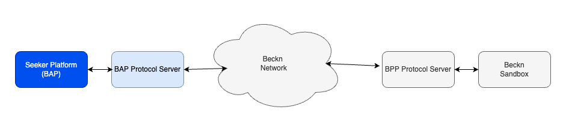

# OPEN BELEM - DSEP Implementation Guide

#### Version 1.1

## Version History

| Date       | Version | Description                                         |
| ---------- | ------- | --------------------------------------------------- |
| 22-11-2023 | 1.0     | Initial Version                                     |
| 10-07-2024 | 1.1     | Phase 2 (Community adoption)                        |

## Introduction

This document provides material that helps network participants build and integrate their application with the Open Belem Network for educational courses. This document is part of the starter kit that provides information about the network, learning resources, network participant checklist etc. This document only focuses on the implementation of the seeker/provider platform for educational courses. It assumes the reader has a good overview of the Beckn network, its APIs, the overall structure of the schema etc.

## Structure of the document

This document has the following parts:

1. Outcome Visualization - This is a pictorial or descriptive representation of the different use cases that are supported by the network.
2. Flow diagrams - This section provides a pictorial representation of the message flows that happen during the use case.
3. API Calls and Schema - This section provides details on the API calls and the schema of the message that is sent in the form of sample schemas.
4. Taxonomy and layer 2 configuration - This section provides details on the taxonomy, enumerations and any rules defined for either the use case or by the network.
5. Notes on writing/integrating with your own software - This section describes ways in which you can integrate (Becknify) your new or existing software
6. Links to downloadable resources - This section contains the downloadable files referenced in this document.
7. Sandbox Details - Sandbox links to BAP, Regitry/Gateway and BPP.

## Outcome Visualisation

### Use case - Discovery, order and fulfillment of Educational courses

This use case uses the names "EduSeeker" and "CourseProvider" as examples for illustration.

- Srilekha is a working professional looking to upskill herself. She uses her smartphone to search for suitable online courses in data science.

**Discovery**:
- Srilekha begins to browse the EduSeeker app to search for data science courses.
- She receives a catalogue of 4 available courses provided by EduSeeker & CourseProvider. Among them, she finds one which fits her schedule and budget, offered by CourseProvider.

**Order**:
- Srilekha selects the course, opting for a 3-month program at the cost of Rs. 15,000.
- She accepts the terms of order and is prompted to choose a payment method (card or link).
- She chooses to make payment through the link and confirms the order.
- The order is confirmed by CourseProvider and verifies the payment and generates an order ID.

**Fulfillment**:
- Srilekha receives login credentials for the course platform. She logs in and starts her first lesson. After completing each module, she is prompted to take a quiz to test her understanding.

**Post Fulfillment**:
- Upon course completion, Srilekha rates her experience using a 0-5 star rating.

## Flow diagrams

### General Beckn message flow and error handling

This section is relevant to all the messages flows illustrated below and discussed further in the document.

Beckn is a aynchronous protocol at its core.

- When a network participant(NP1) sends a message to another participant(NP2), the other participant(NP2) immediately returns back an ACK/NACK(Acknowledgement or Negative Acknowledgement in case of error - usually with wrongly formed messages).
- An ACK is an indicator that the receiving participant(NP2) will process this message and dispatch an on_xxxxxx message to original NP (NP1)
- Subsequently after processing the message NP2 sends back the real response in the corresponding on_xxxxxx message, to which again the first participant(NP1).
- This message can contain a message field (for success) or error field (for failure)
- NP1 when it receives the on_xxxxxx message, sends back an ACK/NACK (Here in both the cases NP1 will not send any subsequent message).
- In the Use case diagrams, this ACK/NACK is not illustrated explicitly to keep the diagrams crisp.
- However when writing software we should be prepared to receive these NACK messages as well as error field in the on_xxxxxx messages
- While this discussion is from a Beckn perspective, Adapters can provide synchronous modes. For example, the Protocol Server which is the reference implementation of the Beckn Adapter provides a synchronous mode by default. So if your software calls the support endpoint on the BAP Protocol Server, the Protocol Server waits till it gets the on_support and returns back that as the response.


**Structure of a message with a NACK**

```
{
    "message": {
        "ack": {
            "status": "NACK"
        }
    },
    "error": {
        "code": 400,
        "message": "OpenApiValidator Error at BAP-CLIENT",
    }
}
```

**Structure of a on_select message with an error**

```
{
    "context": {
        "action": "on_select",
        "version": "1.1.0",
        ...
    },
    "error": {
        "code": 30001,
        "message": "Requested provider is not in the database"
    }
}
```

### Use case - Discovery, order and fulfillment of Educational courses

- This use case does not allow pre-booking of the course. So essentially after the user searches the course, the rest of the messages (select, init, confirm and update) all happen while the user is enrolled in the course. This is due to the current readiness of the participants.
- It is envisioned that a future version of this guide (once the NPs are ready) will add pre-booking of a slot for the course.

**Search for Educational courses**

## API Calls and Schema

### search

Search request can contain one or more search criterion within it. Use the following list on how to specify the criterion.

- The category of courses to search for is specified in message->intent->category->descriptor->name
- The name of course to  search for is specified in message->intent->item->descriptor->name
- If searching by free text, it is specified in message->intent->descriptor->name
- You can directly search course by a particular provider, it is specified in message->intent->provider->id
- You can obviously also combine multiple criteria together

```
{
    "context": {
        "domain": "open-belem:courses",
        "action": "search",
       "version": "{{core_version}}",
        "bap_id": "{{bap_id}}",
        "bap_uri": "{{bap_uri}}",
        "location": {
            "city": {
                "name": "Bangalore",
                "code": "std:080"
            },
            "country": {
                "name": "India",
                "code": "IND"
            }
        },
        "transaction_id": "a9aaecca-10b7-4d19-b640-b047a7c62196",
        "message_id": "{{$randomUUID}}",
        "ttl": "PT10M",
        "timestamp": "2023-02-15T15:14:30.560Z"
    },
    "message": {
        "intent": {
            "item": {
                "descriptor": {
                    "name": "javascript courses"
                }
            }
        }
    }
}
```

### on_search

**on_search with catalog of results**

- The catalog that comes back has a list of providers.
- Each provider has a list of items.
- Each item is the catalog listing for a course.

```
{
    "context": {
        "ttl": "PT10M",
        "action": "search",
        "timestamp": "2024-09-12T20:29:08.425Z",
        "message_id": "5d2a120d-f7f3-48c2-9ce0-24708c83add8",
        "transaction_id": "a9aaecca-10b7-4d19-b640-b047a7c62196",
        "domain": "open-belem:courses",
        "version": "1.1.0",
        "bap_id": "ps-bap-network.becknprotocol.io",
        "bap_uri": "https://ps-bap-network.becknprotocol.io",
        "location": {
            "city": {
                "name": "Bangalore",
                "code": "std:080"
            },
            "country": {
                "name": "India",
                "code": "IND"
            }
        }
    },
    "responses": [
        {
            "context": {
                "domain": "open-belem:courses",
                "action": "on_search",
                "version": "1.1.0",
                "bpp_id": "sandbox-bpp-network.becknprotocol.io",
                "bpp_uri": "https://sandbox-bpp-network.becknprotocol.io",
                "country": "IND",
                "city": "std:080",
                "location": {
                    "city": {
                        "name": "Bangalore",
                        "code": "std:080"
                    },
                    "country": {
                        "name": "India",
                        "code": "IND"
                    }
                },
                "bap_id": "ps-bap-network.becknprotocol.io",
                "bap_uri": "https://ps-bap-network.becknprotocol.io",
                "transaction_id": "a9aaecca-10b7-4d19-b640-b047a7c62196",
                "message_id": "5d2a120d-f7f3-48c2-9ce0-24708c83add8",
                "ttl": "PT10M",
                "timestamp": "2024-09-12T20:29:12.894Z"
            },
            "message": {
                "catalog": {
                    "descriptor": {
                        "name": "Catalog for English courses"
                    },
                    "providers": [
                        {
                            "id": "INFOSYS",
                            "descriptor": {
                                "name": "Infosys Springboard",
                                "short_desc": "Infosys Springboard Digital literacy program",
                                "images": [
                                    {
                                        "url": "https://infyspringboard.onwingspan.com/web/assets/images/infosysheadstart/app_logos/landing-new.png",
                                        "size_type": "sm"
                                    }
                                ]
                            },
                            "categories": [
                                {
                                    "id": "LANGUAGE-COURSES",
                                    "descriptor": {
                                        "code": "LANGUAGE-COURSES",
                                        "name": "Language Courses"
                                    }
                                },
                                {
                                    "id": "SKILL-DEVELOPMENT-COURSES",
                                    "descriptor": {
                                        "code": "SKILL-DEVELOPMENT-COURSES",
                                        "name": "Skill development Courses"
                                    }
                                },
                                {
                                    "id": "TECHNICAL-COURSES",
                                    "descriptor": {
                                        "code": "TECHNICAL-COURSES",
                                        "name": "Technical Courses"
                                    }
                                },
                                {
                                    "id": "SELF-PACED-COURSES",
                                    "descriptor": {
                                        "code": "SELF-PACED-COURSES",
                                        "name": "Self Paced Courses"
                                    }
                                }
                            ],
                            "items": [
                                {
                                    "id": "d4975df5-b18c-4772-80ad-368669856d52",
                                    "quantity": {
                                        "maximum": {
                                            "count": 1
                                        }
                                    },
                                    "descriptor": {
                                        "name": "Everyday Conversational English",
                                        "short_desc": "Elevate your daily conversations with confidence through our 'Everyday Conversational English' course.",
                                        "long_desc": "<p><strong>Course Overview:</strong><br>Welcome to 'Everyday Conversational English,' your key to mastering essential language skills for real-life communication. Tailored for all levels, this course offers:</p><ol><li><strong>Practical Vocabulary:</strong><br>Learn everyday expressions for seamless communication.</li><li><strong>Interactive Role-Playing:</strong><br>Apply knowledge through immersive exercises for real-world scenarios.</li><li><strong>Cultural Insights:</strong><br>Gain cultural nuances to connect authentically in conversations.</li><li><strong>Real-Life Scenarios:</strong><br>Navigate common situations with confidence-building tools.</li><li><strong>Quiz Assessments:</strong><br>Reinforce learning through quizzes for ongoing skill development.</li></ol><p><strong>Why Take This Course:</strong></p><ul><li><strong>Personal & Professional Growth:</strong><br>Enhance personal connections and gain a professional edge.</li><li><strong>Cultural Fluency:</strong><br>Understand and engage with diverse cultures confidently.</li><li><strong>Life-Long Skill:</strong><br>Develop a valuable skill applicable across various life stages.</li></ul><p>Join 'Everyday Conversational English' and elevate your communication for meaningful connections and success.</p>",
                                        "images": [
                                            {
                                                "url": "https://ashokitech.com/uploads/course/spring-boot-microservices-online-training.jpeg"
                                            }
                                        ],
                                        "media": [
                                            {
                                                "url": "https://infyspringboard.onwingspan.com/web/courses/infosysheadstart/everyday-conversational-english/preview/"
                                            }
                                        ]
                                    },
                                    "creator": {
                                        "descriptor": {
                                            "name": "Prof. Emma Sullivan",
                                            "short_desc": "Experienced language educator dedicated to fostering practical conversational skills and cultural fluency",
                                            "long_desc": "Hello, I'm Prof. Emma Sullivan, your guide in 'Everyday Conversational English.' With over a decade of experience, I'm here to make language learning dynamic and culturally enriching. Let's explore practical communication skills together for personal and professional growth. Join me on this exciting journey!",
                                            "images": [
                                                {
                                                    "url": "https://infyspringboard.onwingspan.com/web/assets/images/infosysheadstart/ins/1.png"
                                                }
                                            ]
                                        }
                                    },
                                    "price": {
                                        "currency": "INR",
                                        "value": "0"
                                    },
                                    "category_ids": [
                                        "LANGUAGE-COURSES",
                                        "SELF-PACED-COURSES"
                                    ],
                                    "rating": "4.5",
                                    "rateable": true,
                                    "tags": [
                                        {
                                            "descriptor": {
                                                "code": "content-metadata",
                                                "name": "Content metadata"
                                            },
                                            "list": [
                                                {
                                                    "descriptor": {
                                                        "code": "learner-level",
                                                        "name": "Learner level"
                                                    },
                                                    "value": "Beginner"
                                                },
                                                {
                                                    "descriptor": {
                                                        "code": "learning-objective",
                                                        "name": "Learning objective"
                                                    },
                                                    "value": "By the end of the course, learners will confidently navigate everyday conversations, demonstrating improved fluency, cultural awareness, and effective communication skills."
                                                },
                                                {
                                                    "descriptor": {
                                                        "code": "prerequisite",
                                                        "name": "Prerequisite"
                                                    },
                                                    "value": "Should have a basic understanding of English"
                                                },
                                                {
                                                    "descriptor": {
                                                        "code": "prerequisite",
                                                        "name": "Prerequisite"
                                                    },
                                                    "value": "Access to a computer or internet to access the course online"
                                                },
                                                {
                                                    "descriptor": {
                                                        "code": "lang-code",
                                                        "name": "Language code"
                                                    },
                                                    "value": "en"
                                                },
                                                {
                                                    "descriptor": {
                                                        "code": "course-duration",
                                                        "name": "Course duration"
                                                    },
                                                    "value": "P20H"
                                                }
                                            ],
                                            "display": true
                                        }
                                    ]
                                }
                            ],
                            "fulfillments": [
                                {
                                    "agent": {
                                        "person": {
                                            "name": "Infosys Springboard"
                                        },
                                        "contact": {
                                            "email": "support@infy.com"
                                        }
                                    },
                                    "tracking": false
                                }
                            ]
                        }
                    ]
                }
            }
        }
    ]
}
```

### select

**sending a select request**

- Choose the item(s) from the list from on_search and request quote
- The chosen item is in message->order->item_id

```
{
    "context": {
        "domain": "open-belem:courses",
        "action": "select",
        "version": "{{core_version}}",
        "bap_id": "{{bap_id}}",
        "bap_uri": "{{bap_uri}}",
        "bpp_id": "{{bpp_id}}",
        "bpp_uri": "{{bpp_uri}}",
        "location": {
            "city": {
                "name": "Bangalore",
                "code": "std:080"
            },
            "country": {
                "name": "India",
                "code": "IND"
            }
        },
        "transaction_id": "a9aaecca-10b7-4d19-b640-b047a7c62196",
        "message_id": "{{$randomUUID}}",
        "timestamp": "2022-12-12T09:55:41.161Z",
        "ttl": "PT10M"
    },
    "message": {
        "order": {
        "provider": {
            "id": "INFOSYS"
        },
        "items": [
            {
            "id": "d4975df5-b18c-4772-80ad-368669856d52"
            }
        ]
        }
    }
}
```

### on_select

- The BPP returns back with a quote for the selection
- It is in message->order->quote

```
{
    "context": {
        "ttl": "PT10M",
        "action": "select",
        "timestamp": "2024-09-13T11:05:48.613Z",
        "message_id": "8b5a5d34-8b5e-47ad-b55e-81a09da7292c",
        "transaction_id": "a9aaecca-10b7-4d19-b640-b047a7c62196",
        "domain": "open-belem:courses",
        "version": "1.1.0",
        "bap_id": "ps-bap-network.becknprotocol.io",
        "bap_uri": "https://ps-bap-network.becknprotocol.io",
        "location": {
            "city": {
                "name": "Bangalore",
                "code": "std:080"
            },
            "country": {
                "name": "India",
                "code": "IND"
            }
        },
        "bpp_id": "sandbox-bpp-network.becknprotocol.io",
        "bpp_uri": "https://sandbox-bpp-network.becknprotocol.io"
    },
    "responses": [
        {
            "context": {
                "domain": "open-belem:courses",
                "action": "on_select",
                "version": "1.1.0",
                "bpp_id": "sandbox-bpp-network.becknprotocol.io",
                "bpp_uri": "https://sandbox-bpp-network.becknprotocol.io",
                "country": "IND",
                "city": "std:080",
                "location": {
                    "city": {
                        "name": "Bangalore",
                        "code": "std:080"
                    },
                    "country": {
                        "name": "India",
                        "code": "IND"
                    }
                },
                "bap_id": "ps-bap-network.becknprotocol.io",
                "bap_uri": "https://ps-bap-network.becknprotocol.io",
                "transaction_id": "a9aaecca-10b7-4d19-b640-b047a7c62196",
                "message_id": "8b5a5d34-8b5e-47ad-b55e-81a09da7292c",
                "ttl": "PT10M",
                "timestamp": "2024-09-13T11:05:49.270Z"
            },
            "message": {
                "order": {
                    "provider": {
                        "id": "INFOSYS",
                        "descriptor": {
                            "name": "Infosys Springboard",
                            "short_desc": "Infosys Springboard Digital literacy program",
                            "images": [
                                {
                                    "url": "https://infyspringboard.onwingspan.com/web/assets/images/infosysheadstart/app_logos/landing-new.png",
                                    "size_type": "sm"
                                }
                            ]
                        },
                        "categories": [
                            {
                                "id": "LANGUAGE-COURSES",
                                "descriptor": {
                                    "code": "LANGUAGE-COURSES",
                                    "name": "Language Courses"
                                }
                            },
                            {
                                "id": "SKILL-DEVELOPMENT-COURSES",
                                "descriptor": {
                                    "code": "SKILL-DEVELOPMENT-COURSES",
                                    "name": "Skill development Courses"
                                }
                            },
                            {
                                "id": "TECHNICAL-COURSES",
                                "descriptor": {
                                    "code": "TECHNICAL-COURSES",
                                    "name": "Technical Courses"
                                }
                            },
                            {
                                "id": "SELF-PACED-COURSES",
                                "descriptor": {
                                    "code": "SELF-PACED-COURSES",
                                    "name": "Self Paced Courses"
                                }
                            }
                        ]
                    },
                    "items": [
                        {
                            "id": "d4975df5-b18c-4772-80ad-368669856d52",
                            "quantity": {
                                "maximum": {
                                    "count": 1
                                }
                            },
                            "descriptor": {
                                "name": "Everyday Conversational English",
                                "short_desc": "Elevate your daily conversations with confidence through our 'Everyday Conversational English' course.",
                                "long_desc": "<p><strong>Course Overview:</strong><br>Welcome to 'Everyday Conversational English,' your key to mastering essential language skills for real-life communication. Tailored for all levels, this course offers:</p><ol><li><strong>Practical Vocabulary:</strong><br>Learn everyday expressions for seamless communication.</li><li><strong>Interactive Role-Playing:</strong><br>Apply knowledge through immersive exercises for real-world scenarios.</li><li><strong>Cultural Insights:</strong><br>Gain cultural nuances to connect authentically in conversations.</li><li><strong>Real-Life Scenarios:</strong><br>Navigate common situations with confidence-building tools.</li><li><strong>Quiz Assessments:</strong><br>Reinforce learning through quizzes for ongoing skill development.</li></ol><p><strong>Why Take This Course:</strong></p><ul><li><strong>Personal & Professional Growth:</strong><br>Enhance personal connections and gain a professional edge.</li><li><strong>Cultural Fluency:</strong><br>Understand and engage with diverse cultures confidently.</li><li><strong>Life-Long Skill:</strong><br>Develop a valuable skill applicable across various life stages.</li></ul><p>Join 'Everyday Conversational English' and elevate your communication for meaningful connections and success.</p>",
                                "images": [
                                    {
                                        "url": "https://ashokitech.com/uploads/course/spring-boot-microservices-online-training.jpeg"
                                    }
                                ],
                                "media": [
                                    {
                                        "url": "https://infyspringboard.onwingspan.com/web/courses/infosysheadstart/everyday-conversational-english/preview/"
                                    }
                                ]
                            },
                            "creator": {
                                "descriptor": {
                                    "name": "Prof. Emma Sullivan",
                                    "short_desc": "Experienced language educator dedicated to fostering practical conversational skills and cultural fluency",
                                    "long_desc": "Hello, I'm Prof. Emma Sullivan, your guide in 'Everyday Conversational English.' With over a decade of experience, I'm here to make language learning dynamic and culturally enriching. Let's explore practical communication skills together for personal and professional growth. Join me on this exciting journey!",
                                    "images": [
                                        {
                                            "url": "https://infyspringboard.onwingspan.com/web/assets/images/infosysheadstart/ins/1.png"
                                        }
                                    ]
                                }
                            },
                            "price": {
                                "currency": "INR",
                                "value": "150"
                            },
                            "category_ids": [
                                "LANGUAGE-COURSES",
                                "SELF-PACED-COURSES"
                            ],
                            "rating": "4.5",
                            "rateable": true,
                            "tags": [
                                {
                                    "descriptor": {
                                        "code": "content-metadata",
                                        "name": "Content metadata"
                                    },
                                    "list": [
                                        {
                                            "descriptor": {
                                                "code": "learner-level",
                                                "name": "Learner level"
                                            },
                                            "value": "Beginner"
                                        },
                                        {
                                            "descriptor": {
                                                "code": "learning-objective",
                                                "name": "Learning objective"
                                            },
                                            "value": "By the end of the course, learners will confidently navigate everyday conversations, demonstrating improved fluency, cultural awareness, and effective communication skills."
                                        },
                                        {
                                            "descriptor": {
                                                "code": "prerequisite",
                                                "name": "Prerequisite"
                                            },
                                            "value": "Should have a basic understanding of English"
                                        },
                                        {
                                            "descriptor": {
                                                "code": "prerequisite",
                                                "name": "Prerequisite"
                                            },
                                            "value": "Access to a computer or internet to access the course online"
                                        },
                                        {
                                            "descriptor": {
                                                "code": "lang-code",
                                                "name": "Language code"
                                            },
                                            "value": "en"
                                        },
                                        {
                                            "descriptor": {
                                                "code": "course-duration",
                                                "name": "Course duration"
                                            },
                                            "value": "P20H"
                                        }
                                    ],
                                    "display": true
                                }
                            ]
                        }
                    ],
                    "fulfillments": [
                        {
                            "agent": {
                                "person": {
                                    "name": "Infosys Springboard"
                                },
                                "contact": {
                                    "email": "support@infy.com"
                                }
                            },
                            "tracking": false
                        }
                    ],
                    "quote": {
                        "price": {
                            "currency": "INR",
                            "value": "150"
                        }
                    },
                    "type": "DEFAULT"
                }
            }
        }
    ]
}
```

### init

**send init request**

- The draft order including billing details.
- Billing details specified in message->order->billing

```
{
    "context": {
        "domain": "open-belem:courses",
        "action": "init",
        "version": "{{core_version}}",
        "bap_id": "{{bap_id}}",
        "bap_uri": "{{bap_uri}}",
        "bpp_id": "{{bpp_id}}",
        "bpp_uri": "{{bpp_uri}}",
        "location": {
            "city": {
                "name": "Bangalore",
                "code": "std:080"
            },
            "country": {
                "name": "India",
                "code": "IND"
            }
        },
        "transaction_id": "a9aaecca-10b7-4d19-b640-b047a7c62196",
        "message_id": "{{$randomUUID}}",
        "ttl": "PT10M",
        "timestamp": "2023-02-15T15:14:30.560Z"
    },
    "message": {
        "order": {
        "provider": {
            "id": "INFOSYS"
        },
        "items": [
            {
            "id": "d4975df5-b18c-4772-80ad-368669856d52"
            }
        ],
        "billing": {
            "name": "Jane Doe",
            "phone": "+91-9663088848",
            "email": "jane.doe@example.com",
            "address": "No 27, XYZ Lane, etc"
        },
        "fulfillments": [
            {
            "customer": {
                "person": {
                "name": "Jane Doe",
                "age": "13",
                "gender": "female",
                "tags": [
                    {
                    "descriptor": {
                        "code": "professional-details",
                        "name": "Professional Details"
                    },
                    "list": [
                        {
                        "descriptor": {
                            "code": "profession",
                            "name": "profession"
                        },
                        "value": "student"
                        }
                    ],
                    "display": true
                    }
                ]
                },
                "contact": {
                "phone": "+91-9663088848",
                "email": "jane.doe@example.com"
                }
            }
            }
        ]
        }
    }
}
```

### on_init

- Contains payment terms. Payment terms specified in message->order->payments
- Cancellation terms specified in message->order->cancellation_terms
- Here we show the BPP as payment collector. In case the BAP specifies that it collects the payment in the init, the url field within payments will be empty


```

{
    "context": {
        "ttl": "PT10M",
        "action": "init",
        "timestamp": "2024-09-13T11:08:28.936Z",
        "message_id": "8390effd-c454-485e-8243-4606405878b8",
        "transaction_id": "a9aaecca-10b7-4d19-b640-b047a7c62196",
        "domain": "open-belem:courses",
        "version": "1.1.0",
        "bap_id": "ps-bap-network.becknprotocol.io",
        "bap_uri": "https://ps-bap-network.becknprotocol.io",
        "location": {
            "city": {
                "name": "Bangalore",
                "code": "std:080"
            },
            "country": {
                "name": "India",
                "code": "IND"
            }
        },
        "bpp_id": "sandbox-bpp-network.becknprotocol.io",
        "bpp_uri": "https://sandbox-bpp-network.becknprotocol.io"
    },
    "responses": [
        {
            "context": {
                "domain": "open-belem:courses",
                "action": "on_init",
                "version": "1.1.0",
                "bpp_id": "sandbox-bpp-network.becknprotocol.io",
                "bpp_uri": "https://sandbox-bpp-network.becknprotocol.io",
                "country": "IND",
                "city": "std:080",
                "location": {
                    "city": {
                        "name": "Bangalore",
                        "code": "std:080"
                    },
                    "country": {
                        "name": "India",
                        "code": "IND"
                    }
                },
                "bap_id": "ps-bap-network.becknprotocol.io",
                "bap_uri": "https://ps-bap-network.becknprotocol.io",
                "transaction_id": "a9aaecca-10b7-4d19-b640-b047a7c62196",
                "message_id": "8390effd-c454-485e-8243-4606405878b8",
                "ttl": "PT10M",
                "timestamp": "2024-09-13T11:08:29.277Z"
            },
            "message": {
                "order": {
                    "provider": {
                        "id": "INFOSYS",
                        "descriptor": {
                            "name": "Infosys Springboard",
                            "short_desc": "Infosys Springboard Digital literacy program",
                            "images": [
                                {
                                    "url": "https://infyspringboard.onwingspan.com/web/assets/images/infosysheadstart/app_logos/landing-new.png",
                                    "size_type": "sm"
                                }
                            ]
                        },
                        "categories": [
                            {
                                "id": "LANGUAGE-COURSES",
                                "descriptor": {
                                    "code": "LANGUAGE-COURSES",
                                    "name": "Language Courses"
                                }
                            },
                            {
                                "id": "SKILL-DEVELOPMENT-COURSES",
                                "descriptor": {
                                    "code": "SKILL-DEVELOPMENT-COURSES",
                                    "name": "Skill development Courses"
                                }
                            },
                            {
                                "id": "TECHNICAL-COURSES",
                                "descriptor": {
                                    "code": "TECHNICAL-COURSES",
                                    "name": "Technical Courses"
                                }
                            },
                            {
                                "id": "SELF-PACED-COURSES",
                                "descriptor": {
                                    "code": "SELF-PACED-COURSES",
                                    "name": "Self Paced Courses"
                                }
                            }
                        ]
                    },
                    "items": [
                        {
                            "id": "d4975df5-b18c-4772-80ad-368669856d52",
                            "quantity": {
                                "maximum": {
                                    "count": 1
                                }
                            },
                            "descriptor": {
                                "name": "Everyday Conversational English",
                                "short_desc": "Elevate your daily conversations with confidence through our 'Everyday Conversational English' course.",
                                "long_desc": "<p><strong>Course Overview:</strong><br>Welcome to 'Everyday Conversational English,' your key to mastering essential language skills for real-life communication. Tailored for all levels, this course offers:</p><ol><li><strong>Practical Vocabulary:</strong><br>Learn everyday expressions for seamless communication.</li><li><strong>Interactive Role-Playing:</strong><br>Apply knowledge through immersive exercises for real-world scenarios.</li><li><strong>Cultural Insights:</strong><br>Gain cultural nuances to connect authentically in conversations.</li><li><strong>Real-Life Scenarios:</strong><br>Navigate common situations with confidence-building tools.</li><li><strong>Quiz Assessments:</strong><br>Reinforce learning through quizzes for ongoing skill development.</li></ol><p><strong>Why Take This Course:</strong></p><ul><li><strong>Personal & Professional Growth:</strong><br>Enhance personal connections and gain a professional edge.</li><li><strong>Cultural Fluency:</strong><br>Understand and engage with diverse cultures confidently.</li><li><strong>Life-Long Skill:</strong><br>Develop a valuable skill applicable across various life stages.</li></ul><p>Join 'Everyday Conversational English' and elevate your communication for meaningful connections and success.</p>",
                                "images": [
                                    {
                                        "url": "https://ashokitech.com/uploads/course/spring-boot-microservices-online-training.jpeg"
                                    }
                                ],
                                "media": [
                                    {
                                        "url": "https://infyspringboard.onwingspan.com/web/courses/infosysheadstart/everyday-conversational-english/preview/"
                                    }
                                ]
                            },
                            "creator": {
                                "descriptor": {
                                    "name": "Prof. Emma Sullivan",
                                    "short_desc": "Experienced language educator dedicated to fostering practical conversational skills and cultural fluency",
                                    "long_desc": "Hello, I'm Prof. Emma Sullivan, your guide in 'Everyday Conversational English.' With over a decade of experience, I'm here to make language learning dynamic and culturally enriching. Let's explore practical communication skills together for personal and professional growth. Join me on this exciting journey!",
                                    "images": [
                                        {
                                            "url": "https://infyspringboard.onwingspan.com/web/assets/images/infosysheadstart/ins/1.png"
                                        }
                                    ]
                                }
                            },
                            "price": {
                                "currency": "INR",
                                "value": "150"
                            },
                            "category_ids": [
                                "LANGUAGE-COURSES",
                                "SELF-PACED-COURSES"
                            ],
                            "rating": "4.5",
                            "rateable": true,
                            "tags": [
                                {
                                    "descriptor": {
                                        "code": "content-metadata",
                                        "name": "Content metadata"
                                    },
                                    "list": [
                                        {
                                            "descriptor": {
                                                "code": "learner-level",
                                                "name": "Learner level"
                                            },
                                            "value": "Beginner"
                                        },
                                        {
                                            "descriptor": {
                                                "code": "learning-objective",
                                                "name": "Learning objective"
                                            },
                                            "value": "By the end of the course, learners will confidently navigate everyday conversations, demonstrating improved fluency, cultural awareness, and effective communication skills."
                                        },
                                        {
                                            "descriptor": {
                                                "code": "prerequisite",
                                                "name": "Prerequisite"
                                            },
                                            "value": "Should have a basic understanding of English"
                                        },
                                        {
                                            "descriptor": {
                                                "code": "prerequisite",
                                                "name": "Prerequisite"
                                            },
                                            "value": "Access to a computer or internet to access the course online"
                                        },
                                        {
                                            "descriptor": {
                                                "code": "lang-code",
                                                "name": "Language code"
                                            },
                                            "value": "en"
                                        },
                                        {
                                            "descriptor": {
                                                "code": "course-duration",
                                                "name": "Course duration"
                                            },
                                            "value": "P20H"
                                        }
                                    ],
                                    "display": true
                                }
                            ]
                        }
                    ],
                    "fulfillments": [
                        {
                            "agent": {
                                "person": {
                                    "name": "Infosys Springboard"
                                },
                                "contact": {
                                    "email": "support@infy.com"
                                }
                            },
                            "customer": {
                                "person": {
                                    "name": "Jane Doe",
                                    "age": "13",
                                    "gender": "female",
                                    "tags": [
                                        {
                                            "descriptor": {
                                                "code": "professional-details",
                                                "name": "Professional Details"
                                            },
                                            "list": [
                                                {
                                                    "descriptor": {
                                                        "code": "profession",
                                                        "name": "profession"
                                                    },
                                                    "value": "student"
                                                }
                                            ],
                                            "display": true
                                        }
                                    ]
                                },
                                "contact": {
                                    "phone": "+91-9663088848",
                                    "email": "jane.doe@example.com"
                                }
                            },
                            "tracking": false
                        }
                    ],
                    "quote": {
                        "price": {
                            "currency": "INR",
                            "value": "150"
                        }
                    },
                    "billing": {
                        "name": "Jane Doe",
                        "phone": "+91-9663088848",
                        "email": "jane.doe@example.com",
                        "address": "No 27, XYZ Lane, etc"
                    },
                    "payments": [
                        {
                            "params": {
                                "amount": "150",
                                "currency": "INR"
                            },
                            "url": "https://examplepayments.com/pay",
                            "type": "PRE-ORDER",
                            "status": "NOT-PAID",
                            "collected_by": "bpp"
                        }
                    ],
                    "type": "DEFAULT"
                }
            }
        }
    ]
}

```

### confirm

- Confirm order including payment paid info (when applicable).
- It is in message->order->payments

```
{
    "context": {
        "domain": "open-belem:courses",
        "action": "confirm",
        "version": "{{core_version}}",
        "bap_id": "{{bap_id}}",
        "bap_uri": "{{bap_uri}}",
        "bpp_id": "{{bpp_id}}",
        "bpp_uri": "{{bpp_uri}}",
        "location": {
            "city": {
                "name": "Bangalore",
                "code": "std:080"
            },
            "country": {
                "name": "India",
                "code": "IND"
            }
        },
        
        "transaction_id": "a9aaecca-10b7-4d19-b640-b047a7c62196",
        "message_id": "{{$randomUUID}}",
        "ttl": "PT10M",
        "timestamp": "2023-02-15T15:18:33.777Z"
    },
    "message": {
        "order": {
        "provider": {
            "id": "INFOSYS"
        },
        "items": [
            {
            "id": "d4975df5-b18c-4772-80ad-368669856d52"
            }
        ],
        "billing": {
            "name": "Jane Doe",
            "phone": "+91-9663088848",
            "email": "jane.doe@example.com",
            "address": "No 27, XYZ Lane, etc"
        },
        "fulfillments": [
            {
            "customer": {
                "person": {
                "name": "Jane Doe",
                "age": "13",
                "gender": "female"
                },
                "contact": {
                "phone": "+91-9663088848",
                "email": "jane.doe@example.com"
                }
            }
            }
        ],
        "payments": [
            {
            "params": {
                "amount": "150",
                "currency": "INR"
            },
            "status": "PAID"
            }
        ]
        }
    }
}
```

### on_confirm

- Order confirmed. Course has been purchased.

```
{
    "context": {
        "ttl": "PT10M",
        "action": "confirm",
        "timestamp": "2024-09-13T11:10:20.448Z",
        "message_id": "06944ad6-d7bc-47d6-8967-efa105e8bf2d",
        "transaction_id": "a9aaecca-10b7-4d19-b640-b047a7c62196",
        "domain": "open-belem:courses",
        "version": "1.1.0",
        "bap_id": "ps-bap-network.becknprotocol.io",
        "bap_uri": "https://ps-bap-network.becknprotocol.io",
        "location": {
            "city": {
                "name": "Bangalore",
                "code": "std:080"
            },
            "country": {
                "name": "India",
                "code": "IND"
            }
        },
        "bpp_id": "sandbox-bpp-network.becknprotocol.io",
        "bpp_uri": "https://sandbox-bpp-network.becknprotocol.io"
    },
    "responses": [
        {
            "context": {
                "domain": "open-belem:courses",
                "action": "on_confirm",
                "version": "1.1.0",
                "bpp_id": "sandbox-bpp-network.becknprotocol.io",
                "bpp_uri": "https://sandbox-bpp-network.becknprotocol.io",
                "country": "IND",
                "city": "std:080",
                "location": {
                    "city": {
                        "name": "Bangalore",
                        "code": "std:080"
                    },
                    "country": {
                        "name": "India",
                        "code": "IND"
                    }
                },
                "bap_id": "ps-bap-network.becknprotocol.io",
                "bap_uri": "https://ps-bap-network.becknprotocol.io",
                "transaction_id": "a9aaecca-10b7-4d19-b640-b047a7c62196",
                "message_id": "06944ad6-d7bc-47d6-8967-efa105e8bf2d",
                "ttl": "PT10M",
                "timestamp": "2024-09-13T11:10:20.906Z"
            },
            "message": {
                "order": {
                    "id": "12424kh",
                    "provider": {
                        "id": "INFOSYS",
                        "descriptor": {
                            "name": "Infosys Springboard",
                            "short_desc": "Infosys Springboard Digital literacy program",
                            "images": [
                                {
                                    "url": "https://infyspringboard.onwingspan.com/web/assets/images/infosysheadstart/app_logos/landing-new.png",
                                    "size_type": "sm"
                                }
                            ]
                        },
                        "categories": [
                            {
                                "id": "LANGUAGE-COURSES",
                                "descriptor": {
                                    "code": "LANGUAGE-COURSES",
                                    "name": "Language Courses"
                                }
                            },
                            {
                                "id": "SKILL-DEVELOPMENT-COURSES",
                                "descriptor": {
                                    "code": "SKILL-DEVELOPMENT-COURSES",
                                    "name": "Skill development Courses"
                                }
                            },
                            {
                                "id": "TECHNICAL-COURSES",
                                "descriptor": {
                                    "code": "TECHNICAL-COURSES",
                                    "name": "Technical Courses"
                                }
                            },
                            {
                                "id": "SELF-PACED-COURSES",
                                "descriptor": {
                                    "code": "SELF-PACED-COURSES",
                                    "name": "Self Paced Courses"
                                }
                            }
                        ]
                    },
                    "items": [
                        {
                            "id": "d4975df5-b18c-4772-80ad-368669856d52",
                            "quantity": {
                                "maximum": {
                                    "count": 1
                                }
                            },
                            "descriptor": {
                                "name": "Everyday Conversational English",
                                "short_desc": "Elevate your daily conversations with confidence through our 'Everyday Conversational English' course.",
                                "long_desc": "<p><strong>Course Overview:</strong><br>Welcome to 'Everyday Conversational English,' your key to mastering essential language skills for real-life communication. Tailored for all levels, this course offers:</p><ol><li><strong>Practical Vocabulary:</strong><br>Learn everyday expressions for seamless communication.</li><li><strong>Interactive Role-Playing:</strong><br>Apply knowledge through immersive exercises for real-world scenarios.</li><li><strong>Cultural Insights:</strong><br>Gain cultural nuances to connect authentically in conversations.</li><li><strong>Real-Life Scenarios:</strong><br>Navigate common situations with confidence-building tools.</li><li><strong>Quiz Assessments:</strong><br>Reinforce learning through quizzes for ongoing skill development.</li></ol><p><strong>Why Take This Course:</strong></p><ul><li><strong>Personal & Professional Growth:</strong><br>Enhance personal connections and gain a professional edge.</li><li><strong>Cultural Fluency:</strong><br>Understand and engage with diverse cultures confidently.</li><li><strong>Life-Long Skill:</strong><br>Develop a valuable skill applicable across various life stages.</li></ul><p>Join 'Everyday Conversational English' and elevate your communication for meaningful connections and success.</p>",
                                "images": [
                                    {
                                        "url": "https://ashokitech.com/uploads/course/spring-boot-microservices-online-training.jpeg"
                                    }
                                ],
                                "media": [
                                    {
                                        "url": "https://infyspringboard.onwingspan.com/web/courses/infosysheadstart/everyday-conversational-english/preview/"
                                    }
                                ]
                            },
                            "creator": {
                                "descriptor": {
                                    "name": "Prof. Emma Sullivan",
                                    "short_desc": "Experienced language educator dedicated to fostering practical conversational skills and cultural fluency",
                                    "long_desc": "Hello, I'm Prof. Emma Sullivan, your guide in 'Everyday Conversational English.' With over a decade of experience, I'm here to make language learning dynamic and culturally enriching. Let's explore practical communication skills together for personal and professional growth. Join me on this exciting journey!",
                                    "images": [
                                        {
                                            "url": "https://infyspringboard.onwingspan.com/web/assets/images/infosysheadstart/ins/1.png"
                                        }
                                    ]
                                }
                            },
                            "price": {
                                "currency": "INR",
                                "value": "150"
                            },
                            "category_ids": [
                                "LANGUAGE-COURSES",
                                "SELF-PACED-COURSES"
                            ],
                            "rating": "4.5",
                            "rateable": true,
                            "add-ons": [
                                {
                                    "id": "course-outline",
                                    "descriptor": {
                                        "name": "Course Outline",
                                        "long_desc": "Outline for the course",
                                        "media": [
                                            {
                                                "mimetype": "application/pdf",
                                                "url": "https://infyspringboard.onwingspan.com/web/courses/infosysheadstart/everyday-conversational-english/outline.pdf"
                                            }
                                        ]
                                    }
                                },
                                {
                                    "id": "prelim-quiz",
                                    "descriptor": {
                                        "name": "Preliminary Quiz",
                                        "long_desc": "Take this preliminary quiz to see if you will benefit from the course!",
                                        "media": [
                                            {
                                                "mimetype": "text/html",
                                                "url": "https://infyspringboard.onwingspan.com/web/courses/infosysheadstart/everyday-conversational-english/prelim-quiz"
                                            }
                                        ]
                                    }
                                }
                            ],
                            "tags": [
                                {
                                    "descriptor": {
                                        "code": "content-metadata",
                                        "name": "Content metadata"
                                    },
                                    "list": [
                                        {
                                            "descriptor": {
                                                "code": "learner-level",
                                                "name": "Learner level"
                                            },
                                            "value": "Beginner"
                                        },
                                        {
                                            "descriptor": {
                                                "code": "learning-objective",
                                                "name": "Learning objective"
                                            },
                                            "value": "By the end of the course, learners will confidently navigate everyday conversations, demonstrating improved fluency, cultural awareness, and effective communication skills."
                                        },
                                        {
                                            "descriptor": {
                                                "code": "prerequisite",
                                                "name": "Prerequisite"
                                            },
                                            "value": "Should have a basic understanding of English"
                                        },
                                        {
                                            "descriptor": {
                                                "code": "prerequisite",
                                                "name": "Prerequisite"
                                            },
                                            "value": "Access to a computer or internet to access the course online"
                                        },
                                        {
                                            "descriptor": {
                                                "code": "lang-code",
                                                "name": "Language code"
                                            },
                                            "value": "en"
                                        },
                                        {
                                            "descriptor": {
                                                "code": "course-duration",
                                                "name": "Course duration"
                                            },
                                            "value": "P20H"
                                        }
                                    ],
                                    "display": true
                                }
                            ]
                        }
                    ],
                    "fulfillments": [
                        {
                            "state": {
                                "descriptor": {
                                    "code": "NOT-STARTED",
                                    "name": "Not Started"
                                },
                                "updated_at": "2023-02-06T09:55:41.161Z"
                            },
                            "agent": {
                                "person": {
                                    "name": "Infosys Springboard"
                                },
                                "contact": {
                                    "email": "support@infy.com"
                                }
                            },
                            "customer": {
                                "person": {
                                    "name": "Jane Doe",
                                    "age": "13",
                                    "gender": "female"
                                },
                                "contact": {
                                    "phone": "+91-9663088848",
                                    "email": "jane.doe@example.com"
                                }
                            },
                            "stops": [
                                {
                                    "id": "0",
                                    "instructions": {
                                        "name": "content-video-1",
                                        "long_desc": "Description About the Content",
                                        "media": [
                                            {
                                                "mimetype": "video/mp4",
                                                "url": "https://embedded-video-player-url/play"
                                            }
                                        ]
                                    }
                                },
                                {
                                    "id": "1",
                                    "instructions": {
                                        "name": "content-video-2",
                                        "long_desc": "Description About the Content",
                                        "media": [
                                            {
                                                "mimetype": "video/mp4",
                                                "url": "https://embedded-video-player-url/play"
                                            }
                                        ]
                                    }
                                },
                                {
                                    "id": "2",
                                    "instructions": {
                                        "name": "content-pdf",
                                        "long_desc": "Description About the Content",
                                        "media": [
                                            {
                                                "mimetype": "application/pdf",
                                                "url": "https://link-to-the-document/"
                                            }
                                        ]
                                    }
                                }
                            ],
                            "tags": [
                                {
                                    "descriptor": {
                                        "code": "course-completion-details",
                                        "name": "Content Completion Details"
                                    },
                                    "list": [
                                        {
                                            "descriptor": {
                                                "code": "course-certificate",
                                                "name": "Course certificate"
                                            },
                                            "value": "https://link-to-certificate"
                                        },
                                        {
                                            "descriptor": {
                                                "code": "course-badge",
                                                "name": "Course Badge"
                                            },
                                            "value": "https://link-to-badge"
                                        }
                                    ],
                                    "display": true
                                }
                            ],
                            "tracking": false
                        }
                    ],
                    "quote": {
                        "price": {
                            "currency": "INR",
                            "value": "150"
                        }
                    },
                    "billing": {
                        "name": "Jane Doe",
                        "phone": "+91-9663088848",
                        "email": "jane.doe@example.com",
                        "address": "No 27, XYZ Lane, etc"
                    },
                    "payments": [
                        {
                            "params": {
                                "amount": "150",
                                "currency": "INR"
                            },
                            "type": "PRE-ORDER",
                            "status": "PAID",
                            "collected_by": "bpp"
                        }
                    ],
                    "type": "DEFAULT"
                }
            }
        }
    ]
}
```

### status

- Request for status on order. order_id is specifiedin message->order_id

```
{
    "context": {
        "domain": "open-belem:courses",
        "action": "status",
        "location": {
            "city": {
                "name": "Bangalore",
                "code": "std:080"
            },
            "country": {
                "name": "India",
                "code": "IND"
            }
        },
        "version": "{{core_version}}",
        "bap_id": "{{bap_id}}",
        "bap_uri": "{{bap_uri}}",
        "bpp_id": "{{bpp_id}}",
        "bpp_uri": "{{bpp_uri}}",
        "transaction_id": "a9aaecca-10b7-4d19-b640-b047a7c62196",
        "message_id": "{{$randomUUID}}",
        "ttl": "PT10M",
        "timestamp": "2023-02-15T15:14:30.560Z"
    },
    "message": {
        "order_id": "12424"
    }
}
```

### on_status

- Status of requested order.
- Primarily the fulfillment status is specified in message->order->fulfillments[]->state
- Fulfillment here can mean the progress of the course that is being taken by the learner.

```
{
    "context": {
        "ttl": "PT10M",
        "action": "status",
        "timestamp": "2024-09-13T11:11:14.004Z",
        "message_id": "d0a5c86d-e7d2-460b-8501-a42bec8119b6",
        "transaction_id": "a9aaecca-10b7-4d19-b640-b047a7c62196",
        "domain": "open-belem:courses",
        "version": "1.1.0",
        "bap_id": "ps-bap-network.becknprotocol.io",
        "bap_uri": "https://ps-bap-network.becknprotocol.io",
        "location": {
            "city": {
                "name": "Bangalore",
                "code": "std:080"
            },
            "country": {
                "name": "India",
                "code": "IND"
            }
        },
        "bpp_id": "sandbox-bpp-network.becknprotocol.io",
        "bpp_uri": "https://sandbox-bpp-network.becknprotocol.io"
    },
    "responses": [
        {
            "context": {
                "domain": "open-belem:courses",
                "action": "on_status",
                "version": "1.1.0",
                "bpp_id": "sandbox-bpp-network.becknprotocol.io",
                "bpp_uri": "https://sandbox-bpp-network.becknprotocol.io",
                "country": "IND",
                "city": "std:080",
                "bap_id": "ps-bap-network.becknprotocol.io",
                "bap_uri": "https://ps-bap-network.becknprotocol.io",
                "transaction_id": "a9aaecca-10b7-4d19-b640-b047a7c62196",
                "message_id": "d0a5c86d-e7d2-460b-8501-a42bec8119b6",
                "ttl": "PT10M",
                "timestamp": "2024-09-13T11:11:14.119Z"
            },
            "message": {
                "order": {
                    "id": "12424kh",
                    "provider": {
                        "id": "INFOSYS",
                        "descriptor": {
                            "name": "Infosys Springboard",
                            "short_desc": "Infosys Springboard Digital literacy program",
                            "images": [
                                {
                                    "url": "https://infyspringboard.onwingspan.com/web/assets/images/infosysheadstart/app_logos/landing-new.png",
                                    "size_type": "sm"
                                }
                            ]
                        },
                        "categories": [
                            {
                                "id": "LANGUAGE-COURSES",
                                "descriptor": {
                                    "code": "LANGUAGE-COURSES",
                                    "name": "Language Courses"
                                }
                            },
                            {
                                "id": "SKILL-DEVELOPMENT-COURSES",
                                "descriptor": {
                                    "code": "SKILL-DEVELOPMENT-COURSES",
                                    "name": "Skill development Courses"
                                }
                            },
                            {
                                "id": "TECHNICAL-COURSES",
                                "descriptor": {
                                    "code": "TECHNICAL-COURSES",
                                    "name": "Technical Courses"
                                }
                            },
                            {
                                "id": "SELF-PACED-COURSES",
                                "descriptor": {
                                    "code": "SELF-PACED-COURSES",
                                    "name": "Self Paced Courses"
                                }
                            }
                        ]
                    },
                    "items": [
                        {
                            "id": "d4975df5-b18c-4772-80ad-368669856d52",
                            "quantity": {
                                "maximum": {
                                    "count": 1
                                }
                            },
                            "descriptor": {
                                "name": "Everyday Conversational English",
                                "short_desc": "Elevate your daily conversations with confidence through our 'Everyday Conversational English' course.",
                                "long_desc": "<p><strong>Course Overview:</strong><br>Welcome to 'Everyday Conversational English,' your key to mastering essential language skills for real-life communication. Tailored for all levels, this course offers:</p><ol><li><strong>Practical Vocabulary:</strong><br>Learn everyday expressions for seamless communication.</li><li><strong>Interactive Role-Playing:</strong><br>Apply knowledge through immersive exercises for real-world scenarios.</li><li><strong>Cultural Insights:</strong><br>Gain cultural nuances to connect authentically in conversations.</li><li><strong>Real-Life Scenarios:</strong><br>Navigate common situations with confidence-building tools.</li><li><strong>Quiz Assessments:</strong><br>Reinforce learning through quizzes for ongoing skill development.</li></ol><p><strong>Why Take This Course:</strong></p><ul><li><strong>Personal & Professional Growth:</strong><br>Enhance personal connections and gain a professional edge.</li><li><strong>Cultural Fluency:</strong><br>Understand and engage with diverse cultures confidently.</li><li><strong>Life-Long Skill:</strong><br>Develop a valuable skill applicable across various life stages.</li></ul><p>Join 'Everyday Conversational English' and elevate your communication for meaningful connections and success.</p>",
                                "images": [
                                    {
                                        "url": "https://ashokitech.com/uploads/course/spring-boot-microservices-online-training.jpeg"
                                    }
                                ],
                                "media": [
                                    {
                                        "url": "https://infyspringboard.onwingspan.com/web/courses/infosysheadstart/everyday-conversational-english/preview/"
                                    }
                                ]
                            },
                            "creator": {
                                "descriptor": {
                                    "name": "Prof. Emma Sullivan",
                                    "short_desc": "Experienced language educator dedicated to fostering practical conversational skills and cultural fluency",
                                    "long_desc": "Hello, I'm Prof. Emma Sullivan, your guide in 'Everyday Conversational English.' With over a decade of experience, I'm here to make language learning dynamic and culturally enriching. Let's explore practical communication skills together for personal and professional growth. Join me on this exciting journey!",
                                    "images": [
                                        {
                                            "url": "https://infyspringboard.onwingspan.com/web/assets/images/infosysheadstart/ins/1.png"
                                        }
                                    ]
                                }
                            },
                            "price": {
                                "currency": "INR",
                                "value": "150"
                            },
                            "category_ids": [
                                "LANGUAGE-COURSES",
                                "SELF-PACED-COURSES"
                            ],
                            "rating": "4.5",
                            "rateable": true,
                            "add-ons": [
                                {
                                    "id": "course-outline",
                                    "descriptor": {
                                        "name": "Course Outline",
                                        "long_desc": "Outline for the course",
                                        "media": [
                                            {
                                                "mimetype": "application/pdf",
                                                "url": "https://infyspringboard.onwingspan.com/web/courses/infosysheadstart/everyday-conversational-english/outline.pdf"
                                            }
                                        ]
                                    }
                                },
                                {
                                    "id": "prelim-quiz",
                                    "descriptor": {
                                        "name": "Preliminary Quiz",
                                        "long_desc": "Take this preliminary quiz to see if you will benefit from the course!",
                                        "media": [
                                            {
                                                "mimetype": "text/html",
                                                "url": "https://infyspringboard.onwingspan.com/web/courses/infosysheadstart/everyday-conversational-english/prelim-quiz"
                                            }
                                        ]
                                    }
                                }
                            ],
                            "tags": [
                                {
                                    "descriptor": {
                                        "code": "content-metadata",
                                        "name": "Content metadata"
                                    },
                                    "list": [
                                        {
                                            "descriptor": {
                                                "code": "learner-level",
                                                "name": "Learner level"
                                            },
                                            "value": "Beginner"
                                        },
                                        {
                                            "descriptor": {
                                                "code": "learning-objective",
                                                "name": "Learning objective"
                                            },
                                            "value": "By the end of the course, learners will confidently navigate everyday conversations, demonstrating improved fluency, cultural awareness, and effective communication skills."
                                        },
                                        {
                                            "descriptor": {
                                                "code": "prerequisite",
                                                "name": "Prerequisite"
                                            },
                                            "value": "Should have a basic understanding of English"
                                        },
                                        {
                                            "descriptor": {
                                                "code": "prerequisite",
                                                "name": "Prerequisite"
                                            },
                                            "value": "Access to a computer or internet to access the course online"
                                        },
                                        {
                                            "descriptor": {
                                                "code": "lang-code",
                                                "name": "Language code"
                                            },
                                            "value": "en"
                                        },
                                        {
                                            "descriptor": {
                                                "code": "course-duration",
                                                "name": "Course duration"
                                            },
                                            "value": "P20H"
                                        }
                                    ],
                                    "display": true
                                }
                            ]
                        }
                    ],
                    "fulfillments": [
                        {
                            "state": {
                                "descriptor": {
                                    "code": "COMPLETED",
                                    "name": "COMPLETED"
                                },
                                "updated_at": "2023-02-06T09:55:41.161Z"
                            },
                            "agent": {
                                "person": {
                                    "name": "Infosys Springboard"
                                },
                                "contact": {
                                    "email": "support@infy.com"
                                }
                            },
                            "customer": {
                                "person": {
                                    "name": "Jane Doe",
                                    "age": "13",
                                    "gender": "female",
                                    "tags": [
                                        {
                                            "descriptor": {
                                                "code": "professional-details",
                                                "name": "Professional Details"
                                            },
                                            "list": [
                                                {
                                                    "descriptor": {
                                                        "code": "profession",
                                                        "name": "profession"
                                                    },
                                                    "value": "student"
                                                }
                                            ],
                                            "display": true
                                        }
                                    ]
                                },
                                "contact": {
                                    "phone": "+91-9663088848",
                                    "email": "jane.doe@example.com"
                                }
                            },
                            "stops": [
                                {
                                    "id": "0",
                                    "instructions": {
                                        "name": "content-video-1",
                                        "long_desc": "Description About the Content",
                                        "media": [
                                            {
                                                "mimetype": "video/mp4",
                                                "url": "https://embedded-video-player-url/play"
                                            }
                                        ]
                                    }
                                },
                                {
                                    "id": "1",
                                    "instructions": {
                                        "name": "content-video-2",
                                        "long_desc": "Description About the Content",
                                        "media": [
                                            {
                                                "mimetype": "video/mp4",
                                                "url": "https://embedded-video-player-url/play"
                                            }
                                        ]
                                    }
                                },
                                {
                                    "id": "2",
                                    "instructions": {
                                        "name": "content-pdf",
                                        "long_desc": "Description About the Content",
                                        "media": [
                                            {
                                                "mimetype": "application/pdf",
                                                "url": "https://link-to-the-document/"
                                            }
                                        ]
                                    }
                                }
                            ],
                            "tags": [
                                {
                                    "descriptor": {
                                        "code": "course-completion-details",
                                        "name": "Content Completion Details"
                                    },
                                    "list": [
                                        {
                                            "descriptor": {
                                                "code": "course-certificate",
                                                "name": "Course certificate"
                                            },
                                            "value": "https://link-to-certificate"
                                        },
                                        {
                                            "descriptor": {
                                                "code": "course-badge",
                                                "name": "Course Badge"
                                            },
                                            "value": "https://link-to-badge"
                                        }
                                    ],
                                    "display": true
                                }
                            ],
                            "tracking": false
                        }
                    ],
                    "quote": {
                        "price": {
                            "currency": "INR",
                            "value": "150"
                        }
                    },
                    "billing": {
                        "name": "Jane Doe",
                        "phone": "+91-9663088848",
                        "email": "jane.doe@example.com",
                        "address": "No 27, XYZ Lane, etc"
                    },
                    "payments": [
                        {
                            "params": {
                                "amount": "150",
                                "currency": "INR"
                            },
                            "type": "PRE-ORDER",
                            "status": "PAID",
                            "collected_by": "bpp"
                        }
                    ],
                    "type": "DEFAULT"
                }
            }
        }
    ]
}
```

### update (Course progress and completion)

- Update the state of the fulfillment to change the status of the course progress.

```
{
    "context": {
        "domain": "open-belem:courses",
        "action": "update",
        "location": {
            "city": {
                "name": "Bangalore",
                "code": "std:080"
            },
            "country": {
                "name": "India",
                "code": "IND"
            }
        },
        "version": "{{core_version}}",
        "bap_id": "{{bap_id}}",
        "bap_uri": "{{bap_uri}}",
        "bpp_id": "{{bpp_id}}",
        "bpp_uri": "{{bpp_uri}}",
        "transaction_id": "a9aaecca-10b7-4d19-b640-b047a7c62196",
        "message_id": "{{$randomUUID}}",
        "ttl": "PT10M",
        "timestamp": "2023-02-15T15:14:30.560Z"
    },
    "message": {
    "order": {
      "id": "12424kh",
      "items": [
        {
          "id": "d4975df5-b18c-4772-80ad-368669856d52",
          "fulfillments": [
            {
              "state": {
                "descriptor": {
                  "code": "COMPLETED",
                  "name": "COMPLETED"
                },
                "updated_at": "2023-02-06T09:55:41.161Z"
              }
            }
          ]
        }
      ]
    },
    "update_target": "order.items[0].fulfillments[0].state"
  }
}

```

### on_update (Course progress and completion)

- Confirmation of successful change of course progress and completion status
- State in message->order->fulfillments[]->state

```
{
    "context": {
        "ttl": "PT10M",
        "action": "update",
        "timestamp": "2024-09-13T11:17:06.145Z",
        "message_id": "b14e6c0b-1897-4db4-85d5-58152cc9d9ff",
        "transaction_id": "a9aaecca-10b7-4d19-b640-b047a7c62196",
        "domain": "open-belem:courses",
        "version": "1.1.0",
        "bap_id": "ps-bap-network.becknprotocol.io",
        "bap_uri": "https://ps-bap-network.becknprotocol.io",
        "location": {
            "city": {
                "name": "Bangalore",
                "code": "std:080"
            },
            "country": {
                "name": "India",
                "code": "IND"
            }
        },
        "bpp_id": "sandbox-bpp-network.becknprotocol.io",
        "bpp_uri": "https://sandbox-bpp-network.becknprotocol.io"
    },
    "responses": [
        {
            "context": {
                "domain": "open-belem:courses",
                "action": "on_update",
                "version": "1.1.0",
                "bpp_id": "sandbox-bpp-network.becknprotocol.io",
                "bpp_uri": "https://sandbox-bpp-network.becknprotocol.io",
                "country": "IND",
                "city": "std:080",
                "bap_id": "ps-bap-network.becknprotocol.io",
                "bap_uri": "https://ps-bap-network.becknprotocol.io",
                "transaction_id": "a9aaecca-10b7-4d19-b640-b047a7c62196",
                "message_id": "b14e6c0b-1897-4db4-85d5-58152cc9d9ff",
                "ttl": "PT10M",
                "timestamp": "2024-09-13T11:17:08.207Z"
            },
            "message": {
                "order": {
                    "id": "12424kh",
                    "provider": {
                        "id": "INFOSYS",
                        "descriptor": {
                            "name": "Infosys Springboard",
                            "short_desc": "Infosys Springboard Digital literacy program",
                            "images": [
                                {
                                    "url": "https://infyspringboard.onwingspan.com/web/assets/images/infosysheadstart/app_logos/landing-new.png",
                                    "size_type": "sm"
                                }
                            ]
                        },
                        "categories": [
                            {
                                "id": "LANGUAGE-COURSES",
                                "descriptor": {
                                    "code": "LANGUAGE-COURSES",
                                    "name": "Language Courses"
                                }
                            },
                            {
                                "id": "SKILL-DEVELOPMENT-COURSES",
                                "descriptor": {
                                    "code": "SKILL-DEVELOPMENT-COURSES",
                                    "name": "Skill development Courses"
                                }
                            },
                            {
                                "id": "TECHNICAL-COURSES",
                                "descriptor": {
                                    "code": "TECHNICAL-COURSES",
                                    "name": "Technical Courses"
                                }
                            },
                            {
                                "id": "SELF-PACED-COURSES",
                                "descriptor": {
                                    "code": "SELF-PACED-COURSES",
                                    "name": "Self Paced Courses"
                                }
                            }
                        ]
                    },
                    "items": [
                        {
                            "id": "d4975df5-b18c-4772-80ad-368669856d52",
                            "quantity": {
                                "maximum": {
                                    "count": 1
                                }
                            },
                            "descriptor": {
                                "name": "Everyday Conversational English",
                                "short_desc": "Elevate your daily conversations with confidence through our 'Everyday Conversational English' course.",
                                "long_desc": "<p><strong>Course Overview:</strong><br>Welcome to 'Everyday Conversational English,' your key to mastering essential language skills for real-life communication. Tailored for all levels, this course offers:</p><ol><li><strong>Practical Vocabulary:</strong><br>Learn everyday expressions for seamless communication.</li><li><strong>Interactive Role-Playing:</strong><br>Apply knowledge through immersive exercises for real-world scenarios.</li><li><strong>Cultural Insights:</strong><br>Gain cultural nuances to connect authentically in conversations.</li><li><strong>Real-Life Scenarios:</strong><br>Navigate common situations with confidence-building tools.</li><li><strong>Quiz Assessments:</strong><br>Reinforce learning through quizzes for ongoing skill development.</li></ol><p><strong>Why Take This Course:</strong></p><ul><li><strong>Personal & Professional Growth:</strong><br>Enhance personal connections and gain a professional edge.</li><li><strong>Cultural Fluency:</strong><br>Understand and engage with diverse cultures confidently.</li><li><strong>Life-Long Skill:</strong><br>Develop a valuable skill applicable across various life stages.</li></ul><p>Join 'Everyday Conversational English' and elevate your communication for meaningful connections and success.</p>",
                                "images": [
                                    {
                                        "url": "https://ashokitech.com/uploads/course/spring-boot-microservices-online-training.jpeg"
                                    }
                                ],
                                "media": [
                                    {
                                        "url": "https://infyspringboard.onwingspan.com/web/courses/infosysheadstart/everyday-conversational-english/preview/"
                                    }
                                ]
                            },
                            "creator": {
                                "descriptor": {
                                    "name": "Prof. Emma Sullivan",
                                    "short_desc": "Experienced language educator dedicated to fostering practical conversational skills and cultural fluency",
                                    "long_desc": "Hello, I'm Prof. Emma Sullivan, your guide in 'Everyday Conversational English.' With over a decade of experience, I'm here to make language learning dynamic and culturally enriching. Let's explore practical communication skills together for personal and professional growth. Join me on this exciting journey!",
                                    "images": [
                                        {
                                            "url": "https://infyspringboard.onwingspan.com/web/assets/images/infosysheadstart/ins/1.png"
                                        }
                                    ]
                                }
                            },
                            "price": {
                                "currency": "INR",
                                "value": "150"
                            },
                            "category_ids": [
                                "LANGUAGE-COURSES",
                                "SELF-PACED-COURSES"
                            ],
                            "rating": "4.5",
                            "rateable": true,
                            "add-ons": [
                                {
                                    "id": "course-outline",
                                    "descriptor": {
                                        "name": "Course Outline",
                                        "long_desc": "Outline for the course",
                                        "media": [
                                            {
                                                "mimetype": "application/pdf",
                                                "url": "https://infyspringboard.onwingspan.com/web/courses/infosysheadstart/everyday-conversational-english/outline.pdf"
                                            }
                                        ]
                                    }
                                },
                                {
                                    "id": "prelim-quiz",
                                    "descriptor": {
                                        "name": "Preliminary Quiz",
                                        "long_desc": "Take this preliminary quiz to see if you will benefit from the course!",
                                        "media": [
                                            {
                                                "mimetype": "text/html",
                                                "url": "https://infyspringboard.onwingspan.com/web/courses/infosysheadstart/everyday-conversational-english/prelim-quiz"
                                            }
                                        ]
                                    }
                                }
                            ],
                            "tags": [
                                {
                                    "descriptor": {
                                        "code": "content-metadata",
                                        "name": "Content metadata"
                                    },
                                    "list": [
                                        {
                                            "descriptor": {
                                                "code": "learner-level",
                                                "name": "Learner level"
                                            },
                                            "value": "Beginner"
                                        },
                                        {
                                            "descriptor": {
                                                "code": "learning-objective",
                                                "name": "Learning objective"
                                            },
                                            "value": "By the end of the course, learners will confidently navigate everyday conversations, demonstrating improved fluency, cultural awareness, and effective communication skills."
                                        },
                                        {
                                            "descriptor": {
                                                "code": "prerequisite",
                                                "name": "Prerequisite"
                                            },
                                            "value": "Should have a basic understanding of English"
                                        },
                                        {
                                            "descriptor": {
                                                "code": "prerequisite",
                                                "name": "Prerequisite"
                                            },
                                            "value": "Access to a computer or internet to access the course online"
                                        },
                                        {
                                            "descriptor": {
                                                "code": "lang-code",
                                                "name": "Language code"
                                            },
                                            "value": "en"
                                        },
                                        {
                                            "descriptor": {
                                                "code": "course-duration",
                                                "name": "Course duration"
                                            },
                                            "value": "P20H"
                                        }
                                    ],
                                    "display": true
                                }
                            ]
                        }
                    ],
                    "fulfillments": [
                        {
                            "state": {
                                "descriptor": {
                                    "code": "COMPLETED",
                                    "name": "Completed"
                                },
                                "updated_at": "2023-02-06T09:55:41.161Z"
                            },
                            "agent": {
                                "person": {
                                    "name": "Infosys Springboard"
                                },
                                "contact": {
                                    "email": "support@infy.com"
                                }
                            },
                            "customer": {
                                "person": {
                                    "name": "Jane Doe",
                                    "age": "13",
                                    "gender": "female",
                                    "tags": [
                                        {
                                            "descriptor": {
                                                "code": "professional-details",
                                                "name": "Professional Details"
                                            },
                                            "list": [
                                                {
                                                    "descriptor": {
                                                        "code": "profession",
                                                        "name": "profession"
                                                    },
                                                    "value": "student"
                                                }
                                            ],
                                            "display": true
                                        }
                                    ]
                                },
                                "contact": {
                                    "phone": "+91-9663088848",
                                    "email": "jane.doe@example.com"
                                }
                            },
                            "stops": [
                                {
                                    "id": "0",
                                    "instructions": {
                                        "name": "content-video-1",
                                        "long_desc": "Description About the Content",
                                        "media": [
                                            {
                                                "mimetype": "video/mp4",
                                                "url": "https://embedded-video-player-url/play"
                                            }
                                        ]
                                    }
                                },
                                {
                                    "id": "1",
                                    "instructions": {
                                        "name": "content-video-2",
                                        "long_desc": "Description About the Content",
                                        "media": [
                                            {
                                                "mimetype": "video/mp4",
                                                "url": "https://embedded-video-player-url/play"
                                            }
                                        ]
                                    }
                                },
                                {
                                    "id": "2",
                                    "instructions": {
                                        "name": "content-pdf",
                                        "long_desc": "Description About the Content",
                                        "media": [
                                            {
                                                "mimetype": "application/pdf",
                                                "url": "https://link-to-the-document/"
                                            }
                                        ]
                                    }
                                }
                            ],
                            "tags": [
                                {
                                    "descriptor": {
                                        "code": "course-completion-details",
                                        "name": "Content Completion Details"
                                    },
                                    "list": [
                                        {
                                            "descriptor": {
                                                "code": "course-certificate",
                                                "name": "Course certificate"
                                            },
                                            "value": "https://link-to-certificate"
                                        },
                                        {
                                            "descriptor": {
                                                "code": "course-badge",
                                                "name": "Course Badge"
                                            },
                                            "value": "https://link-to-badge"
                                        }
                                    ],
                                    "display": true
                                }
                            ],
                            "tracking": false
                        }
                    ],
                    "quote": {
                        "price": {
                            "currency": "INR",
                            "value": "150"
                        }
                    },
                    "billing": {
                        "name": "Jane Doe",
                        "phone": "+91-9663088848",
                        "email": "jane.doe@example.com",
                        "address": "No 27, XYZ Lane, etc"
                    },
                    "payments": [
                        {
                            "params": {
                                "amount": "150",
                                "currency": "INR"
                            },
                            "type": "PRE-ORDER",
                            "status": "PAID",
                            "collected_by": "bpp"
                        }
                    ],
                    "type": "DEFAULT"
                }
            }
        }
    ]
}
```

### track

- Track the progress of the course

```
{
    "context": {
        "domain": "open-belem:courses",
        "action": "track",
        "location": {
            "city": {
                "name": "Bangalore",
                "code": "std:080"
            },
            "country": {
                "name": "India",
                "code": "IND"
            }
        },
        "version": "{{core_version}}",
        "bap_id": "{{bap_id}}",
        "bap_uri": "{{bap_uri}}",
        "bpp_id": "{{bpp_id}}",
        "bpp_uri": "{{bpp_uri}}",
        "transaction_id": "a9aaecca-10b7-4d19-b640-b047a7c62195",
        "message_id": "{{$randomUUID}}",
        "ttl": "PT10M",
        "timestamp": "2023-02-23T08:09:02.172Z"
    },
    "message": {
        "order_id": "d4975df5"
    }
}


```

### on_track

- Tracking URL with whatever custom UI on course progress you want to display
- The tracking URL will be in message->tracking->url

```
{
    "context": {
        "ttl": "PT10M",
        "action": "track",
        "timestamp": "2024-09-13T11:13:50.087Z",
        "message_id": "aef6a324-c863-4521-91ef-d547dbdc0812",
        "transaction_id": "a9aaecca-10b7-4d19-b640-b047a7c62195",
        "domain": "open-belem:courses",
        "version": "1.1.0",
        "bap_id": "ps-bap-network.becknprotocol.io",
        "bap_uri": "https://ps-bap-network.becknprotocol.io",
        "location": {
            "city": {
                "name": "Bangalore",
                "code": "std:080"
            },
            "country": {
                "name": "India",
                "code": "IND"
            }
        },
        "bpp_id": "sandbox-bpp-network.becknprotocol.io",
        "bpp_uri": "https://sandbox-bpp-network.becknprotocol.io"
    },
    "responses": [
        {
            "context": {
                "domain": "open-belem:courses",
                "action": "on_track",
                "version": "1.1.0",
                "bpp_id": "sandbox-bpp-network.becknprotocol.io",
                "bpp_uri": "https://sandbox-bpp-network.becknprotocol.io",
                "country": "IND",
                "city": "std:080",
                "bap_id": "ps-bap-network.becknprotocol.io",
                "bap_uri": "https://ps-bap-network.becknprotocol.io",
                "transaction_id": "a9aaecca-10b7-4d19-b640-b047a7c62195",
                "message_id": "aef6a324-c863-4521-91ef-d547dbdc0812",
                "ttl": "PT10M",
                "timestamp": "2024-09-13T11:13:50.644Z"
            },
            "message": {
                "tracking": {
                    "id": "66666ahhf9u385",
                    "url": "http://www.sometrackingApp.com/tracking-url-for-course-progress",
                    "status": "active"
                }
            }
        }
    ]
}

```


### cancel

- Request to cancel a course enrollment.
- The order_id for the course enrollment should be specified in message->order->id

```
{
    "context": {
        "domain": "open-belem:courses",
        "action": "cancel",
        "location": {
            "country": {
                "name": "India",
                "code": "IND"
            }
        },
        "version": "{{core_version}}",
        "bap_id": "{{bap_id}}",
        "bap_uri": "{{bap_uri}}",
        "bpp_id": "{{bpp_id}}",
        "bpp_uri": "{{bpp_uri}}",
        "timestamp": "2022-12-15T15:38:16.226Z",
        "message_id": "{{$randomUUID}}",
        "ttl": "PT10M",
        "transaction_id": "bdb5ba09-2241-4f00-b434-73466cd06228"
    },
    "message": {
        "order_id": "d4975df5",
        "cancellation_reason_id": "1",
        "descriptor": {
            "short_desc": "Not Satisfied"
        }
    }
}

```


### on_cancel

- Response to a cancellation request.
- Contains the updated order object with cancellation details.

```
{
    "context": {
        "ttl": "PT10M",
        "action": "cancel",
        "timestamp": "2024-09-13T11:23:37.149Z",
        "message_id": "0a0954ba-32d1-4824-ab1c-02c5d3954934",
        "transaction_id": "bdb5ba09-2241-4f00-b434-73466cd06228",
        "domain": "open-belem:courses",
        "version": "1.1.0",
        "bap_id": "ps-bap-network.becknprotocol.io",
        "bap_uri": "https://ps-bap-network.becknprotocol.io",
        "location": {
            "country": {
                "name": "India",
                "code": "IND"
            }
        },
        "bpp_id": "sandbox-bpp-network.becknprotocol.io",
        "bpp_uri": "https://sandbox-bpp-network.becknprotocol.io"
    },
    "responses": [
        {
            "context": {
                "domain": "open-belem:courses",
                "action": "on_cancel",
                "version": "1.1.0",
                "bpp_id": "sandbox-bpp-network.becknprotocol.io",
                "bpp_uri": "https://sandbox-bpp-network.becknprotocol.io",
                "country": "IND",
                "city": "std:080",
                "bap_id": "ps-bap-network.becknprotocol.io",
                "bap_uri": "https://ps-bap-network.becknprotocol.io",
                "transaction_id": "bdb5ba09-2241-4f00-b434-73466cd06228",
                "message_id": "0a0954ba-32d1-4824-ab1c-02c5d3954934",
                "ttl": "PT10M",
                "timestamp": "2024-09-13T11:23:37.900Z"
            },
            "message": {
                "order": {
                    "id": "12424kh",
                    "provider": {
                        "id": "INFOSYS",
                        "descriptor": {
                            "name": "Infosys Springboard",
                            "short_desc": "Infosys Springboard Digital literacy program",
                            "images": [
                                {
                                    "url": "https://infyspringboard.onwingspan.com/web/assets/images/infosysheadstart/app_logos/landing-new.png",
                                    "size_type": "sm"
                                }
                            ]
                        },
                        "categories": [
                            {
                                "id": "LANGUAGE-COURSES",
                                "descriptor": {
                                    "code": "LANGUAGE-COURSES",
                                    "name": "Language Courses"
                                }
                            },
                            {
                                "id": "SKILL-DEVELOPMENT-COURSES",
                                "descriptor": {
                                    "code": "SKILL-DEVELOPMENT-COURSES",
                                    "name": "Skill development Courses"
                                }
                            },
                            {
                                "id": "TECHNICAL-COURSES",
                                "descriptor": {
                                    "code": "TECHNICAL-COURSES",
                                    "name": "Technical Courses"
                                }
                            },
                            {
                                "id": "SELF-PACED-COURSES",
                                "descriptor": {
                                    "code": "SELF-PACED-COURSES",
                                    "name": "Self Paced Courses"
                                }
                            }
                        ]
                    },
                    "items": [
                        {
                            "id": "d4975df5-b18c-4772-80ad-368669856d52",
                            "quantity": {
                                "maximum": {
                                    "count": 1
                                }
                            },
                            "descriptor": {
                                "name": "Everyday Conversational English",
                                "short_desc": "Elevate your daily conversations with confidence through our 'Everyday Conversational English' course.",
                                "long_desc": "<p><strong>Course Overview:</strong><br>Welcome to 'Everyday Conversational English,' your key to mastering essential language skills for real-life communication. Tailored for all levels, this course offers:</p><ol><li><strong>Practical Vocabulary:</strong><br>Learn everyday expressions for seamless communication.</li><li><strong>Interactive Role-Playing:</strong><br>Apply knowledge through immersive exercises for real-world scenarios.</li><li><strong>Cultural Insights:</strong><br>Gain cultural nuances to connect authentically in conversations.</li><li><strong>Real-Life Scenarios:</strong><br>Navigate common situations with confidence-building tools.</li><li><strong>Quiz Assessments:</strong><br>Reinforce learning through quizzes for ongoing skill development.</li></ol><p><strong>Why Take This Course:</strong></p><ul><li><strong>Personal & Professional Growth:</strong><br>Enhance personal connections and gain a professional edge.</li><li><strong>Cultural Fluency:</strong><br>Understand and engage with diverse cultures confidently.</li><li><strong>Life-Long Skill:</strong><br>Develop a valuable skill applicable across various life stages.</li></ul><p>Join 'Everyday Conversational English' and elevate your communication for meaningful connections and success.</p>",
                                "images": [
                                    {
                                        "url": "https://ashokitech.com/uploads/course/spring-boot-microservices-online-training.jpeg"
                                    }
                                ],
                                "media": [
                                    {
                                        "url": "https://infyspringboard.onwingspan.com/web/courses/infosysheadstart/everyday-conversational-english/preview/"
                                    }
                                ]
                            },
                            "creator": {
                                "descriptor": {
                                    "name": "Prof. Emma Sullivan",
                                    "short_desc": "Experienced language educator dedicated to fostering practical conversational skills and cultural fluency",
                                    "long_desc": "Hello, I'm Prof. Emma Sullivan, your guide in 'Everyday Conversational English.' With over a decade of experience, I'm here to make language learning dynamic and culturally enriching. Let's explore practical communication skills together for personal and professional growth. Join me on this exciting journey!",
                                    "images": [
                                        {
                                            "url": "https://infyspringboard.onwingspan.com/web/assets/images/infosysheadstart/ins/1.png"
                                        }
                                    ]
                                }
                            },
                            "price": {
                                "currency": "INR",
                                "value": "150"
                            },
                            "category_ids": [
                                "LANGUAGE-COURSES",
                                "SELF-PACED-COURSES"
                            ],
                            "rating": "4.5",
                            "rateable": true,
                            "add-ons": [
                                {
                                    "id": "course-outline",
                                    "descriptor": {
                                        "name": "Course Outline",
                                        "long_desc": "Outline for the course",
                                        "media": [
                                            {
                                                "mimetype": "application/pdf",
                                                "url": "https://infyspringboard.onwingspan.com/web/courses/infosysheadstart/everyday-conversational-english/outline.pdf"
                                            }
                                        ]
                                    }
                                },
                                {
                                    "id": "prelim-quiz",
                                    "descriptor": {
                                        "name": "Preliminary Quiz",
                                        "long_desc": "Take this preliminary quiz to see if you will benefit from the course!",
                                        "media": [
                                            {
                                                "mimetype": "text/html",
                                                "url": "https://infyspringboard.onwingspan.com/web/courses/infosysheadstart/everyday-conversational-english/prelim-quiz"
                                            }
                                        ]
                                    }
                                }
                            ],
                            "tags": [
                                {
                                    "descriptor": {
                                        "code": "content-metadata",
                                        "name": "Content metadata"
                                    },
                                    "list": [
                                        {
                                            "descriptor": {
                                                "code": "learner-level",
                                                "name": "Learner level"
                                            },
                                            "value": "Beginner"
                                        },
                                        {
                                            "descriptor": {
                                                "code": "learning-objective",
                                                "name": "Learning objective"
                                            },
                                            "value": "By the end of the course, learners will confidently navigate everyday conversations, demonstrating improved fluency, cultural awareness, and effective communication skills."
                                        },
                                        {
                                            "descriptor": {
                                                "code": "prerequisite",
                                                "name": "Prerequisite"
                                            },
                                            "value": "Should have a basic understanding of English"
                                        },
                                        {
                                            "descriptor": {
                                                "code": "prerequisite",
                                                "name": "Prerequisite"
                                            },
                                            "value": "Access to a computer or internet to access the course online"
                                        },
                                        {
                                            "descriptor": {
                                                "code": "lang-code",
                                                "name": "Language code"
                                            },
                                            "value": "en"
                                        },
                                        {
                                            "descriptor": {
                                                "code": "course-duration",
                                                "name": "Course duration"
                                            },
                                            "value": "P20H"
                                        }
                                    ],
                                    "display": true
                                }
                            ]
                        }
                    ],
                    "fulfillments": [
                        {
                            "state": {
                                "descriptor": {
                                    "code": "course-cancelled",
                                    "name": "Course has been cancelled"
                                },
                                "updated_at": "2023-02-06T09:55:41.161Z"
                            },
                            "agent": {
                                "person": {
                                    "name": "Infosys Springboard"
                                },
                                "contact": {
                                    "email": "support@infy.com"
                                }
                            },
                            "customer": {
                                "person": {
                                    "name": "Jane Doe",
                                    "age": "13",
                                    "gender": "female"
                                },
                                "contact": {
                                    "phone": "+91-9663088848",
                                    "email": "jane.doe@example.com"
                                }
                            },
                            "stops": [
                                {
                                    "id": "0",
                                    "instructions": {
                                        "name": "content-video-1",
                                        "long_desc": "Description About the Content",
                                        "media": [
                                            {
                                                "mimetype": "video/mp4",
                                                "url": "https://embedded-video-player-url/play"
                                            }
                                        ]
                                    }
                                },
                                {
                                    "id": "1",
                                    "instructions": {
                                        "name": "content-video-2",
                                        "long_desc": "Description About the Content",
                                        "media": [
                                            {
                                                "mimetype": "video/mp4",
                                                "url": "https://embedded-video-player-url/play"
                                            }
                                        ]
                                    }
                                },
                                {
                                    "id": "2",
                                    "instructions": {
                                        "name": "content-pdf",
                                        "long_desc": "Description About the Content",
                                        "media": [
                                            {
                                                "mimetype": "application/pdf",
                                                "url": "https://link-to-the-document/"
                                            }
                                        ]
                                    }
                                }
                            ],
                            "tags": [
                                {
                                    "descriptor": {
                                        "code": "course-completion-details",
                                        "name": "Content Completion Details"
                                    },
                                    "list": [
                                        {
                                            "descriptor": {
                                                "code": "course-certificate",
                                                "name": "Course certificate"
                                            },
                                            "value": "https://link-to-certificate"
                                        },
                                        {
                                            "descriptor": {
                                                "code": "course-badge",
                                                "name": "Course Badge"
                                            },
                                            "value": "https://link-to-badge"
                                        }
                                    ],
                                    "display": true
                                }
                            ],
                            "tracking": false
                        }
                    ],
                    "quote": {
                        "price": {
                            "currency": "INR",
                            "value": "150"
                        }
                    },
                    "billing": {
                        "name": "Jane Doe",
                        "phone": "+91-9663088848",
                        "email": "jane.doe@example.com",
                        "address": "No 27, XYZ Lane, etc"
                    },
                    "payments": [
                        {
                            "params": {
                                "amount": "150",
                                "currency": "INR"
                            },
                            "type": "PRE-ORDER",
                            "status": "PAID",
                            "collected_by": "bpp"
                        }
                    ],
                    "type": "DEFAULT"
                }
            }
        }
    ]
}

```


### support

- Request for support information.
- If regarding a specific order, specify the order_id in message->support->ref_id

```
{
    "context": {
        "domain": "open-belem:courses",
        "action": "support",
        "version": "{{core_version}}",
        "location": {
            "city": {
                "name": "Bangalore",
                "code": "std:080"
            },
            "country": {
                "name": "India",
                "code": "IND"
            }
        },
        "bap_id": "{{bap_id}}",
        "bap_uri": "{{bap_uri}}",
        "bpp_id": "{{bpp_id}}",
        "bpp_uri": "{{bpp_uri}}",
        "transaction_id": "a9aaecca-10b7-4d19-b640-b047a7c62196",
        "message_id": "{{$randomUUID}}",
        "ttl": "PT10M",
        "timestamp": "2023-02-15T15:14:30.560Z"
    },
    "message": {
        "support": {
            "ref_id": "d4975df5"
        }
  }
}

```

### on_support

- Contains support information. If integrated with a CMS, the URL could contain order specific support info
- In all other cases, contains general support info (message->support)

```
{
    "context": {
        "ttl": "PT10M",
        "action": "support",
        "timestamp": "2024-09-13T11:27:41.568Z",
        "message_id": "17a29828-4330-424e-a26f-faaf5ccdd2ca",
        "transaction_id": "a9aaecca-10b7-4d19-b640-b047a7c62196",
        "domain": "open-belem:courses",
        "version": "1.1.0",
        "bap_id": "ps-bap-network.becknprotocol.io",
        "bap_uri": "https://ps-bap-network.becknprotocol.io",
        "location": {
            "city": {
                "name": "Bangalore",
                "code": "std:080"
            },
            "country": {
                "name": "India",
                "code": "IND"
            }
        },
        "bpp_id": "sandbox-bpp-network.becknprotocol.io",
        "bpp_uri": "https://sandbox-bpp-network.becknprotocol.io"
    },
    "responses": [
        {
            "context": {
                "domain": "open-belem:courses",
                "action": "on_support",
                "version": "1.1.0",
                "bpp_id": "sandbox-bpp-network.becknprotocol.io",
                "bpp_uri": "https://sandbox-bpp-network.becknprotocol.io",
                "country": "IND",
                "city": "std:080",
                "bap_id": "ps-bap-network.becknprotocol.io",
                "bap_uri": "https://ps-bap-network.becknprotocol.io",
                "transaction_id": "a9aaecca-10b7-4d19-b640-b047a7c62196",
                "message_id": "17a29828-4330-424e-a26f-faaf5ccdd2ca",
                "ttl": "PT10M",
                "timestamp": "2024-09-13T11:27:41.627Z"
            },
            "message": {
                "support": {
                    "ref_id": "Abjhjh13773",
                    "order_id": "d4975df5",
                    "callback_phone": "+91-8858150053",
                    "email": "support@ekstep.com",
                    "phone": "+91-965676879",
                    "url": "https://www.somesupportApp.com/chat-url-for-support",
                    "docs": [
                        {
                            "descriptor": {
                                "name": "FAQs",
                                "short_desc": "Frequently asked questions and common issues"
                            },
                            "url": "https://link-to-the-document.com",
                            "mime_type": "application/pdf"
                        }
                    ]
                }
            }
        }
    ]
}
```


### rating

- Rate different categories including fulfillment. Specify in message->ratings
- Value should be a decimal between 0 and 5.
- Id can be the order id.

```
{
    "context": {
        "domain": "open-belem:courses",
        "action": "rating",
        "location": {
            "city": {
                "name": "Bangalore",
                "code": "std:080"
            },
            "country": {
                "name": "India",
                "code": "IND"
            }
        },
        "version": "{{core_version}}",
        "bap_id": "{{bap_id}}",
        "bap_uri": "{{bap_uri}}",
        "bpp_id": "{{bpp_id}}",
        "bpp_uri": "{{bpp_uri}}",
        "transaction_id": "a9aaecca-10b7-4d19-b640-b047a7c62196",
        "message_id": "{{$randomUUID}}",
        "ttl": "PT10M",
        "timestamp": "2023-02-15T15:14:30.560Z"
    },
    "message": {
        "ratings": [
            {
                "id": "d4975df5-b18c-4772-80ad-368669856d52",
                "rating_category": "Item",
                "value": "4"
            }
        ]
    }
}

```

### on_rating

- Confirmation of rating.
- Optionally send a form for additional input (message->feedback_form). Empty message otherwise.

```
{
    "context": {
        "ttl": "PT10M",
        "action": "rating",
        "timestamp": "2024-09-13T11:28:42.486Z",
        "message_id": "99aa1591-39c8-471a-9ade-7b4b5916b894",
        "transaction_id": "a9aaecca-10b7-4d19-b640-b047a7c62196",
        "domain": "open-belem:courses",
        "version": "1.1.0",
        "bap_id": "ps-bap-network.becknprotocol.io",
        "bap_uri": "https://ps-bap-network.becknprotocol.io",
        "location": {
            "city": {
                "name": "Bangalore",
                "code": "std:080"
            },
            "country": {
                "name": "India",
                "code": "IND"
            }
        },
        "bpp_id": "sandbox-bpp-network.becknprotocol.io",
        "bpp_uri": "https://sandbox-bpp-network.becknprotocol.io"
    },
    "responses": [
        {
            "context": {
                "domain": "open-belem:courses",
                "action": "on_rating",
                "version": "1.1.0",
                "bpp_id": "sandbox-bpp-network.becknprotocol.io",
                "bpp_uri": "https://sandbox-bpp-network.becknprotocol.io",
                "country": "IND",
                "city": "std:080",
                "bap_id": "ps-bap-network.becknprotocol.io",
                "bap_uri": "https://ps-bap-network.becknprotocol.io",
                "transaction_id": "a9aaecca-10b7-4d19-b640-b047a7c62196",
                "message_id": "99aa1591-39c8-471a-9ade-7b4b5916b894",
                "ttl": "PT10M",
                "timestamp": "2024-09-13T11:28:43.011Z"
            },
            "message": {
                "feedback_form": {
                    "form": {
                        "url": "https://infosys.springboard.io/rating?course=d4975df5-b18c-4772-80ad-368669856d52",
                        "mime_type": "text/html"
                    },
                    "required": false
                }
            }
        }
    ]
}
```

## Taxonomy and layer 2 configuration

- Any specific tags, enumerations, and rules we add for the use cases or required by the network, will go here.

## Integrating with your software

This section gives general walkthrough of how you would integrate your software with the Beckn network (say the sandbox environment). Refer to the starter kit for details on how to register with the sandbox and get credentials.

Beckn-ONIX is an initiative to promote easy install and maintenance of a Beckn Network. Apart from the Registry and Gateway components that are required for a network facilitator, Beckn-ONIX provides a Beckn Adapter. A reference implementation of the Beckn-ONIX specificatino is available at [Beckn-ONIX repository](https://github.com/beckn/beckn-onix). The reference implementation of the Beckn Adapter is called the Protocol Server. Based on whether we are writing the seeker platform or the provider platform, we will be installing the BAP Protocol Server or the BPP Protocol Server respectively.

### Integrating the seeker platform

If you are writing the seeker platform software, the following are the steps you can follow to build and integrate your application.

1. Identify the use cases from above section that are close to the functionality you plan for your application.
2. Design and develop the UI that implements the flow you need. Typically you will have a API server that this UI talks to and it is called the Seeker Platform in the diagram below.
3. The API server should construct the required JSON message packets required for the different endpoints shown in the API section above.
4. Install the BAP Protocol Server using the reference implementation of Beckn-ONIX. During the installation, you will need the address of the registry of the environment, a URL where the Beckn responses will arrive (called Subscriber URL) and a subscriber_id (typically the same as subscriber URL without the "https://" prefix)
5. Install the layer 2 file for the domain (Link is in the last section of this document)
6. Check with your network tech support to enable your BAP Protocol Server in the registry.
7. Once enabled, you can transact on the Beckn Network. Typically the sandbox environment will have the rest of the components you need to test your software. In the diagram below,
   - you write the Seeker Platform(dark blue)
   - install the BAP Protocol Server (light blue)
   - the remaining components are provided by the sandbox enviornment
8. Once the application is working on the Sandbox, refer to the Starter kit for instructions to take it to pre-production and production.



### Integrating the provider platform

If you are writing the provider platform software, the following are the steps you can follow to build and integrate your application.

1. Identify the use cases from above section that are close to the functionality you plan for your application.
2. Design and develop the component that accepts the Beckn requests and interacts with your software to do transactions. It has to be a endpoint(it is called as webhook_url in the description below) which receives all the Beckn requests (search, select etc). This endpoint can either exist outside of your marketplace/shop software or within it. That is a design decision that will have to be taken by you based on the design of your existing marketplace/shop software. This component is also responsible for sending back the responses to a the Beckn Adaptor.
3. Install the BPP Protocol Server using the reference implementation of Beckn-ONIX. During the installation, you will need the address of the registry of the environment, a URL where the Beckn responses will arrive (called Subscriber URL), a subscriber_id (typically the same as subscriber URL without the "https://" prefix) and the webhook_url that you configured in the step above. Also the address of the BPP Protocol Server Client will have to be configured in your component above. This address hosts all the response endpoints (on_search,on_select etc)
4. Install the layer 2 file for the domain (Link is in the last section of this document)
5. Check with your network tech support to enable your BPP Protocol Server in the registry.
6. Once enabled, you can transact on the Beckn Network. Typically the sandbox environment will have the rest of the components you need to test your software. In the diagram below,
   - you write the Provider Platform(dark blue) - Here the component you wrote above in point 2 as well as your marketplace/shop software is together shown as Provider Platform
   - install the BPP Protocol Server (light blue)
   - the remaining components are provided by the sandbox enviornment
   - Use the postman collection to test your Provider Platform
7. Once the application is working on the Sandbox, refer to the Starter kit for instructions to take it to pre-production and production.


## Links to artefacts

- [Postman collection for Open Belem. Check training and courses](./postman/open_belem_postman_collection.json)
- [Layer2 config for Open Belem courses courses](./layer2/open-belem_courses_1.1.0.yaml)
- When installing layer2 using Beckn-ONIX use this web address (https://raw.githubusercontent.com/beckn/missions/main/OPEN-BELEM/layer2/open-belem_courses_1.1.0.yaml)


