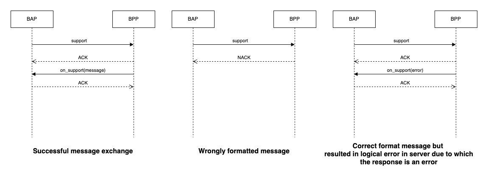

# Open kenya Implementation Guide

#### Version 1.1

## Version History

| Date       | Version | Description                                         |
| ---------- | ------- | --------------------------------------------------- |
| 07-08-2024 | 1.0     | Initial Version                                     |

## Introduction

This document provides material that helps network participants build and integrate their application with the open kenya nework for learning purposes. This document is part of the starter kit that provides information about the network, learning resources, network participant checklist etc. This document only focuses on the implementation of the seeker/provider platform. It assumes the reader has a good overview of the Beckn network, its APIs, the overall structure of the schema etc.

## Structure of the document

This document has the following parts:

1. Outcome Visualization - This is a pictorial or descriptive representation of the different use cases that are supported by the network.
2. Flow diagrams - This section provides a pictorial representation of the message flows that happen during the use case.
3. API Calls and Schema - This section provides details on the API calls and the schema of the message that is sent in the form of sample schemas.
4. Taxonomy and layer 2 configuration - This section provides details on the taxonomy, enumerations and any rules defined for either the use case or by the network.
5. Notes on writing/integrating with your own software - This section describes ways in which you can integrate (Becknify) your new or existing software
6. Links to downloadable resources - This section contains the downloadable files referenced in this document.
7. Sandbox Details - Sandbox links to BAP, Regitry/Gateway and BPP.

## Outcome Visualisation
### Use case - Discovery, order and fulfillment of Agricultural Products

This use case follows Yaro, an Agripreneur in Mombasa, Kenya, as he helps farmers purchase fertilizers.

**Discovery**:

- Yaro uses Kuza One to search for Topdress Fertiliser for a farmer's 2-acre tomato crop.

- The platform sends search queries to nearby fertilizer vendors and returns options from 4 providers:
  - Mavuno Topdress (KSh 7220/50kg)
  - Fanisi Mazao Topdress (KSh 8110/50kg) 
  - Baraka Topdress Standard (KSh 8000/50kg)
  - YaraVera Amidas-Topdress (KSh 8205/50kg)

**Order**:

- Selection: Yaro selects "Mavuno Topdress" as the preferred fertilizer

- Initiation: 
  - Specifies quantity (100 kgs)
  - Chooses nearest pickup location
  - Provides contact information for invoicing

- Confirmation:
  - Reviews final quote (KSh 14,440)
  - Checks terms of purchase including cancellation and return policies
  - Selects "pay on delivery" option
  - Receives order ID and shipping details

**Fulfillment**:

- Receives status updates that order is packed and ready for pickup

- Picks up order from manufacturer warehouse near Mombasa bus stop

- Order status updates to "picked-up"

**Post Fulfillment**:

- Yaro provides ratings based on:
  - Product/service quality (from farmer)
  - Fulfillment quality - time, ease, etc. (from Agripreneur)

## Flow diagrams

### General Beckn message flow and error handling

This section is relevant to all the messages flows illustrated below and discussed further in the document.

Beckn is a aynchronous protocol at its core.

- When a network participant(NP1) sends a message to another participant(NP2), the other participant(NP2) immediately returns back an ACK/NACK(Acknowledgement or Negative Acknowledgement in case of error - usually with wrongly formed messages).
- An ACK is an indicator that the receiving participant(NP2) will process this message and dispatch an on_xxxxxx message to original NP (NP1)
- Subsequently after processing the message NP2 sends back the real response in the corresponding on_xxxxxx message, to which again the first participant(NP1).
- This message can contain a message field (for success) or error field (for failure)
- NP1 when it receives the on_xxxxxx message, sends back an ACK/NACK (Here in both the cases NP1 will not send any subsequent message).
- In the Use case diagrams, this ACK/NACK is not illustrated explicitly to keep the diagrams crisp.
- However when writing software we should be prepared to receive these NACK messages as well as error field in the on_xxxxxx messages
- While this discussion is from a Beckn perspective, Adapters can provide synchronous modes. For example, the Protocol Server which is the reference implementation of the Beckn Adapter provides a synchronous mode by default. So if your software calls the support endpoint on the BAP Protocol Server, the Protocol Server waits till it gets the on_support and returns back that as the response.



**Structure of a message with a NACK**

```
{
    "message": {
        "ack": {
            "status": "NACK"
        }
    },
    "error": {
        "code": 400,
        "message": "OpenApiValidator Error at BAP-CLIENT",
    }
}
```

**Structure of a on_select message with an error**

```
{
    "context": {
        "action": "on_select",
        "version": "1.1.0",
        ...
    },
    "error": {
        "code": 30001,
        "message": "Requested provider is not in the database"
    }
}
```

### Use case - Discovery, order and fulfillment of Educational Content

- The flow allows users to discover educational content providers, browse their catalogs, place orders and track fulfillment
- Orders can be fulfilled through store pickup or delivery based on retailer capabilities
- Payment options include cash on delivery and online payment methods

## API Calls and Schema

### search


Search request can contain one or more search criterion within it. Use the following list on how to specify the criterion:

- The location to search around is specified in the message->intent->fulfillment->stops[0]->location field
- If searching by free text, it is specified in message->intent->descriptor->name
- If searching by category, it is specified in message->intent->category->descriptor->code


**search by name**

```json
{
    "context": {
        "domain": "agrinet:products",
        "action": "search",
        "location": {
            "country": {
              "name": "kenya",
              "code": "KEN"
            },
            "city": {
              "name": "Kirinyaga"
            }
        },
        "version": "1.1.0",
        "bap_id": "{{bap_id}}",
        "bap_uri": "{{bap_uri}}",
        "transaction_id": "6743e9e2-4fb5-487c-92b7-13ba8018f176",
        "message_id": "6743e9e2-4fb5-487c-92b7-13ba8018f176",
        "timestamp": "2023-07-16T04:41:16Z"
    },
    "message": {
        "intent": {
            "item": {
                "descriptor": {
                    "name" : "how to grow potatoes"
                }
            }
        }
    }
}
```

### on_search

**on_search with catalog of results**

- The catalog that comes back has a list of providers.
- Each provider has a list of items.
- Each item is the catalog listing for a an course to purchase

```
{
    "context": {
      "domain": "agrinet:products",
      "location": {
        "country": {
            "name": "kenya"
          },
          "city" : {
            "name": "kirinyaga"
          }
      },
      "action": "on_search",
      "version": "1.1.0",
      "bap_id": "{bap_id}",
      "bap_uri": "{bap_url}",
      "bpp_id": "{bpp_id}",
      "bpp_uri": "{bpp_url}",
      "message_id": "6104c0a3-d1d1-4ded-aaa4-76e4caf727ce",
      "transaction_id": "8100d125-76a7-4588-88be-81b97657cd09",
      "timestamp": "2023-11-06T09:41:09.708Z",
      "ttl": "PT10M"
    },
    "message": {
      "catalog": {
        "descriptor": {
          "name": "Kuza-agrinet:products-BPP",
          "short_desc" : "",
          "long_desc" : "",
          "images": [
            {
              "url": "https://image_url"
            }
          ]
        },
        "providers": [
          {
            "id": "provider_id_1",
            "descriptor": {
              "name": "Provider 1",
              "short_desc" : "Short description about provider",
              "long_desc" : "Full description about provider",
              "images": [
                  {
                  "url": "Url to the picture or logo of the provider"
                  }
              ]
            },
            "locations": [
              {
                "id": "location id of provider 1",
                "gps": "12.909955,77.596316",
                "country": "Country of provider 1",
                "state": "State or county of the provider",
                "district": "District or sub county of the provider",
                "city": "City of the provider",
                "address": "Address of the provider 1",
                "map_url": "Map URL of the provider"
              }
            ],
            "categories": [
              {
                "id": "c1",
                "descriptor": {
                  "code": "Agri Services",
                  "name": "Agri Services"
                }
              },
              {
                "id": "land_preparation",
                "descriptor": {
                  "code": "landpreparation",
                  "name": "Land Preparation"
                }
              },
              {
                "id": "bacterial_wilt",
                "descriptor": {
                  "code": "bactreral_wilt",
                  "name": "Bacterial Wilt"
                }
              }
            ],
            "fulfillments": [
              {
              "description" : "Delivery arranged by provider",
                "id": "f1",
                "type": "Delivery"
              },
              {
                "description" : "Delivery will be handled by customer",
                "id": "f2",
                "type": "Self-Pickup"
              }
            ],
            "items": [
              {
                "id": "item_id",
                "descriptor": {
                  "images": [
                    {
                      "url": "https://image_url"
                    }
                  ],
                  "name": "Ploughing",
                  "short_desc": "Ploughing also turns over the upper layer of soil, bringing fresh nutrients to the surface. It buries weeds and the remains of previous crops, allowing them to break down.",
                  "long_desc": "Ploughing also turns over the upper layer of soil, bringing fresh nutrients to the surface. It buries weeds and the remains of previous crops, allowing them to break down."
                },
                "matched": false,
                "recommended": true,
                "price": {
                  "listed_value": "1300.0",
                  "currency": "KSH",
                  "value": "1200.0"
                },
                "quantity": {
                  "unitized": {                    
                    "measure" : {
                      "count":"2",
                      "unit" : "Bags"
                    }
                  }
                },
                "rating": "5",
                "creator" : {
                  "descriptor" : {
                    "name" : "Hello Tractor"
                  }
                },
                "location_ids": [
                  "location_id1",
                  "location_id2"
                ],
                "category_ids": [
                  "c1", 
                  "c2",
                  "land_preparation",
                  "bacterial_wilt"
                ],
                "fulfillment_id": [
                  "f1",
                  "f2"
                ]
              }
            ]
          },
          {
            "id": "provider_id_2",
            "descriptor": {
              "name": "Provider 2",
              "short_desc" : "",
              "long_desc" : "",
              "images": [
                  {
                  "url": "https://image_url"
                  }
              ]
            },
            "locations": [
              {
                "id": "location 1",
                "gps": "12.909955,77.596316"
              }
            ],
            "categories": [
              {
                "id": "c1",
                "descriptor": {
                  "code": "Agri Services",
                  "name": "Agri Services"
                }
              },
              {
                "id": "land_preparation",
                "descriptor": {
                  "code": "landpreparation",
                  "name": "Land Preparation"
                }
              },
              {
                "id": "bacterial_wilt",
                "descriptor": {
                  "code": "bactreral_wilt",
                  "name": "Bacterial Wilt"
                }
              }
            ],
            "fulfillments": [
              {
                "id": "f1",
                "type": "Delivery"
              },
              {
                "id": "f2",
                "type": "Self-Pickup"
              }
            ],
            "items": [
              {
                "id": "item_id",
                "descriptor": {
                  "images": [
                    {
                      "url": "https://image_url"
                    }
                  ],
                  "name": "Ploughing",
                  "short_desc": "Ploughing also turns over the upper layer of soil, bringing fresh nutrients to the surface. It buries weeds and the remains of previous crops, allowing them to break down.",
                  "long_desc": "Ploughing also turns over the upper layer of soil, bringing fresh nutrients to the surface. It buries weeds and the remains of previous crops, allowing them to break down."
                },
                "matched": false,
                "recommended": true,
                "price": {
                  "listed_value": "1300.0",
                  "currency": "KSH",
                  "value": "1200.0"
                },
                "quantity": {
                  "unitized": {                    
                    "measure" : {
                      "count":"2",
                      "unit" : "Bags"
                    }
                  }
                },
                "rating": "5",
                "creator" : {
                  "descriptor" : {
                    "name" : "Hello Tractor"
                  }
                },
                "location_ids": [
                  "location_id1",
                  "location_id2"
                ],
                "category_ids": [
                  "c1", 
                  "c2"
                ],
                "fulfillment_ids": [
                  "f1",
                  "f2"
                ]
              }
            ]
          }
        ],        
        "offer": {
            "descriptor": {
                "name": "hire1get1free"
              },
              "item_ids": [
                "item_id1",
                "item_id2"
            ]
        }
      }
    }
  }
```

### select

**sending a select request**

- Choose the item(s) from the list from on_search and request quote
- The chosen item is in message->order->item_id

```
{
    "context": {
      "domain": "agrinet:products",
      "location": {
        "country": {
            "name": "kenya"
          },
          "city" : {
            "name": "kirinyaga"
          }
      },
      "action": "select",
      "version": "1.1.0",
      "bap_id": "{bap_id}",
      "bap_uri": "{bap_url}",
      "bpp_id": "{bpp_id}",
      "bpp_uri": "{bpp_url}",
      "message_id": "6104c0a3-d1d1-4ded-aaa4-76e4caf727ce",
      "transaction_id": "8100d125-76a7-4588-88be-81b97657cd09",
      "timestamp": "2023-11-06T09:41:09.708Z",
      "ttl": "PT10M"
    },
    "message": {
      "order": {
        "provider": {
          "id": "provider_id"
        },
        "items": [
          {
            "id": "item_id",
            "quantity": {
              "selected": {
                "count": 3,
                "measure" : {
                  "unit" : "Acres"
                }
              }
            }
          }
        ]
      }
    }
  }
```

### on_select

- The BPP returns back with a quote for the selection
- It is in message->order->quote

```
{
    "context": {
      "domain": "agrinet:products",
      "location": {
        "country": {
            "name": "kenya"
          },
          "city" : {
            "name": "kirinyaga"
          }
      },
      "action": "on_select",
      "version": "1.1.0",
      "bap_id": "{bap_id}",
      "bap_uri": "{bap_url}",
      "bpp_id": "{bpp_id}",
      "bpp_uri": "{bpp_url}",
      "message_id": "6104c0a3-d1d1-4ded-aaa4-76e4caf727ce",
      "transaction_id": "8100d125-76a7-4588-88be-81b97657cd09",
      "timestamp": "2023-11-06T09:41:09.708Z",
      "ttl": "PT10M"
    },
    "message": {
      "order": {
        "provider": 
          {
            "id": "provider_id_1",
            "descriptor": {
              "name": "Provider 1",
              "short_desc" : "",
              "long_desc" : "",
              "images": [
                  {
                  "url": "https://image_url"
                  }
              ]
            },
            "locations": [
              {
                "id": "location 1",
                "gps": "12.909955,77.596316"
              }
            ],
            "categories": [
              {
                "id": "c1",
                "descriptor": {
                  "code": "herbicide",
                  "name": "herbicide"
                }
              }
            ],
            "fulfillments": [
              {
              "description" : "Delivery arranged by provider",
                "id": "f1",
                "type": "Delivery"
              },
              {
                "description" : "Delivery will be handled by customer",
                "id": "f2",
                "type": "Self-Pickup"
              }
            ]
          },        
        "items": [
          {
            "id": "item_id",
            "descriptor": {
              "images": [
                {
                  "url": "https://image_url"
                }
              ],
              "name": "Potasun",
              "short_desc": "Selective post-emergence herbicide for weed control in Irish potatoes. Mixing: 200mls/20ltr. Available in 1ltr pack",
              "long_desc": "Potasun 50EC is a selective herbicide that controls annual and perennial grasses and broad leaf weeds in tomato, cassava, Irish potato, and cocoyam. It is a selective earlier post-emergence herbicide"
            },
            "matched": true,
            "quantity": {
              "selected": {
                "count": 3,
                "measure" : {
                  "unit" : "Acres"
                }
              }
            },
            "price": {
              "listed_value": "1200.0",
              "currency": "KSH",
              "value": "1200.0"
            },
            "rating": "5",
            "creator" : {
              "descriptor" : {
                "name" : "Hello Tractor"
              }
            },
            "recommended": true,
            "location_ids": [
              "location_id1",
              "location_id2"
            ],
            "category_ids": [
              "c1", 
              "c2",
              "land_preparation",
              "sowing",
              "bacterial_wilt"
            ]
          }
        ],
        "offer": {
            "descriptor": {
                "name": "buy1get1"
              },
              "item_ids": [
                "item_id1",
                "item_id2"
            ]
        },
        "quote": {
            "price": {
            "currency": "KSH",
            "value": "1500.0"
            },
            "breakup": [
            {
                "title": "base-price",
                "price": {
                "currency": "KSH",
                "value": "1200.0"
                }
            },
            {
                "title": "taxes",
                "price": {
                "currency": "KSH",
                "value": "300.0"
                }
            }
          ]
        },
        "fulfillments": [
          {
          "description" : "Delivery arranged by provider",
            "id": "f1",
            "type": "Delivery"
          },
          {
            "description" : "Delivery will be handled by customer",
            "id": "f2",
            "type": "Self-Pickup"
          }
        ]
      }
    }
  }
```

### init

**send init request**

- The draft order including billing details.
- Billing details specified in message->order->billing

```
{
    "context": {
      "domain": "agrinet:products",
      "location": {
        "country": {
          "name": "kenya"
        },
        "city": {
          "name": "Kirinyaga"
        }
      },
      "action": "init",
      "version": "1.1.0",
      "bap_id": "{bap_id}",
      "bap_uri": "{bap_url}",
      "bpp_id": "{bpp_id}",
      "bpp_uri": "{bpp_url}",
      "message_id": "6104c0a3-d1d1-4ded-aaa4-76e4caf727ce",
      "transaction_id": "8100d125-76a7-4588-88be-81b97657cd09",
      "timestamp": "2023-11-06T09:41:09.708Z"
    },
    "message": {
      "order": {
        "provider": {
          "id": "provider_id"
        },
        "items": [
          {
            "id": "item_id",
            "quantity": {
              "selected": {
                "count": 3,
                "measure" : {
                  "unit" : "Acres"
                }
              }
            }
          }
        ],
        "fulfillments": [
          {
            "type": "Delivery",
            "stops": [
              {
                "location": {
                  "gps": "13.2008459,77.708736",
                  "address": "Nduini, Kirinyaga Central, Kirinyaga, Kenya",
                  "city": {
                    "name": "Nduini"
                  },
                  "county": {
                    "name": "Kirinyaga"
                  },
                  "country": {
                    "name": "Kenya"
                  },
                  "area_code": "75001"
                },
                "time": {
                  "label": "preferable time slot",
                  "timestamp": "2024-01-17T10:58:43.451Z",
                  "range": {
                    "start": "2024-01-17T16:10:00.430Z",
                    "end": "2024-01-17T16:10:00.430Z"
                  }
                },
                "contact": {
                  "phone": "2547463949",
                  "email": "nc.njugunu@gmail.com"
                }
              }
            ]
          }
        ],
        "billing": {
          "name": "John Githuru",
          "phone": "2542343344",
          "email": "nc.njugunu@gmail.com",
          "address": "Nduini, Kirinyaga Central, Kirinyaga, Kenya",
          "city": {
            "name": "Nduini"
          },
          "county": {
            "name": "Kirinyaga"
          }
        }
      }
    }
  }
```

### on_init

- Contains payment terms. Payment terms specified in message->order->payments
- Cancellation terms specified in message->order->cancellation_terms
- Here we show the BPP as payment collector. In case the BAP specifies that it collects the payment in the init, the url field within payments will be empty

```
{
    "context": {
      "domain": "agrinet:products",
      "location": {
        "country": {
            "name": "kenya"
          },
          "city" : {
            "name": "kirinyaga"
          }
      },
      "action": "on_init",
      "version": "1.1.0",
      "bap_id": "{bap_id}",
      "bap_uri": "{bap_url}",
      "bpp_id": "{bpp_id}",
      "bpp_uri": "{bpp_url}",
      "message_id": "6104c0a3-d1d1-4ded-aaa4-76e4caf727ce",
      "transaction_id": "8100d125-76a7-4588-88be-81b97657cd09",
      "timestamp": "2023-11-06T09:41:09.708Z",
      "ttl": "PT10M"
    },
    "message": {
      "order": {
        "provider": 
          {
            "id": "provider_id_1",
            "descriptor": {
              "name": "Provider 1",
              "short_desc" : "",
              "long_desc" : "",
              "images": [
                  {
                  "url": "https://image_url"
                  }
              ]
            },
            "locations": [
              {
                "id": "location 1",
                "gps": "12.909955,77.596316"
              }
            ],
            "categories": [
              {
                "id": "c1",
                "descriptor": {
                  "code": "Agri Services",
                  "name": "Agri Services"
                }
              },
              {
                "id": "land_preparation",
                "descriptor": {
                  "code": "landpreparation",
                  "name": "Land Preparation"
                }
              },
              {
                "id": "bacterial_wilt",
                "descriptor": {
                  "code": "bactreral_wilt",
                  "name": "Bacterial Wilt"
                }
              }
            ]
          },
        "items": [
          {
            "id": "item_id",
            "descriptor": {
              "images": [
                {
                  "url": "https://image_url"
                }
              ],
              "name": "Potasun",
              "short_desc": "Selective post-emergence herbicide for weed control in Irish potatoes. Mixing: 200mls/20ltr. Available in 1ltr pack",
              "long_desc": "Potasun 50EC is a selective herbicide that controls annual and perennial grasses and broad leaf weeds in tomato, cassava, Irish potato, and cocoyam. It is a selective earlier post-emergence herbicide"
            },
            "quantity": {
              "selected": {
                "count": 3,
                "measure" : {
                  "unit" : "Acres"
                }
              }
            },
            "matched": true,
            "price": {
              "listed_value": "1200.0",
              "currency": "KSH",
              "value": "1200.0"
            },
            "rating": "5",
            "creator" : {
              "descriptor" : {
                "name" : "Hello Tractor"
              }
            },
            "recommended": true,
            "location_ids": [
              "location_id1",
              "location_id2"
            ],
            "category_ids": [
              "c1", 
              "c2",
              "land_preparation",
              "bacterial_wilt"
            ],
            "fulfillment_ids": [
              "f1",
              "f2"
            ]
          }
        ],
        "offer": {
            "descriptor": {
                "name": "buy1get1"
              },
              "item_ids": [
                "item_id1",
                "item_id2"
            ]
        },
        "quote": {
            "price": {
            "currency": "KSH",
            "value": "1700.0"
            },
            "breakup": [
            {
                "title": "base-price",
                "price": {
                "currency": "KSH",
                "value": "1200.0"
                }
            },
            {
                "title": "taxes",
                "price": {
                "currency": "KSH",
                "value": "300.0"
                }
            },
            {
                "title": "delivery-charges",
                "price": {
                "currency": "KSH",
                "value": "200.0"
                }
            }
            ]
        },
        "fulfillments": [
            {
              "type": "Delivery",
              "stops": [
                {
                  "location": {
                    "gps": "13.2008459,77.708736",
                    "address": "Nduini, Kirinyaga Central, Kirinyaga, Kenya",
                    "city": {
                      "name": "Nduini"
                    },
                    "county": {
                      "name": "Kirinyaga"
                    },
                    "country": {
                      "name": "Kenya"
                    },
                    "area_code": "75001"
                  },
                  "time": {
                    "label": "preferable time slot",
                    "timestamp": "2024-01-17T10:58:43.451Z",
                    "range": {
                      "start": "2024-01-17T16:10:00.430Z",
                      "end": "2024-01-17T16:10:00.430Z"
                    }
                  },
                  "contact": {
                    "phone": "2547463949",
                    "email": "nc.njugunu@gmail.com"
                  }
                }
              ],
              "agent": {
                "person": {
                  "id": "string",
                  "url": "string",
                  "name": "string"
                },
                "contact": {
                  "phone": "string",
                  "email": "string"
                }
              },
              "customer": {
                "person": {
                  "name": "John Githuru"
                },
                "contact": {
                  "phone": "2542343344"
                }
              }
            }
          ],
        "billing": {
            "name": "John Githuru",
            "phone": "2542343344",
            "email": "nc.njugunu@gmail.com",
            "address": "Nduini, Kirinyaga Central, Kirinyaga, Kenya",
            "city": {
                "name": "Nduini"
            },
            "county": {
                "name": "Kirinyaga"
            }
        },
        "payments": [
            {
            "id": "string",
            "collected_by": "string",
            "status": "NOT-PAID",
            "type": "PRE-FULFILLMENT",
            "params": {
                "amount": "1700",
                "currency": "KSH",
                "virtual_payment_address": "string"
            }
            }
        ]
      }
    }
  }
```

### confirm

- Confirm order including payment paid info (when applicable).
- It is in message->order->payments

```
{
    "context": {
      "domain": "agrinet:products",
      "location": {
        "country": {
          "name": "kenya"
        },
        "city": {
          "name": "Kirinyaga"
        }
      },
      "action": "confirm",
      "version": "1.1.0",
      "bap_id": "{bap_id}",
      "bap_uri": "{bap_url}",
      "bpp_id": "{bpp_id}",
      "bpp_uri": "{bpp_url}",
      "message_id": "6104c0a3-d1d1-4ded-aaa4-76e4caf727ce",
      "transaction_id": "8100d125-76a7-4588-88be-81b97657cd09",
      "timestamp": "2023-11-06T09:41:09.708Z"
    },
    "message": {
      "order": {
        "provider": {
          "id": "provider_id"
        },
        "items": [
          {
            "id": "item_id",
            "quantity": {
              "selected": {
                "count": 3,
                "measure" : {
                  "unit" : "Acres"
                }
              }
            }
          }
        ],
        "fulfillments": [
          {
            "type": "Delivery",
            "stops": [
              {
                "location": {
                  "gps": "13.2008459,77.708736",
                  "address": "Nduini, Kirinyaga Central, Kirinyaga, Kenya",
                  "city": {
                    "name": "Nduini"
                  },
                  "county": {
                    "name": "Kirinyaga"
                  },
                  "country": {
                    "name": "Kenya"
                  },
                  "area_code": "75001"
                },
                "time": {
                  "label": "preferable time slot",
                  "timestamp": "2024-01-17T10:58:43.451Z",
                  "range": {
                    "start": "2024-01-17T16:10:00.430Z",
                    "end": "2024-01-17T16:10:00.430Z"
                  }
                },
                "contact": {
                  "phone": "2547463949",
                  "email": "nc.njugunu@gmail.com"
                }
              }
            ]
          }
        ],
        "billing": {
          "name": "John Githuru",
          "phone": "2542343344",
          "email": "nc.njugunu@gmail.com",
          "address": "Nduini, Kirinyaga Central, Kirinyaga, Kenya",
          "city": {
            "name": "Nduini"
          },
          "county": {
            "name": "Kirinyaga"
          }
        },
        "payments": [
            {
              "id": "string",
              "collected_by": "string",
              "status": "PAID",
              "type": "PRE-FULFILLMENT",
              "params": {
                "transaction_id": "string",
                "amount": "1700",
                "currency": "KSH",
                "virtual_payment_address": "string"
              }
            }
          ]
      }
    }
  }
```

### on_confirm

- Order confirmed.

```
{
    "context": {
      "domain": "agrinet:products",
      "location": {
        "country": {
            "name": "kenya"
          },
          "city" : {
            "name": "kirinyaga"
          }
      },
      "action": "on_confirm",
      "version": "1.1.0",
      "bap_id": "{bap_id}",
      "bap_uri": "{bap_url}",
      "bpp_id": "{bpp_id}",
      "bpp_uri": "{bpp_url}",
      "message_id": "6104c0a3-d1d1-4ded-aaa4-76e4caf727ce",
      "transaction_id": "8100d125-76a7-4588-88be-81b97657cd09",
      "timestamp": "2023-11-06T09:41:09.708Z",
      "ttl": "PT10M"
    },
    "message": {
      "order": {
        "id": "order_id",
        "status": "active",
        "provider": 
          {
            "id": "provider_id_1",
            "descriptor": {
              "name": "Provider 1",
              "short_desc" : "",
              "long_desc" : "",
              "images": [
                  {
                  "url": "https://image_url"
                  }
              ]
            },
            "locations": [
              {
                "id": "location 1",
                "gps": "12.909955,77.596316"
              }
            ],
            "categories": [
              {
                "id": "c1",
                "descriptor": {
                  "code": "Agri Services",
                  "name": "Agri Services"
                }
              },
              {
                "id": "land_preparation",
                "descriptor": {
                  "code": "landpreparation",
                  "name": "Land Preparation"
                }
              },
              {
                "id": "bacterial_wilt",
                "descriptor": {
                  "code": "bactreral_wilt",
                  "name": "Bacterial Wilt"
                }
              }
            ]
          },
        "items": [
          {
            "id": "item_id",
            "descriptor": {
              "images": [
                {
                  "url": "https://image_url"
                }
              ],
              "name": "Potasun",
              "short_desc": "Selective post-emergence herbicide for weed control in Irish potatoes. Mixing: 200mls/20ltr. Available in 1ltr pack",
              "long_desc": "Potasun 50EC is a selective herbicide that controls annual and perennial grasses and broad leaf weeds in tomato, cassava, Irish potato, and cocoyam. It is a selective earlier post-emergence herbicide"
            },
            "quantity": {
              "selected": {
                "count": 3,
                "measure" : {
                  "unit" : "Acres"
                }
              }
            },
            "matched": true,
            "price": {
              "listed_value": "1200.0",
              "currency": "KSH",
              "value": "1200.0"
            },
            "rating": "5",
            "creator" : {
              "descriptor" : {
                "name" : "Hello Tractor"
              }
            },
            "recommended": true,
            "location_ids": [
              "location_id1",
              "location_id2"
            ],
            "category_ids": [
              "c1", 
              "land_preparation",
              "bacterial_wilt"
            ],
            "fulfillment_ids": [
              "f1",
              "f2"
            ],
            "cancellation_terms" : [
              {
                "fulfillment_state": {
                  "descriptor": {
                    "name": "string",
                    "code": "string",
                    "short_desc": "string",
                    "long_desc": "string"
                  }
                },
                "reason_required": true,
                "cancellation_fee": {
                  "percentage": "10.00",
                  "amount": {
                    "currency": "string",
                    "value": "100"
                  }
                }
              }
            ],
            "return_terms": [
              {
                "fulfillment_state": {
                  "name": "string",
                  "code": "string"
                },
                "return_eligible": true,
                "return_time": {
                  "label": "string",
                  "timestamp": "2024-01-04T07:12:23.580Z",
                  "duration": "string",
                  "range": {
                    "start": "2024-01-04T07:12:23.580Z",
                    "end": "2024-01-04T07:12:23.580Z"
                  },
                  "days": "string"
                },
                "fulfillment_managed_by": "CONSUMER"
              }
            ],
            "refund_terms": [
              {
                "fulfillment_state": {
                  "name": "string",
                  "code": "string"
                },
                "refund_eligible": true,
                "refund_within": {
                  "label": "string",
                  "timestamp": "2024-01-04T07:12:23.579Z",
                  "duration": "string",
                  "range": {
                    "start": "2024-01-04T07:12:23.579Z",
                    "end": "2024-01-04T07:12:23.579Z"
                  },
                  "days": "string"
                },
                "refund_amount": {
                  "currency": "string",
                  "value": "100.00"
                }
              }
            ],
            "replacement_terms": [
              {
                "fulfillment_state": {
                  "name": "string",
                  "code": "string"
                },
                "replace_within": {
                  "label": "string",
                  "timestamp": "2024-01-04T07:12:23.580Z",
                  "duration": "string",
                  "range": {
                    "start": "2024-01-04T07:12:23.580Z",
                    "end": "2024-01-04T07:12:23.580Z"
                  },
                  "days": "string",
                  "schedule": {
                    "frequency": "string",
                    "holidays": [
                      "2024-01-04T07:12:23.580Z"
                    ],
                    "times": [
                      "2024-01-04T07:12:23.580Z"
                    ]
                  }
                }
              }
            ]
          }
        ],
        "offer": {
            "descriptor": {
                "name": "buy1get1"
              },
              "item_ids": [
                "item_id1",
                "item_id2"
            ]
        },
        "quote": {
            "price": {
            "currency": "KSH",
            "value": "1700.0"
            },
            "breakup": [
            {
                "title": "base-price",
                "price": {
                "currency": "KSH",
                "value": "1200.0"
                }
            },
            {
                "title": "taxes",
                "price": {
                "currency": "KSH",
                "value": "300.0"
                }
            },
            {
                "title": "delivery-charges",
                "price": {
                "currency": "KSH",
                "value": "200.0"
                }
            }
            ]
        },
        "fulfillments": [
            {
              "type": "Delivery",
              "state" : {
                  "descriptor" : {
                      "code": "PRE-Order",
                      "name" : "Before Order"
                  },
                  "updated_at" : "2023-02-06T09:55:41.161Z"
              },
              "stops": [
                {
                  "location": {
                    "gps": "13.2008459,77.708736",
                    "address": "Nduini, Kirinyaga Central, Kirinyaga, Kenya",
                    "city": {
                      "name": "Nduini"
                    },
                    "county": {
                      "name": "Kirinyaga"
                    },
                    "country": {
                      "name": "Kenya"
                    },
                    "area_code": "75001"
                  },
                  "time": {
                    "label": "preferable time slot",
                    "timestamp": "2024-01-17T10:58:43.451Z",
                    "range": {
                      "start": "2024-01-17T16:10:00.430Z",
                      "end": "2024-01-17T16:10:00.430Z"
                    }
                  },
                  "contact": {
                    "phone": "2547463949",
                    "email": "nc.njugunu@gmail.com"
                  }
                }
              ],
              "agent": {
                "person": {
                  "id": "string",
                  "url": "string",
                  "name": "string"
                },
                "contact": {
                  "phone": "string",
                  "email": "string"
                }
              },
              "customer": {
                "person": {
                  "name": "John Githuru"
                },
                "contact": {
                  "phone": "2542343344"
                }
              }
            }
          ],
        "fulfillment_state": {
          "descriptor": {
            "name": "In Transit",
            "code": "it",
            "short_desc": "string",
            "long_desc": "string"
          },
          "updated_at": "2024-01-18T08:14:33.667Z",
          "updated_by": "string"
        },
        "billing": {
            "name": "John Githuru",
            "phone": "2542343344",
            "email": "nc.njugunu@gmail.com",
            "address": "Nduini, Kirinyaga Central, Kirinyaga, Kenya",
            "city": {
                "name": "Nduini"
            },
            "county": {
                "name": "Kirinyaga"
            }
        },
        "payments": [
          {
            "id": "string",
            "collected_by": "string",
            "status": "PAID",
            "type": "PRE-FULFILLMENT",
            "params": {
              "transaction_id": "string",
              "amount": "1500",
              "currency": "KSH",
              "virtual_payment_address": "string"
            }
          }
        ]
      }
    }
  }
```

### status

- Request for status on order. order_id is specifiedin message->order_id

```
{
    "context": {
      "domain": "agrinet:products",
      "location": {
        "country": {
          "name": "kenya"
        },
        "city": {
          "name": "Kirinyaga"
        }
      },
      "action": "status",
      "version": "1.1.0",
      "bap_id": "{bap_id}",
      "bap_uri": "{bap_url}",
      "bpp_id": "{bpp_id}",
      "bpp_uri": "{bpp_url}",
      "message_id": "6104c0a3-d1d1-4ded-aaa4-76e4caf727ce",
      "transaction_id": "8100d125-76a7-4588-88be-81b97657cd09",
      "timestamp": "2023-11-06T09:41:09.708Z"
    },
    "message": {
      "order_id": "b989c9a9-f603-4d44-b38d-26fd72286b38"
    }
  }
```

### on_status

- Status of requested order.
- Primarily the fulfillment status is specified in message->order->fulfillments[]->state


```
{
    "context": {
      "domain": "agrinet:products",
      "location": {
        "country": {
            "name": "kenya"
          },
          "city" : {
            "name": "kirinyaga"
          }
      },
      "action": "on_status",
      "version": "1.1.0",
      "bap_id": "{bap_id}",
      "bap_uri": "{bap_url}",
      "bpp_id": "{bpp_id}",
      "bpp_uri": "{bpp_url}",
      "message_id": "6104c0a3-d1d1-4ded-aaa4-76e4caf727ce",
      "transaction_id": "8100d125-76a7-4588-88be-81b97657cd09",
      "timestamp": "2023-11-06T09:41:09.708Z",
      "ttl": "PT10M"
    },
    "message": {
      "order": {
        "id": "order_id",
        "provider": 
          {
            "id": "provider_id_1",
            "descriptor": {
              "name": "Provider 1",
              "short_desc" : "",
              "long_desc" : "",
              "images": [
                  {
                  "url": "https://image_url"
                  }
              ]
            },
            "locations": [
              {
                "id": "location 1",
                "gps": "12.909955,77.596316"
              }
            ],
            "categories": [
              {
                "id": "c1",
                "descriptor": {
                  "code": "Agri Services",
                  "name": "Agri Services"
                }
              },
              {
                "id": "land_preparation",
                "descriptor": {
                  "code": "landpreparation",
                  "name": "Land Preparation"
                }
              },
              {
                "id": "bacterial_wilt",
                "descriptor": {
                  "code": "bactreral_wilt",
                  "name": "Bacterial Wilt"
                }
              }
            ]
          },
        "items": [
          {
            "id": "item_id",
            "descriptor": {
              "images": [
                {
                  "url": "https://image_url"
                }
              ],
              "name": "Potasun",
              "short_desc": "Selective post-emergence herbicide for weed control in Irish potatoes. Mixing: 200mls/20ltr. Available in 1ltr pack",
              "long_desc": "Potasun 50EC is a selective herbicide that controls annual and perennial grasses and broad leaf weeds in tomato, cassava, Irish potato, and cocoyam. It is a selective earlier post-emergence herbicide"
            },
            "unit_type": "Kgs",
            "unit_size": "10",
            "matched": true,
            "price": {
              "listed_value": "1200.0",
              "currency": "KSH",
              "value": "1200.0"
            },
            "rating": "5",
            "creator" : "Bayer",
            "recommended": true,
            "location_ids": ["location_id"],
            "category_ids": [
              "c1",
              "land_preparation",
              "bacterial_wilt"
            ],
            "fulfillment_ids": ["f1"],
            "cancellation_terms" : [
              {
                "fulfillment_state": {
                  "descriptor": {
                    "name": "string",
                    "code": "string",
                    "short_desc": "string",
                    "long_desc": "string"
                  }
                },
                "reason_required": true,
                "cancellation_fee": {
                  "percentage": "10.00",
                  "amount": {
                    "currency": "string",
                    "value": "100"
                  }
                }
              }
            ],
            "return_terms": [
              {
                "fulfillment_state": {
                  "name": "string",
                  "code": "string"
                },
                "return_eligible": true,
                "return_time": {
                  "label": "string",
                  "timestamp": "2024-01-04T07:12:23.580Z",
                  "duration": "string",
                  "range": {
                    "start": "2024-01-04T07:12:23.580Z",
                    "end": "2024-01-04T07:12:23.580Z"
                  },
                  "days": "string"
                },
                "fulfillment_managed_by": "CONSUMER"
              }
            ],
            "refund_terms": [
              {
                "fulfillment_state": {
                  "name": "string",
                  "code": "string"
                },
                "refund_eligible": true,
                "refund_within": {
                  "label": "string",
                  "timestamp": "2024-01-04T07:12:23.579Z",
                  "duration": "string",
                  "range": {
                    "start": "2024-01-04T07:12:23.579Z",
                    "end": "2024-01-04T07:12:23.579Z"
                  },
                  "days": "string"
                },
                "refund_amount": {
                  "currency": "string",
                  "value": "100.00"
                }
              }
            ],
            "replacement_terms": [
              {
                "fulfillment_state": {
                  "name": "string",
                  "code": "string"
                },
                "replace_within": {
                  "label": "string",
                  "timestamp": "2024-01-04T07:12:23.580Z",
                  "duration": "string",
                  "range": {
                    "start": "2024-01-04T07:12:23.580Z",
                    "end": "2024-01-04T07:12:23.580Z"
                  },
                  "days": "string",
                  "schedule": {
                    "frequency": "string",
                    "holidays": [
                      "2024-01-04T07:12:23.580Z"
                    ],
                    "times": [
                      "2024-01-04T07:12:23.580Z"
                    ]
                  }
                }
              }
            ]
          }
        ],
        "offer": {
            "descriptor": {
                "name": "buy1get1"
              },
              "item_ids": [
                {
                    "item_id": "item-1"
                },
                {
                    "item_id": "item-2"
                }
            ]
        },
        "quote": {
            "price": {
            "currency": "KSH",
            "value": "1700.0"
            },
            "breakup": [
            {
                "title": "base-price",
                "price": {
                "currency": "KSH",
                "value": "1200.0"
                }
            },
            {
                "title": "taxes",
                "price": {
                "currency": "KSH",
                "value": "300.0"
                }
            },
            {
                "title": "delivery-charges",
                "price": {
                "currency": "KSH",
                "value": "200.0"
                }
            }
            ]
        },
        "fulfillments": [
            {
              "type": "Delivery",
              "state" : {
                "descriptor" : {
                    "code": "PRE-Order",
                    "name" : "Before Order"
                },
                "updated_at" : "2023-02-06T09:55:41.161Z"
            },
              "stops": [
                {
                  "location": {
                    "gps": "13.2008459,77.708736",
                    "address": "Nduini, Kirinyaga Central, Kirinyaga, Kenya",
                    "city": {
                      "name": "Nduini"
                    },
                    "county": {
                      "name": "Kirinyaga"
                    },
                    "country": {
                      "name": "Kenya"
                    },
                    "area_code": "75001"
                  },
                  "time": {
                    "label": "preferable time slot",
                    "timestamp": "2024-01-17T10:58:43.451Z",
                    "range": {
                      "start": "2024-01-17T16:10:00.430Z",
                      "end": "2024-01-17T16:10:00.430Z"
                    }
                  },
                  "contact": {
                    "phone": "2547463949",
                    "email": "nc.njugunu@gmail.com"
                  }
                }
              ],
              "customer": {
                "person": {
                  "name": "John Githuru"
                },
                "contact": {
                  "phone": "2542343344"
                }
              }
            }
          ],
        "fulfillment_state": {
          "descriptor": {
            "name": "string",
            "code": "string",
            "short_desc": "string",
            "long_desc": "string"
          },
          "updated_at": "2024-01-18T08:14:33.667Z",
          "updated_by": "string"
        },
        "billing": {
            "name": "John Githuru",
            "phone": "2542343344",
            "email": "nc.njugunu@gmail.com",
            "address": "Nduini, Kirinyaga Central, Kirinyaga, Kenya",
            "city": {
                "name": "Nduini"
            },
            "county": {
                "name": "Kirinyaga"
            }
        },
        "payments": [
          {
            "id": "string",
            "collected_by": "string",
            "status": "PAID",
            "type": "PRE-FULFILLMENT",
            "params": {
              "transaction_id": "string",
              "amount": "1500",
              "currency": "KSH",
              "virtual_payment_address": "string"
            }
          }
        ],
        "cancellation_terms": [
          {
            "descriptor": {
                "name": "terms",
                "short_desc" : "",
                "long_desc" : ""
            }
          },
          {
            "cancellation_fee": {
              "amount": {
                "currency": "KSH",
                "value": "100"
              }
            }
          }
        ],
        "return_terms": [
            {
              "descriptor": {
                "name": "terms",
                "short_desc" : "",
                "long_desc" : ""
              }
            },
            {
              "return_charges": {
                "amount": {
                  "currency": "KSH",
                  "value": "100"
                }
              }
            }
          ],
        "replacement_terms": [
            {
              "descriptor": {
                "name": "terms",
                "short_desc" : "",
                "long_desc" : ""
              }
            },
            {
              "replacement_charges": {
                "amount": {
                  "currency": "KSH",
                  "value": "100"
                }
              }
            }
          ],
        "refund_terms": [
            {
              "descriptor": {
                "name": "terms",
                "short_desc" : "",
                "long_desc" : ""
              }
            },
            {
              "refund_charges": {
                "amount": {
                  "currency": "KSH",
                  "value": "100"
                }
              }
            }
          ]
      }
    }
  }
```

### update 

- Update the state of the order

```
{
    "context": {
      "domain": "agrinet:products",
      "location": {
        "country": {
          "name": "kenya"
        },
        "city": {
          "name": "Kirinyaga"
        }
      },
      "action": "update",
      "version": "1.1.0",
      "bap_id": "{bap_id}",
      "bap_uri": "{bap_url}",
      "bpp_id": "{bpp_id}",
      "bpp_uri": "{bpp_url}",
      "message_id": "6104c0a3-d1d1-4ded-aaa4-76e4caf727ce",
      "transaction_id": "8100d125-76a7-4588-88be-81b97657cd09",
      "timestamp": "2023-11-06T09:41:09.708Z"
    },
    "message": {
      "order": {
        "id": "b989c9a9-f603-4d44-b38d-26fd72286b38",
        "fulfillments": [
          {
            "customer": {
              "contact": {
                "phone": "+254-7475647"
              }
            }
          }
        ]
      },
      "update_target": "order.fulfillments[0].customer"
    }
}
```

### on_update 

- Confirmation of succesfull updated operation
- State in message->order->fulfillments[]->state

```
{
    "context": {
      "domain": "agrinet:products",
      "location": {
        "country": {
            "name": "kenya"
          },
          "city" : {
            "name": "kirinyaga"
          }
      },
      "action": "on_update",
      "version": "1.1.0",
      "bap_id": "{bap_id}",
      "bap_uri": "{bap_url}",
      "bpp_id": "{bpp_id}",
      "bpp_uri": "{bpp_url}",
      "message_id": "6104c0a3-d1d1-4ded-aaa4-76e4caf727ce",
      "transaction_id": "8100d125-76a7-4588-88be-81b97657cd09",
      "timestamp": "2023-11-06T09:41:09.708Z",
      "ttl": "PT10M"
    },
    "message": {
      "order": {
        "id": "order_id",
        "provider": 
          {
            "id": "provider_id_1",
            "descriptor": {
              "name": "Provider 1",
              "short_desc" : "",
              "long_desc" : "",
              "images": [
                  {
                  "url": "https://image_url"
                  }
              ]
            },
            "locations": [
              {
                "id": "location 1",
                "gps": "12.909955,77.596316"
              }
            ],
            "categories": [
              {
                "id": "c1",
                "descriptor": {
                  "code": "herbicide",
                  "name": "herbicide"
                }
              }
            ]
          },
        "items": [
          {
            "id": "item_id",
            "descriptor": {
              "images": [
                {
                  "url": "https://image_url"
                }
              ],
              "name": "Potasun",
              "short_desc": "Selective post-emergence herbicide for weed control in Irish potatoes. Mixing: 200mls/20ltr. Available in 1ltr pack",
              "long_desc": "Potasun 50EC is a selective herbicide that controls annual and perennial grasses and broad leaf weeds in tomato, cassava, Irish potato, and cocoyam. It is a selective earlier post-emergence herbicide"
            },
            "quantity": {
              "selected": {
                "count": 3,
                "measure" : {
                  "unit" : "Acres"
                }
              }
            },
            "matched": true,
            "price": {
              "listed_value": "1200.0",
              "currency": "KSH",
              "value": "1200.0"
            },
            "rating": "5",
            "creator" : {
              "descriptor" : {
                "name" : "Hello Tractor"
              }
            },
            "recommended": true,
            "location_ids": [
              "location_id1",
              "location_id2"
            ],
            "category_ids": [
              "c1", 
              "c2"
            ],
            "fulfillment_ids": [
              "f1",
              "f2"
            ],
            "cancellation_terms" : [
              {
                "fulfillment_state": {
                  "descriptor": {
                    "name": "string",
                    "code": "string",
                    "short_desc": "string",
                    "long_desc": "string"
                  }
                },
                "reason_required": true,
                "cancellation_fee": {
                  "percentage": "10.00",
                  "amount": {
                    "currency": "string",
                    "value": "100"
                  }
                }
              }
            ],
            "return_terms": [
              {
                "fulfillment_state": {
                  "name": "string",
                  "code": "string"
                },
                "return_eligible": true,
                "return_time": {
                  "label": "string",
                  "timestamp": "2024-01-04T07:12:23.580Z",
                  "duration": "string",
                  "range": {
                    "start": "2024-01-04T07:12:23.580Z",
                    "end": "2024-01-04T07:12:23.580Z"
                  },
                  "days": "string"
                },
                "fulfillment_managed_by": "CONSUMER"
              }
            ],
            "refund_terms": [
              {
                "fulfillment_state": {
                  "name": "string",
                  "code": "string"
                },
                "refund_eligible": true,
                "refund_within": {
                  "label": "string",
                  "timestamp": "2024-01-04T07:12:23.579Z",
                  "duration": "string",
                  "range": {
                    "start": "2024-01-04T07:12:23.579Z",
                    "end": "2024-01-04T07:12:23.579Z"
                  },
                  "days": "string"
                },
                "refund_amount": {
                  "currency": "string",
                  "value": "100.00"
                }
              }
            ],
            "replacement_terms": [
              {
                "fulfillment_state": {
                  "name": "string",
                  "code": "string"
                },
                "replace_within": {
                  "label": "string",
                  "timestamp": "2024-01-04T07:12:23.580Z",
                  "duration": "string",
                  "range": {
                    "start": "2024-01-04T07:12:23.580Z",
                    "end": "2024-01-04T07:12:23.580Z"
                  },
                  "days": "string",
                  "schedule": {
                    "frequency": "string",
                    "holidays": [
                      "2024-01-04T07:12:23.580Z"
                    ],
                    "times": [
                      "2024-01-04T07:12:23.580Z"
                    ]
                  }
                }
              }
            ]
          }
        ],
        "offer": {
          "descriptor": {
              "name": "buy1get1"
            },
            "item_ids": [
              "item_id1",
              "item_id2"
          ]
      },
      "quote": {
          "price": {
          "currency": "KSH",
          "value": "1700.0"
          },
          "breakup": [
          {
              "title": "base-price",
              "price": {
              "currency": "KSH",
              "value": "1200.0"
              }
          },
          {
              "title": "taxes",
              "price": {
              "currency": "KSH",
              "value": "300.0"
              }
          },
          {
              "title": "delivery-charges",
              "price": {
              "currency": "KSH",
              "value": "200.0"
              }
          }
          ]
      },
      "fulfillments": [
          {
            "type": "Delivery",
            "state" : {
              "descriptor" : {
                  "code": "PRE-Order",
                  "name" : "Before Order"
              },
              "updated_at" : "2023-02-06T09:55:41.161Z"
          },
            "stops": [
              {
                "location": {
                  "gps": "13.2008459,77.708736",
                  "address": "Nduini, Kirinyaga Central, Kirinyaga, Kenya",
                  "city": {
                    "name": "Nduini"
                  },
                  "county": {
                    "name": "Kirinyaga"
                  },
                  "country": {
                    "name": "Kenya"
                  },
                  "area_code": "75001"
                },
                "time": {
                  "label": "preferable time slot",
                  "timestamp": "2024-01-17T10:58:43.451Z",
                  "range": {
                    "start": "2024-01-17T16:10:00.430Z",
                    "end": "2024-01-17T16:10:00.430Z"
                  }
                },
                "contact": {
                  "phone": "2547463949",
                  "email": "nc.njugunu@gmail.com"
                }
              }
            ],
            "agent": {
              "person": {
                "id": "string",
                "url": "string",
                "name": "string"
              },
              "contact": {
                "phone": "string",
                "email": "string"
              }
            },
            "customer": {
              "person": {
                "name": "John Githuru"
              },
              "contact": {
                "phone": "2542343344"
              }
            }
          }
        ],
      "fulfillment_state": {
        "descriptor": {
          "name": "string",
          "code": "string",
          "short_desc": "string",
          "long_desc": "string"
        },
        "updated_at": "2024-01-18T08:14:33.667Z",
        "updated_by": "string"
      },
      "billing": {
          "name": "John Githuru",
          "phone": "2542343344",
          "email": "nc.njugunu@gmail.com",
          "address": "Nduini, Kirinyaga Central, Kirinyaga, Kenya",
          "city": {
              "name": "Nduini"
          },
          "county": {
              "name": "Kirinyaga"
          }
      },
      "payments": [
        {
          "id": "string",
          "collected_by": "string",
          "status": "PAID",
          "type": "PRE-FULFILLMENT",
          "params": {
            "transaction_id": "string",
            "amount": "1500",
            "currency": "KSH",
            "virtual_payment_address": "string"
          }
        }
      ]
      }
    }
  }
```


### support

- Request for support information.
- If regarding a specific order, specify the order_id in message->support->ref_id

```
{
    "context": {
      "domain": "agrinet:products",
      "location": {
        "country": {
          "name": "kenya"
        },
        "city": {
          "name": "Kirinyaga"
        }
      },
      "action": "support",
      "version": "1.1.0",
      "bap_id": "{bap_id}",
      "bap_uri": "{bap_url}",
      "bpp_id": "{bpp_id}",
      "bpp_uri": "{bpp_url}",
      "message_id": "6104c0a3-d1d1-4ded-aaa4-76e4caf727ce",
      "transaction_id": "8100d125-76a7-4588-88be-81b97657cd09",
      "timestamp": "2023-11-06T09:41:09.708Z"
    },
    "message": {
      "support": {
        "ref_id": "894789-43954",
        "phone": "+254 7684937",
        "email": "john_gitiomi@gmail.com"
      }
    }
  }
```

### on_support

- Contains support information. If integrated with a CMS, the URL could contain order specific support info
- In all other cases, contains general support info (message->support)

```
{
    "context": {
      "domain": "agrinet:products",
      "location": {
        "country": {
            "name": "kenya"
          },
          "city" : {
            "name": "kirinyaga"
          }
      },
      "action": "on_support",
      "version": "1.1.0",
      "bap_id": "{bap_id}",
      "bap_uri": "{bap_url}",
      "bpp_id": "{bpp_id}",
      "bpp_uri": "{bpp_url}",
      "message_id": "6104c0a3-d1d1-4ded-aaa4-76e4caf727ce",
      "transaction_id": "8100d125-76a7-4588-88be-81b97657cd09",
      "timestamp": "2023-11-06T09:41:09.708Z",
      "ttl": "PT10M"
    },
    "message": {
      "support": {
        "ref_id": "d4975df5-b18c-4772-80ad",
        "callback_phone": "+254 75849302",
        "phone": "+254 87960541",
        "email": "abcd.support@support.com"
      }
    }
  }
```

### track

- Request for a tracking URL for the order. Order Id must be specified in message->order_id

```
{
    "context": {
      "domain": "agrinet:products",
      "location": {
        "country": {
          "name": "kenya"
        },
        "city": {
          "name": "Kirinyaga"
        }
      },
      "action": "status",
      "version": "1.1.0",
      "bap_id": "{bap_id}",
      "bap_uri": "{bap_url}",
      "bpp_id": "{bpp_id}",
      "bpp_uri": "{bpp_url}",
      "message_id": "6104c0a3-d1d1-4ded-aaa4-76e4caf727ce",
      "transaction_id": "8100d125-76a7-4588-88be-81b97657cd09",
      "timestamp": "2023-11-06T09:41:09.708Z"
    },
    "message": {
      "order_id": "b989c9a9-f603-4d44-b38d-26fd72286b38"
    }
  }
```

### on_track

- Tracking URL after the order is shipped
- The tracking URL will be in message->tracking->url

```
{
    "context": {
      "domain": "agrinet:products",
      "location": {
        "country": {
            "name": "kenya"
          },
          "city" : {
            "name": "kirinyaga"
          }
      },
      "action": "on_track",
      "version": "1.1.0",
      "bap_id": "{bap_id}",
      "bap_uri": "{bap_url}",
      "bpp_id": "{bpp_id}",
      "bpp_uri": "{bpp_url}",
      "message_id": "6104c0a3-d1d1-4ded-aaa4-76e4caf727ce",
      "transaction_id": "8100d125-76a7-4588-88be-81b97657cd09",
      "timestamp": "2023-11-06T09:41:09.708Z",
      "ttl": "PT10M"
    },
    "message": {
      "tracking": {
        "url": "https://agrinet:products-kuza-bpp.kuza.one/tracking/8100d125-76a7-4588-88be-81b97657cd09",
        "status": "active"
      }
    }
  }
```

### cancel

- Request to cancel an order. order_id to be specified in message->order_id

```
{
    "context": {
        "domain": "onest:learning-experiences",
        "version": "1.1.0",
        "action": "cancel",
        "bap_id": "onest.becknprotocol.io",
        "bap_uri": "https://onest-network.becknprotocol.io/",
        "bpp_id": "infosys.springboard.io",
        "bpp_uri": "https://infosys.springboard.io",
        "transaction_id": "a9aaecca-10b7-4d19-b640-b047a7c62196",
        "message_id": "d514a38f-e112-4bb8-a3d8-b8e5d8dea82d",
        "ttl": "PT10M",
        "timestamp": "2023-02-20T15:21:36.925Z"
    },
    "message": {
        "order_id" : "d4975df5",
        "cancellation_reason_id" :"1",
        "descriptor": {
            "short_desc" :"Not Satisfied"
        }
    }
}
```

### on_cancel

- Confirmation of cancelled order. The cancelled order will be in message->order


```
{
    "context": {
      "domain": "onest:learning-experiences",
      "version": "1.1.0",
      "action": "on_cancel",
      "bap_id": "onest.becknprotocol.io",
      "bap_uri": "https://onest-network.becknprotocol.io/",
      "bpp_id": "infosys.springboard.io",
      "bpp_uri": "https://infosys.springboard.io",
      "transaction_id": "a9aaecca-10b7-4d19-b640-b047a7c62196",
      "message_id": "d514a38f-e112-4bb8-a3d8-b8e5d8dea82d",
      "ttl": "PT10M",
      "timestamp": "2023-02-20T15:21:36.925Z"
    },
    "message": {
      "order": {
        "id": "d4975df5",
        "provider": {
          "id": "INFOSYS",
          "descriptor": {
            "name": "Infosys Springboard",
            "short_desc": "Infosys Springboard Digital literacy program",
            "images": [
              {
                "url": "https://infyspringboard.onwingspan.com/web/assets/images/infosysheadstart/app_logos/landing-new.png",
                "size_type": "sm"
              }
            ]
          }
        },
        "items": [
          {
            "id": "d4975df5-b18c-4772-80ad-368669856d52",
            "quantity": {
              "maximum": 1
            },
            "descriptor": {
              "name": "Everyday Conversational English",
              "long_desc": "Everyday Conversational English",
              "images": [
                {
                  "url": "https://infyspringboard.onwingspan.com/web/assets/images/infosysheadstart/everyday-conversational-english.png"
                }
              ],
              "media": [
                {
                  "url": "https://infyspringboard.onwingspan.com/web/courses/infosysheadstart/everyday-conversational-english/preview/"
                }
              ]
            },
            "price": {
              "currency": "INR",
              "value": "0"
            },
            "category_ids": [
              "LANGUAGE-COURSES"
            ],
            "rating": "4.5",
            "tags": [
              {
                "descriptor": {
                  "code": "course-highlights",
                  "name": "Course Highlights"
                },
                "list": [
                  {
                    "descriptor": {
                      "code": "highlight",
                      "name": "highlight-1"
                    },
                    "value": "Focusing on clear pronunciation and reducing any strong accents that may impede communication."
                  },
                  {
                    "descriptor": {
                      "code": "highlight",
                      "name": "highlight-2"
                    },
                    "value": "Expanding everyday vocabulary to facilitate common conversations."
                  }
                ],
                "display": true
              },
              {
                "descriptor": {
                  "code": "course-prerequisites",
                  "name": "Course Prerequisites"
                },
                "list": [
                  {
                    "descriptor": {
                      "code": "prerequisite",
                      "name": "prerequisite-1"
                    },
                    "value": "Should have a basic understanding of English"
                  },
                  {
                    "descriptor": {
                      "code": "prerequisite",
                      "name": "prerequisite-2"
                    },
                    "value": "Access to a computer or internet to access the course online"
                  }
                ],
                "display": true
              }
            ],
            "rateable": true
          },
          {
            "id": "c9461edd-628d-46f3-820e-bab42b57d143",
            "parent_item_id": "d4975df5-b18c-4772-80ad-368669856d52",
            "descriptor": {
              "name": "Everyday Conversational English - Chapter 1",
              "long_desc": "Everyday Conversational English - Chapter 1",
              "images": [
                {
                  "url": "https://infyspringboard.onwingspan.com/web/assets/images/infosysheadstart/everyday-conversational-english-ch1.png"
                }
              ],
              "media": [
                {
                  "url": "https://infyspringboard.onwingspan.com/web/courses/infosysheadstart/everyday-conversational-english-ch1/"
                }
              ]
            }
          },
          {
            "id": "77223dc6-f6e4-48dd-bf0e-1e43841e651c",
            "parent_item_id": "d4975df5-b18c-4772-80ad-368669856d52",
            "descriptor": {
              "name": "Everyday Conversational English - Chapter 2",
              "long_desc": "Everyday Conversational English - Chapter 2",
              "images": [
                {
                  "url": "https://infyspringboard.onwingspan.com/web/assets/images/infosysheadstart/everyday-conversational-english-ch2.png"
                }
              ],
              "media": [
                {
                  "url": "https://infyspringboard.onwingspan.com/web/courses/infosysheadstart/everyday-conversational-english-ch2/"
                }
              ]
            }
          },
          {
            "id": "eae312ed-5a2a-4b95-bed8-407a832b11b8",
            "parent_item_id": "d4975df5-b18c-4772-80ad-368669856d52",
            "descriptor": {
              "name": "Everyday Conversational English - Chapter 3",
              "long_desc": "Everyday Conversational English - Chapter 3",
              "images": [
                {
                  "url": "https://infyspringboard.onwingspan.com/web/assets/images/infosysheadstart/everyday-conversational-english-ch3.png"
                }
              ],
              "media": [
                {
                  "url": "https://infyspringboard.onwingspan.com/web/courses/infosysheadstart/everyday-conversational-english-ch3/"
                }
              ]
            }
          }
        ],
        "billing": {
          "name": "Namma Yatri",
          "organization": {
            "address": "Girija Building, Number 817, Ganapathi Temple Rd",
            "city": "Bengaluru",
            "state": "Karnataka",
            "contact": {
              "email": "nammayatri.support@juspay.in",
              "phone": "+91 80 68501060"
            }
          }
        },
        "quote": {
          "price": {
            "currency": "INR",
            "value": "0"
          }
        },
        "fulfillments": [
          {
            "customer": {
              "person": {
                "name": "Manjunath",
                "creds": {
                  "type": "VerifiableCredential",
                  "url": "https://infyspringboard.onwingspan.com/web/courses/infosysheadstart/everyday-conversational-english/certificate"
                }
              },
              "contact": {
                "phone": "+91 9988764321",
                "email": "manjunath@gmail.com"
              }
            },
            "agent": {
              "person": {
                "id": "eng-01-prof",
                "name": "Prof. Shipra Vaidya"
              }
            },
            "state": {
              "descriptor": {
                "code": "course-cancelled",
                "name": "Course has been cancelled"
              }
            }
          }
        ],
        "payments": [
          {
            "params": {
              "amount": "0",
              "currency": "INR"
            },
            "status": "PAID"
          }
        ],
        "type": "DEFAULT"
      }
    }
  }
```

### rating

- Rate different categories including fulfillment. Specify in message->ratings
- Value should be a decimal between 0 and 5.
- Id can be the order id.

```
{
    "context": {
      "domain": "agrinet:products",
      "location": {
        "country": {
          "name": "kenya"
        },
        "city": {
          "name": "Kirinyaga"
        }
      },
      "action": "rating",
      "version": "1.1.0",
      "bap_id": "{bap_id}",
      "bap_uri": "{bap_url}",
      "bpp_id": "{bpp_id}",
      "bpp_uri": "{bpp_url}",
      "message_id": "6104c0a3-d1d1-4ded-aaa4-76e4caf727ce",
      "transaction_id": "8100d125-76a7-4588-88be-81b97657cd09",
      "timestamp": "2023-11-06T09:41:09.708Z"
    },
    "message": {
        "ratings": [
            {
                "id": "b989c9a9-f603-4d44-b38d-26fd72286b38",
                "rating_category": "Order",
                "value": "5"
            }
        ]
    }
  }
```

### on_rating

- Confirmation of rating.
- Optionally send a form for additional input (message->feedback_form). Empty message otherwise.

```
{
    "context": {
      "domain": "agrinet:products",
      "location": {
        "country": {
            "name": "kenya"
          },
          "city" : {
            "name": "kirinyaga"
          }
      },
      "action": "on_rating",
      "version": "1.1.0",
      "bap_id": "{bap_id}",
      "bap_uri": "{bap_url}",
      "bpp_id": "{bpp_id}",
      "bpp_uri": "{bpp_url}",
      "message_id": "6104c0a3-d1d1-4ded-aaa4-76e4caf727ce",
      "transaction_id": "8100d125-76a7-4588-88be-81b97657cd09",
      "timestamp": "2023-11-06T09:41:09.708Z",
      "ttl": "PT10M"
    },
    "message": {
      "feedback_form": {
        "form": {
          "url": "https://agrinet:products.kuza-bpp.kuza.one/feedback/portal"
        }
      }
    }
  }
```

## Taxonomy and layer 2 configuration

- **Product Categories** - The values allowed for product categories are specified in the Open kenya agriculture taxonomy.
  

- **Fulfillment Types** supported are:
  - Store pickup
  - Home delivery (where available)

## Integrating with your software

This section gives general walkthrough of how you would integrate your software with the Beckn network (say the sandbox environment). Refer to the starter kit for details on how to register with the sandbox and get credentials.

Beckn-ONIX is an initiative to promote easy install and maintenance of a Beckn Network. Apart from the Registry and Gateway components that are required for a network facilitator, Beckn-ONIX provides a Beckn Adapter. A reference implementation of the Beckn-ONIX specificatino is available at [Beckn-ONIX repository](https://github.com/beckn/beckn-onix). The reference implementation of the Beckn Adapter is called the Protocol Server. Based on whether we are writing the seeker platform or the provider platform, we will be installing the BAP Protocol Server or the BPP Protocol Server respectively.

### Integrating the seeker platform

If you are writing the seeker platform software, the following are the steps you can follow to build and integrate your application.

1. Identify the use cases from above section that are close to the functionality you plan for your application.
2. Design and develop the UI that implements the flow you need. Typically you will have a API server that this UI talks to and it is called the Seeker Platform in the diagram below.
3. The API server should construct the required JSON message packets required for the different endpoints shown in the API section above.
4. Install the BAP Protocol Server using the reference implementation of Beckn-ONIX. During the installation, you will need the address of the registry of the environment, a URL where the Beckn responses will arrive (called Subscriber URL) and a subscriber_id (typically the same as subscriber URL without the "https://" prefix)
5. Install the layer 2 file for the domain (Link is in the last section of this document)
6. Check with your network tech support to enable your BAP Protocol Server in the registry.
7. Once enabled, you can transact on the Beckn Network. Typically the sandbox environment will have the rest of the components you need to test your software. In the diagram below,
   - you write the Seeker Platform(dark blue)
   - install the BAP Protocol Server (light blue)
   - the remaining components are provided by the sandbox enviornment
8. Once the application is working on the Sandbox, refer to the Starter kit for instructions to take it to pre-production and production.


### Integrating the provider platform

If you are writing the provider platform software, the following are the steps you can follow to build and integrate your application.

1. Identify the use cases from above section that are close to the functionality you plan for your application.
2. Design and develop the component that accepts the Beckn requests and interacts with your software to do transactions. It has to be a endpoint(it is called as webhook_url in the description below) which receives all the Beckn requests (search, select etc). This endpoint can either exist outside of your marketplace/shop software or within it. That is a design decision that will have to be taken by you based on the design of your existing marketplace/shop software. This component is also responsible for sending back the responses to a the Beckn Adaptor.
3. Install the BPP Protocol Server using the reference implementation of Beckn-ONIX. During the installation, you will need the address of the registry of the environment, a URL where the Beckn responses will arrive (called Subscriber URL), a subscriber_id (typically the same as subscriber URL without the "https://" prefix) and the webhook_url that you configured in the step above. Also the address of the BPP Protocol Server Client will have to be configured in your component above. This address hosts all the response endpoints (on_search,on_select etc)
4. Install the layer 2 file for the domain (Link is in the last section of this document)
5. Check with your network tech support to enable your BPP Protocol Server in the registry.
6. Once enabled, you can transact on the Beckn Network. Typically the sandbox environment will have the rest of the components you need to test your software. In the diagram below,
   - you write the Provider Platform(dark blue) - Here the component you wrote above in point 2 as well as your marketplace/shop software is together shown as Provider Platform
   - install the BPP Protocol Server (light blue)
   - the remaining components are provided by the sandbox enviornment
   - Use the postman collection to test your Provider Platform
7. Once the application is working on the Sandbox, refer to the Starter kit for instructions to take it to pre-production and production.


## Links to artefacts

- [Postman collection for Open kenya Learning](./postman/open_kenya_postman_collection.json)
- [Layer2 config for Open kenya Learning](./layer2/open_kenya_products_1.1.0.yaml)
- When installing layer2 using Beckn-ONIX use this web address (https://raw.githubusercontent.com/beckn/missions/main/OPEN-kenya/layer2/open_kenya_products_1.1.0.yaml)

## Sandbox Details(TBD)

