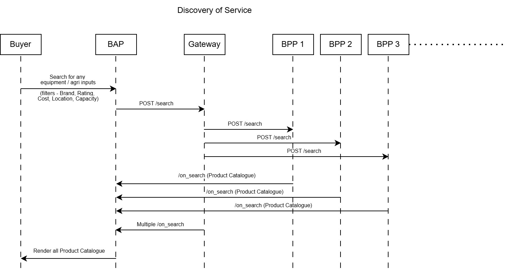
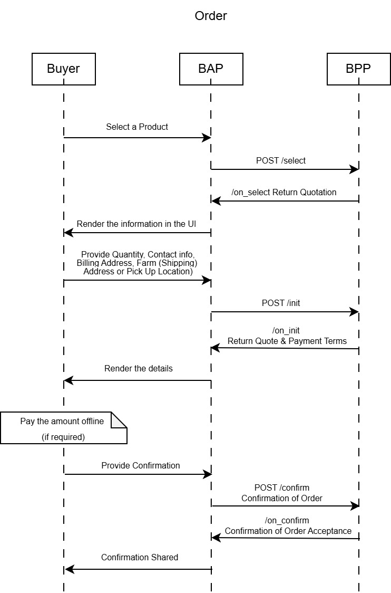
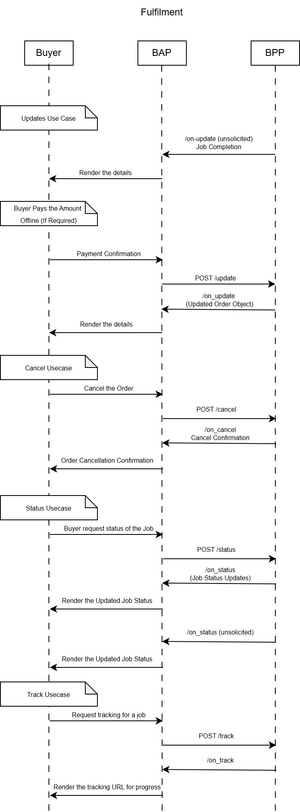

# UAI Implementation Guide - Equipment Purchase

#### Version 1.0

## Version History

| Date       | Version | Description                                         |
| ---------- | ------- | --------------------------------------------------- |
| 06-11-2024 | 0.1     | Initial Version                                     |
| 14-11-2024 | 0.2     | Internal Review Comments Incorprated                                     |
| 18-11-2024 | 1.0     | Final Version                                     |

## Introduction

This document provides material that helps network participants build and integrate their application with the Beckn Network. This document is part of the starter kit that provides information about the network, learning resources, network participant checklist etc. This document only focuses on the implementation of the seeker/provider platform. It assumes the reader has a good overview of the Beckn network, its APIs, the overall structure of the schema etc.

## Structure of the document

This document has the following parts:

1. Outcome Visualization - This is a pictorial or descriptive representation of the different use cases that are supported by the network.
2. Flow diagrams - This section provides a pictorial representation of the message flows that happen during the use case.
3. API Calls and Schema - This section provides details on the API calls and the schema of the message that is sent in the form of sample schemas.
4. Taxonomy and layer 2 configuration - This section provides details on the taxonomy, enumerations and any rules defined for either the use case or by the network.
5. Notes on writing/integrating with your own software - This section describes ways in which you can integrate (Becknify) your new or existing software
6. Links to downloadable resources - This section contains the downloadable files referenced in this document.

## Outcome Visualisation


### Use case - Discovery, Booking a Demo and Purchase of Agricultural Equipments on UAI Network

1.	Rajesh, a guava farmer in Nashik district, needs a motor pump for his 2-acre farm and uses a UAI-enabled app to search for suitable options.
2.	His search query is sent to nearby vendors, and he filters results by brand, capacity, cost, and rating.
3.	He receives a list of available models and their prices from nearby sellers:
    -	Sharp Hydro 1.0 HP Self Priming Pump - AL3 60 MM @ Rs 4647.16 (3.1 rating)
    -	GoWater 0.5 HP Self Priming Pump - AL3 30 MM @ Rs 3198.71 (4.4 rating)
    -	PowerHouse 1.5 HP Single Phase Monoblock Pump @ Rs 4000 (4.5 rating)
    -	Kirloskar 0.5 HP Star Ultra Monoblock Pump @ Rs 2090 (4.0 rating)
4.	Rajesh selects the Kirloskar 0.5 HP Star Ultra Monoblock Pump based on his preference. He receives two options - ‘Book a Demo’ or Purchase
5.	Rajesh places a request for 'Book a Demo’. He specifies contact, address, Date & Time details for a demonstration.
6. Rajesh receives a confirmation message for the demonstration.
7. Rajesh receives the status updates of the demonstration - demo date, time and demo completion status
8. Rajesh tracks the status of the demo periodically, receives the demo.

Rajesh is happy with the demo and proceeds to purchase the quipement:
9. Rajesh specifies a quantity of 1 units and opts for home delivery, entering his contact information, billing, and shipping address for invoicing.
10.	The app sends a purchase request to the seller, including product details, quantity, delivery preference, and Rajesh’s contact information.
11.	Rajesh receives a final quote with any additional charges (e.g., Rs 2300), along with the purchase terms such as cancellation and refund policies.
12.	After reviewing the quote and terms, Rajesh selects the "pay on delivery" option and confirms the order.
13.	The seller provides an order ID along with estimated shipping dates and tracking details.
14.	As the order is processed, Rajesh receives status updates; once delivered to his provided address, the order status updates to “delivered.”
15.	Post-delivery, Rajesh rates the motor pump based on product quality, delivery fulfillment, and support, helping future buyers make informed decisions.
16.	If any issues arise, Rajesh can contact support services through the app for assistance with his purchase.


## Flow diagrams

### General Beckn message flow and error handling

This section is relevant to all the messages flows illustrated below and discussed further in the document.

Beckn is a aynchronous protocol at its core.

- When a network participant(NP1) sends a message to another participant(NP2), the other participant(NP2) immediately returns back an ACK/NACK(Acknowledgement or Negative Acknowledgement in case of error - usually with wrongly formed messages).
- An ACK is an indicator that the receiving participant(NP2) will process this message and dispatch an on_xxxxxx message to original NP (NP1)
- Subsequently after processing the message NP2 sends back the real response in the corresponding on_xxxxxx message, to which again the first participant(NP1).
- This message can contain a message field (for success) or error field (for failure)
- NP1 when it receives the on_xxxxxx message, sends back an ACK/NACK (Here in both the cases NP1 will not send any subsequent message).
- In the Use case diagrams, this ACK/NACK is not illustrated explicitly to keep the diagrams crisp.
- However when writing software we should be prepared to receive these NACK messages as well as error field in the on_xxxxxx messages
- While this discussion is from a Beckn perspective, Adapters can provide synchronous modes. For example, the Protocol Server which is the reference implementation of the Beckn Adapter provides a synchronous mode by default. So if your software calls the support endpoint on the BAP Protocol Server, the Protocol Server waits till it gets the on_support and returns back that as the response.


**Structure of a message with a NACK**

```
{
    "message": {
        "ack": {
            "status": "NACK"
        }
    },
    "error": {
        "code": 400,
        "message": "OpenApiValidator Error at BAP-CLIENT",
    }
}
```

**Structure of a on_select message with an error**

```
{
    "context": {
        "action": "on_select",
        "version": "1.1.0",
        ...
    },
    "error": {
        "code": 30001,
        "message": "Requested provider is not in the database"
    }
}
```

### Use case - Discovery of Equipment Purchase on UAI Network

**Search for Farm Equipment Purchase**



**Place an order for the Farm Equipment**



**Fullfilment of an active order**



**Seek support and provide rating**


## API Calls and Schema

### Booking a Demo and then Purchasing the item

#### search

**search by keywords, rating and price**
```
{
    "context": {
        "domain": "retail:uai",
        "location": {
            "country": {
                "name": "IND"
            }
        },
        "action": "search",
        "version": "1.1.0",
        "bap_id": "{bap_id}",
        "bap_uri": "{bap_url}",
        "transaction_id": "8100d125-76a7-4588-88be-81b97657cd09",
        "message_id": "6104c0a3-d1d1-4ded-aaa4-76e4caf727ce",
        "timestamp": "2023-11-06T09:41:09.673Z",
        "ttl": "PT10M"
    },
    "message": {
        "intent": {
            "category": {
                "descriptor": {
                    "code": "purchase"
                }
            },
            "item": {
                "descriptor": {
                    "name": "motor pump"
                },
                "rating": ">3.0",
                "price": {
                    "maximum_value": "5000",
                    "currency": "INR"
                }
            }
        }
    }
}
```

**search by keyword, creator and capacity**
```
{
    "context": {
        "domain": "retail:uai",
        "location": {
            "country": {
                "name": "IND"
            }
        },
        "action": "search",
        "version": "1.1.0",
        "bap_id": "{bap_id}",
        "bap_uri": "{bap_url}",
        "transaction_id": "8100d125-76a7-4588-88be-81b97657cd09",
        "message_id": "6104c0a3-d1d1-4ded-aaa4-76e4caf727ce",
        "timestamp": "2023-11-06T09:41:09.673Z",
        "ttl": "PT10M"
    },
    "message": {
        "intent": {
            "category": {
                "descriptor": {
                    "code": "purchase"
                }
            },
            "item": {
                "descriptor": {
                    "name": "motor pump"
                },
                "creator": {
                    "descriptor": {
                        "code": "Kirlosker"
                    }
                },
                "tags": [
                    {
                        "list": [
                            {
                                "descriptor": {
                                    "code": "capacity"
                                },
                                "value": ">30MM"
                            }
                        ]
                    }
                ]
            }
        }
    }
}
```

**search by keyword and fulfillment type**
```
{
    "context": {
        "domain": "retail:uai",
        "location": {
            "country": {
                "name": "IND"
            }
        },
        "action": "search",
        "version": "1.1.0",
        "bap_id": "{bap_id}",
        "bap_uri": "{bap_url}",
        "transaction_id": "8100d125-76a7-4588-88be-81b97657cd09",
        "message_id": "6104c0a3-d1d1-4ded-aaa4-76e4caf727ce",
        "timestamp": "2023-11-06T09:41:09.673Z",
        "ttl": "PT10M"
    },
    "message": {
        "intent": {
            "category": {
                "descriptor": {
                    "code": "purchase"
                }
            },
            "item": {
                "descriptor": {
                    "name": "motor pump"
                },
                "fulfillment": {
                    "type": "Delivery"
                }
            }
        }
    }
}
```

#### on_search

**on_search with catalog of results**
- The catalog that comes back has a list of providers.
- Each provider has a list of items.
- Each item is the catalog listing for a resource.
- The name, short_desc and long_desc fields contain the name and description of the resource.
- Further, if the resource is a video or a pdf, its mimetype and url are specified in the media field.

The items which allow booking a demo have category code "demo" in it.

```
{
    "context": {
        "domain": "retail:uai",
        "location": {
            "country": {
                "name": "IND"
            }
        },
        "action": "on_search",
        "version": "1.1.0",
        "bap_id": "{bap_id}",
        "bap_uri": "{bap_url}",
        "bpp_id": "{bpp_id}",
        "bpp_uri": "{bpp_url}",
        "message_id": "message_124",
        "transaction_id": "transaction_456",
        "timestamp": "2023-11-06T09:41:09.708Z",
        "ttl": "PT10M"
    },
    "message": {
        "catalog": {
            "descriptor": {
                "name": "Agricultural Equipment",
                "images": [
                    {
                        "url": "https://example.com/agri_equipment.jpg"
                    }
                ]
            },
            "providers": [
                {
                    "id": "vendor1",
                    "descriptor": {
                        "name": "Nashik Agri Vendor",
                        "short_desc": "Quality pumps from local suppliers",
                        "images": [
                            {
                                "url": "https://example.com/vendor1_logo.jpg"
                            }
                        ]
                    },
                    "fulfillments": [
                        {
                            "id": "f1",
                            "type": "Delivery"
                        },
                        {
                            "id": "f2",
                            "type": "Self-Pickup"
                        }
                    ],
                    "locations": [
                        {
                            "id": "l1",
                            "gps": "23.11355, 24.32344"
                        },
                        {
                            "id": "l2",
                            "gps": "24.11355, 23.32344"
                        },
                        {
                            "id": "l3",
                            "gps": "24.24434, 23.24234"
                        }
                    ],
                    "categories": [
                        {
                            "id": "c1",
                            "descriptor": {
                                "code": "purchase"
                            }
                        },
                        {
                            "id": "c2",
                            "descriptor": {
                                "code": "demo"
                            }
                        }
                    ],
                    "items": [
                        {
                            "id": "motor1",
                            "descriptor": {
                                "name": "Sharp Hydro 1.0 HP Self Priming Pump - AL3 60 MM",
                                "short_desc": "Self-priming pump for medium farms",
                                "long_desc": "1.0 HP pump suitable for a 2-acre farm",
                                "images": [
                                    {
                                        "url": "https://example.com/sharp_hydro.jpg"
                                    }
                                ]
                            },
                            "price": {
                                "currency": "INR",
                                "value": "4647.16"
                            },
                            "rating": "3.1",
                            "creator": {
                                "descriptor": {
                                    "name": "Sharp Hydro",
                                    "code": "Sharp-Hydro"
                                }
                            },
                            "fulfillment_ids": [
                                "f1",
                                "f2"
                            ],
                            "category_ids": [
                                "c1",
                                "c2
                            ],
                            "tags": [
                                {
                                    "list": [
                                        {
                                            "descriptor": {
                                                "code": "capacity"
                                            },
                                            "value": "60MM"
                                        }
                                    ]
                                }
                            ]
                        },
                        {
                            "id": "motor2",
                            "descriptor": {
                                "name": "Kirloskar 0.5 HP Star Ultra Monoblock Pump",
                                "short_desc": "Reliable pump for small farms",
                                "long_desc": "0.5 HP pump, ideal for irrigation needs",
                                "images": [
                                    {
                                        "url": "https://example.com/kirloskar_pump.jpg"
                                    }
                                ]
                            },
                            "price": {
                                "currency": "INR",
                                "value": "2090.00"
                            },
                            "rating": "4.0",
                            "creator": {
                                "descriptor": {
                                    "name": "Kirloskar",
                                    "code": "Kirloskar"
                                }
                            },
                            "fulfillment_ids": [
                                "f1",
                                "f2"
                            ],
                            "category_ids": [
                                "c1"
                            ],
                            "tags": [
                                {
                                    "list": [
                                        {
                                            "descriptor": {
                                                "code": "capacity"
                                            },
                                            "value": "60MM"
                                        }
                                    ]
                                }
                            ]
                        }
                    ]
                },
                {
                    "id": "vendor2",
                    "descriptor": {
                        "name": "FarmEquip Distributors",
                        "short_desc": "Trusted distributor of agricultural equipment",
                        "images": [
                            {
                                "url": "https://example.com/vendor2_logo.jpg"
                            }
                        ]
                    },
                    "fulfillments": [
                        {
                            "id": "f1",
                            "type": "Delivery"
                        },
                        {
                            "id": "f2",
                            "type": "Self-Pickup"
                        }
                    ],
                    "locations": [
                        {
                            "id": "l1",
                            "gps": "23.11355, 24.32344"
                        },
                        {
                            "id": "l2",
                            "gps": "24.11355, 23.32344"
                        },
                        {
                            "id": "l3",
                            "gps": "24.24434, 23.24234"
                        }
                    ],
                    "categories": [
                        {
                            "id": "c1",
                            "descriptor": {
                                "code": "purchase"
                            }
                        },
                        {
                            "id": "c2",
                            "descriptor": {
                                "code": "demo"
                            }
                        }
                    ],
                    "items": [
                        {
                            "id": "motor3",
                            "descriptor": {
                                "name": "GoWater 0.5 HP Self Priming Pump - AL3 30 MM",
                                "short_desc": "Energy-efficient pump for small farms",
                                "long_desc": "Lightweight and durable, suitable for small farm irrigation",
                                "images": [
                                    {
                                        "url": "https://example.com/gowater_pump.jpg"
                                    }
                                ]
                            },
                            "price": {
                                "currency": "INR",
                                "value": "3198.71"
                            },
                            "rating": "4.4",
                            "creator": {
                                "descriptor": {
                                    "name": "Go Water",
                                    "code": "GoWater"
                                }
                            },
                            "fulfillment_ids": [
                                "f1"
                            ],
                            "category_ids": [
                                "c1",
                                "c2"
                            ],
                            "tags": [
                                {
                                    "list": [
                                        {
                                            "descriptor": {
                                                "code": "capacity"
                                            },
                                            "value": "30MM"
                                        }
                                    ]
                                }
                            ]
                        },
                        {
                            "id": "motor4",
                            "descriptor": {
                                "name": "PowerHouse 1.5 HP Single Phase Monoblock Pump",
                                "short_desc": "High-power pump for large fields",
                                "long_desc": "1.5 HP pump with a single-phase motor, ideal for extensive irrigation needs",
                                "images": [
                                    {
                                        "url": "https://example.com/powerhouse_pump.jpg"
                                    }
                                ]
                            },
                            "price": {
                                "currency": "INR",
                                "value": "4000.00"
                            },
                            "rating": "4.5",
                            "creator": {
                                "descriptor": {
                                    "name": "Power House",
                                    "code": "Power-House"
                                }
                            },
                            "fulfillment_ids": [
                                "f2"
                            ],
                            "category_ids": [
                                "c1",
                                "c2
                            ],
                            "tags": [
                                {
                                    "list": [
                                        {
                                            "descriptor": {
                                                "code": "capacity"
                                            },
                                            "value": "60MM"
                                        }
                                    ]
                                }
                            ]
                        }
                    ]
                }
            ]
        }
    }
}
```

### User books a Demo

**Assuming booking a demo would be free, there would not be a quotatio involved. Select API call can be skipped**

**There would not be any billing and payment involved. Init API call can also be skipped**

**confirm a demo order.**
BAP specifies that it is a demo request using item category code.

#### confirm

```
{
    "context": {
      "domain": "retail:uai",
      "location": {
        "country": {
          "code": "IND"
        }
      },
      "action": "confirm",
      "version": "1.1.0",
      "bap_id": "{bap_id}",
      "bap_uri": "{bap_uri}",
      "bpp_id": "{bpp_id}",
      "bpp_uri": "{bpp_uri}",
      "message_id": "6d098f3a-4873-4b2e-935e-e4d6be92eb01",
      "transaction_id": "8100d125-76a7-4588-88be-81b97657cd09",
      "timestamp": "2023-11-06T09:44:47.217Z"
    },
    "message": {
      "order": {
        "provider": {
          "id": "vendor1"
        },
        "items": [
          {
            "id": "motor2",
            "category_ids": [
              "c2"
            ]
          }
        ],
        "fulfillments": [
          {
            "customer": {
                "person": {
                    "name": "Rajesh"
                },
                "contact": {
                    "phone": "8130xxxxxx"
                }
            },
            "stops": [
                {
                    "type": "end",
                    "location": {
                        "district": {
                            "name": "Nashik",
                            "code": "nashik"
                        },
                        "state": {
                            "name": "Maharashtra",
                            "code": "maharashtra"
                        },
                        "area_code": "122024"
                    },
                    "time": {
                        "range": {
                            "start": "2025-03-06T09:00:00.000Z",
                            "end": "2025-03-06T010:00:00.000Z"
                        }
                    }
                }
            ]
          }
        ]
      }
    }
  }
```

#### on_confirm

```
{
    "context": {
        "domain": "retail:uai",
        "location": {
            "country": {
                "code": "IND"
            }
        },
        "action": "on_confirm",
        "version": "1.1.0",
        "bap_id": "{bap_id}",
        "bap_uri": "{bap_uri}",
        "bpp_id": "{bpp_id}",
        "bpp_uri": "{bpp_uri}",
        "message_id": "6d098f3a-4873-4b2e-935e-e4d6be92eb01",
        "transaction_id": "8100d125-76a7-4588-88be-81b97657cd09",
        "timestamp": "2023-11-06T09:44:47.217Z"
    },
    "message": {
        "order": {
            "id": "ord1",
            "provider": {
                "id": "vendor1",
                "descriptor": {
                    "name": "Nashik Agri Vendor",
                    "short_desc": "Quality pumps from local suppliers",
                    "images": [
                        {
                            "url": "https://example.com/vendor1_logo.jpg"
                        }
                    ]
                }
            },
            "items": [
                {
                    "id": "motor2",
                    "descriptor": {
                        "name": "Kirloskar 0.5 HP Star Ultra Monoblock Pump",
                        "short_desc": "Reliable pump for small farms",
                        "long_desc": "0.5 HP pump, ideal for irrigation needs",
                        "images": [
                            {
                                "url": "https://example.com/kirloskar_pump.jpg"
                            }
                        ]
                    },
                    "price": {
                        "currency": "INR",
                        "value": "2090.00"
                    },
                    "rating": "4.0",
                    "creator": {
                        "descriptor": {
                            "name": "Kirloskar",
                            "code": "Kirloskar"
                        }
                    },
                    "fulfillment_ids": [
                        "f1"
                    ],
                    "category_ids": [
                        "c1",
                        "c2"
                    ],
                    "tags": [
                        {
                            "list": [
                                {
                                    "descriptor": {
                                        "code": "capacity"
                                    },
                                    "value": "60MM"
                                }
                            ]
                        }
                    ]
                }
            ],
            "fulfillments": [
                {
                    "customer": {
                        "person": {
                            "name": "Rajesh"
                        },
                        "contact": {
                            "phone": "8130xxxxxx"
                        }
                    },
                    "stops": [
                        {
                            "type": "end",
                            "location": {
                                "district": {
                                    "name": "Nashik",
                                    "code": "nashik"
                                },
                                "state": {
                                    "name": "Maharashtra",
                                    "code": "maharashtra"
                                },
                                "area_code": "122024"
                            },
                            "time": {
                                "range": {
                                    "start": "2025-03-06T09:00:00.000Z",
                                    "end": "2025-03-06T010:00:00.000Z"
                                }
                            }
                        }
                    ],
                    "state": {
                        "descriptor": {
                            "code": "Order-Placed"
                        }
                    }
                }
            ]
        }
    }
}
```

#### status

```
{
    "context": {
        "domain": "retail:uai",
        "location": {
            "country": {
                "code": "IND"
            }
        },
        "action": "status",
        "version": "1.1.0",
        "bap_id": "{bap_id}",
        "bap_uri": "{bap_uri}",
        "bpp_id": "{bpp_id}",
        "bpp_uri": "{bpp_uri}",
        "message_id": "6d098f3a-4873-4b2e-935e-e4d6be92eb01",
        "transaction_id": "8100d125-76a7-4588-88be-81b97657cd09",
        "timestamp": "2023-11-06T09:44:47.217Z"
    },
    "message": {
        "order_id": "ord1"
    }
}

```

#### on_status
```
{
    "context": {
        "domain": "retail:uai",
        "location": {
            "country": {
                "code": "IND"
            }
        },
        "action": "on_status",
        "version": "1.1.0",
        "bap_id": "{bap_id}",
        "bap_uri": "{bap_uri}",
        "bpp_id": "{bpp_id}",
        "bpp_uri": "{bpp_uri}",
        "message_id": "6d098f3a-4873-4b2e-935e-e4d6be92eb01",
        "transaction_id": "8100d125-76a7-4588-88be-81b97657cd09",
        "timestamp": "2023-11-06T09:44:47.217Z"
    },
    "message": {
        "order": {
            "id": "ord1",
            "provider": {
                "id": "vendor1",
                "descriptor": {
                    "name": "Nashik Agri Vendor",
                    "short_desc": "Quality pumps from local suppliers",
                    "images": [
                        {
                            "url": "https://example.com/vendor1_logo.jpg"
                        }
                    ]
                }
            },
            "items": [
                {
                    "id": "motor2",
                    "descriptor": {
                        "name": "Kirloskar 0.5 HP Star Ultra Monoblock Pump",
                        "short_desc": "Reliable pump for small farms",
                        "long_desc": "0.5 HP pump, ideal for irrigation needs",
                        "images": [
                            {
                                "url": "https://example.com/kirloskar_pump.jpg"
                            }
                        ]
                    },
                    "price": {
                        "currency": "INR",
                        "value": "2090.00"
                    },
                    "rating": "4.0",
                    "creator": {
                        "descriptor": {
                            "name": "Kirloskar",
                            "code": "Kirloskar"
                        }
                    },
                    "fulfillment_ids": [
                        "f1"
                    ],
                    "category_ids": [
                        "c1",
                        "c2"
                    ],
                    "tags": [
                        {
                            "list": [
                                {
                                    "descriptor": {
                                        "code": "capacity"
                                    },
                                    "value": "60MM"
                                }
                            ]
                        }
                    ]
                }
            ],
            "fulfillments": [
                {
                    "customer": {
                        "person": {
                            "name": "Rajesh"
                        },
                        "contact": {
                            "phone": "8130xxxxxx"
                        }
                    },
                    "stops": [
                        {
                            "type": "end",
                            "location": {
                                "district": {
                                    "name": "Nashik",
                                    "code": "nashik"
                                },
                                "state": {
                                    "name": "Maharashtra",
                                    "code": "maharashtra"
                                },
                                "area_code": "122024"
                            },
                            "time": {
                                "range": {
                                    "start": "2025-03-06T09:00:00.000Z",
                                    "end": "2025-03-06T010:00:00.000Z"
                                }
                            }
                        }
                    ],
                    "agent": {
                        "person": {
                            "name": "Sundaram"
                        },
                        "contact": {
                            "phone": "97643564xx"
                        }
                    }
                    "state": {
                        "descriptor": {
                            "code": "Agent-Assigned"
                        }
                    }
                }
            ]
        }
    }
}
```
#### on_status

```
{
    "context": {
        "domain": "retail:uai",
        "location": {
            "country": {
                "code": "IND"
            }
        },
        "action": "on_status",
        "version": "1.1.0",
        "bap_id": "{bap_id}",
        "bap_uri": "{bap_uri}",
        "bpp_id": "{bpp_id}",
        "bpp_uri": "{bpp_uri}",
        "message_id": "6d098f3a-4873-4b2e-935e-e4d6be92eb01",
        "transaction_id": "8100d125-76a7-4588-88be-81b97657cd09",
        "timestamp": "2023-11-06T09:44:47.217Z"
    },
    "message": {
        "order": {
            "id": "ord1",
            "provider": {
                "id": "vendor1",
                "descriptor": {
                    "name": "Nashik Agri Vendor",
                    "short_desc": "Quality pumps from local suppliers",
                    "images": [
                        {
                            "url": "https://example.com/vendor1_logo.jpg"
                        }
                    ]
                }
            },
            "items": [
                {
                    "id": "motor2",
                    "descriptor": {
                        "name": "Kirloskar 0.5 HP Star Ultra Monoblock Pump",
                        "short_desc": "Reliable pump for small farms",
                        "long_desc": "0.5 HP pump, ideal for irrigation needs",
                        "images": [
                            {
                                "url": "https://example.com/kirloskar_pump.jpg"
                            }
                        ]
                    },
                    "price": {
                        "currency": "INR",
                        "value": "2090.00"
                    },
                    "rating": "4.0",
                    "creator": {
                        "descriptor": {
                            "name": "Kirloskar",
                            "code": "Kirloskar"
                        }
                    },
                    "fulfillment_ids": [
                        "f1"
                    ],
                    "category_ids": [
                        "c1",
                        "c2"
                    ],
                    "tags": [
                        {
                            "list": [
                                {
                                    "descriptor": {
                                        "code": "capacity"
                                    },
                                    "value": "60MM"
                                }
                            ]
                        }
                    ]
                }
            ],
            "fulfillments": [
                {
                    "customer": {
                        "person": {
                            "name": "Rajesh"
                        },
                        "contact": {
                            "phone": "8130xxxxxx"
                        }
                    },
                    "stops": [
                        {
                            "type": "end",
                            "location": {
                                "district": {
                                    "name": "Nashik",
                                    "code": "nashik"
                                },
                                "state": {
                                    "name": "Maharashtra",
                                    "code": "maharashtra"
                                },
                                "area_code": "122024"
                            },
                            "time": {
                                "range": {
                                    "start": "2025-03-06T09:00:00.000Z",
                                    "end": "2025-03-06T010:00:00.000Z"
                                }
                            }
                        }
                    ],
                    "agent": {
                        "person": {
                            "name": "Sundaram"
                        },
                        "contact": {
                            "phone": "97643564xx"
                        }
                    }
                    "state": {
                        "descriptor": {
                            "code": "Order-Fulfilled"
                        }
                    }
                }
            ]
        }
    }
}
```

### User is satisfied with the demo and proceeds to buy the equipment.
This is considered a new transaction. BAP already has the item detail, this transaction can start from select onwards.

BAP specifies that it is a purchase request using item category code.

#### select

**selecting an item from the catalog**

- provider Contains details of the seller from whom the items are purchased.
- Items  A list of individual items included in the purchase.
- fulfillments[idx] object provides specific fulfillment details for each part of the order..

```
{
    "context": {
      "domain": "retail:uai",
      "location": {
        "country": {
          "code": "IND"
        }
      },
      "action": "select",
      "version": "1.1.0",
      "bap_id": "{bap_id}",
      "bap_uri": "{bap_uri}",
      "bpp_id": "{bpp_id}",
      "bpp_uri": "{bpp_uri}",
      "message_id": "6d098f3a-4873-4b2e-935e-e4d6be92eb01",
      "transaction_id": "8100d125-76a7-4588-88be-81b97657cd09",
      "timestamp": "2023-11-06T09:44:47.217Z"
    },
    "message": {
      "order": {
        "provider": {
          "id": "vendor1"
        },
        "items": [
          {
            "id": "motor2",
            "category_ids": [
              "c1"
            ],
            "quantity": {
              "selected": {
                "count": "1"
              }
            }
          }
        ],
        "fulfillments": [
          {
            "id": "f1",
            "stops": [
                {
                    "type": "end",
                    "location": {
                        "gps": "23.23442, 24.35352"
                    }
                }
            ]
          }
        ]
      }
    }
  }
```

#### on_select

**Getting a quotation from the seller for the selected items from the catalog**

- Contains the pricing, itemized details, and cost breakup for a potential purchase.

```
{
    "context": {
        "domain": "retail:uai",
        "location": {
            "country": {
                "code": "IND"
            }
        },
        "action": "on_select",
        "version": "1.1.0",
        "bap_id": "{bap_id}",
        "bap_uri": "{bap_uri}",
        "bpp_id": "{bpp_id}",
        "bpp_uri": "{bpp_uri}",
        "message_id": "6d098f3a-4873-4b2e-935e-e4d6be92eb01",
        "transaction_id": "8100d125-76a7-4588-88be-81b97657cd09",
        "timestamp": "2023-11-06T09:44:47.217Z"
    },
    "message": {
        "order": {
            "provider": {
                "id": "vendor1",
                "descriptor": {
                    "name": "Nashik Agri Vendor",
                    "short_desc": "Quality pumps from local suppliers",
                    "images": [
                        {
                            "url": "https://example.com/vendor1_logo.jpg"
                        }
                    ]
                }
            },
            "items": [
                {
                    "id": "motor2",
                    "descriptor": {
                        "name": "Kirloskar 0.5 HP Star Ultra Monoblock Pump",
                        "short_desc": "Reliable pump for small farms",
                        "long_desc": "0.5 HP pump, ideal for irrigation needs",
                        "images": [
                            {
                                "url": "https://example.com/kirloskar_pump.jpg"
                            }
                        ]
                    },
                    "price": {
                        "currency": "INR",
                        "value": "2090.00"
                    },
                    "rating": "4.0",
                    "creator": {
                        "descriptor": {
                            "name": "Kirloskar",
                            "code": "Kirloskar"
                        }
                    },
                    "fulfillment_ids": [
                        "f1"
                    ],
                    "category_ids": [
                        "c1"
                    ],
                    "tags": [
                        {
                            "list": [
                                {
                                    "descriptor": {
                                        "code": "capacity"
                                    },
                                    "value": "60MM"
                                }
                            ]
                        }
                    ]
                }
            ],
            "fulfillments": [
                {
                    "id": "f1",
                    "stops": [
                        {
                            "type": "end",
                            "location": {
                                "gps": "23.23442, 24.35352"
                            }
                        }
                    ]
                }
            ],
            "quote": {
                "price": {
                    "currency": "INR",
                    "value": "2200.0"
                },
                "breakup": [
                    {
                        "title": "item-price",
                        "price": {
                            "currency": "INR",
                            "value": "2090.0"
                        }
                    },
                    {
                        "title": "taxes",
                        "price": {
                            "currency": "INR",
                            "value": "110.0"
                        }
                    }
                ]
            }
        }
    }
}

```

#### init

**initialise an order with billing details**

```
{
    "context": {
      "domain": "retail:uai",
      "location": {
        "country": {
          "code": "IND"
        }
      },
      "action": "init",
      "version": "1.1.0",
      "bap_id": "{bap_id}",
      "bap_uri": "{bap_uri}",
      "bpp_id": "{bpp_id}",
      "bpp_uri": "{bpp_uri}",
      "message_id": "6d098f3a-4873-4b2e-935e-e4d6be92eb01",
      "transaction_id": "8100d125-76a7-4588-88be-81b97657cd09",
      "timestamp": "2023-11-06T09:44:47.217Z"
    },
    "message": {
      "order": {
        "provider": {
          "id": "vendor1"
        },
        "items": [
          {
            "id": "motor2",
            "fulfillment_ids": [
              "f1"
            ],
            "category_ids": [
              "c1"
            ],
            "quantity": {
              "selected": {
                "count": "1"
              }
            }
          }
        ],
        "fulfillments": [
          {
            "id": "f1",
            "stops": [
                {
                    "type": "end",
                    "location": {
                        "gps": "23.23442, 24.35352",
                        "address": "123 street, HSR layout, Nashik",
                        "city": "Nashik",
                        "district": "Nashik",
                        "state": "Maharashtra"
                    }
                }
            ],
            "customer": {
                "person": {
                    "name": "Rajesh"
                },
                "contact": {
                    "phone": "8130xxxxxx"
                }
            }
          }
        ],
        "billing": {
            "name": "Rajesj",
            "phone" : "8130xxxxxx",
            "email" : "Rajesh@example.com" 
        }
      }
    }
  }

```

#### on_init

**Receive the payment details from the seller.**

```
{
    "context": {
        "domain": "retail:uai",
        "location": {
            "country": {
                "code": "IND"
            }
        },
        "action": "on_init",
        "version": "1.1.0",
        "bap_id": "{bap_id}",
        "bap_uri": "{bap_uri}",
        "bpp_id": "{bpp_id}",
        "bpp_uri": "{bpp_uri}",
        "message_id": "6d098f3a-4873-4b2e-935e-e4d6be92eb01",
        "transaction_id": "8100d125-76a7-4588-88be-81b97657cd09",
        "timestamp": "2023-11-06T09:44:47.217Z"
    },
    "message": {
        "order": {
            "provider": {
                "id": "vendor1",
                "descriptor": {
                    "name": "Nashik Agri Vendor",
                    "short_desc": "Quality pumps from local suppliers",
                    "images": [
                        {
                            "url": "https://example.com/vendor1_logo.jpg"
                        }
                    ]
                }
            },
            "items": [
                {
                    "id": "motor2",
                    "descriptor": {
                        "name": "Kirloskar 0.5 HP Star Ultra Monoblock Pump",
                        "short_desc": "Reliable pump for small farms",
                        "long_desc": "0.5 HP pump, ideal for irrigation needs",
                        "images": [
                            {
                                "url": "https://example.com/kirloskar_pump.jpg"
                            }
                        ]
                    },
                    "price": {
                        "currency": "INR",
                        "value": "2090.00"
                    },
                    "rating": "4.0",
                    "creator": {
                        "descriptor": {
                            "name": "Kirloskar",
                            "code": "Kirloskar"
                        }
                    },
                    "fulfillment_ids": [
                        "f1"
                    ],
                    "category_ids": [
                        "c1"
                    ],
                    "tags": [
                        {
                            "list": [
                                {
                                    "descriptor": {
                                        "code": "capacity"
                                    },
                                    "value": "60MM"
                                }
                            ]
                        }
                    ]
                }
            ],
            "fulfillments": [
                {
                    "id": "f1",
                    "type": "Delivery",
                    "stops": [
                        {
                            "type": "end",
                            "location": {
                                "gps": "23.23442, 24.35352",
                                "address": "123 street, HSR layout, Nashik",
                                "city": "Nashik",
                                "district": "Nashik",
                                "state": "Maharashtra"
                            }
                        }
                    ],
                    "customer": {
                        "person": {
                            "name": "Rajesh"
                        },
                        "contact": {
                            "phone": "8130xxxxxx"
                        }
                    }
                }
            ],
            "quote": {
                "price": {
                    "currency": "INR",
                    "value": "2200.0"
                },
                "breakup": [
                    {
                        "title": "item-price",
                        "price": {
                            "currency": "INR",
                            "value": "2090.0"
                        }
                    },
                    {
                        "title": "taxes",
                        "price": {
                            "currency": "INR",
                            "value": "110.0"
                        }
                    }
                ]
            },
            "billing": {
                "name": "Rajesj",
                "phone" : "8130xxxxxx",
                "email" : "Rajesh@example.com" 
            },
            "payments": [
                {
                    "status": "NOT-PAID",
                    "type": "POST-FULFILLMENT",
                    "collected_by": "AGENT",
                    "params": {
                        "amount": "2200",
                        "currency": "INR"
                    }
                }
            ],
            "cancellation_terms": [
                {
                    "cancel_by": {
                        "label": "before delivery starts"
                    },
                    "cancellation_fee": {
                        "percentage": "10%"
                    }
                },
                {
                    "cancel_by": {
                        "label": "in delivery items"
                    },
                    "cancellation_fee": {
                        "percentage": "50%"
                    }
                }
            ],
            "return_terms": [
                {
                    "return_eligible": "false"
                }
            ]
        }
    }
}
```

#### confirm

**Confirm payment terms for post-fulfillment collection**

```
{
    "context": {
        "domain": "retail:uai",
        "location": {
            "country": {
                "code": "IND"
            }
        },
        "action": "confirm",
        "version": "1.1.0",
        "bap_id": "{bap_id}",
        "bap_uri": "{bap_uri}",
        "bpp_id": "{bpp_id}",
        "bpp_uri": "{bpp_uri}",
        "message_id": "6d098f3a-4873-4b2e-935e-e4d6be92eb01",
        "transaction_id": "8100d125-76a7-4588-88be-81b97657cd09",
        "timestamp": "2023-11-06T09:44:47.217Z"
    },
    "message": {
        "order": {
            "provider": {
                "id": "vendor1"
            },
            "items": [
                {
                    "id": "motor2",
                    "fulfillment_ids": [
                        "f1"
                    ],
                    "category_ids": [
                        "c1"
                    ],
                    "quantity": {
                        "selected": {
                            "count": "1"
                        }
                    }
                }
            ],
            "fulfillments": [
                {
                    "id": "f1",
                    "stops": [
                        {
                            "type": "end",
                            "location": {
                                "gps": "23.23442, 24.35352"
                            }
                        }
                    ],
                    "customer": {
                        "person": {
                            "name": "Rajesh"
                        },
                        "contact": {
                            "phone": "8130xxxxxx"
                        }
                    }
                }
            ],
            "billing": {
                "name": "Rajesj",
                "phone": "8130xxxxxx",
                "email": "Rajesh@example.com"
            },
            "payments": [
                {
                    "status": "NOT-PAID",
                    "type": "POST-FULFILLMENT",
                    "collected_by": "AGENT",
                    "params": {
                        "amount": "2200",
                        "currency": "INR"
                    }
                }
            ]
        }
    }
}

```

#### on_confirm

**Confirm order details, including agent assignment and payment terms**

```
{
    "context": {
        "domain": "retail:uai",
        "location": {
            "country": {
                "code": "IND"
            }
        },
        "action": "on_confirm",
        "version": "1.1.0",
        "bap_id": "{bap_id}",
        "bap_uri": "{bap_uri}",
        "bpp_id": "{bpp_id}",
        "bpp_uri": "{bpp_uri}",
        "message_id": "6d098f3a-4873-4b2e-935e-e4d6be92eb01",
        "transaction_id": "8100d125-76a7-4588-88be-81b97657cd09",
        "timestamp": "2023-11-06T09:44:47.217Z"
    },
    "message": {
        "order": {
            "id": "b989c9a9-f603-4d44-b38d-26fd72286b40",
            "provider": {
                "id": "vendor1",
                "descriptor": {
                    "name": "Nashik Agri Vendor",
                    "short_desc": "Quality pumps from local suppliers",
                    "images": [
                        {
                            "url": "https://example.com/vendor1_logo.jpg"
                        }
                    ]
                }
            },
            "items": [
                {
                    "id": "motor2",
                    "descriptor": {
                        "name": "Kirloskar 0.5 HP Star Ultra Monoblock Pump",
                        "short_desc": "Reliable pump for small farms",
                        "long_desc": "0.5 HP pump, ideal for irrigation needs",
                        "images": [
                            {
                                "url": "https://example.com/kirloskar_pump.jpg"
                            }
                        ]
                    },
                    "price": {
                        "currency": "INR",
                        "value": "2090.00"
                    },
                    "rating": "4.0",
                    "creator": {
                        "descriptor": {
                            "name": "Kirloskar",
                            "code": "Kirloskar"
                        }
                    },
                    "fulfillment_ids": [
                        "f1"
                    ],
                    "category_ids": [
                        "c1"
                    ],
                    "tags": [
                        {
                            "list": [
                                {
                                    "descriptor": {
                                        "code": "capacity"
                                    },
                                    "value": "60MM"
                                }
                            ]
                        }
                    ]
                }
            ],
            "fulfillments": [
                {
                    "id": "f1",
                    "type": "Delivery",
                    "stops": [
                        {
                            "type": "end",
                            "location": {
                                "gps": "23.23442, 24.35352",
                                "address": "123 street, HSR layout, Nashik",
                                "city": "Nashik",
                                "district": "Nashik",
                                "state": "Maharashtra"
                            }
                        }
                    ],
                    "customer": {
                        "person": {
                            "name": "Rajesh"
                        },
                        "contact": {
                            "phone": "8130xxxxxx"
                        }
                    },
                    "state": {
                        "descriptor": {
                            "code": "ORDER CONFIRMED",
                            "name": "Your Order is confirmed"
                        }
                    }
                }
            ],
            "quote": {
                "price": {
                    "currency": "INR",
                    "value": "2200.0"
                },
                "breakup": [
                    {
                        "title": "item-price",
                        "price": {
                            "currency": "INR",
                            "value": "2090.0"
                        }
                    },
                    {
                        "title": "taxes",
                        "price": {
                            "currency": "INR",
                            "value": "110.0"
                        }
                    }
                ]
            },
            "billing": {
                "name": "Rajesj",
                "phone" : "8130xxxxxx",
                "email" : "Rajesh@example.com" 
            },
            "payments": [
                {
                    "status": "NOT-PAID",
                    "type": "POST-FULFILLMENT",
                    "collected_by": "AGENT",
                    "params": {
                        "amount": "2200",
                        "currency": "INR"
                    }
                }
            ],
            "cancellation_terms": [
                {
                    "cancel_by": {
                        "label": "before delivery starts"
                    },
                    "cancellation_fee": {
                        "percentage": "10%"
                    }
                },
                {
                    "cancel_by": {
                        "label": "in delivery items"
                    },
                    "cancellation_fee": {
                        "percentage": "50%"
                    }
                }
            ],
            "return_terms": [
                {
                    "return_eligible": "false"
                }
            ]
        }
    }
}

```

#### status

**Request current status of the order using order ID**


```
{
    "context": {
        "domain": "retail:uai",
        "location": {
            "country": {
                "code": "IND"
            }
        },
        "action": "status",
        "version": "1.1.0",
        "bap_id": "{bap_id}",
        "bap_uri": "{bap_uri}",
        "bpp_id": "{bpp_id}",
        "bpp_uri": "{bpp_uri}",
        "message_id": "6d098f3a-4873-4b2e-935e-e4d6be92eb01",
        "transaction_id": "8100d125-76a7-4588-88be-81b97657cd09",
        "timestamp": "2023-11-06T09:44:47.217Z"
    },
    "message": {
        "order_id": "b989c9a9-f603-4d44-b38d-26fd72286b40"
    }
}

```

#### on_status

**Retrieve the current status of the order, including progress and fulfillment details**
```
{
    "context": {
        "domain": "retail:uai",
        "location": {
            "country": {
                "code": "IND"
            }
        },
        "action": "on_confirm",
        "version": "1.1.0",
        "bap_id": "{bap_id}",
        "bap_uri": "{bap_uri}",
        "bpp_id": "{bpp_id}",
        "bpp_uri": "{bpp_uri}",
        "message_id": "6d098f3a-4873-4b2e-935e-e4d6be92eb01",
        "transaction_id": "8100d125-76a7-4588-88be-81b97657cd09",
        "timestamp": "2023-11-06T09:44:47.217Z"
    },
    "message": {
        "order": {
            "id": "b989c9a9-f603-4d44-b38d-26fd72286b40",
            "provider": {
                "id": "vendor1",
                "descriptor": {
                    "name": "Nashik Agri Vendor",
                    "short_desc": "Quality pumps from local suppliers",
                    "images": [
                        {
                            "url": "https://example.com/vendor1_logo.jpg"
                        }
                    ]
                }
            },
            "items": [
                {
                    "id": "motor2",
                    "descriptor": {
                        "name": "Kirloskar 0.5 HP Star Ultra Monoblock Pump",
                        "short_desc": "Reliable pump for small farms",
                        "long_desc": "0.5 HP pump, ideal for irrigation needs",
                        "images": [
                            {
                                "url": "https://example.com/kirloskar_pump.jpg"
                            }
                        ]
                    },
                    "price": {
                        "currency": "INR",
                        "value": "2090.00"
                    },
                    "rating": "4.0",
                    "creator": {
                        "descriptor": {
                            "name": "Kirloskar",
                            "code": "Kirloskar"
                        }
                    },
                    "fulfillment_ids": [
                        "f1"
                    ],
                    "category_ids": [
                        "c1"
                    ],
                    "tags": [
                        {
                            "list": [
                                {
                                    "descriptor": {
                                        "code": "capacity"
                                    },
                                    "value": "60MM"
                                }
                            ]
                        }
                    ]
                }
            ],
            "fulfillments": [
                {
                    "id": "f1",
                    "type": "Delivery",
                    "stops": [
                        {
                            "type": "end",
                            "location": {
                                "gps": "23.23442, 24.35352",
                                "address": "123 street, HSR layout, Nashik",
                                "city": "Nashik",
                                "district": "Nashik",
                                "state": "Maharashtra"
                            }
                        }
                    ],
                    "customer": {
                        "person": {
                            "name": "Rajesh"
                        },
                        "contact": {
                            "phone": "8130xxxxxx"
                        }
                    },
                    "agent": {
                        "person": {
                            "name": "Tony"
                        },
                        "contact": {
                            "phone": "9230xxxxxx"
                        },
                        "rating": "4.7"
                    },
                    "state": {
                        "descriptor": {
                            "code": "Delivered",
                            "name": "Your Order is delivered"
                        }
                    }
                }
            ],
            "quote": {
                "price": {
                    "currency": "INR",
                    "value": "2200.0"
                },
                "breakup": [
                    {
                        "title": "item-price",
                        "price": {
                            "currency": "INR",
                            "value": "2090.0"
                        }
                    },
                    {
                        "title": "taxes",
                        "price": {
                            "currency": "INR",
                            "value": "110.0"
                        }
                    }
                ]
            },
            "billing": {
                "name": "Rajesj",
                "phone" : "8130xxxxxx",
                "email" : "Rajesh@example.com" 
            },
            "payments": [
                {
                    "status": "PAID",
                    "type": "POST-FULFILLMENT",
                    "collected_by": "AGENT",
                    "params": {
                        "amount": "2200",
                        "currency": "INR"
                    }
                }
            ],
            "cancellation_terms": [
                {
                    "cancel_by": {
                        "label": "before delivery starts"
                    },
                    "cancellation_fee": {
                        "percentage": "10%"
                    }
                },
                {
                    "cancel_by": {
                        "label": "in delivery items"
                    },
                    "cancellation_fee": {
                        "percentage": "50%"
                    }
                }
            ],
            "return_terms": [
                {
                    "return_eligible": "false"
                }
            ]
        }
    }
}

```

#### support

**sending a support request**

- In most cases the support request is a call to get contact details of the provider platform (Phone, Web url etc).
- However in rare cases a reference id might be sent to provide a context to the request.

```
{
    "context": {
        "domain": "retail:uai",
        "location": {
            "country": {
                "code": "IND"
            }
        },
        "action": "support",
        "version": "1.1.0",
        "bap_id": "{bap_id}",
        "bap_uri": "{bap_uri}",
        "bpp_id": "{bpp_id}",
        "bpp_uri": "{bpp_uri}",
        "message_id": "6d098f3a-4873-4b2e-935e-e4d6be92eb01",
        "transaction_id": "8100d125-76a7-4588-88be-81b97657cd09",
        "timestamp": "2023-11-06T09:44:47.217Z"
    },
    "message": {
        "ref_id": "9e188d26-0b1b-4920-a586-6006b0bcf768"
    }
}

```

#### on_support

**Getting an on_support callback**

- In most cases the returned details are common contact information of the provider platform.
- However it is possible to connect this to other customer management solutions.

```
{
    "context": {
        "domain": "retail:uai",
        "location": {
            "country": {
                "name": "IND"
            }
        },
        "action": "on_support",
        "version": "1.1.0",
        "bap_id": "{bap_id}",
        "bap_uri": "{bap_url}",
        "bpp_id": "{bpp_id}",
        "bpp_uri": "{bpp_url}",
        "message_id": "6104c0a3-d1d1-4ded-aaa4-76e4caf727ce",
        "transaction_id": "8100d125-76a7-4588-88be-81b97657cd09",
        "timestamp": "2023-11-06T09:41:09.708Z",
        "ttl": "PT10M"
    },
    "message": {
        "support": {
            "ref_id": "9e188d26-0b1b-4920-a586-6006b0bcf768",
            "phone": "18001801551",
            "url": "https://kirloskar.io/equipements/support.html"
        }
    }
}


```

#### get_rating_categories

- BAP can fetch a list of categoried for which a BPP accepts rating
- ```message``` field is not needed in the get_rating_categories request.

```
{
  "context": {
    "domain": "retail:uai",
    "action": "get_rating_categories",
    "location": {
      "country": {
        "name": "India",
        "code": "IND"
      }
    },
    "city": "std:080",
    "version": "1.1.0",
    "bap_id": "{bap_id}",
    "bap_uri": "{bap_url}",
    "bpp_id": "{bpp_id}",
    "bpp_uri": "{bpp_url}",
    "transaction_id": "6743e9e2-4fb5-487c-92b7-13ba8018f176",
    "message_id": "6743e9e2-4fb5-487c-92b7-13ba8018f176",
    "timestamp": "2023-07-16T04:41:16Z"
  }
}
```

#### rating_categories

- The BPP responds with a list of categories in which ratings can be provided.

```
{
  "context": {
    "domain": "retail:uai",
    "action": "get_rating_categories",
    "location": {
      "country": {
        "name": "India",
        "code": "IND"
      }
    },
    "city": "std:080",
    "version": "1.1.0",
    "bap_id": "{bap_id}",
    "bap_uri": "{bap_url}",
    "bpp_id": "{bpp_id}",
    "bpp_uri": "{bpp_url}",
    "transaction_id": "6743e9e2-4fb5-487c-92b7-13ba8018f176",
    "message_id": "6743e9e2-4fb5-487c-92b7-13ba8018f176",
    "timestamp": "2023-07-16T04:41:16Z"
  },
  "message": {
    "rating_categories": [
      Item,
      Order,
      Fulfillment,
      Provider
    ]
  }
}
```

#### rating

**Rating a resource**

- When the user wants to rate the resource, it happens in two steps.
- The user sends a numerical (0-5) rating in the request.
- The response will have a link to the form where the user can provide text feedback.

```
{
    "context": {
        "domain": "retail:uai",
        "location": {
            "country": {
                "name": "IND"
            }
        },
        "action": "rating",
        "version": "1.1.0",
        "bap_id": "{bap_id}",
        "bap_uri": "{bap_url}",
        "bpp_id": "{bpp_id}",
        "bpp_uri": "{bpp_url}",
        "message_id": "6104c0a3-d1d1-4ded-aaa4-76e4caf727ce",
        "transaction_id": "8100d125-76a7-4588-88be-81b97657cd09",
        "timestamp": "2023-11-06T09:41:09.708Z",
        "ttl": "PT10M"
    },
    "message": {
        "ratings": [
            {
                "id": "motor2",
                "rating_category": "Item",
                "value": "4"
            }
        ]
    }
}

```

#### on_rating

**Getting on_rating response**

- The on_rating response has a link to the form where the user can specify a text feedback that goes alongside the numerical rating provided earlier.

```
{
    "context": {
        "domain": "retail:uai",
        "location": {
            "country": {
                "name": "IND"
            }
        },
        "action": "on_rating",
        "version": "1.1.0",
        "bap_id": "{bap_id}",
        "bap_uri": "{bap_url}",
        "bpp_id": "{bpp_id}",
        "bpp_uri": "{bpp_url}",
        "message_id": "6104c0a3-d1d1-4ded-aaa4-76e4caf727ce",
        "transaction_id": "8100d125-76a7-4588-88be-81b97657cd09",
        "timestamp": "2023-11-06T09:41:09.708Z",
        "ttl": "PT10M"
    },
    "message": {
        "feedback_form": {
            "form": {
                "url": "https://kirloskar.io/rating/feedback"
            }
        }
    }
}

```

## Taxonomy and layer 2 configuration

- Any specific tags, enumerations, and rules we add for the use cases or required by the network, will go here.

## Integrating with your software

This section gives general walkthrough of how you would integrate your software with the Beckn network (say the sandbox environment). Refer to the starter kit for details on how to register with the sandbox and get credentials.

Beckn-ONIX is an initiative to promote easy install and maintenance of a Beckn Network. Apart from the Registry and Gateway components that are required for a network facilitator, Beckn-ONIX provides a Beckn Adapter. A reference implementation of the Beckn-ONIX specificatino is available at [Beckn-ONIX repository](https://github.com/beckn/beckn-onix). The reference implementation of the Beckn Adapter is called the Protocol Server. Based on whether we are writing the seeker platform or the provider platform, we will be installing the BAP Protocol Server or the BPP Protocol Server respectively.

### Integrating the seeker platform

If you are writing the seeker platform software, the following are the steps you can follow to build and integrate your application.

1. Identify the use cases from above section that are close to the functionality you plan for your application.
2. Design and develop the UI that implements the flow you need. Typically you will have a API server that this UI talks to and it is called the Seeker Platform in the diagram below.
3. The API server should construct the required JSON message packets required for the different endpoints shown in the API section above.
4. Install the BAP Protocol Server using the reference implementation of Beckn-ONIX. During the installation, you will need the address of the registry of the environment, a URL where the Beckn responses will arrive (called Subscriber URL) and a subscriber_id (typically the same as subscriber URL without the "https://" prefix)
5. Install the layer 2 file for the domain (Link is in the last section of this document)
6. Check with your network tech support to enable your BAP Protocol Server in the registry.
7. Once enabled, you can transact on the Beckn Network. Typically the sandbox environment will have the rest of the components you need to test your software. In the diagram below,
   - you write the Seeker Platform(dark blue)
   - install the BAP Protocol Server (light blue)
   - the remaining components are provided by the sandbox enviornment
8. Once the application is working on the Sandbox, refer to the Starter kit for instructions to take it to pre-production and production.


### Integrating the provider platform

If you are writing the provider platform software, the following are the steps you can follow to build and integrate your application.

1. Identify the use cases from above section that are close to the functionality you plan for your application.
2. Design and develop the component that accepts the Beckn requests and interacts with your software to do transactions. It has to be a endpoint(it is called as webhook_url in the description below) which receives all the Beckn requests (search, select etc). This endpoint can either exist outside of your marketplace/shop software or within it. That is a design decision that will have to be taken by you based on the design of your existing marketplace/shop software. This component is also responsible for sending back the responses to a the Beckn Adaptor.
3. Install the BPP Protocol Server using the reference implementation of Beckn-ONIX. During the installation, you will need the address of the registry of the environment, a URL where the Beckn responses will arrive (called Subscriber URL), a subscriber_id (typically the same as subscriber URL without the "https://" prefix) and the webhook_url that you configured in the step above. Also the address of the BPP Protocol Server Client will have to be configured in your component above. This address hosts all the response endpoints (on_search,on_select etc)
4. Install the layer 2 file for the domain (Link is in the last section of this document)
5. Check with your network tech support to enable your BPP Protocol Server in the registry.
6. Once enabled, you can transact on the Beckn Network. Typically the sandbox environment will have the rest of the components you need to test your software. In the diagram below,
   - you write the Provider Platform(dark blue) - Here the component you wrote above in point 2 as well as your marketplace/shop software is together shown as Provider Platform
   - install the BPP Protocol Server (light blue)
   - the remaining components are provided by the sandbox enviornment
   - Use the postman collection to test your Provider Platform
7. Once the application is working on the Sandbox, refer to the Starter kit for instructions to take it to pre-production and production.


## Links to artefacts

- [Postman collection for UAI](./postman/Uai.postman_collection.json)

## Sandbox Details

### Registry/Gateway:
- **Gateway Sandbox:** gateway-uai.becknprotocol.io
- **Registry Sandbox:** registery-uai.becknprotocol.io

### BPP:
 - **BPP Client Sandbox:** bpp-ps-client-sandbox-uai.becknprotocol.io
 - **BPP Network Sandbox:** bpp-ps-network-sandbox-uai.becknprotocol.io
 - **BPP Sandbox:** bpp-unified-sandbox-uai.becknprotocol.io

### Domain name:
    retail:uai

