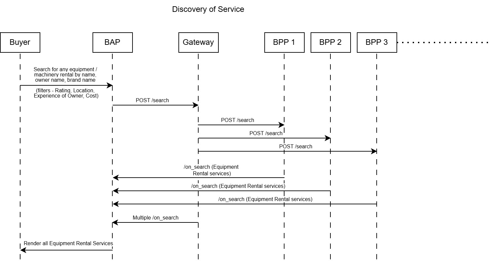

# UAI Implementation Guide - Knowledge Advisory

#### Version 1.0

## Version History

| Date       | Version | Description                                         |
| ---------- | ------- | --------------------------------------------------- |
| 06-11-2024 | 1.0     | Initial Version                                     |

## Introduction

This document provides material that helps network participants build and integrate their application with the Beckn Network. This document is part of the starter kit that provides information about the network, learning resources, network participant checklist etc. This document only focuses on the implementation of the seeker/provider platform. It assumes the reader has a good overview of the Beckn network, its APIs, the overall structure of the schema etc.

## Structure of the document

This document has the following parts:

1. Outcome Visualization - This is a pictorial or descriptive representation of the different use cases that are supported by the network.
2. Flow diagrams - This section provides a pictorial representation of the message flows that happen during the use case.
3. API Calls and Schema - This section provides details on the API calls and the schema of the message that is sent in the form of sample schemas.
4. Taxonomy and layer 2 configuration - This section provides details on the taxonomy, enumerations and any rules defined for either the use case or by the network.
5. Notes on writing/integrating with your own software - This section describes ways in which you can integrate (Becknify) your new or existing software
6. Links to downloadable resources - This section contains the downloadable files referenced in this document.

## Outcome Visualisation

### Use case - Discovery of Rental Services for Farm Equipment

1.	Vijay, a grape farmer in Nashik, faces a powdery mildew infestation on his crops and needs a sprayer to apply fungicides effectively.
2.	Using the UAI platform, Vijay searches for rental services that offer sprayers and other specialized equipment operated by experienced providers nearby.
3.	He filters the search results by rating, experience, location, and rental cost, finding options like:
a.	Sandip Patil - 4.2 rating, 3 years of experience, sprayer and tractor, 2 km away
b.	Bhagwan Wane - 3.8 rating, 2 years of experience, sprayer and harvester, 3 km away
c.	Ajinkya Sonavane - 3.5 rating, 4 years of experience, sprayer and drones, 2 km away
4.	Vijay chooses Sandip Patil as his preferred service provider and reviews available equipment details and rental costs.
5.	After selecting the sprayer, Vijay receives a rental quote of INR 300 per acre. He inputs his booking date, time, and the required area for spraying.
6.	He reviews the final quote, including any applicable taxes and terms of service, such as cancellation and refund policies.
7.	Vijay accepts the terms and confirms his order by choosing cash on delivery as the payment method.
8.	The service provider, Sandip Patil, confirms the booking and shares the order ID along with the agent’s details and scheduled time for the service.
9.	On the scheduled day, Vijay receives status updates as Sandip Patil arrives and completes the spraying.
10.	After completing the service, Vijay pays Sandip by cash, based on the final amount agreed.
11.	Satisfied with the service, Vijay submits a rating for the equipment quality, service punctuality, and overall support, helping others make informed choices.

## Flow diagrams

### General Beckn message flow and error handling

This section is relevant to all the messages flows illustrated below and discussed further in the document.

Beckn is a aynchronous protocol at its core.

- When a network participant(NP1) sends a message to another participant(NP2), the other participant(NP2) immediately returns back an ACK/NACK(Acknowledgement or Negative Acknowledgement in case of error - usually with wrongly formed messages).
- An ACK is an indicator that the receiving participant(NP2) will process this message and dispatch an on_xxxxxx message to original NP (NP1)
- Subsequently after processing the message NP2 sends back the real response in the corresponding on_xxxxxx message, to which again the first participant(NP1).
- This message can contain a message field (for success) or error field (for failure)
- NP1 when it receives the on_xxxxxx message, sends back an ACK/NACK (Here in both the cases NP1 will not send any subsequent message).
- In the Use case diagrams, this ACK/NACK is not illustrated explicitly to keep the diagrams crisp.
- However when writing software we should be prepared to receive these NACK messages as well as error field in the on_xxxxxx messages
- While this discussion is from a Beckn perspective, Adapters can provide synchronous modes. For example, the Protocol Server which is the reference implementation of the Beckn Adapter provides a synchronous mode by default. So if your software calls the support endpoint on the BAP Protocol Server, the Protocol Server waits till it gets the on_support and returns back that as the response.


**Structure of a message with a NACK**

```
{
    "message": {
        "ack": {
            "status": "NACK"
        }
    },
    "error": {
        "code": 400,
        "message": "OpenApiValidator Error at BAP-CLIENT",
    }
}
```

**Structure of a on_select message with an error**

```
{
    "context": {
        "action": "on_select",
        "version": "1.1.0",
        ...
    },
    "error": {
        "code": 30001,
        "message": "Requested provider is not in the database"
    }
}
```

### Use case - Discovery of Rental Services for Farm Equipment

**Search for rental service**



**Place an order for the Farm Equipment**


**Fullfilment of an active order**


**Seek support and provide rating**


## API Calls and Schema

### Discovery and consumption of free knowledge advisory

#### search

**search by topic**

- The topic to search is specified in the message->item->descriptor->name field.

```
{
  "context": {
    "domain": "advisory:uai",
    "action": "search",
    "location": {
      "country": {
        "name": "India",
        "code": "IND"
      }
    },
    "version": "1.1.0",
    "bap_id": "ps-bap-network.becknprotocol.io",
    "bap_uri": "https://ps-bap-client.becknprotocol.io",
    "transaction_id": "7b3d0c62-7c1b-4c6b-b768-14f81b6c3c90",
    "message_id": "f47ac10b-58cc-4372-a567-0e02b2c3d479",
    "timestamp": "2024-07-02T09:15:30Z"
  },
  "message": {
    "intent": {
      "item": {
        "descriptor": {
          "name": "Stemphylium Blight"
        }
      }
    }
  }
}
```

**search by topic and language**

- The topic to search is specified in the message->intent->item->descriptor->name field.
- The desired language is specified in a tag named languages.

```
{
  "context": {
    "domain": "advisory:uai",
    "action": "search",
    "location": {
      "country": {
        "code": "IND"
      }
    },
    "version": "1.1.0",
    "bap_id": "ps-bap-network.becknprotocol.io",
    "bap_uri": "https://ps-bap-client.becknprotocol.io",
    "transaction_id": "d28ec57e-8c8f-4db0-a5aa-73d6563942e1",
    "message_id": "6c8b36e8-7886-4cc8-b3a6-8a3d464fcd6c",
    "timestamp": "2024-07-02T09:15:30Z"
  },
  "message": {
    "intent": {
      "item": {
        "descriptor": {
          "name": "Stemphylium Blight"
        },
        "tags": [
          {
            "descriptor": {
              "name": "languages"
            },
            "list": [
              {
                "value": "Odia"
              },
              {
                "value": "Hindi"
              }
            ]
          }
        ]
      }
    }
  }
}

```

#### on_search

**on_search with catalog of results**

- The catalog that comes back has a list of providers.
- Each provider has a list of items.
- Each item is the catalog listing for a resource.
- The name, short_desc and long_desc fields contain the name and description of the resource.
- Further, if the resource is a video or a pdf, its mimetype and url are specified in the media field.

```
{
  "context": {
    "domain": "advisory:uai",
    "action": "on_search",
    "location": {
      "country": {
        "code": "IND"
      }
    },
    "version": "1.1.0",
    "bap_id": "ps-bap-network.becknprotocol.io",
    "bap_url": "https://ps-bap-client.becknprotocol.io",
    "bpp_id": "beckn-sandbox-bpp.becknprotocol.io",
    "bpp_uri": "https://sandbox-bpp-network.becknprotocol.io",
    "transaction_id": "7b3d0c62-7c1b-4c6b-b768-14f81b6c3c90",
    "message_id": "f47ac10b-58cc-4372-a567-0e02b2c3d479",
    "timestamp": "2024-07-02T09:15:30Z"
  },
  "message": {
    "catalog": {
      "descriptor": {
        "name": "Kisaan Seva"
      },
      "providers": [
        {
          "id": "19a02a67-d2f0-4ea7-b7e1-b2cf4fa57f56",
          "descriptor": {
            "name": "Agri Acad",
            "short_desc": "Agri Academic aggregator",
            "images": [
              {
                "url": "https://agri_acad.example.org/logo.png"
              }
            ]
          },
          "items": [
            {
              "id": "9875",
              "descriptor": {
                "name": "Stemphylium Blight: Steps to prevent",
                "short_desc": "TNAU Agritech portal",
                "long_desc": "To manage Stemphylium Blight in onions, begin by inspecting crops regularly and removing infected leaves to prevent spread. Avoid overhead irrigation, as excess moisture promotes fungal growth; instead, use drip irrigation to keep leaves dry. Apply fungicides like Mancozeb or Azoxystrobin, adhering to recommended dosages for effective control. Rotate crops with non-host plants, such as cereals, to limit fungal spore buildup in soil. Maintain balanced fertilization, as excess nitrogen can increase  susceptibility, and ensure adequate spacing for better airflow. Routine monitoring is crucial to detect early signs and take prompt action, safeguarding the crop yield effectively."
              }
            },
            {
              "id": "4321",
              "descriptor": {
                "name": "Stemphylium Blight: care gossypii",
                "short_desc": "Stemphylium Blight management",
                "long_desc": "",
                "media": [
                  {
                    "mimetype": "application/pdf",
                    "url": "https://agritech.tnau.ac.in/itk/pdf/itk_Stemphylium.pdf"
                  }
                ]
              },
              "rating": "4.0"
            },
            {
              "id": "8977",
              "descriptor": {
                "name": "Stemphylium Blight Management in Onion Farming - Hindi Video",
                "short_desc": "Control the Stemphylium Blight in Onino farming by following the information provided in the video. ",
                "long_desc": "",
                "media": [
                  {
                    "mimetype": "video/mp4",
                    "url": "https://www.youtube.com/watch?v=30QQf9yCJNQ"
                  }
                ]
              },
              "rating": "3.5"
            }
          ]
        },
        {
          "id": "5e899a32-72f3-48e1-9156-5b1302c1f32a",
          "descriptor": {
            "name": "Farming videos",
            "short_desc": "Farming video repository",
            "images": [
              {
                "url": "https:/farm_video.example.org/logo.png"
              }
            ]
          },
          "items": [
            {
              "id": "53453",
              "descriptor": {
                "name": "Stemphylium Blight control in onion",
                "short_desc": "Stemphylium control in cotton",
                "long_desc": "",
                "media": [
                  {
                    "mimetype": "video/mp4",
                    "url": "https://www.youtube.com/watch?v=J8Y4jefHAYQ"
                  }
                ]
              },
              "rating": "4.5"
            }
          ]
        }
      ]
    }
  }
}
```

#### support

**sending a support request**

- In most cases the support request is a call to get contact details of the provider platform (Phone, Web url etc).
- However in rare cases a reference id might be sent to provide a context to the request.

```
{
  "context": {
    "domain": "advisory:uai",
    "location": {
      "country": {
        "name": "IND"
      }
    },
    "action": "support",
    "version": "1.1.0",
    "bap_id": "ps-bap-network.becknprotocol.io",
    "bap_url": "https://ps-bap-client.becknprotocol.io",
    "bpp_id": "beckn-sandbox-bpp.becknprotocol.io",
    "bpp_uri": "https://sandbox-bpp-network.becknprotocol.io",
    "message_id": "d8b23543-24b4-48eb-ae8a-4a5db68f8d09",
    "transaction_id": "fa2c9c8b-ba24-4d2b-bd9c-3e03d7f6b193",
    "timestamp": "2024-07-02T09:18:30Z"
  },
  "message": {
    "ref_id": "9e188d26-0b1b-4920-a586-6006b0bcf768"
  }
}
```

#### on_support

**Getting an on_support callback**

- In most cases the returned details are common contact information of the provider platform.
- However it is possible to connect this to other customer management solutions.

```
{
  "context": {
    "domain": "advisory:uai",
    "location": {
      "country": {
        "code": "IND"
      }
    },
    "action": "on_support",
    "version": "1.1.0",
    "bap_id": "ps-bap-network.becknprotocol.io",
    "bap_url": "https://ps-bap-client.becknprotocol.io",
    "bpp_id": "beckn-sandbox-bpp.becknprotocol.io",
    "bpp_uri": "https://sandbox-bpp-network.becknprotocol.io",
    "message_id": "d8b23543-24b4-48eb-ae8a-4a5db68f8d09",
    "transaction_id": "fa2c9c8b-ba24-4d2b-bd9c-3e03d7f6b193",
    "timestamp": "2024-07-02T09:18:30Z",
    "ttl": "PT10M"
  },
  "message": {
    "support": {
      "ref_id": "9e188d26-0b1b-4920-a586-6006b0bcf768",
      "phone": "18001801551",
      "url": "https://agritech.tnau.ac.in/agriculture/agri_faqs.html"
    }
  }
}

```

#### rating

**Rating a resource**

- When the user wants to rate the resource, it happens in two steps.
- The user sends a numerical (0-5) rating in the request.
- The response will have a link to the form where the user can provide text feedback.

```
{
  "context": {
    "domain": "advisory:uai",
    "location": {
      "country": {
        "name": "IND"
      }
    },
    "action": "rating",
    "version": "1.1.0",
    "bap_id": "ps-bap-network.becknprotocol.io",
    "bap_url": "https://ps-bap-client.becknprotocol.io",
    "bpp_id": "beckn-sandbox-bpp.becknprotocol.io",
    "bpp_uri": "https://sandbox-bpp-network.becknprotocol.io",
    "message_id": "e8c50b1e-6512-42b3-b0b4-8f8a703a5c66",
    "transaction_id": "b7204c3a-9f5e-418f-80a3-ae5dd4e5b97a",
    "timestamp": "2024-07-02T09:15:30Z"
  },
  "message": {
    "ratings": [
      {
        "id": "19a02a67-d2f0-4ea7-b7e1-b2cf4fa57f56",
        "rating_category": "Provider",
        "value": "5"
      }
    ]
  }
}
```

#### on_rating

**Getting on_rating response**

- The on_rating response has a link to the form where the user can specify a text feedback that goes alongside the numerical rating provided earlier.

```
{
  "context": {
    "domain": "advisory:uai",
    "location": {
      "country": {
        "name": "IND"
      }
    },
    "action": "on_rating",
    "version": "1.1.0",
    "bap_id": "ps-bap-network.becknprotocol.io",
    "bap_url": "https://ps-bap-client.becknprotocol.io",
    "bpp_id": "beckn-sandbox-bpp.becknprotocol.io",
    "bpp_uri": "https://sandbox-bpp-network.becknprotocol.io",
    "message_id": "e8c50b1e-6512-42b3-b0b4-8f8a703a5c66",
    "transaction_id": "b7204c3a-9f5e-418f-80a3-ae5dd4e5b97a",
    "timestamp": "2024-07-02T09:15:30Z",
    "ttl": "PT10M"
  },
  "message": {
    "feedback_form": {
      "form": {
        "url": "https://agri_acad.example.org/feedback"
      }
    }
  }
}
```

### Discovery and consumption of paid knowledge advisory

#### search

**search by topic**
```
{
  "context": {
    "domain": "advisory:uai",
    "action": "search",
    "location": {
      "country": {
        "code": "IND"
      }
    },
    "version": "1.1.0",
    "bap_id": "ps-bap-network.becknprotocol.io",
    "bap_uri": "https://ps-bap-client.becknprotocol.io",
    "transaction_id": "7b3d0c62-7c1b-4c6b-b768-14f81b6c3c90",
    "message_id": "f47ac10b-58cc-4372-a567-0e02b2c3d479",
    "timestamp": "2024-07-02T09:15:30Z"
  },
  "message": {
     "intent": {
      "item": {
        "descriptor": {
          "name": "Weather forecast"
        },
        "time" : {
          "range" : {
            "start" : "2024-03-01T00:00:00.000Z",
            "end" : "2024-03-15T00:00:00.000Z"
          }
        }
      },
      "fulfillment": {
        "stops": [
          {
            "location": {
              "gps": ""12.9716, 77.5946""
            }
          }
        ]
      }
    }
  }
}
```
#### on_search

**on_search with catalog of results**
- The catalog that comes back has a list of providers.
- Each provider has a list of items.
- Each item is the catalog listing for a resource.
- The name, short_desc and long_desc fields contain the name and description of the resource.
- Further, if the resource is a video or a pdf, its mimetype and url are specified in the media field.

```
{
    "context": {
      "domain": "advisory:uai",
      "location": {
        "country": {
          "code": "INDIA"
        }
      },
      "action": "on_search",
      "version": "1.1.0",
      "bap_id": "dataset-bap-id",
      "bap_uri": "https://55a6-124-123-32-28.ngrok-free.app",
      "bpp_id": "dataset-bpp-subId",
      "bpp_uri": "https://4e21-124-123-32-28.ngrok-free.app",
      "message_id": "6104c0a3-d1d1-4ded-aaa4-76e4caf727ce",
      "transaction_id": "8100d125-76a7-4588-88be-81b97657cd09",
      "timestamp": "2023-11-06T09:41:09.708Z",
      "ttl": "PT10M"
    },
    "message": {
      "catalog": {
        "descriptor": {
          "name": "Data source platform ltd"
        },
        "providers": [
          {
            "id": "1",
            "descriptor": {
              "name": "WeAreNews14",
              "additional_desc": {
                "url" : "https://www.wearenews14.com/",
                "content_type" : "text/html"
              },
              "images": [
                {
                  "url": "https://static1.anpoimages.com/wordpress/wp-content/uploads/2020/04/example-new-logo-hero.png"
                }
              ]
            },
            "tags": [
              {
                "descriptor": {
                  "name": "Provider's Additional Information"
                },
                "list": [
                  {
                    "descriptor": {
                      "name": "License"
                    },
                    "value": "Proprietary"
                  },
                  {
                    "descriptor": {
                      "name": "Provider's years in operation"
                    },
                    "value": "3"
                  }
                ]
              }
            ],
            "rating": "4.9",
            "categories": [
              {
                "id": "c1",
                "descriptor": {
                  "code": "Weather-forecast",
                  "name": "Weather Forecast"
                }
              }
            ],
            "fulfillments": [
              {
                "id": "f1",
                "type": "CLOUD"
              },
              {
                "id": "f2",
                "type": "REST"
              },
              {
                "id": "f3",
                "type": "EMAIL"
              }
            ],
            "items": [
              {
                "id": "1",
                "descriptor": {
                  "images": [
                    {
                      "url": "https://www.analyticssteps.com/backend/media/thumbnail/6006173/6278986_1571298721_Weather_Forecoast_Graphics.jpg"
                    }
                  ],
                  "additional_desc" : {
                    "url" : "https://www.example.com/weather-forecast-sample/downloadsample",
                    "content_type" : "text/html"
                  },
                  "name": "Hyperlocal weather forecast",
                  "short_desc": "Access accurate and up-to-date weather forecasts for Sarpang, providing essential information on temperature, precipitation, wind speed, and more.",
                  "long_desc": "<p>Our <strong>Weather Forecast Data of Sarpang</strong> delivers reliable and timely forecasts tailored specifically for the region. Stay informed about current and future weather conditions, including temperature variations, precipitation levels, wind speed patterns, and more. Whether you're planning outdoor activities, agricultural operations, or travel itineraries, our comprehensive weather forecasts for Sarpang ensure that you're well-prepared for any weather-related situations. Trust our data to make informed decisions and optimize your plans, keeping you ahead of the weather and ready for whatever nature brings.</p>"
                },
                "time" : {
                  "range" : {
                    "start" : "2024-03-01T00:00:00.000Z",
                    "end" : "2024-03-15T00:00:00.000Z"
                  }
                },
                "matched": true,
                "price": {
                  "currency": "INR",
                  "value": "30"
                },
                "recommended": true,
                "category_ids": [
                  "c1"
                ],
                "fulfillment_ids": [
                  "f1",
                  "f2",
                  "f3"
                ],
                "tags": [
                  {
                    "descriptor": {
                      "name": "Forecast confidence levels"
                    },
                    "list": [
                      {
                        "value": "90%"
                      },
                      {
                        "value": "85%"
                      },
                      {
                        "value": "80%"
                      },
                      {
                        "value": "75%"
                      },
                      {
                        "value": "70%"
                      }
                    ]
                  },
                  {
                    "descriptor": {
                      "name": "Weather datapoints"
                    },
                    "list": [
                      {
                        "value": "Temperature"
                      },
                      {
                        "value": "Vertical wind speed"
                      },
                      {
                        "value": "Horizontal wind velocity"
                      },
                      {
                        "value": "Relative Humidity"
                      },
                      {
                        "value": "Surface pressure"
                      },
                      {
                        "value": "Dew Point"
                      },
                      {
                        "value": "Precipitation"
                      },
                      {
                        "value": "Cloud cover"
                      },
                      {
                        "value": "Solar radiation"
                      }
                    ]
                  },
                  {
                    "descriptor": {
                      "name": "Data formats"
                    },
                    "list": [
                      {
                        "value": "PDF"
                      },
                      {
                        "value": "BUFR"
                      },
                      {
                        "value": "XML"
                      },
                      {
                        "value": "JSON"
                      },
                      {
                        "value": "CSV"
                      },
                      {
                        "value": "NetCDF"
                      },
                      {
                        "value": "GRIB"
                      },
                      {
                        "value": "Shapefiles"
                      },
                      {
                        "value": "GeoTIFF"
                      }
                    ]
                  },
                  {
                    "descriptor": {
                      "name": "Dataset Attribute"
                    },
                    "list": [
                      {
                        "descriptor": {
                          "name": "Size"
                        },
                        "value": "20MB"
                      },
                      {
                        "descriptor": {
                          "name": "Last update timestamp"
                        },
                        "value": "24 Feb 2024 23:21"
                      }
                    ]
                  }
                ]
              }
            ]
          }
        ]
      }
    }
  }
```
#### select

**selecting an item from the catalog**

- provider Contains details of the seller from whom the items are purchased.
- Items  A list of individual items included in the purchase.
- fulfillments[idx] object provides specific fulfillment details for each part of the order..

```
{
  "context": {
    "domain": "advisory:uai",
    "location": {
      "country": {
        "code": "IND"
      }
    },
    "action": "select",
    "version": "1.1.0",
    "bap_id": "dataset-bap-id",
    "bap_uri": "https://55a6-124-123-32-28.ngrok-free.app",
    "bpp_id": "dataset-bpp-subId",
    "bpp_uri": "https://4e21-124-123-32-28.ngrok-free.app",
    "message_id": "6d098f3a-4873-4b2e-935e-e4d6be92eb01",
    "transaction_id": "8100d125-76a7-4588-88be-81b97657cd09",
    "timestamp": "2023-11-06T09:44:47.217Z"
  },
  "message": {
    "order": {
      "provider": {
        "id": "1"
      },
      "items": [
        {
          "id": "1",
          "fulfillment_ids": [
            "f1"
          ],
          "tags": [
            {
              "descriptor": {
                "name": "Data formats"
              },
              "list": [
                {
                  "value": "PDF"
                }
              ]
            }
          ]
        }
      ],
      "fulfillments": [
        {
          "id": "f1"
          "type": "CLOUD"
        }
      ]
    }
  }
}
```

#### on_select

**Getting a quotation from the seller for the selected items from the catalog**

- Contains the pricing, itemized details, and cost breakup for a potential purchase.

```
{
  "context": {
    "domain": "advisory:uai",
    "location": {
      "country": {
        "code": "IND"
      }
    },
    "action": "on_select",
    "version": "1.1.0",
    "bap_id": "dataset-bap-id",
    "bap_uri": "https://55a6-124-123-32-28.ngrok-free.app",
    "bpp_id": "dataset-bpp-subId",
    "bpp_uri": "https://4e21-124-123-32-28.ngrok-free.app",
    "message_id": "6d098f3a-4873-4b2e-935e-e4d6be92eb01",
    "transaction_id": "8100d125-76a7-4588-88be-81b97657cd09",
    "timestamp": "2023-11-06T09:44:47.229Z",
    "ttl": "PT10M"
  },
  "message": {
    "order": {
      "provider": {
        "id": "1",
        "descriptor": {
          "name": "WeAreNews14",
          "additional_desc": {
            "url" : "https://www.wearenews14.com/",
            "content_type" : "text/html"
          },
          "images": [
            {
              "url": "https://static1.anpoimages.com/wordpress/wp-content/uploads/2020/04/accuweather-new-logo-hero.png"
            }
          ]
        },
        "rating": "4.9",
      },
      "items": [
        {
          "id": "1",
          "descriptor": {
            "images": [
              {
                "url": "https://www.analyticssteps.com/backend/media/thumbnail/6006173/6278986_1571298721_Weather_Forecoast_Graphics.jpg"
              }
            ],
            "additional_desc" : {
              "url" : "https://www.example.com/weather-forecast-sample/downloadsample",
              "content_type" : "text/html"
            },
            "name": "Hyperlocal weather forecast",
            "short_desc": "Access accurate and up-to-date weather forecasts for Sarpang, providing essential information on temperature, precipitation, wind speed, and more.",
            "long_desc": "<p>Our <strong>Weather Forecast Data of Sarpang</strong> delivers reliable and timely forecasts tailored specifically for the region. Stay informed about current and future weather conditions, including temperature variations, precipitation levels, wind speed patterns, and more. Whether you're planning outdoor activities, agricultural operations, or travel itineraries, our comprehensive weather forecasts for Sarpang ensure that you're well-prepared for any weather-related situations. Trust our data to make informed decisions and optimize your plans, keeping you ahead of the weather and ready for whatever nature brings.</p>"
          },
          "time" : {
            "range" : {
              "start" : "2024-03-01T00:00:00.000Z",
              "end" : "2024-03-15T00:00:00.000Z"
            }
          },
          "category_ids": [
            "c1"
          ],
          "fulfillment_ids": [
            "f1"
          ],
          "price": {
             "currency": "INR",
             "value": "30"
          },
          "tags": [
            {
              "descriptor": {
                "name": "Weather datapoints"
              },
              "list": [
                {
                  "value": "Temperature"
                },
                {
                  "value": "Horizontal wind velocity"
                },
                {
                  "value": "Relative Humidity"
                },
                {
                  "value": "Surface pressure"
                },
                {
                  "value": "Precipitation"
                }
              ]
            },
            {
              "descriptor": {
                "name": "Data formats"
              },
              "list": [
                {
                  "value": "PDF"
                }
              ]
            }
          ]
        }
      ],
      "fulfillments": [
        {
          "id": "f1"
          "type": "CLOUD"
        }
      ],
      "quote": {
        "price": {
          "currency": "INR",
          "value": "31.5"
        },
        "breakup": [
          {
            "title": "dataset-fee",
            "price": {
              "currency": "INR",
              "value": "30"
            }
          },
          {
            "title": "gst",
            "price": {
              "currency": "INR",
              "value": "1.5"
            }
          }
        ]
      }
    }
  }
}
```

#### init

**initialise an order with billing details**

```
{
  "context": {
    "domain": "advisory:uai",
    "location": {
      "country": {
        "code": "IND"
      }
    },
    "action": "init",
    "version": "1.1.0",
    "bap_id": "dataset-bap-id",
    "bap_uri": "https://55a6-124-123-32-28.ngrok-free.app",
    "bpp_id": "dataset-bpp-subId",
    "bpp_uri": "https://4e21-124-123-32-28.ngrok-free.app",
    "message_id": "6d098f3a-4873-4b2e-935e-e4d6be92eb01",
    "transaction_id": "8100d125-76a7-4588-88be-81b97657cd09",
    "timestamp": "2023-11-06T09:44:47.217Z"
  },
  "message": {
    "order": {
      "provider": {
        "id": "1"
      },
      "items": [
        {
          "id": "1",
          "fulfillment_ids": [
            "f1"
          ],
          "tags": [
            {
              "descriptor": {
                "name": "Data formats"
              },
              "list": [
                {
                  "value": "PDF"
                }
              ]
            }
          ]
        }
      ],
      "fulfillments": [
        {
          "id": "f1"
          "type": "CLOUD"
        }
      ],
      "billing": {
        "name": "Monisha",
        "phone" : "+9752345678",
        "email" : "Monisha@example.com" 
      }
    }
  }
}
```

#### on_init

**Receive the payment details from the seller.**

```
{
  "context": {
    "domain": "advisory:uai",
    "location": {
      "country": {
        "code": "IND"
      }
    },
    "action": "on_init",
    "version": "1.1.0",
    "bap_id": "dataset-bap-id",
    "bap_uri": "https://55a6-124-123-32-28.ngrok-free.app",
    "bpp_id": "dataset-bpp-subId",
    "bpp_uri": "https://4e21-124-123-32-28.ngrok-free.app",
    "message_id": "6d098f3a-4873-4b2e-935e-e4d6be92eb01",
    "transaction_id": "8100d125-76a7-4588-88be-81b97657cd09",
    "timestamp": "2023-11-06T09:44:47.229Z",
    "ttl": "PT10M"
  },
  "message": {
    "order": {
      "provider": {
        "id": "1",
        "descriptor": {
          "name": "WeAreNews14",
          "additional_desc": {
            "url" : "https://www.wearenews14.com/",
            "content_type" : "text/html"
          },
          "images": [
            {
              "url": "https://static1.anpoimages.com/wordpress/wp-content/uploads/2020/04/accuweather-new-logo-hero.png"
            }
          ]
        },
        "rating": "4.9",
      },
      "items": [
        {
          "id": "1",
          "descriptor": {
            "images": [
              {
                "url": "https://www.analyticssteps.com/backend/media/thumbnail/6006173/6278986_1571298721_Weather_Forecoast_Graphics.jpg"
              }
            ],
            "additional_desc" : {
              "url" : "https://www.example.com/weather-forecast-sample/downloadsample",
              "content_type" : "text/html"
            },
            "name": "Hyperlocal weather forecast",
            "short_desc": "Access accurate and up-to-date weather forecasts for Sarpang, providing essential information on temperature, precipitation, wind speed, and more.",
            "long_desc": "<p>Our <strong>Weather Forecast Data of Sarpang</strong> delivers reliable and timely forecasts tailored specifically for the region. Stay informed about current and future weather conditions, including temperature variations, precipitation levels, wind speed patterns, and more. Whether you're planning outdoor activities, agricultural operations, or travel itineraries, our comprehensive weather forecasts for Sarpang ensure that you're well-prepared for any weather-related situations. Trust our data to make informed decisions and optimize your plans, keeping you ahead of the weather and ready for whatever nature brings.</p>"
          },
          "time" : {
            "range" : {
              "start" : "2024-03-01T00:00:00.000Z",
              "end" : "2024-03-15T00:00:00.000Z"
            }
          },
          "category_ids": [
            "c1"
          ],
          "fulfillment_ids": [
            "f1"
          ],
          "price": {
             "currency": "INR",
             "value": "30"
          },
          "tags": [
            {
              "descriptor": {
                "name": "Weather datapoints"
              },
              "list": [
                {
                  "value": "Temperature"
                },
                {
                  "value": "Horizontal wind velocity"
                },
                {
                  "value": "Relative Humidity"
                },
                {
                  "value": "Surface pressure"
                },
                {
                  "value": "Precipitation"
                }
              ]
            },
            {
              "descriptor": {
                "name": "Data formats"
              },
              "list": [
                {
                  "value": "PDF"
                }
              ]
            }
          ]
        }
      ],
      "fulfillments": [
        {
          "id": "f1"
          "type": "CLOUD"
        }
      ],
      "quote": {
        "price": {
          "currency": "INR",
          "value": "31.5"
        },
        "breakup": [
          {
            "title": "dataset-fee",
            "price": {
              "currency": "INR",
              "value": "30"
            }
          },
          {
            "title": "gst",
            "price": {
              "currency": "INR",
              "value": "1.5"
            }
          }
        ]
      },
      "payments": [
        {
          "status": "NOT-PAID",
          "type": "PRE-ORDER",
          "params": {
            "amount": "31.5",
            "currency": "INR",
            "bank_code": "INB0004321",
            "bank_account_number": "1234002341"
          }
        }
      ]
    }
  }
}
```

#### confirm

**Provide the proof of payment to the seller**

```
{
  "context": {
    "domain": "advisory:uai",
    "location": {
      "country": {
        "code": "IND"
      }
    },
    "action": "confirm",
    "version": "1.1.0",
    "bap_id": "dataset-bap-id",
    "bap_uri": "https://55a6-124-123-32-28.ngrok-free.app",
    "bpp_id": "dataset-bpp-subId",
    "bpp_uri": "https://4e21-124-123-32-28.ngrok-free.app",
    "message_id": "6d098f3a-4873-4b2e-935e-e4d6be92eb01",
    "transaction_id": "8100d125-76a7-4588-88be-81b97657cd09",
    "timestamp": "2023-11-06T09:44:47.217Z"
  },
  "message": {
    "order": {
      "provider": {
        "id": "1"
      },
      "items": [
        {
          "id": "1",
          "fulfillment_ids": [
            "f1"
          ],
          "tags": [
            {
              "descriptor": {
                "name": "Data formats"
              },
              "list": [
                {
                  "value": "PDF"
                }
              ]
            }
          ]
        }
      ],
      "fulfillments": [
        {
          "id": "f1"
          "type": "CLOUD"
        }
      ],
      "billing": {
        "name": "Monisha",
        "phone" : "+9752345678",
        "email" : "Monisha@example.com" 
      },
      "payments": [
        {
          "status": "PAID",
          "type": "PRE-ORDER",
          "params": {
            "transaction_id": "raz816863816313",
            "amount": "31.5",
            "currency": "INR",
            "bank_code": "INB0004321",
            "bank_account_number": "1234002341"
          }
        }
      ]
    }
  }
}
```

#### on_confirm

**Create an order, provide the link to the report**

```
{
  "context": {
    "domain": "advisory:uai",
    "location": {
      "country": {
        "code": "IND"
      }
    },
    "action": "on_confirm",
    "version": "1.1.0",
    "bap_id": "dataset-bap-id",
    "bap_uri": "https://55a6-124-123-32-28.ngrok-free.app",
    "bpp_id": "dataset-bpp-subId",
    "bpp_uri": "https://4e21-124-123-32-28.ngrok-free.app",
    "message_id": "6d098f3a-4873-4b2e-935e-e4d6be92eb01",
    "transaction_id": "8100d125-76a7-4588-88be-81b97657cd09",
    "timestamp": "2023-11-06T09:44:47.229Z",
    "ttl": "PT10M"
  },
  "message": {
    "order": {
      "id": "b989c9a9-f603-4d44-b38d-26fd72286b40",
      "provider": {
        "id": "1",
        "descriptor": {
          "name": "WeAreNews14",
          "additional_desc": {
            "url" : "https://www.wearenews14.com/",
            "content_type" : "text/html"
          },
          "images": [
            {
              "url": "https://static1.anpoimages.com/wordpress/wp-content/uploads/2020/04/accuweather-new-logo-hero.png"
            }
          ]
        },
        "rating": "4.9",
      },
      "items": [
        {
          "id": "1",
          "descriptor": {
            "images": [
              {
                "url": "https://www.analyticssteps.com/backend/media/thumbnail/6006173/6278986_1571298721_Weather_Forecoast_Graphics.jpg"
              }
            ],
            "additional_desc" : {
              "url" : "https://www.example.com/weather-forecast-sample/downloadsample",
              "content_type" : "text/html"
            },
            "name": "Hyperlocal weather forecast",
            "short_desc": "Access accurate and up-to-date weather forecasts for Sarpang, providing essential information on temperature, precipitation, wind speed, and more.",
            "long_desc": "<p>Our <strong>Weather Forecast Data of Sarpang</strong> delivers reliable and timely forecasts tailored specifically for the region. Stay informed about current and future weather conditions, including temperature variations, precipitation levels, wind speed patterns, and more. Whether you're planning outdoor activities, agricultural operations, or travel itineraries, our comprehensive weather forecasts for Sarpang ensure that you're well-prepared for any weather-related situations. Trust our data to make informed decisions and optimize your plans, keeping you ahead of the weather and ready for whatever nature brings.</p>"
          },
          "time" : {
            "range" : {
              "start" : "2024-03-01T00:00:00.000Z",
              "end" : "2024-03-15T00:00:00.000Z"
            }
          },
          "category_ids": [
            "c1"
          ],
          "fulfillment_ids": [
            "f1"
          ],
          "price": {
             "currency": "INR",
             "value": "30"
          },
          "tags": [
            {
              "descriptor": {
                "name": "Weather datapoints"
              },
              "list": [
                {
                  "value": "Temperature"
                },
                {
                  "value": "Horizontal wind velocity"
                },
                {
                  "value": "Relative Humidity"
                },
                {
                  "value": "Surface pressure"
                },
                {
                  "value": "Precipitation"
                }
              ]
            },
            {
              "descriptor": {
                "name": "Data formats"
              },
              "list": [
                {
                  "value": "PDF"
                }
              ]
            }
          ]
        }
      ],
      "fulfillments": [
        {
          "id": "f1"
          "type": "CLOUD",
          "state": {
            "descriptor" : {
              "code" : "ORDER CONFIRMED",
              "name" : "Your Order is confirmed"
            }
          },
          "stops" : [
            {
              "instructions": {
                "short_desc" : "The below link can be usd to access the report PDF",
                "media": [
                  {
                    "url": "www.example.com/weather/report/234434.PDF"
                  }
                ]
              }
            }
          ],
        }
      ],
      "quote": {
        "price": {
          "currency": "INR",
          "value": "31.5"
        },
        "breakup": [
          {
            "title": "dataset-fee",
            "price": {
              "currency": "INR",
              "value": "30"
            }
          },
          {
            "title": "gst",
            "price": {
              "currency": "INR",
              "value": "1.5"
            }
          }
        ]
      },
      "payments": [
        {
          "status": "NOT-PAID",
          "type": "PRE-ORDER",
          "params": {
            "amount": "31.5",
            "currency": "INR",
            "bank_code": "INB0004321",
            "bank_account_number": "1234002341"
          }
        }
      ]
    }
  }
}
```

#### status

**check for status in case forecast report link could not be sent in the on_confirm callback**

```
{
  "context": {
    "domain": "advisory:uai",
    "location": {
      "country": {
        "code": "IND"
      }
    },
    "action": "status",
    "version": "1.1.0",
    "bap_id": "dataset-bap-id",
    "bap_uri": "https://55a6-124-123-32-28.ngrok-free.app",
    "bpp_id": "dataset-bpp-subId",
    "bpp_uri": "https://4e21-124-123-32-28.ngrok-free.app",
    "message_id": "b8c1e69c-fbbc-439b-a5de-2adcc74fa0da",
    "transaction_id": "8100d125-76a7-4588-88be-81b97657cd09",
    "timestamp": "2023-11-06T10:14:10.295Z",
    "ttl": "PT10M"
  },
  "message": {
    "order_id": "b989c9a9-f603-4d44-b38d-26fd72286b40"
  }
}
```

#### on_status

**get the status of the order, with the link to the forecast report**
```
{
  "context": {
    "domain": "advisory:uai",
    "location": {
      "country": {
        "code": "IND"
      }
    },
    "action": "on_confirm",
    "version": "1.1.0",
    "bap_id": "dataset-bap-id",
    "bap_uri": "https://55a6-124-123-32-28.ngrok-free.app",
    "bpp_id": "dataset-bpp-subId",
    "bpp_uri": "https://4e21-124-123-32-28.ngrok-free.app",
    "message_id": "6d098f3a-4873-4b2e-935e-e4d6be92eb01",
    "transaction_id": "8100d125-76a7-4588-88be-81b97657cd09",
    "timestamp": "2023-11-06T09:44:47.229Z",
    "ttl": "PT10M"
  },
  "message": {
    "order": {
      "id": "b989c9a9-f603-4d44-b38d-26fd72286b40",
      "provider": {
        "id": "1",
        "descriptor": {
          "name": "WeAreNews14",
          "additional_desc": {
            "url" : "https://www.wearenews14.com/",
            "content_type" : "text/html"
          },
          "images": [
            {
              "url": "https://static1.anpoimages.com/wordpress/wp-content/uploads/2020/04/accuweather-new-logo-hero.png"
            }
          ]
        },
        "rating": "4.9",
      },
      "items": [
        {
          "id": "1",
          "descriptor": {
            "images": [
              {
                "url": "https://www.analyticssteps.com/backend/media/thumbnail/6006173/6278986_1571298721_Weather_Forecoast_Graphics.jpg"
              }
            ],
            "additional_desc" : {
              "url" : "https://www.example.com/weather-forecast-sample/downloadsample",
              "content_type" : "text/html"
            },
            "name": "Hyperlocal weather forecast",
            "short_desc": "Access accurate and up-to-date weather forecasts for Sarpang, providing essential information on temperature, precipitation, wind speed, and more.",
            "long_desc": "<p>Our <strong>Weather Forecast Data of Sarpang</strong> delivers reliable and timely forecasts tailored specifically for the region. Stay informed about current and future weather conditions, including temperature variations, precipitation levels, wind speed patterns, and more. Whether you're planning outdoor activities, agricultural operations, or travel itineraries, our comprehensive weather forecasts for Sarpang ensure that you're well-prepared for any weather-related situations. Trust our data to make informed decisions and optimize your plans, keeping you ahead of the weather and ready for whatever nature brings.</p>"
          },
          "time" : {
            "range" : {
              "start" : "2024-03-01T00:00:00.000Z",
              "end" : "2024-03-15T00:00:00.000Z"
            }
          },
          "category_ids": [
            "c1"
          ],
          "fulfillment_ids": [
            "f1"
          ],
          "price": {
             "currency": "INR",
             "value": "30"
          },
          "tags": [
            {
              "descriptor": {
                "name": "Weather datapoints"
              },
              "list": [
                {
                  "value": "Temperature"
                },
                {
                  "value": "Horizontal wind velocity"
                },
                {
                  "value": "Relative Humidity"
                },
                {
                  "value": "Surface pressure"
                },
                {
                  "value": "Precipitation"
                }
              ]
            },
            {
              "descriptor": {
                "name": "Data formats"
              },
              "list": [
                {
                  "value": "PDF"
                }
              ]
            }
          ]
        }
      ],
      "fulfillments": [
        {
          "id": "f1"
          "type": "CLOUD",
          "state": {
            "descriptor" : {
              "code" : "ORDER-COMPLETED",
              "name" : "Your Order is completed"
            }
          },
          "stops" : [
            {
              "instructions": {
                "short_desc" : "The below link can be usd to access the report PDF",
                "media": [
                  {
                    "url": "www.example.com/weather/report/234434.PDF"
                  }
                ]
              }
            }
          ],
        }
      ],
      "quote": {
        "price": {
          "currency": "INR",
          "value": "31.5"
        },
        "breakup": [
          {
            "title": "dataset-fee",
            "price": {
              "currency": "INR",
              "value": "30"
            }
          },
          {
            "title": "gst",
            "price": {
              "currency": "INR",
              "value": "1.5"
            }
          }
        ]
      },
      "payments": [
        {
          "status": "NOT-PAID",
          "type": "PRE-ORDER",
          "params": {
            "amount": "31.5",
            "currency": "INR",
            "bank_code": "INB0004321",
            "bank_account_number": "1234002341"
          }
        }
      ]
    }
  }
}
```

#### support

**sending a support request**

- In most cases the support request is a call to get contact details of the provider platform (Phone, Web url etc).
- However in rare cases a reference id might be sent to provide a context to the request.

```
{
  "context": {
    "domain": "advisory:uai",
    "location": {
      "country": {
        "name": "IND"
      }
    },
    "action": "support",
    "version": "1.1.0",
    "bap_id": "ps-bap-network.becknprotocol.io",
    "bap_url": "https://ps-bap-client.becknprotocol.io",
    "bpp_id": "beckn-sandbox-bpp.becknprotocol.io",
    "bpp_uri": "https://sandbox-bpp-network.becknprotocol.io",
    "message_id": "d8b23543-24b4-48eb-ae8a-4a5db68f8d09",
    "transaction_id": "fa2c9c8b-ba24-4d2b-bd9c-3e03d7f6b193",
    "timestamp": "2024-07-02T09:18:30Z"
  },
  "message": {
    "ref_id": "9e188d26-0b1b-4920-a586-6006b0bcf768"
  }
}
```

#### on_support

**Getting an on_support callback**

- In most cases the returned details are common contact information of the provider platform.
- However it is possible to connect this to other customer management solutions.

```
{
  "context": {
    "domain": "advisory:uai",
    "location": {
      "country": {
        "code": "IND"
      }
    },
    "action": "on_support",
    "version": "1.1.0",
    "bap_id": "ps-bap-network.becknprotocol.io",
    "bap_url": "https://ps-bap-client.becknprotocol.io",
    "bpp_id": "beckn-sandbox-bpp.becknprotocol.io",
    "bpp_uri": "https://sandbox-bpp-network.becknprotocol.io",
    "message_id": "d8b23543-24b4-48eb-ae8a-4a5db68f8d09",
    "transaction_id": "fa2c9c8b-ba24-4d2b-bd9c-3e03d7f6b193",
    "timestamp": "2024-07-02T09:18:30Z",
    "ttl": "PT10M"
  },
  "message": {
    "support": {
      "ref_id": "9e188d26-0b1b-4920-a586-6006b0bcf768",
      "phone": "18001801551",
      "url": "https://agritech.tnau.ac.in/agriculture/agri_faqs.html"
    }
  }
}

```

#### rating

**Rating a resource**

- When the user wants to rate the resource, it happens in two steps.
- The user sends a numerical (0-5) rating in the request.
- The response will have a link to the form where the user can provide text feedback.

```
{
  "context": {
    "domain": "advisory:uai",
    "location": {
      "country": {
        "name": "IND"
      }
    },
    "action": "rating",
    "version": "1.1.0",
    "bap_id": "ps-bap-network.becknprotocol.io",
    "bap_url": "https://ps-bap-client.becknprotocol.io",
    "bpp_id": "beckn-sandbox-bpp.becknprotocol.io",
    "bpp_uri": "https://sandbox-bpp-network.becknprotocol.io",
    "message_id": "e8c50b1e-6512-42b3-b0b4-8f8a703a5c66",
    "transaction_id": "b7204c3a-9f5e-418f-80a3-ae5dd4e5b97a",
    "timestamp": "2024-07-02T09:15:30Z"
  },
  "message": {
    "ratings": [
      {
        "id": "19a02a67-d2f0-4ea7-b7e1-b2cf4fa57f56",
        "rating_category": "Provider",
        "value": "5"
      }
    ]
  }
}
```

#### on_rating

**Getting on_rating response**

- The on_rating response has a link to the form where the user can specify a text feedback that goes alongside the numerical rating provided earlier.

```
{
  "context": {
    "domain": "advisory:uai",
    "location": {
      "country": {
        "name": "IND"
      }
    },
    "action": "on_rating",
    "version": "1.1.0",
    "bap_id": "ps-bap-network.becknprotocol.io",
    "bap_url": "https://ps-bap-client.becknprotocol.io",
    "bpp_id": "beckn-sandbox-bpp.becknprotocol.io",
    "bpp_uri": "https://sandbox-bpp-network.becknprotocol.io",
    "message_id": "e8c50b1e-6512-42b3-b0b4-8f8a703a5c66",
    "transaction_id": "b7204c3a-9f5e-418f-80a3-ae5dd4e5b97a",
    "timestamp": "2024-07-02T09:15:30Z",
    "ttl": "PT10M"
  },
  "message": {
    "feedback_form": {
      "form": {
        "url": "https://agri_acad.example.org/feedback"
      }
    }
  }
}
```

## Taxonomy and layer 2 configuration

- Any specific tags, enumerations, and rules we add for the use cases or required by the network, will go here.

## Integrating with your software

This section gives general walkthrough of how you would integrate your software with the Beckn network (say the sandbox environment). Refer to the starter kit for details on how to register with the sandbox and get credentials.

Beckn-ONIX is an initiative to promote easy install and maintenance of a Beckn Network. Apart from the Registry and Gateway components that are required for a network facilitator, Beckn-ONIX provides a Beckn Adapter. A reference implementation of the Beckn-ONIX specificatino is available at [Beckn-ONIX repository](https://github.com/beckn/beckn-onix). The reference implementation of the Beckn Adapter is called the Protocol Server. Based on whether we are writing the seeker platform or the provider platform, we will be installing the BAP Protocol Server or the BPP Protocol Server respectively.

### Integrating the seeker platform

If you are writing the seeker platform software, the following are the steps you can follow to build and integrate your application.

1. Identify the use cases from above section that are close to the functionality you plan for your application.
2. Design and develop the UI that implements the flow you need. Typically you will have a API server that this UI talks to and it is called the Seeker Platform in the diagram below.
3. The API server should construct the required JSON message packets required for the different endpoints shown in the API section above.
4. Install the BAP Protocol Server using the reference implementation of Beckn-ONIX. During the installation, you will need the address of the registry of the environment, a URL where the Beckn responses will arrive (called Subscriber URL) and a subscriber_id (typically the same as subscriber URL without the "https://" prefix)
5. Install the layer 2 file for the domain (Link is in the last section of this document)
6. Check with your network tech support to enable your BAP Protocol Server in the registry.
7. Once enabled, you can transact on the Beckn Network. Typically the sandbox environment will have the rest of the components you need to test your software. In the diagram below,
   - you write the Seeker Platform(dark blue)
   - install the BAP Protocol Server (light blue)
   - the remaining components are provided by the sandbox enviornment
8. Once the application is working on the Sandbox, refer to the Starter kit for instructions to take it to pre-production and production.


### Integrating the provider platform

If you are writing the provider platform software, the following are the steps you can follow to build and integrate your application.

1. Identify the use cases from above section that are close to the functionality you plan for your application.
2. Design and develop the component that accepts the Beckn requests and interacts with your software to do transactions. It has to be a endpoint(it is called as webhook_url in the description below) which receives all the Beckn requests (search, select etc). This endpoint can either exist outside of your marketplace/shop software or within it. That is a design decision that will have to be taken by you based on the design of your existing marketplace/shop software. This component is also responsible for sending back the responses to a the Beckn Adaptor.
3. Install the BPP Protocol Server using the reference implementation of Beckn-ONIX. During the installation, you will need the address of the registry of the environment, a URL where the Beckn responses will arrive (called Subscriber URL), a subscriber_id (typically the same as subscriber URL without the "https://" prefix) and the webhook_url that you configured in the step above. Also the address of the BPP Protocol Server Client will have to be configured in your component above. This address hosts all the response endpoints (on_search,on_select etc)
4. Install the layer 2 file for the domain (Link is in the last section of this document)
5. Check with your network tech support to enable your BPP Protocol Server in the registry.
6. Once enabled, you can transact on the Beckn Network. Typically the sandbox environment will have the rest of the components you need to test your software. In the diagram below,
   - you write the Provider Platform(dark blue) - Here the component you wrote above in point 2 as well as your marketplace/shop software is together shown as Provider Platform
   - install the BPP Protocol Server (light blue)
   - the remaining components are provided by the sandbox enviornment
   - Use the postman collection to test your Provider Platform
7. Once the application is working on the Sandbox, refer to the Starter kit for instructions to take it to pre-production and production.


## Links to artefacts

TBP
