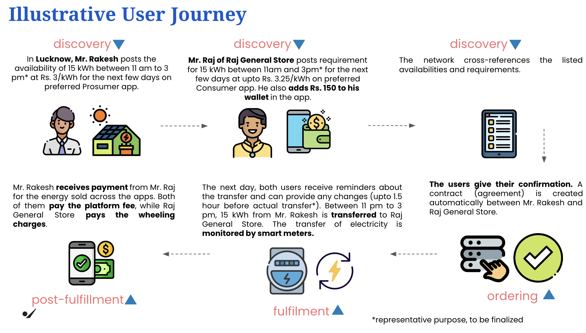

# UEI Implementation Guide - P2P energy trade

#### Version 1.0

## Version History

| Date       | Version | Description                                         |
| ---------- | ------- | --------------------------------------------------- |
| 16-12-2024 | 1.0     | Initial Version                                     |

## Introduction

This document provides material that helps network participants build and integrate their application with a Beck network for Peer to Peer(P2P) energy trade. This document is part of the starter kit that provides information about the network, learning resources, network participant checklist etc. This document only focuses on the implementation of the seeker/provider platform. It assumes the reader has a good overview of the Beckn network, its APIs, the overall structure of the schema etc.

## Structure of the document

This document has the following parts:

1. Outcome Visualization - This is a pictorial or descriptive representation of the different use cases that are supported by the network.
2. Flow diagrams - This section provides a pictorial representation of the message flows that happen during the use case.
3. API Calls and Schema - This section provides details on the API calls and the schema of the message that is sent in the form of sample schemas.
4. Taxonomy and layer 2 configuration - This section provides details on the taxonomy, enumerations and any rules defined for either the use case or by the network.
5. Notes on writing/integrating with your own software - This section describes ways in which you can integrate (Becknify) your new or existing software
6. Links to downloadable resources - This section contains the downloadable files referenced in this document.
7. Sandbox Details - Sandbox links to BAP, Regitry/Gateway and BPP.

## Outcome Visualisation



### Use case - Discovery, order and fulfillment of EV Charging

- Raj is a general store owner in Lucknow. He wants to buy affordable solar energy for his general store.
- Rakesh is a resident of Lucknow. He has a solar plant installed on the roof of his house and wants to sell the surplus solar energy directly to consumers.

- Rakesh logs into the preferred Prosumer app.
- He posts the availability of 15 kWh of surplus energy, specifying:
    Time: 11 am to 3 pm
    Price: Rs. 3/kWh
    Duration: chooses the preferred time slot(s)
- Rakesh reviews and confirms the listing.

**Discovery**:

- Raj logs into the preferred Consumer app.
- He posts the requirement for 15 kWh of energy, specifying:
    Time: 11 am to 3 pm
    Price: Willing to pay up to Rs. 3.25/kWh
    Duration: chooses the preferred time slot(s)
- Raj reviews and confirms his request.

- The platform/network cross-references the listings.
- Gate Closure: After a specified gate closure time, the system identifies a match between:
    Rakesh's availability (15 kWh at Rs. 3/kWh)
    Raj’s requirement (15 kWh at up to Rs. 3.25/kWh).
- Both users are either notified of the match or they read the matching data and update their records.

**Order**:

- Raj and Rakesh negotiate and finalsie the price.
- Raj provides the billing information.
- Both are allowed to make any last-minute changes up to X hours before the scheduled transfer.
- Both Rakesh and Mr. Raj confirm the match on their respective apps. A contract/agreement is automatically generated between Rakesh and Raj General Store.

**Fulfillment**:

- Between 11 am and 3 pm, 15 kWh of electricity is transferred from Rakesh to Raj General Store.
- The transfer is monitored in real-time via smart meters to ensure transparency and accuracy.


## Flow diagrams

### General Beckn message flow and error handling

This section is relevant to all the messages flows illustrated below and discussed further in the document.

Beckn is a aynchronous protocol at its core.

- When a network participant(NP1) sends a message to another participant(NP2), the other participant(NP2) immediately returns back an ACK/NACK(Acknowledgement or Negative Acknowledgement in case of error - usually with wrongly formed messages).
- An ACK is an indicator that the receiving participant(NP2) will process this message and dispatch an on_xxxxxx message to original NP (NP1)
- Subsequently after processing the message NP2 sends back the real response in the corresponding on_xxxxxx message, to which again the first participant(NP1).
- This message can contain a message field (for success) or error field (for failure)
- NP1 when it receives the on_xxxxxx message, sends back an ACK/NACK (Here in both the cases NP1 will not send any subsequent message).
- In the Use case diagrams, this ACK/NACK is not illustrated explicitly to keep the diagrams crisp.
- However when writing software we should be prepared to receive these NACK messages as well as error field in the on_xxxxxx messages
- While this discussion is from a Beckn perspective, Adapters can provide synchronous modes. For example, the Protocol Server which is the reference implementation of the Beckn Adapter provides a synchronous mode by default. So if your software calls the support endpoint on the BAP Protocol Server, the Protocol Server waits till it gets the on_support and returns back that as the response.


**Structure of a message with a NACK**

```
{
    "message": {
        "ack": {
            "status": "NACK"
        }
    },
    "error": {
        "code": 400,
        "message": "OpenApiValidator Error at BAP-CLIENT",
    }
}
```

**Structure of a on_select message with an error**

```
{
    "context": {
        "action": "on_select",
        "version": "1.1.0",
        ...
    },
    "error": {
        "code": 30001,
        "message": "Requested provider is not in the database"
    }
}
```

### Use case - Discovery, order and fulfillment of surplus solar energy

- <>
- <>

**Search for surplus solar energy**

## API Calls and Schema

### search

Search request can contain one or more search criterion within it. Use the following list on how to specify the criterion.

- <>
- <>
- If searching by free text, it is specified in message->intent->descriptor->name
- If searching by category, it is specified in message->intent->category->descriptor->code

```

```

### on_search

**on_search with catalog of results**

- The catalog that comes back has a list of providers.
- Each provider has a list of items.
- Each item is the catalog listing solar energy.

```

```

### select

**sending a select request**

- Choose the item(s) from the list from on_search and request quote
- The chosen item is in message->order->item_id

```

```

### on_select

- The BPP returns back with a quote for the selection
- It is in message->order->quote

```

```

### init

**send init request**

- The draft order including billing details.
- Billing details specified in message->order->billing

```

```

### on_init

- Contains payment terms. Payment terms specified in message->order->payments
- Cancellation terms specified in message->order->cancellation_terms
- Here we show the BPP as payment collector. In case the BAP specifies that it collects the payment in the init, the url field within payments will be empty

```

```

### confirm

- Confirm order including payment paid info (when applicable).
- It is in message->order->payments

```

```

### on_confirm

- Order confirmed. Charging can start.

```

```

### status

- Request for status on order. order_id is specifiedin message->order_id

```

```

### on_status

- Status of requested order.
- Primarily the fulfillment status is specified in message->order->fulfillments[]->state

```

```


## Taxonomy and layer 2 configuration

TBP


## Integrating with your software

This section gives general walkthrough of how you would integrate your software with the Beckn network (say the sandbox environment). Refer to the starter kit for details on how to register with the sandbox and get credentials.

Beckn-ONIX is an initiative to promote easy install and maintenance of a Beckn Network. Apart from the Registry and Gateway components that are required for a network facilitator, Beckn-ONIX provides a Beckn Adapter. A reference implementation of the Beckn-ONIX specificatino is available at [Beckn-ONIX repository](https://github.com/beckn/beckn-onix). The reference implementation of the Beckn Adapter is called the Protocol Server. Based on whether we are writing the seeker platform or the provider platform, we will be installing the BAP Protocol Server or the BPP Protocol Server respectively.

### Integrating the seeker platform

If you are writing the seeker platform software, the following are the steps you can follow to build and integrate your application.

1. Identify the use cases from above section that are close to the functionality you plan for your application.
2. Design and develop the UI that implements the flow you need. Typically you will have a API server that this UI talks to and it is called the Seeker Platform in the diagram below.
3. The API server should construct the required JSON message packets required for the different endpoints shown in the API section above.
4. Install the BAP Protocol Server using the reference implementation of Beckn-ONIX. During the installation, you will need the address of the registry of the environment, a URL where the Beckn responses will arrive (called Subscriber URL) and a subscriber_id (typically the same as subscriber URL without the "https://" prefix)
5. Install the layer 2 file for the domain (Link is in the last section of this document)
6. Check with your network tech support to enable your BAP Protocol Server in the registry.
7. Once enabled, you can transact on the Beckn Network. Typically the sandbox environment will have the rest of the components you need to test your software. In the diagram below,
   - you write the Seeker Platform(dark blue)
   - install the BAP Protocol Server (light blue)
   - the remaining components are provided by the sandbox enviornment
8. Once the application is working on the Sandbox, refer to the Starter kit for instructions to take it to pre-production and production.


### Integrating the provider platform

If you are writing the provider platform software, the following are the steps you can follow to build and integrate your application.

1. Identify the use cases from above section that are close to the functionality you plan for your application.
2. Design and develop the component that accepts the Beckn requests and interacts with your software to do transactions. It has to be a endpoint(it is called as webhook_url in the description below) which receives all the Beckn requests (search, select etc). This endpoint can either exist outside of your marketplace/shop software or within it. That is a design decision that will have to be taken by you based on the design of your existing marketplace/shop software. This component is also responsible for sending back the responses to a the Beckn Adaptor.
3. Install the BPP Protocol Server using the reference implementation of Beckn-ONIX. During the installation, you will need the address of the registry of the environment, a URL where the Beckn responses will arrive (called Subscriber URL), a subscriber_id (typically the same as subscriber URL without the "https://" prefix) and the webhook_url that you configured in the step above. Also the address of the BPP Protocol Server Client will have to be configured in your component above. This address hosts all the response endpoints (on_search,on_select etc)
4. Install the layer 2 file for the domain (Link is in the last section of this document)
5. Check with your network tech support to enable your BPP Protocol Server in the registry.
6. Once enabled, you can transact on the Beckn Network. Typically the sandbox environment will have the rest of the components you need to test your software. In the diagram below,
   - you write the Provider Platform(dark blue) - Here the component you wrote above in point 2 as well as your marketplace/shop software is together shown as Provider Platform
   - install the BPP Protocol Server (light blue)
   - the remaining components are provided by the sandbox enviornment
   - Use the postman collection to test your Provider Platform
7. Once the application is working on the Sandbox, refer to the Starter kit for instructions to take it to pre-production and production.


## Links to artefacts

TBP

## Sandbox Details

TBP

