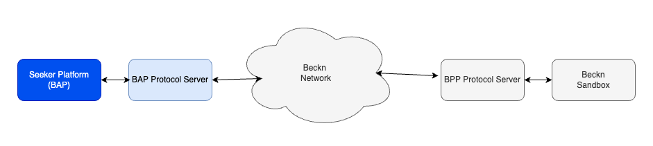

# UEI Implementation Guide - EV Charging

#### Version 1.1

## Version History

| Date       | Version | Description                                         |
| ---------- | ------- | --------------------------------------------------- |
| 07-08-2024 | 1.0     | Initial Version                                     |
| 09-09-2024 | 1.1     | Incorporated input from Participants during Winroom |

## Introduction

This document provides material that helps network participants build and integrate their application with the UEI Network for EV Charging. This document is part of the starter kit that provides information about the network, learning resources, network participant checklist etc. This document only focuses on the implementation of the seeker/provider platform. It assumes the reader has a good overview of the Beckn network, its APIs, the overall structure of the schema etc.

## Structure of the document

This document has the following parts:

1. Outcome Visualization - This is a pictorial or descriptive representation of the different use cases that are supported by the network.
2. Flow diagrams - This section provides a pictorial representation of the message flows that happen during the use case.
3. API Calls and Schema - This section provides details on the API calls and the schema of the message that is sent in the form of sample schemas.
4. Taxonomy and layer 2 configuration - This section provides details on the taxonomy, enumerations and any rules defined for either the use case or by the network.
5. Notes on writing/integrating with your own software - This section describes ways in which you can integrate (Becknify) your new or existing software
6. Links to downloadable resources - This section contains the downloadable files referenced in this document.
7. Sandbox Details - Sandbox links to BAP, Regitry/Gateway and BPP.

## Outcome Visualisation

### Use case - Discovery, order and fulfillment of EV Charging

This use cases uses the names "Pulse Energy" and "Kazam" as examples for illustration.

- Srilekha is an IT professional who travels for work five days a week. She uses her four-wheeler electric vehicle (EV) for her commute. She prefers to charge her vehicle during her work hours and looks for suitable charging stations near her workplace.

**Discovery**:

- Srilekha begins to browse the Pulse Energy app to search for nearby EV chargers for four-wheelers.

- She receives a catalogue of 4 available chargers provided by Pulse energy & Kazam. Among them, she finds one which is located at a distance of 500 metres, which was in the catalogue of Kazam.

**Order**:

- Srilekha selects the charger, opting for a charging session at the cost of Rs. 13/kWh for a duration of 1 hour.

- She accepts the terms of order and is prompted to choose a payment method (card or link).

- She chooses to make payment through the link and confirms the order.

- The order is confirmed by Kazam’s charger provider and verifies the payment and generates an order ID

**Fulfillment**:

- Srilekha plugs the kazam’s charger into her vehicle and initiates the charging process. After an hour, the charging stops, and she is prompted to either remove the charger or continue charging. Srilekha removes the charger from her vehicle, thus ending the charging process.

**Post Fulfilment**: 

- Srilekha rates her experience using a 0-5 star rating.

## Flow diagrams

### General Beckn message flow and error handling

This section is relevant to all the messages flows illustrated below and discussed further in the document.

Beckn is a aynchronous protocol at its core.

- When a network participant(NP1) sends a message to another participant(NP2), the other participant(NP2) immediately returns back an ACK/NACK(Acknowledgement or Negative Acknowledgement in case of error - usually with wrongly formed messages).
- An ACK is an indicator that the receiving participant(NP2) will process this message and dispatch an on_xxxxxx message to original NP (NP1)
- Subsequently after processing the message NP2 sends back the real response in the corresponding on_xxxxxx message, to which again the first participant(NP1).
- This message can contain a message field (for success) or error field (for failure)
- NP1 when it receives the on_xxxxxx message, sends back an ACK/NACK (Here in both the cases NP1 will not send any subsequent message).
- In the Use case diagrams, this ACK/NACK is not illustrated explicitly to keep the diagrams crisp.
- However when writing software we should be prepared to receive these NACK messages as well as error field in the on_xxxxxx messages
- While this discussion is from a Beckn perspective, Adapters can provide synchronous modes. For example, the Protocol Server which is the reference implementation of the Beckn Adapter provides a synchronous mode by default. So if your software calls the support endpoint on the BAP Protocol Server, the Protocol Server waits till it gets the on_support and returns back that as the response.


**Structure of a message with a NACK**

```
{
    "message": {
        "ack": {
            "status": "NACK"
        }
    },
    "error": {
        "code": 400,
        "message": "OpenApiValidator Error at BAP-CLIENT",
    }
}
```

**Structure of a on_select message with an error**

```
{
    "context": {
        "action": "on_select",
        "version": "1.1.0",
        ...
    },
    "error": {
        "code": 30001,
        "message": "Requested provider is not in the database"
    }
}
```

### Use case - Discovery, order and fulfillment of EV Charging

- This usecase does not allow pre-booking of the charging station. So essentially after the user searches the charging station, the rest of the messages (select, init, confirm and update) all happen while the user is at the charging station. This is due to the current readiness of the participants.
- It is envisioned that a future version of this guide (once the NPs are ready) will add pre-booking of a slot at a charging station.

**Search for EV Charging stations nearby**

## API Calls and Schema

### search

Search request can contain one or more search criterion within it. Use the following list on how to specify the criterion.

- The location to search around is specified in the message->intent->fulfillment->stops[0]->location field.
- The connector type required is specified in message->intent->fulfillment->tags[0]->list[0]. Refer to the taxonomy section below for the list of connector types supported.
- If searching by free text, it is specified in message->intent->descriptor->name
- If searching by category, it is specified in message->intent->category->descriptor->code

```
{
  "context": {
    "ttl": "PT10M",
    "action": "search",
    "timestamp": "2024-08-05T09:21:12.618Z",
    "message_id": "e138f204-ec0b-415d-9c9a-7b5bafe10bfe",
    "transaction_id": "2ad735b9-e190-457f-98e5-9702fd895996",
    "domain": "ev-charging:uei",
    "version": "1.1.0",
    "bap_id": "example-bap-id",
    "bap_uri": "https://example-bap-url.com"
  },
  "message": {
    "intent": {
      "descriptor": {
        "name": "charging stations for ioniq 5"
      },
      "category": {
        "descriptor": {
          "code": "green-tariff"
        }
      },
      "fulfillment": {
        "stops": [
          {
            "location": {
              "circle": {
                "gps": "12.423423,77.325647",
                "radius": {
                  "type": "CONSTANT",
                  "value": "5",
                  "unit": "km"
                }
              }
            }
          }
        ],
        "tags": [
          {
            "list": [
              {
                "descriptor": {
                  "code": "connector-type"
                },
                "value": "CCS2"
              }
            ]
          }
        ]
      }
    }
  }
}
```

### on_search

**on_search with catalog of results**

- The catalog that comes back has a list of providers.
- Each provider has a list of items.
- Each item is the catalog listing for a charging station.

```
{
  "context": {
    "domain": "ev-charging:uei",
    "action": "on_search",
    "location": {
      "country": {
        "name": "India",
        "code": "IND"
      }
    },
    "city": "std:080",
    "version": "1.1.0",
    "bap_id": "example-bap.com",
    "bap_uri": "https://api.example-bap.com/pilot/bap/energy/v1",
    "bpp_id": "example-bpp.com",
    "bpp_uri": "https://example-bpp.com",
    "transaction_id": "6743e9e2-4fb5-487c-92b7-13ba8018f176",
    "message_id": "6743e9e2-4fb5-487c-92b7-13ba8018f176",
    "timestamp": "2023-07-16T04:41:16Z"
  },
  "message": {
    "catalog": {
      "providers": [
        {
          "id": "example_provider_id",
          "descriptor": {
            "name": "Example Company",
            "short_desc": "Example Company Pvt Ltd",
            "images": [
              {
                "url": "https://example-company.com/images/logo.png"
              }
            ]
          },
          "categories": [
            {
              "id": "1",
              "descriptor": {
                "code": "green-tariff",
                "name": "green tariff"
              }
            }
          ],
          "locations": [
            {
              "id": "1",
              "gps": "12.345345,77.389754",
              "descriptor": {
                "name": "ABC Charging station, sector 47"
              },
              "address": "123, Plaza house, street 23"
            },
            {
              "id": "2",
              "gps": "12.247934,77.876987",
              "descriptor": {
                "name": "ABC Charging station, sector 81"
              },
              "address": "824, peter lane, street 8"
            }
          ],
          "items": [
            {
              "id": "pe-charging-01",
              "descriptor": {
                "code": "energy"
              },
              "price": {
                "value": "8",
                "currency": "INR/kWH"
              },
              "quantity": {
                "available": {
                  "measure": {
                    "value": "100",
                    "unit": "kWH"
                  }
                }
              },
              "category_ids": [
                "1"
              ],
              "location_ids": [
                "1"
              ],
              "fulfillment_ids": [
                "1",
                "2"
              ],
              "add_ons": [
                {
                  "id": "pe-charging-01-addon-1",
                  "descriptor": {
                    "name": "Free car wash"
                  },
                  "price": {
                    "value": "0",
                    "currency": "INR"
                  }
                }
              ]
            },
            {
              "id": "pe-charging-02",
              "descriptor": {
                "code": "energy"
              },
              "price": {
                "value": "8",
                "currency": "INR/kWH"
              },
              "quantity": {
                "available": {
                  "measure": {
                    "value": "100",
                    "unit": "kWH"
                  }
                }
              },
              "category_ids": [
                "1"
              ],
              "location_ids": [
                "1"
              ],
              "fulfillment_ids": [
                "3",
                "4"
              ],
              "add_ons": [
                {
                  "id": "pe-charging-01-addon-1",
                  "descriptor": {
                    "name": "Free car wash"
                  },
                  "price": {
                    "value": "0",
                    "currency": "INR"
                  }
                }
              ]
            }
          ],
          "fulfillments": [
            {
              "id": "1",
              "type": "CHARGING",
              "tags": [
                {
                  "descriptor": {
                    "name": "Charging Point Specifications"
                  },
                  "list": [
                    {
                      "descriptor": {
                        "name": "Pillar Number 4",
                        "code": "charger-id"
                      },
                      "value": "charg1"
                    },
                    {
                      "descriptor": {
                          "code": "Availability"
                      },
                      "value": "Available"
                    }
                  ]
                }
              ]
            },
            {
              "id": "2",
              "type": "CHARGING",
              "tags": [
                {
                  "descriptor": {
                      "name": "Connector Specifications"
                  },
                  "list": [
                    {
                        "descriptor": {
                            "name": "connector Id",
                            "code": "connector-id"
                        },
                        "value": "con1"
                    },
                    {
                        "descriptor": {
                            "name": "Charger Type",
                            "code": "charger-type"
                        },
                        "value": "DC"
                    },
                    {
                        "descriptor": {
                            "name": "Connector Type",
                            "code": "connector-type"
                        },
                        "value": "CCS2"
                    },
                    {
                        "descriptor": {
                            "name": "Power Rating",
                            "code": "power-rating"
                        },
                        "value": "30kW"
                    },
                    {
                        "descriptor": {
                            "name": "Availability",
                            "code": "availability"
                        },
                        "value": "Available"
                    }
                  ]
                }
              ],
              "display": true
            },
            {
              "id": "3",
              "type": "CHARGING",
              "tags": [
                {
                  "descriptor": {
                    "name": "Charging Point Specifications"
                  },
                  "list": [
                    {
                      "descriptor": {
                        "name": "Pillar Number 3",
                        "code": "charger-id"
                      },
                      "value": "charg3"
                    },
                    {
                      "descriptor": {
                          "code": "Availability"
                      },
                      "value": "Unvailable"
                    }
                  ]
                }
              ]
            },
            {
              "id": "4",
              "type": "CHARGING",
              "tags": [
                {
                  "descriptor": {
                      "name": "Connector Specifications"
                  },
                  "list": [
                    {
                        "descriptor": {
                            "name": "connector 1",
                            "code": "connector-id"
                        },
                        "value": "con4"
                    },
                    {
                        "descriptor": {
                            "name": "Charger Type",
                            "code": "charger-type"
                        },
                        "value": "AC"
                    },
                    {
                        "descriptor": {
                            "name": "Connector Type",
                            "code": "connector-type"
                        },
                        "value": "CCS2"
                    },
                    {
                        "descriptor": {
                            "name": "Power Rating",
                            "code": "power-rating"
                        },
                        "value": "40kW"
                    },
                    {
                        "descriptor": {
                            "name": "Availability",
                            "code": "unavailability"
                        },
                        "value": "Available"
                    }
                  ]
                }
              ],
              "display": true
            }
          ]
        }
      ]
    }
  }
}
```

### select

**sending a select request**

- Choose the item(s) from the list from on_search and request quote
- The chosen item is in message->order->item_id

```
{
  "context": {
    "domain": "ev-charging:uei",
    "action": "select",
    "location": {
      "country": {
        "name": "India",
        "code": "IND"
      }
    },
    "city": "std:080",
    "version": "1.1.0",
    "bap_id": "example-bap.com",
    "bap_uri": "https://api.example-bap.com/pilot/bap/energy/v1",
    "bpp_id": "example-bpp.com",
    "bpp_uri": "https://example-bpp.com",
    "transaction_id": "6743e9e2-4fb5-487c-92b7-13ba8018f176",
    "message_id": "6743e9e2-4fb5-487c-92b7-13ba8018f176",
    "timestamp": "2023-07-16T04:41:16Z"
  },
  "message": {
    "order": {
      "provider": {
        "id": "example_provider_id"
      },
      "items": [
        {
          "id": "pe-charging-01",
          "quantity": {
            "selected": {
              "measure": {
                "value": "4",
                "unit": "kWh"
              }
            }
          }
        }
      ],
      "fulfillments": [
        {
          "id": "1"
        },
        {
          "id": "2",
          "stops": [
            {
              "type": "start",
              "time": {
                "timestamp": "2023-07-16T10:00:00+05:30"
              }
            },
            {
              "type": "finish",
              "time": {
                "timestamp": "2023-07-16T10:30:00+05:30"
              }
            }
          ]
        }
      ]
    }
  }
}
```

### on_select

- The BPP returns back with a quote for the selection
- It is in message->order->quote

```
{
  "context": {
    "domain": "ev-charging:uei",
    "action": "on_select",
    "location": {
      "country": {
        "name": "India",
        "code": "IND"
      }
    },
    "city": "std:080",
    "version": "1.1.0",
    "bap_id": "example-bap.com",
    "bap_uri": "https://api.example-bap.com/pilot/bap/energy/v1",
    "bpp_id": "example-bpp.com",
    "bpp_uri": "https://example-bpp.com",
    "transaction_id": "6743e9e2-4fb5-487c-92b7-13ba8018f176",
    "message_id": "6743e9e2-4fb5-487c-92b7-13ba8018f176",
    "timestamp": "2023-07-16T04:41:16Z"
  },
  "message": {
    "order": {
      "provider": {
        "id": "example_provider_id",
        "descriptor": {
          "name": "Example Company",
          "short_desc": "Example Company Pvt Ltd",
          "images": [
            {
              "url": "https://example-company.com/images/logo.png"
            }
          ]
        }
      },
      "items": [
        {
          "id": "pe-charging-01",
          "descriptor": {
            "code": "energy"
          },
          "price": {
            "value": "8",
            "currency": "INR/kWH"
          },
          "quantity": {
            "available": {
              "measure": {
                "value": "100",
                "unit": "kWh"
              }
            },
            "selected": {
              "measure": {
                "value": "4",
                "unit": "kWh"
              }
            }
          }
        },
        {
          "id": "pe-charging-01-addon-1",
          "descriptor": {
            "code": "add-on-item",
            "name": "Free car wash"
          },
          "price": {
            "value": "0",
            "currency": "INR"
          }
        }
      ],
      "fulfillments": [
        {
          "id": "1",
          "type": "CHARGING",
          "tags": [
            {
              "descriptor": {
                "name": "Charging Point Specifications"
              },
              "list": [
                {
                  "descriptor": {
                    "name": "Pillar Number 4",
                    "code": "charger-id"
                  },
                  "value": "charg1"
                },
                {
                  "descriptor": {
                      "code": "Availability"
                  },
                  "value": "Available"
                }
              ]
            }
          ]
        },
        {
          "id": "2",
          "type": "CHARGING",
          "stops": [
            {
              "type": "start",
              "time": {
                "timestamp": "2023-07-16T10:00:00+05:30"
              }
            },
            {
              "type": "finish",
              "time": {
                "timestamp": "2023-07-16T10:30:00+05:30"
              }
            }
          ]
          "tags": [
            {
              "descriptor": {
                  "name": "Connector Specifications"
              },
              "list": [
                {
                    "descriptor": {
                        "name": "connector 1",
                        "code": "connector-id"
                    },
                    "value": "con1"
                },
                {
                    "descriptor": {
                        "name": "Charger Type",
                        "code": "charger-type"
                    },
                    "value": "DC"
                },
                {
                    "descriptor": {
                        "name": "Connector Type",
                        "code": "connector-type"
                    },
                    "value": "CCS2"
                },
                {
                    "descriptor": {
                        "name": "Power Rating",
                        "code": "power-rating"
                    },
                    "value": "30kW"
                },
                {
                    "descriptor": {
                        "name": "Availability",
                        "code": "availability"
                    },
                    "value": "Available"
                }
              ]
            }
          ],
          "display": true
        }
      ],
      "quote": {
        "price": {
          "value": "39.7",
          "currency": "INR"
        },
        "breakup": [
          {
            "title": "charging session cost",
            "item": {
              "descriptor": {
                "name": "Estimated units consumed"
              },
              "quantity": {
                "selected": {
                  "measure": {
                    "value": "4",
                    "unit": "kWh"
                  }
                }
              }
            },
            "price": {
              "value": "32",
              "currency": "INR"
            }
          },
          {
            "item": {
              "descriptor": {
                "name": "Free car wash"
              }
            },
            "price": {
              "value": "0",
              "currency": "INR"
            }
          },
          {
            "title": "gst",
            "price": {
                "currency": "INR",
                "value": "7.20"
            }
          }
        ]
      }
    }
  }
}
```

### init

**send init request**

- The draft order including billing details.
- Billing details specified in message->order->billing

```
{
  "context": {
    "domain": "ev-charging:uei",
    "action": "init",
    "location": {
      "country": {
        "name": "India",
        "code": "IND"
      }
    },
    "city": "std:080",
    "version": "1.1.0",
    "bap_id": "example-bap.com",
    "bap_uri": "https://api.example-bap.com/pilot/bap/energy/v1",
    "bpp_id": "example-bpp.com",
    "bpp_uri": "https://example-bpp.com",
    "transaction_id": "6743e9e2-4fb5-487c-92b7-13ba8018f176",
    "message_id": "6743e9e2-4fb5-487c-92b7-13ba8018f176",
    "timestamp": "2023-07-16T04:41:16Z"
  },
  "message": {
    "order": {
      "provider": {
        "id": "example_provider_id"
      },
      "items": [
        {
          "id": "pe-charging-01"
        }
      ],
      "billing": {
        "name": "John Doe",
        "email": "abc@example.com",
        "phone": "+91-9876522222"
      },
      "fulfillments": [
        {
          "id": "1"
        },
        {
          "id": "2",
          "stops": [
            {
              "type": "start",
              "time": {
                "timestamp": "2023-07-16T10:00:00+05:30"
              }
            },
            {
              "type": "finish",
              "time": {
                "timestamp": "2023-07-16T10:30:00+05:30"
              }
            }
          ],
          "customer": {
            "person": {
              "name": "John Doe"
            },
            "contact": {
              "phone": "+91-9887766554"
            }
          }
        }
      ]
    }
  }
}
```

### on_init

- Contains payment terms. Payment terms specified in message->order->payments
- Cancellation terms specified in message->order->cancellation_terms
- Here we show the BPP as payment collector. In case the BAP specifies that it collects the payment in the init, the url field within payments will be empty

```
{
  "context": {
    "domain": "ev-charging:uei",
    "action": "on_init",
    "location": {
      "country": {
        "name": "India",
        "code": "IND"
      }
    },
    "city": "std:080",
    "version": "1.1.0",
    "bap_id": "example-bap.com",
    "bap_uri": "https://api.example-bap.com/pilot/bap/energy/v1",
    "bpp_id": "example-bpp.com",
    "bpp_uri": "https://example-bpp.com",
    "transaction_id": "6743e9e2-4fb5-487c-92b7-13ba8018f176",
    "message_id": "6743e9e2-4fb5-487c-92b7-13ba8018f176",
    "timestamp": "2023-07-16T04:41:16Z"
  },
  "message": {
    "order": {
      "provider": {
        "id": "example_provider_id",
        "descriptor": {
          "name": "Example Company",
          "short_desc": "Example Company Pvt Ltd",
          "images": [
            {
              "url": "https://example-company.com/images/logo.png"
            }
          ]
        }
      },
      "items": [
        {
          "id": "pe-charging-01",
          "descriptor": {
            "code": "energy"
          },
          "price": {
            "value": "8",
            "currency": "INR/kWH"
          },
          "quantity": {
            "available": {
              "measure": {
                "value": "100",
                "unit": "kWh"
              }
            },
            "selected": {
              "measure": {
                "value": "4",
                "unit": "kWh"
              }
            }
          }
        }
      ],
      "fulfillments": [
        {
          "id": "1",
          "type": "CHARGING",
          "tags": [
            {
              "descriptor": {
                "name": "Charging Point Specifications"
              },
              "list": [
                {
                  "descriptor": {
                    "name": "Pillar Number 4",
                    "code": "charger-id"
                  },
                  "value": "charg1"
                },
                {
                  "descriptor": {
                      "code": "Availability"
                  },
                  "value": "Available"
                }
              ]
            }
          ]
        },
        {
          "id": "2",
          "type": "CHARGING",
          "stops": [
            {
              "type": "start",
              "time": {
                "timestamp": "2023-07-16T10:00:00+05:30"
              }
            },
            {
              "type": "finish",
              "time": {
                "timestamp": "2023-07-16T10:30:00+05:30"
              }
            }
          ],
          "customer": {
            "person": {
              "name": "John Doe"
            },
            "contact": {
              "phone": "+91-9887766554"
            }
          },
          "tags": [
            {
              "descriptor": {
                  "name": "Connector Specifications"
              },
              "list": [
                {
                    "descriptor": {
                        "name": "connector 1",
                        "code": "connector-id"
                    },
                    "value": "con1"
                },
                {
                    "descriptor": {
                        "name": "Charger Type",
                        "code": "charger-type"
                    },
                    "value": "DC"
                },
                {
                    "descriptor": {
                        "name": "Connector Type",
                        "code": "connector-type"
                    },
                    "value": "CCS2"
                },
                {
                    "descriptor": {
                        "name": "Power Rating",
                        "code": "power-rating"
                    },
                    "value": "30kW"
                },
                {
                    "descriptor": {
                        "name": "Availability",
                        "code": "availability"
                    },
                    "value": "Available"
                }
              ]
            }
          ],
          "display": true
        }
      ],
      "billing": {
        "email": "abc@example.com",
        "phone": "+91-9876522222"
      },
      "quote": {
        "price": {
          "value": "39.7",
          "currency": "INR"
        },
        "breakup": [
          {
            "title": "charging session cost",
            "item": {
              "descriptor": {
                "name": "Estimated units consumed"
              },
              "quantity": {
                "selected": {
                  "measure": {
                    "value": "4",
                    "unit": "kWh"
                  }
                }
              }
            },
            "price": {
              "value": "32",
              "currency": "INR"
            }
          },
          {
            "item": {
              "descriptor": {
                "name": "Free car wash"
              }
            },
            "price": {
              "value": "0",
              "currency": "INR"
            }
          },
          {
            "title": "gst",
            "price": {
                "currency": "INR",
                "value": "7.20"
            }
          }
        ]
      }
      "payments": [
        {
          "url": "https://payment.gateway.in",
          "collected_by": "bpp",
          "type": "PRE-ORDER",
          "status": "NOT-PAID",
          "params": {
            "amount": "40",
            "currency": "INR"
          }
        }
      ],
      "cancellation_terms": [
        {
          "fulfillment_state": {
            "descriptor": {
              "code": "charging-start"
            }
          },
          "cancellation_fee": {
            "percentage": "30%"
          },
          "external_ref": {
            "mimetype": "text/html",
            "url": "https://example-company.com/charge/tnc.html"
          }
        }
      ]
    }
  }
}
```

### confirm

- Confirm order including payment paid info (when applicable).
- It is in message->order->payments

```
{
  "context": {
    "domain": "ev-charging:uei",
    "action": "confirm",
    "location": {
      "country": {
        "name": "India",
        "code": "IND"
      }
    },
    "city": "std:080",
    "version": "1.1.0",
    "bap_id": "example-bap.com",
    "bap_uri": "https://api.example-bap.com/pilot/bap/energy/v1",
    "bpp_id": "example-bpp.com",
    "bpp_uri": "https://example-bpp.com",
    "transaction_id": "6743e9e2-4fb5-487c-92b7-13ba8018f176",
    "message_id": "6743e9e2-4fb5-487c-92b7-13ba8018f176",
    "timestamp": "2023-07-16T04:41:16Z"
  },
  "message": {
    "order": {
      "provider": {
        "id": "example_provider_id"
      },
      "items": [
        {
          "id": "pe-charging-01"
        }
      ],
      "billing": {
        "name": "John Doe",
        "email": "abc@example.com",
        "phone": "+91-9876522222"
      },
      "fulfillments": [
        {
          "id": "1"
        },
        {
          "id": "2",
          "stops": [
            {
              "type": "start",
              "time": {
                "timestamp": "2023-07-16T10:00:00+05:30"
              }
            },
            {
              "type": "finish",
              "time": {
                "timestamp": "2023-07-16T10:30:00+05:30"
              }
            }
          ],
          "customer": {
            "person": {
              "name": "John Doe"
            },
            "contact": {
              "phone": "+91-9887766554"
            }
          }
        }
      ],
      "payments": [
        {
          "collected_by": "BPP",
          "params": {
            "amount": "40",
            "currency": "INR",
            "transaction_id": "tans1"
          },
          "status": "PAID",
          "type": "PRE-ORDER"
        }
      ]
    }
  }
}
```

### on_confirm

- Order confirmed. Charging can start.

```
{
  "context": {
    "domain": "ev-charging:uei",
    "action": "on_confirm",
    "location": {
      "country": {
        "name": "India",
        "code": "IND"
      }
    },
    "city": "std:080",
    "version": "1.1.0",
    "bap_id": "example-bap.com",
    "bap_uri": "https://api.example-bap.com/pilot/bap/energy/v1",
    "bpp_id": "example-bpp.com",
    "bpp_uri": "https://example-bpp.com",
    "transaction_id": "6743e9e2-4fb5-487c-92b7-13ba8018f176",
    "message_id": "6743e9e2-4fb5-487c-92b7-13ba8018f176",
    "timestamp": "2023-07-16T04:41:16Z"
  },
  "message": {
    "order": {
      "id": "6743e9e2-4fb5-487c-92b7",
      "provider": {
        "id": "example_provider_id",
        "descriptor": {
          "name": "Example Company",
          "short_desc": "Example Company Pvt Ltd",
          "images": [
            {
              "url": "https://example-company.com/images/logo.png"
            }
          ]
        }
      },
      "items": [
        {
          "id": "pe-charging-01",
          "descriptor": {
            "code": "energy"
          },
          "price": {
            "value": "8",
            "currency": "INR/kWH"
          },
          "quantity": {
            "available": {
              "measure": {
                "value": "100",
                "unit": "kWh"
              }
            },
            "selected": {
              "measure": {
                "value": "4",
                "unit": "kWh"
              }
            }
          }
        }
      ],
      "fulfillments": [
        {
          "id": "1",
          "type": "CHARGING",
          "tags": [
            {
              "descriptor": {
                "name": "Charging Point Specifications"
              },
              "list": [
                {
                  "descriptor": {
                    "name": "Pillar Number 4",
                    "code": "charger-id"
                  },
                  "value": "charg1"
                },
                {
                  "descriptor": {
                      "code": "Availability"
                  },
                  "value": "Available"
                }
              ]
            }
          ]
        },
        {
          "id": "2",
          "type": "CHARGING",
          "stops": [
            {
              "type": "start",
              "time": {
                "timestamp": "2023-07-16T10:00:00+05:30"
              },
              "instructions": {
                "name": "Charging instructions",
                "short_desc": "To start your charging, go to charger number 987, and click on 'start' on your app"
              }
            },
            {
              "type": "finish",
              "time": {
                "timestamp": "2023-07-16T10:30:00+05:30"
              }
            }
          ],
          "customer": {
            "person": {
              "name": "John Doe"
            },
            "contact": {
              "phone": "+91-9887766554"
            }
          },
          "state": {
            "descriptor": {
              "code": "payment-completed"
            }
          },
          "tags": [
            {
              "descriptor": {
                  "name": "Connector Specifications"
              },
              "list": [
                {
                    "descriptor": {
                        "name": "connector 1",
                        "code": "connector-id"
                    },
                    "value": "con1"
                },
                {
                    "descriptor": {
                        "name": "Charger Type",
                        "code": "charger-type"
                    },
                    "value": "DC"
                },
                {
                    "descriptor": {
                        "name": "Connector Type",
                        "code": "connector-type"
                    },
                    "value": "CCS2"
                },
                {
                    "descriptor": {
                        "name": "Power Rating",
                        "code": "power-rating"
                    },
                    "value": "30kW"
                },
                {
                    "descriptor": {
                        "name": "Availability",
                        "code": "availability"
                    },
                    "value": "Available"
                }
              ]
            }
          ],
          "display": true
        }
      ],
      "billing": {
        "email": "abc@example.com",
        "phone": "+91-9876522222"
      },
      "quote": {
        "price": {
          "value": "39.7",
          "currency": "INR"
        },
        "breakup": [
          {
            "title": "charging session cost",
            "item": {
              "descriptor": {
                "name": "Estimated units consumed"
              },
              "quantity": {
                "selected": {
                  "measure": {
                    "value": "4",
                    "unit": "kWh"
                  }
                }
              }
            },
            "price": {
              "value": "32",
              "currency": "INR"
            }
          },
          {
            "item": {
              "descriptor": {
                "name": "Free car wash"
              }
            },
            "price": {
              "value": "0",
              "currency": "INR"
            }
          },
          {
            "title": "gst",
            "price": {
                "currency": "INR",
                "value": "7.20"
            }
          }
        ]
      },
      "payments": [
        {
          "type": "PRE-ORDER",
          "status": "PAID",
          "params": {
            "transaction_id": "trans1",
            "amount": "40",
            "currency": "INR"
          },
          "time": {
            "timestamp": "2023-07-16T09:30:00+05:30"
          }
        }
      ],
      "cancellation_terms": [
        {
          "fulfillment_state": {
            "descriptor": {
              "code": "charging-start"
            }
          },
          "cancellation_fee": {
            "percentage": "30%"
          },
          "external_ref": {
            "mimetype": "text/html",
            "url": "https://example-company.com/charge/tnc.html"
          }
        }
      ]
    }
  }
}
```

### status

- Request for status on order. order_id is specifiedin message->order_id

```
{
  "context": {
    "domain": "ev-charging:uei",
    "action": "status",
    "location": {
      "country": {
        "name": "India",
        "code": "IND"
      }
    },
    "city": "std:080",
    "version": "1.1.0",
    "bap_id": "example-bap.com",
    "bap_uri": "https://api.example-bap.com/pilot/bap/energy/v1",
    "bpp_id": "example-bpp.com",
    "bpp_uri": "https://example-bpp.com",
    "transaction_id": "6743e9e2-4fb5-487c-92b7-13ba8018f176",
    "message_id": "6743e9e2-4fb5-487c-92b7-13ba8018f176",
    "timestamp": "2023-07-16T04:41:16Z"
  },
  "message": {
    "order_id": "6743e9e2-4fb5-487c-92b7"
  }
}
```

### on_status

- Status of requested order.
- Primarily the fulfillment status is specified in message->order->fulfillments[]->state
- The message->order->fulfillments[]->state->descriptor->long_desc can be used to specify the OCPP status of the charge point. This can help the BAP to construct a custom detailed UI for charging status.

```
{
  "context": {
    "domain": "ev-charging:uei",
    "action": "on_status",
    "location": {
      "country": {
        "name": "India",
        "code": "IND"
      }
    },
    "city": "std:080",
    "version": "1.1.0",
    "bap_id": "example-bap.com",
    "bap_uri": "https://api.example-bap.com/pilot/bap/energy/v1",
    "bpp_id": "example-bpp.com",
    "bpp_uri": "https://example-bpp.com",
    "transaction_id": "6743e9e2-4fb5-487c-92b7-13ba8018f176",
    "message_id": "6743e9e2-4fb5-487c-92b7-13ba8018f176",
    "timestamp": "2023-07-16T04:41:16Z"
  },
  "message": {
    "order": {
      "id": "6743e9e2-4fb5-487c-92b7",
      "provider": {
        "id": "example_provider_id",
        "descriptor": {
          "name": "Example Company",
          "short_desc": "Example Company Pvt Ltd",
          "images": [
            {
              "url": "https://example-company.com/images/logo.png"
            }
          ]
        }
      },
      "items": [
        {
          "id": "pe-charging-01",
          "descriptor": {
            "code": "energy"
          },
          "price": {
            "value": "8",
            "currency": "INR/kWH"
          },
          "quantity": {
            "available": {
              "measure": {
                "value": "100",
                "unit": "kWh"
              }
            },
            "selected": {
              "measure": {
                "value": "4",
                "unit": "kWh"
              }
            }
          },
          "fulfillment_ids": [
            "1"
          ]
        }
      ],
      "fulfillments": [
        {
          "id": "1",
          "type": "CHARGING",
          "tags": [
            {
              "descriptor": {
                "name": "Charging Point Specifications"
              },
              "list": [
                {
                  "descriptor": {
                    "name": "Pillar Number 4",
                    "code": "charger-id"
                  },
                  "value": "charg1"
                },
                {
                  "descriptor": {
                      "code": "Availability"
                  },
                  "value": "Available"
                }
              ]
            }
          ]
        },
        {
          "id": "2",
          "type": "CHARGING",
          "stops": [
            {
              "type": "start",
              "time": {
                "timestamp": "2023-07-16T10:00:00+05:30"
              }
            },
            {
              "type": "finish",
              "time": {
                "timestamp": "2023-07-16T10:30:00+05:30"
              }
            }
          ],
          "customer": {
            "person": {
              "name": "John Doe"
            },
            "contact": {
              "phone": "+91-9887766554"
            }
          },
          "state": {
            "descriptor": {
              "code": "pehicle getting charged"
            }
          },
          "tags": [
            {
              "descriptor": {
                  "name": "Connector Specifications"
              },
              "list": [
                {
                    "descriptor": {
                        "name": "connector 1",
                        "code": "connector-id"
                    },
                    "value": "con1"
                },
                {
                    "descriptor": {
                        "name": "Charger Type",
                        "code": "charger-type"
                    },
                    "value": "DC"
                },
                {
                    "descriptor": {
                        "name": "Connector Type",
                        "code": "connector-type"
                    },
                    "value": "CCS2"
                },
                {
                    "descriptor": {
                        "name": "Power Rating",
                        "code": "power-rating"
                    },
                    "value": "30kW"
                },
                {
                    "descriptor": {
                        "name": "Availability",
                        "code": "availability"
                    },
                    "value": "Available"
                }
              ]
            },
            {
              "descriptor": {
                  "name": "Charging Details",
                  "code": "charging-details"
                },
                "list": [
                {
                    "descriptor": {
                      "name": "Energy Delivered",  
                      "code": "energy-delivered"
                    },
                    "value": "2.3kWh"
                },
                {
                    "descriptor": {
                      "name": "State of Charge",
                      "code": "soc"
                    },
                    "value": "80%"
                },
                {
                  "descriptor": {
                      "name": "Start Time",
                      "code": "start-time"
                    },
                    "value": "2023-07-16T10:30:00.000Z"
                },
                {
                  "descriptor": {
                      "name": "Stop Time",
                      "code": "stop-time"
                    },
                    "value": "2023-07-16T11:30:00.000Z"
                },
                {
                  "descriptor": {
                      "name": "Meter Start",
                      "code": "meter-start"
                    },
                    "value": "12345"
                },
                {
                  "descriptor": {
                      "name": "Meter Stop",
                      "code": "meter-stop"
                    },
                    "value": "14345"
                },
                {
                  "descriptor": {
                      "name": "Current",
                      "code": "current"
                    },
                    "value": "10A"
                },
                {
                  "descriptor": {
                      "name": "Power",
                      "code": "power"
                    },
                    "value": "3.3kW"
                },
                {
                  "descriptor": {
                      "name": "Voltage",
                      "code": "voltage"
                    },
                    "value": "330V"
                }
              ],
              "display": true
            }
          ],
          "display": true
        }
      ],
      "billing": {
        "email": "abc@example.com",
        "phone": "+91-9876522222"
      },
      "quote": {
        "price": {
          "value": "39.7",
          "currency": "INR"
        },
        "breakup": [
          {
            "title": "charging session cost",
            "item": {
              "descriptor": {
                "name": "Estimated units consumed"
              },
              "quantity": {
                "selected": {
                  "measure": {
                    "value": "4",
                    "unit": "kWh"
                  }
                }
              }
            },
            "price": {
              "value": "32",
              "currency": "INR"
            }
          },
          {
            "item": {
              "descriptor": {
                "name": "Free car wash"
              }
            },
            "price": {
              "value": "0",
              "currency": "INR"
            }
          },
          {
            "title": "gst",
            "price": {
                "currency": "INR",
                "value": "7.20"
            }
          }
        ]
      },
      "payments": [
        {
          "type": "PRE-ORDER",
          "status": "PAID",
          "params": {
            "transaction_id": "trans1",
            "amount": "40",
            "currency": "INR"
          },
          "time": {
            "timestamp": "2023-07-16T09:30:00+05:30"
          }
        }
      ],
      "cancellation_terms": [
        {
          "fulfillment_state": {
            "descriptor": {
              "code": "charging-start"
            }
          },
          "cancellation_fee": {
            "percentage": "30%"
          },
          "external_ref": {
            "mimetype": "text/html",
            "url": "https://example-company.com/charge/tnc.html"
          }
        }
      ]
    }
  }
}
```

### update (start charging)

- Update the state of the fulfillment to start-charging.
- This will trigger charging start.

```
{
  "context": {
    "domain": "ev-charging:uei",
    "action": "update",
    "location": {
      "country": {
        "name": "India",
        "code": "IND"
      }
    },
    "city": "std:080",
    "version": "1.1.0",
    "bap_id": "example-bap.com",
    "bap_uri": "https://api.example-bap.com/pilot/bap/energy/v1",
    "bpp_id": "example-bpp.com",
    "bpp_uri": "https://example-bpp.com",
    "transaction_id": "6743e9e2-4fb5-487c-92b7-13ba8018f176",
    "message_id": "6743e9e2-4fb5-487c-92b7-13ba8018f176",
    "timestamp": "2023-07-16T04:41:16Z"
  },
  "message": {
    "update_target": "order.fulfillments[0].state",
    "order": {
      "fulfillments": [
        {
          "id": "1",
          "type": "CHARGING",
          "state": {
            "descriptor": {
              "code": "start-charging"
            }
          }
        }
      ]
    }
  }
}
```

### on_update (start charging)

- Confirmation of successful start of charging operation
- State in message->order->fulfillments[]->state

```
{
  "context": {
    "domain": "ev-charging:uei",
    "action": "on_update",
    "location": {
      "country": {
        "name": "India",
        "code": "IND"
      }
    },
    "city": "std:080",
    "version": "1.1.0",
    "bap_id": "example-bap.com",
    "bap_uri": "https://api.example-bap.com/pilot/bap/energy/v1",
    "bpp_id": "example-bpp.com",
    "bpp_uri": "https://example-bpp.com",
    "transaction_id": "6743e9e2-4fb5-487c-92b7-13ba8018f176",
    "message_id": "6743e9e2-4fb5-487c-92b7-13ba8018f176",
    "timestamp": "2023-07-16T04:41:16Z"
  },
  "message": {
    "order": {
      "id": "6743e9e2-4fb5-487c-92b7",
      "provider": {
        "id": "example_provider_id",
        "descriptor": {
          "name": "Example Company",
          "short_desc": "Example Company Pvt Ltd",
          "images": [
            {
              "url": "https://example-company.com/images/logo.png"
            }
          ]
        }
      },
      "items": [
        {
          "id": "pe-charging-01",
          "descriptor": {
            "code": "energy"
          },
          "price": {
            "value": "8",
            "currency": "INR/kWH"
          },
          "quantity": {
            "available": {
              "measure": {
                "value": "100",
                "unit": "kWh"
              }
            },
            "selected": {
              "measure": {
                "value": "4",
                "unit": "kWh"
              }
            }
          }
        }
      ],
      "fulfillments": [
        {
          "id": "1",
          "type": "CHARGING",
          "tags": [
            {
              "descriptor": {
                "name": "Charging Point Specifications"
              },
              "list": [
                {
                  "descriptor": {
                    "name": "Pillar Number 4",
                    "code": "charger-id"
                  },
                  "value": "charg1"
                },
                {
                  "descriptor": {
                      "code": "Availability"
                  },
                  "value": "Available"
                }
              ]
            }
          ]
        },
        {
          "id": "2",
          "type": "CHARGING",
          "stops": [
            {
              "type": "start",
              "time": {
                "timestamp": "2023-07-16T10:00:00+05:30"
              },
              "instructions": {
                "name": "Charging instructions",
                "short_desc": "To start your charging, go to charger number 987, and click on 'start' on your app"
              }
            },
            {
              "type": "finish",
              "time": {
                "timestamp": "2023-07-16T10:30:00+05:30"
              }
            }
          ],
          "customer": {
            "person": {
              "name": "John Doe"
            },
            "contact": {
              "phone": "+91-9887766554"
            }
          },
          "state": {
            "descriptor": {
              "code": "charging started"
            }
          },
          "tags": [
            {
              "descriptor": {
                  "name": "Connector Specifications"
              },
              "list": [
                {
                    "descriptor": {
                        "name": "connector 1",
                        "code": "connector-id"
                    },
                    "value": "con1"
                },
                {
                    "descriptor": {
                        "name": "Charger Type",
                        "code": "charger-type"
                    },
                    "value": "DC"
                },
                {
                    "descriptor": {
                        "name": "Connector Type",
                        "code": "connector-type"
                    },
                    "value": "CCS2"
                },
                {
                    "descriptor": {
                        "name": "Power Rating",
                        "code": "power-rating"
                    },
                    "value": "30kW"
                },
                {
                    "descriptor": {
                        "name": "Availability",
                        "code": "availability"
                    }
                }
              ]
            }
          ],
          "display": true
        }
      ],
      "billing": {
        "email": "abc@example.com",
        "phone": "+91-9876522222"
      },
      "quote": {
        "price": {
          "value": "39.7",
          "currency": "INR"
        },
        "breakup": [
          {
            "title": "charging session cost",
            "item": {
              "descriptor": {
                "name": "Estimated units consumed"
              },
              "quantity": {
                "selected": {
                  "measure": {
                    "value": "4",
                    "unit": "kWh"
                  }
                }
              }
            },
            "price": {
              "value": "32",
              "currency": "INR"
            }
          },
          {
            "item": {
              "descriptor": {
                "name": "Free car wash"
              }
            },
            "price": {
              "value": "0",
              "currency": "INR"
            }
          },
          {
            "title": "gst",
            "price": {
                "currency": "INR",
                "value": "7.20"
            }
          }
        ]
      },
      "payments": [
        {
          "type": "PRE-ORDER",
          "status": "PAID",
          "params": {
            "transaction_id": "trans1",
            "amount": "40",
            "currency": "INR"
          },
          "time": {
            "timestamp": "2023-07-16T09:30:00+05:30"
          }
        }
      ],
      "cancellation_terms": [
        {
          "fulfillment_state": {
            "descriptor": {
              "code": "charging-start"
            }
          },
          "cancellation_fee": {
            "percentage": "30%"
          },
          "external_ref": {
            "mimetype": "text/html",
            "url": "https://example-company.com/charge/tnc.html"
          }
        }
      ]
    }
  }
}
```

### update (end charging)

- Request to change fulfillment state to end-charging

```
{
  "context": {
    "domain": "ev-charging:uei",
    "action": "update",
    "location": {
      "country": {
        "name": "India",
        "code": "IND"
      }
    },
    "city": "std:080",
    "version": "1.1.0",
    "bap_id": "example-bap.com",
    "bap_uri": "https://api.example-bap.com/pilot/bap/energy/v1",
    "bpp_id": "example-bpp.com",
    "bpp_uri": "https://example-bpp.com",
    "transaction_id": "6743e9e2-4fb5-487c-92b7-13ba8018f176",
    "message_id": "6743e9e2-4fb5-487c-92b7-13ba8018f176",
    "timestamp": "2023-07-16T04:41:16Z"
  },
  "message": {
    "update_target": "order.fulfillments[0].state",
    "order": {
      "fulfillments": [
        {
          "id": "1",
          "state": {
            "descriptor": {
              "code": "end-charging"
            }
          }
        }
      ]
    }
  }
}
```

### on_update (end charging)

- Confirmation of successful operation to end charging
- The state will be in message->order->fulfillments[]->state

```
{
  "context": {
    "domain": "ev-charging:uei",
    "action": "on_update",
    "location": {
      "country": {
        "name": "India",
        "code": "IND"
      }
    },
    "city": "std:080",
    "version": "1.1.0",
    "bap_id": "example-bap.com",
    "bap_uri": "https://api.example-bap.com/pilot/bap/energy/v1",
    "bpp_id": "example-bpp.com",
    "bpp_uri": "https://example-bpp.com",
    "transaction_id": "6743e9e2-4fb5-487c-92b7-13ba8018f176",
    "message_id": "6743e9e2-4fb5-487c-92b7-13ba8018f176",
    "timestamp": "2023-07-16T04:41:16Z"
  },
  "message": {
    "order": {
      "id": "6743e9e2-4fb5-487c-92b7",
      "provider": {
        "id": "example_provider_id",
        "descriptor": {
          "name": "Example Company",
          "short_desc": "Example Company Pvt Ltd",
          "images": [
            {
              "url": "https://example-company.com/images/logo.png"
            }
          ]
        }
      },
      "items": [
        {
          "id": "pe-charging-01",
          "descriptor": {
            "code": "energy"
          },
          "price": {
            "value": "8",
            "currency": "INR/kWH"
          },
          "quantity": {
            "available": {
              "measure": {
                "value": "100",
                "unit": "kWh"
              }
            },
            "selected": {
              "measure": {
                "value": "4",
                "unit": "kWh"
              }
            }
          },
          "fulfillment_ids": [
            "1"
          ]
        }
      ],
      "fulfillments": [
        {
          "id": "1",
          "customer": {
            "person": {
              "name": "John Doe"
            },
            "contact": {
              "phone": "+91-9887766554"
            }
          },
          "type": "CHARGING",
          "state": {
            "descriptor": {
              "code": "charging-ended"
            }
          },
          "stops": [
            {
              "type": "start",
              "location": {
                "gps": "12.423423,77.325647"
              },
              "time": {
                "timestamp": "2023-07-16T10:00:00+05:30",
              }
            },
            {
              "type": "end",
              "time": {
                "timestamp": "2023-07-16T10:30:00+05:30",
              }
            }
          ],
          "tags": [
            {
              "descriptor": {
                "name": "Charging Point"
              },
              "list": [
                {
                  "descriptor": {
                    "name": "Charger type"
                  },
                  "value": "AC"
                },
                {
                  "descriptor": {
                    "name": "Connector type"
                  },
                  "value": "CCS2"
                },
                {
                  "descriptor": {
                    "name": "Power Rating"
                  },
                  "value": "greater than 50kW"
                },
                {
                  "descriptor": {
                    "name": "Availability"
                  },
                  "value": "Available"
                }
              ],
              "display": true
            }
          ]
        }
      ],
      "billing": {
        "email": "abc@example.com",
        "phone": "+91-9876522222"
      },
      "quote": {
        "price": {
          "value": "40",
          "currency": "INR"
        },
        "breakup": [
          {
            "item": {
              "descriptor": {
                "name": "Estimated units consumed"
              },
              "quantity": {
                "selected": {
                  "measure": {
                    "value": "4",
                    "unit": "kWh"
                  }
                }
              }
            },
            "price": {
              "value": "32",
              "currency": "INR"
            }
          }
        ]
      },
      "payments": [
        {
          "type": "PRE-ORDER",
          "status": "PAID",
          "params": {
            "amount": "40",
            "currency": "INR"
          },
          "time": {
            "timestamp": "2023-07-16T09:30:00+05:30"
          }
        }
      ],
      "cancellation_terms": [
        {
          "fulfillment_state": {
            "descriptor": {
              "code": "charging-start"
            }
          },
          "cancellation_fee": {
            "percentage": "30%"
          },
          "external_ref": {
            "mimetype": "text/html",
            "url": "https://example-company.com/charge/tnc.html"
          }
        }
      ]
    }
  }
}
```

### support

- Request for support information.
- If regarding a specific order, specify the order_id in message->support->ref_id

```
{
  "context": {
    "domain": "ev-charging:uei",
    "action": "support",
    "location": {
      "country": {
        "name": "India",
        "code": "IND"
      }
    },
    "city": "std:080",
    "version": "1.1.0",
    "bap_id": "example-bap.com",
    "bap_uri": "https://api.example-bap.com/pilot/bap/energy/v1",
    "bpp_id": "example-bpp.com",
    "bpp_uri": "https://example-bpp.com",
    "transaction_id": "6743e9e2-4fb5-487c-92b7-13ba8018f176",
    "message_id": "6743e9e2-4fb5-487c-92b7-13ba8018f176",
    "timestamp": "2023-07-16T04:41:16Z"
  },
  "message": {
    "support": {
      "ref_id": "6743e9e2-4fb5-487c-92b7"
    }
  }
}
```

### on_support

- Contains support information. If integrated with a CMS, the URL could contain order specific support info
- In all other cases, contains general support info (message->support)

```
{
  "context": {
    "domain": "ev-charging:uei",
    "action": "on_support",
    "location": {
      "country": {
        "name": "India",
        "code": "IND"
      }
    },
    "city": "std:080",
    "version": "1.1.0",
    "bap_id": "example-bap.com",
    "bap_uri": "https://api.example-bap.com/pilot/bap/energy/v1",
    "bpp_id": "example-bpp.com",
    "bpp_uri": "https://example-bpp.com",
    "transaction_id": "6743e9e2-4fb5-487c-92b7-13ba8018f176",
    "message_id": "6743e9e2-4fb5-487c-92b7-13ba8018f176",
    "timestamp": "2023-07-16T04:41:16Z"
  },
  "message": {
    "support": {
      "ref_id": "6743e9e2-4fb5-487c-92b7",
      "phone": "1800 1080",
      "email": "customer.care@example-company.com",
      "url": "https://www.example-company.com/helpdesk"
    }
  }
}
```

### track

- Request for a tracking URL for the order. Order Id must be specified in message->order_id

```
{
    "context": {
        "domain": "ev-charging:uei",
        "action": "track",
        "location": {
            "city": {
                "name": "Bangalore",
                "code": "std:080"
            },
            "country": {
                "name": "India",
                "code": "IND"
            }
        },
        "bap_id": "example-bap-id",
        "bap_uri": "https://example-bap-url.com",
        "bpp_id": "example-bpp-id",
        "bpp_uri": "https://example-bpp-url.com",
        "transaction_id": "e0a38442-69b7-4698-aa94-a1b6b5d244c2",
        "message_id": "6ace310b-6440-4421-a2ed-b484c7548bd5",
        "timestamp": "2023-02-18T17:00:40.065Z",
        "version": "1.0.0",
        "ttl": "PT10M"
    },
    "message": {
        "order_id": "b989c9a9-f603-4d44-b38d-26fd72286b38"
    }
}
```

### on_track

- Tracking URL with custom UI on charging process.
- The tracking URL will be in message->tracking->url

```
{
    "context": {
        "domain": "ev-charging:uei",
        "action": "on_track",
        "location": {
            "city": {
                "name": "Bangalore",
                "code": "std:080"
            },
            "country": {
                "name": "India",
                "code": "IND"
            }
        },
        "bap_id": "example-bap-id",
        "bap_uri": "https://example-bap-url.com",
        "bpp_id": "example-bpp-id",
        "bpp_uri": "https://example-bpp-url.com",
        "transaction_id": "e0a38442-69b7-4698-aa94-a1b6b5d244c2",
        "message_id": "6ace310b-6440-4421-a2ed-b484c7548bd5",
        "timestamp": "2023-02-18T17:00:40.065Z",
        "version": "1.0.0",
        "ttl": "PT10M"
    },
    "message": {
        "tracking": {
            "id": "38473fhjd7sriyr8",
            "url": "https://xyz/tracking/201f6fa2-a2f7-42e7-a2e5-8947398747",
            "status": "active"
        }
    }
}
```

### cancel

- Request to cancel an order. order_id to be specified in message->order_id
- In the case where there is no advance booking of the charging slot, this does not have much relevance

```
{
  "context": {
    "domain": "ev-charging:uei",
    "action": "cancel",
    "location": {
      "country": {
        "name": "India",
        "code": "IND"
      }
    },
    "city": "std:080",
    "version": "1.1.0",
    "bap_id": "example-bap.com",
    "bap_uri": "https://api.example-bap.com/pilot/bap/energy/v1",
    "bpp_id": "example-bpp.com",
    "bpp_uri": "https://example-bpp.com",
    "transaction_id": "6743e9e2-4fb5-487c-92b7-13ba8018f176",
    "message_id": "6743e9e2-4fb5-487c-92b7-13ba8018f176",
    "timestamp": "2023-07-16T04:41:16Z"
  },
  "message": {
    "cancellation_reason_id": "5",
    "descriptor": {
      "short_desc": "can't attend booking"
    },
    "order_id": "6743e9e2-4fb5-487c-92b7"
  }
}
```

### on_cancel

- Confirmation of cancelled order. The cancelled order will be in message->order
- In cases where advanced booking of charging station is not supported, this message is not relevant.

```
{
  "context": {
    "domain": "ev-charging:uei",
    "action": "on_cancel",
    "location": {
      "country": {
        "name": "India",
        "code": "IND"
      }
    },
    "city": "std:080",
    "version": "1.1.0",
    "bap_id": "example-bap.com",
    "bap_uri": "https://api.example-bap.com/pilot/bap/energy/v1",
    "bpp_id": "example-bpp.com",
    "bpp_uri": "https://example-bpp.com",
    "transaction_id": "6743e9e2-4fb5-487c-92b7-13ba8018f176",
    "message_id": "6743e9e2-4fb5-487c-92b7-13ba8018f176",
    "timestamp": "2023-07-16T04:41:16Z"
  },
  "message": {
    "order": {
      "id": "6743e9e2-4fb5-487c-92b7",
      "status": "CANCELLED",
      "provider": {
        "id": "example_provider_id",
        "descriptor": {
          "name": "Example Company",
          "short_desc": "Example Company Pvt Ltd",
          "images": [
            {
              "url": "https://example-company.com/images/logo.png"
            }
          ]
        }
      },
      "items": [
        {
          "id": "pe-charging-01",
          "descriptor": {
            "code": "energy"
          },
          "price": {
            "value": "8",
            "currency": "INR/kWH"
          },
          "quantity": {
            "available": {
              "measure": {
                "value": "100",
                "unit": "kWh"
              }
            },
            "selected": {
              "measure": {
                "value": "4",
                "unit": "kWh"
              }
            }
          },
          "fulfillment_ids": [
            "1"
          ]
        }
      ],
      "fulfillments": [
        {
          "id": "1",
          "customer": {
            "person": {
              "name": "John Doe"
            },
            "contact": {
              "phone": "+91-9887766554"
            }
          },
          "type": "CHARGING",
          "state": {
            "descriptor": {
              "code": "order-cancelled"
            }
          },
          "stops": [
            {
              "type": "start",
              "time": {
                "timestamp": "2023-07-16T10:00:00+05:30",
              }
            },
            {
              "type": "end",
              "time": {
                "timestamp": "2023-07-16T10:30:00+05:30",
              }
            }
          ],
          "tags": [
            {
              "descriptor": {
                "name": "Charging Point"
              },
              "list": [
                {
                  "descriptor": {
                    "name": "Charger type"
                  },
                  "value": "AC"
                },
                {
                  "descriptor": {
                    "name": "Connector type"
                  },
                  "value": "CCS2"
                },
                {
                  "descriptor": {
                    "name": "Power Rating"
                  },
                  "value": "greater than 50kW"
                },
                {
                  "descriptor": {
                    "name": "Availability"
                  },
                  "value": "Available"
                }
              ],
              "display": true
            }
          ]
        }
      ],
      "billing": {
        "email": "abc@example.com",
        "phone": "+91-9876522222"
      },
      "quote": {
        "price": {
          "value": "-32",
          "currency": "INR"
        },
        "breakup": [
          {
            "item": {
              "descriptor": {
                "name": "payment refund"
              },
              "quantity": {
                "selected": {
                  "measure": {
                    "value": "4",
                    "unit": "kWh"
                  }
                }
              }
            },
            "price": {
              "value": "-32",
              "currency": "INR"
            }
          }
        ]
      },
      "payments": [
        {
          "type": "PRE-ORDER",
          "status": "PAID",
          "params": {
            "amount": "40",
            "currency": "INR"
          },
          "time": {
            "timestamp": "2023-07-16T09:30:00+05:30"
          }
        }
      ],
      "cancellation_terms": [
        {
          "fulfillment_state": {
            "descriptor": {
              "code": "charging-start"
            }
          },
          "cancellation_fee": {
            "percentage": "30%"
          },
          "external_ref": {
            "mimetype": "text/html",
            "url": "https://example-company.com/charge/tnc.html"
          }
        }
      ]
    }
  }
}
```

### rating

- Rate different categories including fulfillment. Specify in message->ratings
- Value should be a decimal between 0 and 5.
- Id can be the order id.

```
{
  "context": {
    "domain": "ev-charging:uei",
    "action": "rating",
    "location": {
      "country": {
        "name": "India",
        "code": "IND"
      }
    },
    "city": "std:080",
    "version": "1.1.0",
    "bap_id": "example-bap.com",
    "bap_uri": "https://api.example-bap.com/pilot/bap/energy/v1",
    "bpp_id": "example-bpp.com",
    "bpp_uri": "https://example-bpp.com",
    "transaction_id": "6743e9e2-4fb5-487c-92b7-13ba8018f176",
    "message_id": "6743e9e2-4fb5-487c-92b7-13ba8018f176",
    "timestamp": "2023-07-16T04:41:16Z"
  },
  "message": {
    "ratings": [
      {
        "id": "6743e9e2-4fb5-487c-92b7",
        "rating_category": "Fulfillment",
        "value": "5"
      }
    ]
  }
}
```

### on_rating

- Confirmation of rating.
- Optionally send a form for additional input (message->feedback_form). Empty message otherwise.

```
{
  "context": {
    "domain": "ev-charging:uei",
    "action": "on_rating",
    "location": {
      "country": {
        "name": "India",
        "code": "IND"
      }
    },
    "city": "std:080",
    "version": "1.1.0",
    "bap_id": "example-bap.com",
    "bap_uri": "https://api.example-bap.com/pilot/bap/energy/v1",
    "bpp_id": "example-bpp.com",
    "bpp_uri": "https://example-bpp.com",
    "transaction_id": "6743e9e2-4fb5-487c-92b7-13ba8018f176",
    "message_id": "6743e9e2-4fb5-487c-92b7-13ba8018f176",
    "timestamp": "2023-07-16T04:41:16Z"
  },
  "message": {
    "feedback_form": {
      "form": {
        "url": "https://example-bpp.comfeedback/portal"
      },
      "required": false
    }
  }
}
```

## Taxonomy and layer 2 configuration

- **Connector-Type** is a tag used in multiple messages above. The values allowed for the connector types are specified in the OCPI Standard. This [page](https://ev2go.io/ocpiconnectors) lists some of them. This list will be extended with those types which are present in India, but not listed in the OCPI list. The code to be used will be the OCPI connector Value shown in the above webpage in all lowercase characters (e.g.chademo, iec_62196_t3a)
- **Charging Status** in fulfillment object has a long_desc field. This field should have the [OCPP](https://openchargealliance.org/protocols/open-charge-point-protocol/) status json object. The BAP can in on_status get this charging status value and show custom UI uniform across different BPPs.

Below is a list of standardised codes used in this implememtation. Each of these codes also have a list of standardised enum values associated with them. These codes and enums are expected to evolve with time as more NPs implement the UEI EV charging use case.

| SN    | Tag Name | Tag Code | Meaning  | Enums    |
|-------|----------|----------| ---------| ---------|
|    |       | charger-id      |          |          |
|    |       | Availability      |          |          |
|    |       | connector-id      |          |          |
|    |       | charger-type       |          |          |
|    |       | connector-type       |          |          |
|    |       | power-rating       |          |          |
|    |       | energy-delivered       |          |          |
|    |       | soc       |          |          |
|    |       | start-time       |          |          |
|    |       | stop-time       |          |          |
|    |       | meter-start       |          |          |
|    |       | meter-stop       |          |          |
|    |       | current       |          |          |
|    |       | power       |          |          |
|    |       | voltage       |          |          |


## Integrating with your software

This section gives general walkthrough of how you would integrate your software with the Beckn network (say the sandbox environment). Refer to the starter kit for details on how to register with the sandbox and get credentials.

Beckn-ONIX is an initiative to promote easy install and maintenance of a Beckn Network. Apart from the Registry and Gateway components that are required for a network facilitator, Beckn-ONIX provides a Beckn Adapter. A reference implementation of the Beckn-ONIX specificatino is available at [Beckn-ONIX repository](https://github.com/beckn/beckn-onix). The reference implementation of the Beckn Adapter is called the Protocol Server. Based on whether we are writing the seeker platform or the provider platform, we will be installing the BAP Protocol Server or the BPP Protocol Server respectively.

### Integrating the seeker platform

If you are writing the seeker platform software, the following are the steps you can follow to build and integrate your application.

1. Identify the use cases from above section that are close to the functionality you plan for your application.
2. Design and develop the UI that implements the flow you need. Typically you will have a API server that this UI talks to and it is called the Seeker Platform in the diagram below.
3. The API server should construct the required JSON message packets required for the different endpoints shown in the API section above.
4. Install the BAP Protocol Server using the reference implementation of Beckn-ONIX. During the installation, you will need the address of the registry of the environment, a URL where the Beckn responses will arrive (called Subscriber URL) and a subscriber_id (typically the same as subscriber URL without the "https://" prefix)
5. Install the layer 2 file for the domain (Link is in the last section of this document)
6. Check with your network tech support to enable your BAP Protocol Server in the registry.
7. Once enabled, you can transact on the Beckn Network. Typically the sandbox environment will have the rest of the components you need to test your software. In the diagram below,
   - you write the Seeker Platform(dark blue)
   - install the BAP Protocol Server (light blue)
   - the remaining components are provided by the sandbox enviornment
8. Once the application is working on the Sandbox, refer to the Starter kit for instructions to take it to pre-production and production.



### Integrating the provider platform

If you are writing the provider platform software, the following are the steps you can follow to build and integrate your application.

1. Identify the use cases from above section that are close to the functionality you plan for your application.
2. Design and develop the component that accepts the Beckn requests and interacts with your software to do transactions. It has to be a endpoint(it is called as webhook_url in the description below) which receives all the Beckn requests (search, select etc). This endpoint can either exist outside of your marketplace/shop software or within it. That is a design decision that will have to be taken by you based on the design of your existing marketplace/shop software. This component is also responsible for sending back the responses to a the Beckn Adaptor.
3. Install the BPP Protocol Server using the reference implementation of Beckn-ONIX. During the installation, you will need the address of the registry of the environment, a URL where the Beckn responses will arrive (called Subscriber URL), a subscriber_id (typically the same as subscriber URL without the "https://" prefix) and the webhook_url that you configured in the step above. Also the address of the BPP Protocol Server Client will have to be configured in your component above. This address hosts all the response endpoints (on_search,on_select etc)
4. Install the layer 2 file for the domain (Link is in the last section of this document)
5. Check with your network tech support to enable your BPP Protocol Server in the registry.
6. Once enabled, you can transact on the Beckn Network. Typically the sandbox environment will have the rest of the components you need to test your software. In the diagram below,
   - you write the Provider Platform(dark blue) - Here the component you wrote above in point 2 as well as your marketplace/shop software is together shown as Provider Platform
   - install the BPP Protocol Server (light blue)
   - the remaining components are provided by the sandbox enviornment
   - Use the postman collection to test your Provider Platform
7. Once the application is working on the Sandbox, refer to the Starter kit for instructions to take it to pre-production and production.


## Links to artefacts

- [Postman collection for UEI EV Charging](./postman/ev-charging_uei_postman_collection.json)
- [Layer2 config for UEI EV Charging](./layer2/ev-charging_uei_1.1.0.yaml)
- When installing layer2 using Beckn-ONIX use this web address (https://raw.githubusercontent.com/beckn/missions/main/UEI/layer2/ev-charging_uei_1.1.0.yaml)

## Sandbox Details


### BAP:

- **BAP Client Sandbox:** [https://bap-ps-client-sandbox.ueialliance.org/](https://bap-ps-client-sandbox.ueialliance.org/)
- **BAP Network Sandbox:** [https://bap-ps-network-sandbox.ueialliance.org/](https://bap-ps-network-sandbox.ueialliance.org/)

### Registry/Gateway:

- **Gateway Sandbox:** [https://gateway-sandbox.ueialliance.org/](https://gateway-sandbox.ueialliance.org/)
- **Registry Sandbox:** [https://registry-sandbox.ueialliance.org/](https://registry-sandbox.ueialliance.org/)

### BPP:

- **BPP Client Sandbox:** [https://bpp-ps-client-sandbox.ueialliance.org/](https://bpp-ps-client-sandbox.ueialliance.org/)
- **BPP Network Sandbox:** [https://bpp-ps-network-sandbox.ueialliance.org/](https://bpp-ps-network-sandbox.ueialliance.org/)
- **BPP Playground Sandbox:** [https://bpp-playground-sandbox.ueialliance.org/](https://bpp-playground-sandbox.ueialliance.org/)
