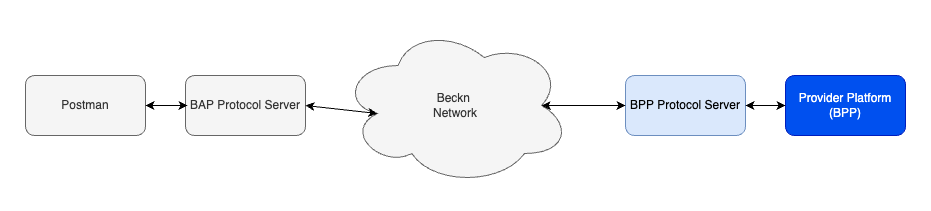

# UEI Implementation Guide - EV Charging

## Introduction

This document provides material that helps network participants build and integrate their application with the UEI Network for EV Charging. This document is part of the starter kit that provides information about the network, learning resources, network participant checklist etc. This document only focuses on the implementation of the seeker/provider platform. It assumes the reader has a good overview of the Beckn network, its APIs, the overall structure of the schema etc.

## Structure of the document

This document has the following parts:

1. Outcome Visualization - This is a pictorial or descriptive representation of the different use cases that are supported by the network.
2. Flow diagrams - This section provides a pictorial representation of the message flows that happen during the use case.
3. API Calls and Schema - This section provides details on the API calls and the schema of the message that is sent in the form of sample schemas.
4. Taxonomy and layer 2 configuration - This section provides details on the taxonomy, enumerations and any rules defined for either the use case or by the network.
5. Notes on writing/integrating with your own software - This section describes ways in which you can integrate (Becknify) your new or existing software
6. Links to downloadable resources - This section contains the downloadable files referenced in this document.

## Outcome Visualisation

### Use case - Discovery, order and fulfillment of EV Charging

This use cases uses the names "Pulse Energy" and "Kazam" as examples for illustration.

- Srilekha is an IT professional who travels for work five days a week. She uses her four-wheeler electric vehicle (EV) for her commute. She prefers to charge her vehicle during her work hours and looks for suitable charging stations near her workplace.

**Discovery**:

- Srilekha begins to browse the Pulse Energy app to search for nearby EV chargers for four-wheelers.

- She receives a catalogue of 4 available chargers provided by Pulse energy & Kazam. Among them, she finds one which is located at a distance of 500 metres, which was in the catalogue of Kazam.

**Order**:

- Srilekha selects the charger, opting for a charging session at the cost of Rs. 13/kWh for a duration of 1 hour.

- She accepts the terms of order and is prompted to choose a payment method (card or link).

- She chooses to make payment through the link and confirms the order.

- The order is confirmed by Kazam’s charger provider and verifies the payment and generates an order ID

**Fulfillment**:

- Srilekha plugs the kazam’s charger into her vehicle and initiates the charging process. After an hour, the charging stops, and she is prompted to either remove the charger or continue charging. Srilekha removes the charger from her vehicle, thus ending the charging process.

**Post Fulfilment**:

- Srilekha rates her experience using a 0-5 star rating.

## Flow diagrams

### General Beckn message flow and error handling

This section is relevant to all the messages flows illustrated below and discussed further in the document.

Beckn is a aynchronous protocol at its core.

- When a network participant(NP1) sends a message to another participant(NP2), the other participant(NP2) immediately returns back an ACK/NACK(Acknowledgement or Negative Acknowledgement in case of error - usually with wrongly formed messages).
- An ACK is an indicator that the receiving participant(NP2) will process this message and dispatch an on_xxxxxx message to original NP (NP1)
- Subsequently after processing the message NP2 sends back the real response in the corresponding on_xxxxxx message, to which again the first participant(NP1).
- This message can contain a message field (for success) or error field (for failure)
- NP1 when it receives the on_xxxxxx message, sends back an ACK/NACK (Here in both the cases NP1 will not send any subsequent message).
- In the Use case diagrams, this ACK/NACK is not illustrated explicitly to keep the diagrams crisp.
- However when writing software we should be prepared to receive these NACK messages as well as error field in the on_xxxxxx messages
- While this discussion is from a Beckn perspective, Adapters can provide synchronous modes. For example, the Protocol Server which is the reference implementation of the Beckn Adapter provides a synchronous mode by default. So if your software calls the support endpoint on the BAP Protocol Server, the Protocol Server waits till it gets the on_support and returns back that as the response.


**Structure of a message with a NACK**

```
{
    "message": {
        "ack": {
            "status": "NACK"
        }
    },
    "error": {
        "code": 400,
        "message": "OpenApiValidator Error at BAP-CLIENT",
    }
}
```

**Structure of a on_select message with an error**

```
{
    "context": {
        "action": "on_select",
        "version": "1.1.0",
        ...
    },
    "error": {
        "code": 30001,
        "message": "Requested provider is not in the database"
    }
}
```

### Use case - Discovery, order and fulfillment of EV Charging

**Search for EV Charging stations nearby**

## API Calls and Schema

### search

**search by location and connector type**

- The location to search around is specified in the message->intent->fulfillment->stops[0]->location field.
- The connector type is specified in the connector-types tag group

```
  {
    "context": {
      "ttl": "PT10M",
      "action": "search",
      "timestamp": "2024-08-05T09:21:12.618Z",
      "message_id": "e138f204-ec0b-415d-9c9a-7b5bafe10bfe",
      "transaction_id": "2ad735b9-e190-457f-98e5-9702fd895996",
      "domain": "ev-charging:uei",
      "version": "1.1.0",
      "bap_id": "example-bap-id",
      "bap_uri": "https://example-bap-url.com",
    },
    "message": {
      "intent": {
        "descriptor": {
          "name": ""
        },
        "fulfillment": {
          "stops": [
            {
                "location": {
                    "circle": {
                        "gps": "12.423423,77.325647",
                        "radius": {
                            "type": "CONSTANT",
                            "value": "5",
                            "unit": "km"
                        }
                    }
                }
            }
          ]
        }
        "tags": [
          {
            "descriptor": {
              "name": "Connector Types",
              "code": "connector-types"
            },
            "list": [
              {
                "descriptor": {
                  "name": "CCS2",
                  "code": "CCS2"
                },
                "value": "CCS2"
              }
            ],
            "display": true
          }
        ]
      }
    }
  }
```

### on_search

**on_search with catalog of results**

- The catalog that comes back has a list of providers.
- Each provider has a list of items.
- Each item is the catalog listing for a charging station.

```
{
    "context": {
        "domain": "ev-charging:uei",
        "action": "on_search",
        "location": {
            "city": {
                "name": "Bangalore",
                "code": "std:080"
            },
            "country": {
                "name": "India",
                "code": "IND"
            }
        },
        "bap_id": "example-bap-id",
        "bap_uri": "https://example-bap-url.com",
        "bpp_id": "example-bpp-id",
        "bpp_uri": "https://example-bpp-url.com",
        "transaction_id": "e0a38442-69b7-4698-aa94-a1b6b5d244c2",
        "message_id": "6ace310b-6440-4421-a2ed-b484c7548bd5",
        "timestamp": "2023-02-18T17:00:40.065Z",
        "version": "1.0.0",
        "ttl": "PT10M"
    },
    "message": {
        "catalog": {
            "descriptor": {
                "name": "Pulse Energy BPP"
            },
            "providers": [
                {
                    "id": "id of the CPO",
                    "descriptor": {
                        "name": "CPO name",
                        "images": [
                            {
                                "url": "logo of the CPO"
                            }
                        ]
                    },
                    "locations": [
                        {
                            "id": "id of the Charging Station",
                            "map_url": "Google Maps url of the location of CS",
                            "gps": "GPS Coords of the CS",
                            "address": "Address of the CS",
                            "city": {
                                "name": "Bangalore",
                                "code": "std:080"
                            },
                            "district": "",
                            "state": {
                                "name": "Karnataka",
                                "code": ""
                            },
                            "country": {
                                "name": "India",
                                "code": "IND"
                            }
                        }
                    ],
                    "items": [
                        {
                            "id": "id of the Charging Station",
                            "category_ids": [
                                "charging-station"
                            ],
                            "location_ids": [
                                "id of the CS"
                            ],
                            "descriptor": {
                                "name": "Name of the CS",
                                "images": [
                                    {
                                        "url": "image 1 of CS"
                                    },
                                    {
                                        "url": "image 2 of CS"
                                    }
                                ]
                            },
                            "tags": [
                                {
                                    "display": true,
                                    "descriptor": {
                                        "name": "Attributes",
                                        "code": "attributes"
                                    },
                                    "list": [
                                        {
                                            "display": true,
                                            "value": "30kms",
                                            "descriptor": {
                                                "name": "Distance",
                                                "code": "distance"
                                            }
                                        }
                                    ]
                                }
                            ]
                        },
                        {
                            "id": "id of the Charge Point",
                            "parent_item_id": "id of the Charging Station (Location) this CP belongs to",
                            "category_ids": [
                                "charge-point"
                            ],
                            "descriptor": {
                                "name": "Type 2",
                                "code": "Human readable unique code of the Charge Point",
                                "images": [
                                    {
                                        "url": "image of the connector's icon"
                                    }
                                ]
                            },
                            "tags": [
                                {
                                    "display": true,
                                    "descriptor": {
                                        "name": "Price",
                                        "code": "price"
                                    },
                                    "list": [
                                        {
                                            "display": true,
                                            "value": "₹15-20/kWh"
                                        }
                                    ]
                                },
                                {
                                    "display": true,
                                    "descriptor": {
                                        "name": "Available Charging Options",
                                        "code": "available-charging-options"
                                    },
                                    "list": [
                                        {
                                            "display": true,
                                            "value": "80",
                                            "descriptor": {
                                                "name": "SoC",
                                                "code": "soc"
                                            }
                                        },
                                        {
                                            "display": true,
                                            "value": "5",
                                            "descriptor": {
                                                "name": "Units",
                                                "code": "units"
                                            }
                                        },
                                        {
                                            "display": true,
                                            "value": "100",
                                            "descriptor": {
                                                "name": "Amount",
                                                "code": "amount"
                                            }
                                        },
                                        {
                                            "display": true,
                                            "value": "30",
                                            "descriptor": {
                                                "name": "Time",
                                                "code": "time"
                                            }
                                        }
                                    ]
                                }
                            ]
                        },
                        {
                            "id": "id of the Charge Point Connector",
                            "parent_item_id": "id of the Charge Point this CPC belongs to",
                            "category_ids": [
                                "connector"
                            ],
                            "descriptor": {
                                "name": "Type 2",
                                "code": "Type2",
                                "images": [
                                    {
                                        "url": "image of the connector's icon"
                                    }
                                ]
                            },
                            "tags": [
                                {
                                    "display": true,
                                    "descriptor": {
                                        "name": "Power Rating",
                                        "code": "power-rating"
                                    },
                                    "list": [
                                        {
                                            "display": true,
                                            "value": "15kW"
                                        }
                                    ]
                                },
                                {
                                    "display": true,
                                    "descriptor": {
                                        "name": "Connector Status",
                                        "code": "connector-status"
                                    },
                                    "list": [
                                        {
                                            "display": true,
                                            "value": "Available",
                                            "descriptor": {
                                                "name": "Status",
                                                "code": "status"
                                            }
                                        },
                                        {
                                            "display": true,
                                            "value": "NoError",
                                            "descriptor": {
                                                "name": "Error",
                                                "code": "error"
                                            }
                                        }
                                    ]
                                }
                            ]
                        }
                    ]
                }
            ]
        }
    }
}
```

### select

**sending a select request**

```
{
    "context": {
        "domain": "ev-charging:uei",
        "action": "select",
        "location": {
            "city": {
                "name": "Bangalore",
                "code": "std:080"
            },
            "country": {
                "name": "India",
                "code": "IND"
            }
        },
        "bap_id": "example-bap-id",
        "bap_uri": "https://example-bap-url.com",
        "bpp_id": "example-bpp-id",
        "bpp_uri": "https://example-bpp-url.com",
        "transaction_id": "e0a38442-69b7-4698-aa94-a1b6b5d244c2",
        "message_id": "6ace310b-6440-4421-a2ed-b484c7548bd5",
        "timestamp": "2023-02-18T17:00:40.065Z",
        "version": "1.0.0",
        "ttl": "PT10M"
    },
    "message": {
        "order": {
            "provider": {
                "id": "id of the CPO"
            },
            "items": [
                {
                    "id": "id of the Charging Station",
                    "descriptor": {
                        "code": "charging-station"
                    }
                },
                {
                    "id": "id of the Charge Point",
                    "descriptor": {
                        "code": "charge-point"
                    }
                },
                {
                    "id": "id of the charge point connector",
                    "descriptor": {
                        "code": "connector"
                    }
                }
            ],
            "tags": [
                {
                    "display": true,
                    "descriptor": {
                        "name": "Selected Charging Option",
                        "code": "selected-charging-option"
                    },
                    "list": [
                        {
                            "display": true,
                            "value": "100",
                            "descriptor": {
                                "name": "Amount",
                                "code": "amount"
                            }
                        }
                    ]
                },
                {
                    "display": true,
                    "descriptor": {
                        "name": "Selected Payment Method",
                        "code": "selected-payment-method"
                    },
                    "list": [
                        {
                            "display": true,
                            "value": "Paytm PG",
                            "descriptor": {
                                "name": "Method",
                                "code": "method"
                            }
                        }
                    ]
                },
                {
                    "display": false,
                    "descriptor": {
                        "name": "User Info",
                        "code": "user-info"
                    },
                    "list": [
                        {
                            "value": "19.2483,39.348944",
                            "descriptor": {
                                "name": "Coordinates",
                                "code": "coordinates"
                            }
                        },
                        {
                            "value": "jbcJKB269vdsjkhbeji",
                            "descriptor": {
                                "name": "User Id",
                                "code": "user-id"
                            }
                        },
                        {
                            "value": "+91987654321",
                            "descriptor": {
                                "name": "Phone",
                                "code": "phone"
                            }
                        },
                        {
                            "value": "hey@gmail.com",
                            "descriptor": {
                                "name": "Email",
                                "code": "email"
                            }
                        }
                    ]
                }
            ]
        }
    }
}
```

### on_select

```
{
    "context": {
        "domain": "ev-charging:uei",
        "action": "on_select",
        "location": {
            "city": {
                "name": "Bangalore",
                "code": "std:080"
            },
            "country": {
                "name": "India",
                "code": "IND"
            }
        },
        "bap_id": "example-bap-id",
        "bap_uri": "https://example-bap-url.com",
        "bpp_id": "example-bpp-id",
        "bpp_uri": "https://example-bpp-url.com",
        "transaction_id": "e0a38442-69b7-4698-aa94-a1b6b5d244c2",
        "message_id": "6ace310b-6440-4421-a2ed-b484c7548bd5",
        "timestamp": "2023-02-18T17:00:40.065Z",
        "version": "1.0.0",
        "ttl": "PT10M"
    },
    "message": {
        "order": {
            "provider": {
                "id": "id of the CPO",
                "descriptor": {
                    "name": "CPO name",
                    "images": [
                        {
                            "url": "logo of the CPO"
                        }
                    ]
                }
            },
            "items": [
                {
                    "id": "id of the Charging Station",
                    "category_ids": [
                        "charging-station"
                    ],
                    "descriptor": {
                        "name": "Name of the CS",
                        "images": [
                            {
                                "url": "image 1 of CS"
                            },
                            {
                                "url": "image 2 of CS"
                            }
                        ]
                    },
                    "tags": [
                        {
                            "display": true,
                            "descriptor": {
                                "name": "Attributes",
                                "code": "attributes"
                            },
                            "list": [
                                {
                                    "display": true,
                                    "value": "30kms",
                                    "descriptor": {
                                        "name": "Distance",
                                        "code": "distance"
                                    }
                                }
                            ]
                        }
                    ]
                },
                {
                    "id": "id of the Charge Point",
                    "parent_item_id": "id of the Charging Station (Location) this CP belongs to",
                    "category_ids": [
                        "charge-point"
                    ],
                    "descriptor": {
                        "name": "Name of the Charge Point",
                        "code": "Human readable unique code of the Charge Point",
                        "images": [
                            {
                                "url": "image 1 of CP"
                            }
                        ]
                    },
                    "tags": [
                        {
                            "display": true,
                            "descriptor": {
                                "name": "Available Charging Options",
                                "code": "available-charging-options"
                            },
                            "list": [
                                {
                                    "display": true,
                                    "value": "80",
                                    "descriptor": {
                                        "name": "SoC",
                                        "code": "soc"
                                    }
                                },
                                {
                                    "display": true,
                                    "value": "5",
                                    "descriptor": {
                                        "name": "Units",
                                        "code": "units"
                                    }
                                },
                                {
                                    "display": true,
                                    "value": "100",
                                    "descriptor": {
                                        "name": "Amount",
                                        "code": "amount"
                                    }
                                },
                                {
                                    "display": true,
                                    "value": "30",
                                    "descriptor": {
                                        "name": "Time",
                                        "code": "time"
                                    }
                                }
                            ]
                        }
                    ]
                },
                {
                    "id": "id of the Charge Point Connector",
                    "parent_item_id": "id of the Charge Point this CPC belongs to",
                    "category_ids": [
                        "connector"
                    ],
                    "descriptor": {
                        "name": "Type 2",
                        "code": "Type2",
                        "images": [
                            {
                                "url": "image of the connector's icon"
                            }
                        ]
                    },
                    "tags": [
                        {
                            "display": true,
                            "descriptor": {
                                "name": "Connector Status",
                                "code": "connector-status"
                            },
                            "list": [
                                {
                                    "display": true,
                                    "value": "Available",
                                    "descriptor": {
                                        "name": "Status",
                                        "code": "status"
                                    }
                                },
                                {
                                    "display": true,
                                    "value": "NoError",
                                    "descriptor": {
                                        "name": "Error",
                                        "code": "error"
                                    }
                                }
                            ]
                        }
                    ]
                }
            ],
            "tags": [
                {
                    "display": true,
                    "descriptor": {
                        "name": "Selected Charging Option",
                        "code": "selected-charging-option"
                    },
                    "list": [
                        {
                            "display": true,
                            "value": "100",
                            "descriptor": {
                                "name": "Amount",
                                "code": "amount"
                            }
                        }
                    ]
                }
            ],
            "quote": {
                "price": {
                    "currency": "INR",
                    "value": "123.25",
                    "estimated_value": "123.25"
                },
                "breakup": [
                    {
                        "title": "Estimated Charging Cost",
                        "price": {
                            "currency": "INR",
                            "value": "100"
                        }
                    },
                    {
                        "title": "GST",
                        "price": {
                            "currency": "INR",
                            "value": "18"
                        }
                    },
                    {
                        "title": "Service Fee",
                        "price": {
                            "currency": "INR",
                            "value": "5.25"
                        }
                    },
                    {
                        "title": "Total",
                        "price": {
                            "currency": "INR",
                            "value": "123.25"
                        }
                    }
                ]
            },
            "refund_terms": [
                {
                    "refund_eligible": true,
                    "refund_within": {
                        "days": "1"
                    },
                    "refund_amount": {
                        "currency": "INR",
                        "minimum_value": "0",
                        "maximum_value": "123.25"
                    }
                }
            ],
            "created_at": "2023-02-18T17:00:40.065Z",
            "updated_at": "2023-02-18T17:00:40.065Z"
        }
    }
}
```

### init

**send init request**

```
{
    "context": {
        "domain": "ev-charging:uei",
        "action": "init",
        "location": {
            "city": {
                "name": "Bangalore",
                "code": "std:080"
            },
            "country": {
                "name": "India",
                "code": "IND"
            }
        },
        "bap_id": "example-bap-id",
        "bap_uri": "https://example-bap-url.com",
        "bpp_id": "example-bpp-id",
        "bpp_uri": "https://example-bpp-url.com",
        "transaction_id": "e0a38442-69b7-4698-aa94-a1b6b5d244c2",
        "message_id": "6ace310b-6440-4421-a2ed-b484c7548bd5",
        "timestamp": "2023-02-18T17:00:40.065Z",
        "version": "1.0.0",
        "ttl": "PT10M"
    },
    "message": {
        "order": {
            "provider": {
                "id": "id of the CPO"
            },
            "items": [
                {
                    "id": "id of the Charging Station",
                    "descriptor": {
                        "code": "charging-station"
                    }
                },
                {
                    "id": "id of the Charge Point",
                    "descriptor": {
                        "code": "charge-point"
                    }
                },
                {
                    "id": "id of the charge point connector",
                    "descriptor": {
                        "code": "connector"
                    }
                }
            ],
            "tags": [
                {
                    "display": true,
                    "descriptor": {
                        "name": "Selected Charging Option",
                        "code": "selected-charging-option"
                    },
                    "list": [
                        {
                            "display": true,
                            "value": "100",
                            "descriptor": {
                                "name": "Amount",
                                "code": "amount"
                            }
                        }
                    ]
                },
                {
                    "display": true,
                    "descriptor": {
                        "name": "Selected Payment Method",
                        "code": "selected-payment-method"
                    },
                    "list": [
                        {
                            "display": true,
                            "value": "Paytm PG",
                            "descriptor": {
                                "name": "Method",
                                "code": "method"
                            }
                        }
                    ]
                },
                {
                    "display": false,
                    "descriptor": {
                        "name": "User Info",
                        "code": "user-info"
                    },
                    "list": [
                        {
                            "value": "19.2483,39.348944",
                            "descriptor": {
                                "name": "Coordinates",
                                "code": "coordinates"
                            }
                        },
                        {
                            "value": "jbcJKB269vdsjkhbeji",
                            "descriptor": {
                                "name": "User Id",
                                "code": "user-id"
                            }
                        },
                        {
                            "value": "+91987654321",
                            "descriptor": {
                                "name": "Phone",
                                "code": "phone"
                            }
                        },
                        {
                            "value": "hey@gmail.com",
                            "descriptor": {
                                "name": "Email",
                                "code": "email"
                            }
                        }
                    ]
                }
            ],
            "billing": {
                "name": "Name of the Customer/Fleet",
                "organization": {
                    "descriptor": {
                        "name": "Fleet Name"
                    },
                    "address": "Address of Fleet",
                    "city": {
                        "name": "Bangalore",
                        "code": "std:080"
                    },
                    "contact": {
                        "phone": "+919876543211",
                        "email": "hello@fleet.com"
                    }
                },
                "address": "Address of the customer",
                "phone": "+919876543211",
                "email": "hello@fleet.com",
                "city": {
                    "name": "Bangalore",
                    "code": "std:080"
                },
                "time": {
                    "timestamp": "timestamp of the bill"
                }
            }
        }
    }
}
```

### on_init

```
{
    "context": {
        "domain": "ev-charging:uei",
        "action": "on_init",
        "location": {
            "city": {
                "name": "Bangalore",
                "code": "std:080"
            },
            "country": {
                "name": "India",
                "code": "IND"
            }
        },
        "bap_id": "example-bap-id",
        "bap_uri": "https://example-bap-url.com",
        "bpp_id": "example-bpp-id",
        "bpp_uri": "https://example-bpp-url.com",
        "transaction_id": "e0a38442-69b7-4698-aa94-a1b6b5d244c2",
        "message_id": "6ace310b-6440-4421-a2ed-b484c7548bd5",
        "timestamp": "2023-02-18T17:00:40.065Z",
        "version": "1.0.0",
        "ttl": "PT10M"
    },
    "message": {
        "order": {
            "provider": {
                "id": "id of the CPO",
                "descriptor": {
                    "name": "CPO name",
                    "images": [
                        {
                            "url": "logo of the CPO"
                        }
                    ]
                }
            },
            "items": [
                {
                    "id": "id of the Charging Station",
                    "category_ids": [
                        "charging-station"
                    ],
                    "descriptor": {
                        "name": "Name of the CS",
                        "images": [
                            {
                                "url": "image 1 of CS"
                            },
                            {
                                "url": "image 2 of CS"
                            }
                        ]
                    },
                    "tags": [
                        {
                            "display": true,
                            "descriptor": {
                                "name": "Attributes",
                                "code": "attributes"
                            },
                            "list": [
                                {
                                    "display": true,
                                    "value": "30kms",
                                    "descriptor": {
                                        "name": "Distance",
                                        "code": "distance"
                                    }
                                }
                            ]
                        }
                    ]
                },
                {
                    "id": "id of the Charge Point",
                    "parent_item_id": "id of the Charging Station (Location) this CP belongs to",
                    "category_ids": [
                        "charge-point"
                    ],
                    "descriptor": {
                        "name": "Name of the Charge Point",
                        "code": "Human readable unique code of the Charge Point",
                        "images": [
                            {
                                "url": "image 1 of CP"
                            }
                        ]
                    },
                    "tags": [
                        {
                            "display": true,
                            "descriptor": {
                                "name": "Available Charging Options",
                                "code": "available-charging-options"
                            },
                            "list": [
                                {
                                    "display": true,
                                    "value": "80",
                                    "descriptor": {
                                        "name": "SoC",
                                        "code": "soc"
                                    }
                                },
                                {
                                    "display": true,
                                    "value": "5",
                                    "descriptor": {
                                        "name": "Units",
                                        "code": "units"
                                    }
                                },
                                {
                                    "display": true,
                                    "value": "100",
                                    "descriptor": {
                                        "name": "Amount",
                                        "code": "amount"
                                    }
                                },
                                {
                                    "display": true,
                                    "value": "30",
                                    "descriptor": {
                                        "name": "Time",
                                        "code": "time"
                                    }
                                }
                            ]
                        }
                    ]
                },
                {
                    "id": "id of the Charge Point Connector",
                    "parent_item_id": "id of the Charge Point this CPC belongs to",
                    "category_ids": [
                        "connector"
                    ],
                    "descriptor": {
                        "name": "Type 2",
                        "code": "Type2",
                        "images": [
                            {
                                "url": "image of the connector's icon"
                            }
                        ]
                    },
                    "tags": [
                        {
                            "display": true,
                            "descriptor": {
                                "name": "Connector Status",
                                "code": "connector-status"
                            },
                            "list": [
                                {
                                    "display": true,
                                    "value": "Available",
                                    "descriptor": {
                                        "name": "Status",
                                        "code": "status"
                                    }
                                },
                                {
                                    "display": true,
                                    "value": "NoError",
                                    "descriptor": {
                                        "name": "Error",
                                        "code": "error"
                                    }
                                }
                            ]
                        }
                    ]
                }
            ],
            "tags": [
                {
                    "display": true,
                    "descriptor": {
                        "name": "Selected Charging Option",
                        "code": "selected-charging-option"
                    },
                    "list": [
                        {
                            "display": true,
                            "value": "100",
                            "descriptor": {
                                "name": "Amount",
                                "code": "amount"
                            }
                        }
                    ]
                }
            ],
            "quote": {
                "price": {
                    "currency": "INR",
                    "value": "123.25",
                    "estimated_value": "123.25"
                },
                "breakup": [
                    {
                        "title": "Estimated Charging Cost",
                        "price": {
                            "currency": "INR",
                            "value": "100"
                        }
                    },
                    {
                        "title": "GST",
                        "price": {
                            "currency": "INR",
                            "value": "18"
                        }
                    },
                    {
                        "title": "Service Fee",
                        "price": {
                            "currency": "INR",
                            "value": "5.25"
                        }
                    },
                    {
                        "title": "Total",
                        "price": {
                            "currency": "INR",
                            "value": "123.25"
                        }
                    }
                ]
            },
            "refund_terms": [
                {
                    "refund_eligible": true,
                    "refund_within": {
                        "days": "1"
                    },
                    "refund_amount": {
                        "currency": "INR",
                        "minimum_value": "0",
                        "maximum_value": "123.25"
                    }
                }
            ],
            "billing": {
                "name": "Name of the Customer/Fleet",
                "organization": {
                    "descriptor": {
                        "name": "Fleet Name"
                    },
                    "address": "Address of Fleet",
                    "city": {
                        "name": "Bangalore",
                        "code": "std:080"
                    },
                    "contact": {
                        "phone": "+919876543211",
                        "email": "hello@fleet.com"
                    }
                },
                "address": "Address of the customer",
                "phone": "+919876543211",
                "email": "hello@fleet.com",
                "city": {
                    "name": "Bangalore",
                    "code": "std:080"
                },
                "time": {
                    "timestamp": "timestamp of the bill"
                }
            },
            "payments": [
                {
                    "time": {
                        "timestamp": "2023-02-18T17:00:40.065Z"
                    },
                    "url": "Payment Gateway link to make the payment",
                    "params": {
                        "amount": "123.25",
                        "currency": "INR",
                        "bank_code": "",
                        "bank_account_number": "",
                        "virtual_payment_address": ""
                    },
                    "type": "PRE-ORDER",
                    "status": "NOT-PAID"
                }
            ],
            "created_at": "2023-02-18T17:00:40.065Z",
            "updated_at": "2023-02-18T17:00:40.065Z"
        }
    }
}
```

### confirm

```
{
    "context": {
        "domain": "ev-charging:uei",
        "action": "confirm",
        "location": {
            "city": {
                "name": "Bangalore",
                "code": "std:080"
            },
            "country": {
                "name": "India",
                "code": "IND"
            }
        },
        "bap_id": "example-bap-id",
        "bap_uri": "https://example-bap-url.com",
        "bpp_id": "example-bpp-id",
        "bpp_uri": "https://example-bpp-url.com",
        "transaction_id": "e0a38442-69b7-4698-aa94-a1b6b5d244c2",
        "message_id": "6ace310b-6440-4421-a2ed-b484c7548bd5",
        "timestamp": "2023-02-18T17:00:40.065Z",
        "version": "1.0.0",
        "ttl": "PT10M"
    },
    "message": {
        "order": {
            "provider": {
                "id": "id of the CPO"
            },
            "items": [
                {
                    "id": "id of the Charging Station",
                    "descriptor": {
                        "code": "charging-station"
                    }
                },
                {
                    "id": "id of the Charge Point",
                    "descriptor": {
                        "code": "charge-point"
                    }
                },
                {
                    "id": "id of the charge point connector",
                    "descriptor": {
                        "code": "connector"
                    }
                }
            ],
            "tags": [
                {
                    "display": true,
                    "descriptor": {
                        "name": "Selected Charging Option",
                        "code": "selected-charging-option"
                    },
                    "list": [
                        {
                            "display": true,
                            "value": "100",
                            "descriptor": {
                                "name": "Amount",
                                "code": "amount"
                            }
                        }
                    ]
                },
                {
                    "display": true,
                    "descriptor": {
                        "name": "Selected Payment Method",
                        "code": "selected-payment-method"
                    },
                    "list": [
                        {
                            "display": true,
                            "value": "Paytm PG",
                            "descriptor": {
                                "name": "Method",
                                "code": "method"
                            }
                        }
                    ]
                },
                {
                    "display": false,
                    "descriptor": {
                        "name": "User Info",
                        "code": "user-info"
                    },
                    "list": [
                        {
                            "value": "19.2483,39.348944",
                            "descriptor": {
                                "name": "Coordinates",
                                "code": "coordinates"
                            }
                        },
                        {
                            "value": "jbcJKB269vdsjkhbeji",
                            "descriptor": {
                                "name": "User Id",
                                "code": "user-id"
                            }
                        },
                        {
                            "value": "+91987654321",
                            "descriptor": {
                                "name": "Phone",
                                "code": "phone"
                            }
                        },
                        {
                            "value": "hey@gmail.com",
                            "descriptor": {
                                "name": "Email",
                                "code": "email"
                            }
                        }
                    ]
                }
            ],
            "billing": {
                "name": "Name of the Customer/Fleet",
                "organization": {
                    "descriptor": {
                        "name": "Fleet Name"
                    },
                    "address": "Address of Fleet",
                    "city": {
                        "name": "Bangalore",
                        "code": "std:080"
                    },
                    "contact": {
                        "phone": "+919876543211",
                        "email": "hello@fleet.com"
                    }
                },
                "address": "Address of the customer",
                "phone": "+919876543211",
                "email": "hello@fleet.com",
                "city": {
                    "name": "Bangalore",
                    "code": "std:080"
                },
                "time": {
                    "timestamp": "timestamp of the bill"
                }
            },
            "payments": [
                {
                    "time": {
                        "timestamp": "2023-02-18T17:00:40.065Z"
                    },
                    "url": "Payment Gateway link to make the payment",
                    "params": {
                        "amount": "123.25",
                        "currency": "INR",
                        "bank_code": "",
                        "bank_account_number": "",
                        "virtual_payment_address": ""
                    },
                    "type": "PRE-ORDER",
                    "status": "PAID",
                    "transaction_id": "a35b56cf-e5cf-41f1-9b5d-fa99d8d5ac8c"
                }
            ]
        }
    }
}
```

### on_confirm

```
{
    "context": {
        "domain": "ev-charging:uei",
        "action": "on_confirm",
        "location": {
            "city": {
                "name": "Bangalore",
                "code": "std:080"
            },
            "country": {
                "name": "India",
                "code": "IND"
            }
        },
        "bap_id": "example-bap-id",
        "bap_uri": "https://example-bap-url.com",
        "bpp_id": "example-bpp-id",
        "bpp_uri": "https://example-bpp-url.com",
        "transaction_id": "e0a38442-69b7-4698-aa94-a1b6b5d244c2",
        "message_id": "6ace310b-6440-4421-a2ed-b484c7548bd5",
        "timestamp": "2023-02-18T17:00:40.065Z",
        "version": "1.0.0",
        "ttl": "PT10M"
    },
    "message": {
        "order": {
            "id": "id of the Order (Charge Txn)",
            "provider": {
                "id": "id of the CPO",
                "descriptor": {
                    "name": "CPO name",
                    "images": [
                        {
                            "url": "logo of the CPO"
                        }
                    ]
                }
            },
            "type": "DRAFT",
            "status": "ACTIVE",
            "items": [
                {
                    "id": "id of the Charging Station",
                    "descriptor": {
                        "name": "Name of the CS",
                        "images": [
                            {
                                "url": "image 1 of CS"
                            }
                        ]
                    }
                },
                {
                    "id": "id of the Charge Point",
                    "parent_item_id": "id of the Charging Station (Location) this CP belongs to",
                    "category_ids": [
                        "charge-point"
                    ],
                    "descriptor": {
                        "name": "Name of the Charge Point",
                        "code": "Human readable unique code of the Charge Point",
                        "images": [
                            {
                                "url": "image 1 of CP"
                            }
                        ]
                    },
                    "tags": [
                        {
                            "display": true,
                            "descriptor": {
                                "name": "Available Charging Options",
                                "code": "available-charging-options"
                            },
                            "list": [
                                {
                                    "display": true,
                                    "value": "80",
                                    "descriptor": {
                                        "name": "SoC",
                                        "code": "soc"
                                    }
                                },
                                {
                                    "display": true,
                                    "value": "5",
                                    "descriptor": {
                                        "name": "Units",
                                        "code": "units"
                                    }
                                },
                                {
                                    "display": true,
                                    "value": "100",
                                    "descriptor": {
                                        "name": "Amount",
                                        "code": "amount"
                                    }
                                },
                                {
                                    "display": true,
                                    "value": "30",
                                    "descriptor": {
                                        "name": "Time",
                                        "code": "time"
                                    }
                                }
                            ]
                        }
                    ]
                },
                {
                    "id": "id of the Charge Point Connector",
                    "parent_item_id": "id of the Charge Point this CPC belongs to",
                    "category_ids": [
                        "connector"
                    ],
                    "descriptor": {
                        "name": "Type 2",
                        "code": "Type2",
                        "images": [
                            {
                                "url": "image of the connector's icon"
                            }
                        ]
                    },
                    "tags": [
                        {
                            "display": true,
                            "descriptor": {
                                "name": "Connector Status",
                                "code": "connector-status"
                            },
                            "list": [
                                {
                                    "display": true,
                                    "value": "Preparing",
                                    "descriptor": {
                                        "name": "Status",
                                        "code": "status"
                                    }
                                },
                                {
                                    "display": true,
                                    "value": "NoError",
                                    "descriptor": {
                                        "name": "Error",
                                        "code": "error"
                                    }
                                }
                            ]
                        }
                    ]
                }
            ],
            "tags": [
                {
                    "display": true,
                    "descriptor": {
                        "name": "Selected Charging Option",
                        "code": "selected-charging-option"
                    },
                    "list": [
                        {
                            "display": true,
                            "value": "100",
                            "descriptor": {
                                "name": "Amount",
                                "code": "amount"
                            }
                        }
                    ]
                }
            ],
            "quote": {
                "price": {
                    "currency": "INR",
                    "value": "123.25",
                    "estimated_value": "123.25"
                },
                "breakup": [
                    {
                        "title": "Estimated Charging Cost",
                        "price": {
                            "currency": "INR",
                            "value": "100"
                        }
                    },
                    {
                        "title": "GST",
                        "price": {
                            "currency": "INR",
                            "value": "18"
                        }
                    },
                    {
                        "title": "Service Fee",
                        "price": {
                            "currency": "INR",
                            "value": "5.25"
                        }
                    },
                    {
                        "title": "Total",
                        "price": {
                            "currency": "INR",
                            "value": "123.25"
                        }
                    }
                ]
            },
            "refund_terms": [
                {
                    "refund_eligible": true,
                    "refund_within": {
                        "days": "1"
                    },
                    "refund_amount": {
                        "currency": "INR",
                        "minimum_value": "0",
                        "maximum_value": "123.25"
                    }
                }
            ],
            "billing": {
                "name": "Name of the Customer/Fleet",
                "organization": {
                    "descriptor": {
                        "name": "Fleet Name"
                    },
                    "address": "Address of Fleet",
                    "city": {
                        "name": "Bangalore",
                        "code": "std:080"
                    },
                    "contact": {
                        "phone": "+919876543211",
                        "email": "hello@fleet.com"
                    }
                },
                "address": "Address of the customer",
                "phone": "+919876543211",
                "email": "hello@fleet.com",
                "city": {
                    "name": "Bangalore",
                    "code": "std:080"
                },
                "time": {
                    "timestamp": "timestamp of the bill"
                }
            },
            "payments": [
                {
                    "time": {
                        "timestamp": "2023-02-18T17:00:40.065Z"
                    },
                    "url": "Payment Gateway link to make the payment",
                    "params": {
                        "amount": "123.25",
                        "currency": "INR",
                        "bank_code": "",
                        "bank_account_number": "",
                        "virtual_payment_address": ""
                    },
                    "type": "PRE-ORDER",
                    "status": "PAID",
                    "transaction_id": "a35b56cf-e5cf-41f1-9b5d-fa99d8d5ac8c"
                }
            ],
            "created_at": "2023-02-18T17:00:40.065Z",
            "updated_at": "2023-02-18T17:00:40.065Z"
        }
    }
}
```

### status

```
{
    "context": {
        "domain": "ev-charging:uei",
        "action": "status",
        "location": {
            "city": {
                "name": "Bangalore",
                "code": "std:080"
            },
            "country": {
                "name": "India",
                "code": "IND"
            }
        },
        "bap_id": "example-bap-id",
        "bap_uri": "https://example-bap-url.com",
        "bpp_id": "example-bpp-id",
        "bpp_uri": "https://example-bpp-url.com",
        "transaction_id": "e0a38442-69b7-4698-aa94-a1b6b5d244c2",
        "message_id": "6ace310b-6440-4421-a2ed-b484c7548bd5",
        "timestamp": "2023-02-18T17:00:40.065Z",
        "version": "1.0.0",
        "ttl": "PT10M"
    },
    "message": {
        "order_id": "id of the Order (Charge Txn)"
    }
}
```

### on_status

```
{
    "context": {
        "domain": "ev-charging:uei",
        "action": "on_status",
        "location": {
            "city": {
                "name": "Bangalore",
                "code": "std:080"
            },
            "country": {
                "name": "India",
                "code": "IND"
            }
        },
        "bap_id": "example-bap-id",
        "bap_uri": "https://example-bap-url.com",
        "bpp_id": "example-bpp-id",
        "bpp_uri": "https://example-bpp-url.com",
        "transaction_id": "e0a38442-69b7-4698-aa94-a1b6b5d244c2",
        "message_id": "6ace310b-6440-4421-a2ed-b484c7548bd5",
        "timestamp": "2023-02-18T17:00:40.065Z",
        "version": "1.0.0",
        "ttl": "PT10M"
    },
    "message": {
        "order": {
            "id": "id of the Order (Charge Txn)",
            "provider": {
                "id": "id of the CPO",
                "descriptor": {
                    "name": "CPO name",
                    "images": [
                        {
                            "url": "logo of the CPO"
                        }
                    ]
                }
            },
            "type": "DRAFT",
            "status": "ACTIVE",
            "items": [
                {
                    "id": "id of the Charging Station",
                    "category_ids": [
                        "charging-station"
                    ],
                    "descriptor": {
                        "name": "Name of the CS",
                        "images": [
                            {
                                "url": "image 1 of CS"
                            },
                            {
                                "url": "image 2 of CS"
                            }
                        ]
                    }
                },
                {
                    "id": "id of the Charge Point",
                    "parent_item_id": "id of the Charging Station (Location) this CP belongs to",
                    "category_ids": [
                        "charge-point"
                    ],
                    "descriptor": {
                        "name": "Name of the Charge Point",
                        "code": "Human readable unique code of the Charge Point",
                        "images": [
                            {
                                "url": "image 1 of CP"
                            }
                        ]
                    },
                    "tags": [
                        {
                            "display": true,
                            "descriptor": {
                                "name": "Available Charging Options",
                                "code": "available-charging-options"
                            },
                            "list": [
                                {
                                    "display": true,
                                    "value": "80",
                                    "descriptor": {
                                        "name": "SoC",
                                        "code": "soc"
                                    }
                                },
                                {
                                    "display": true,
                                    "value": "5",
                                    "descriptor": {
                                        "name": "Units",
                                        "code": "units"
                                    }
                                },
                                {
                                    "display": true,
                                    "value": "100",
                                    "descriptor": {
                                        "name": "Amount",
                                        "code": "amount"
                                    }
                                },
                                {
                                    "display": true,
                                    "value": "30",
                                    "descriptor": {
                                        "name": "Time",
                                        "code": "time"
                                    }
                                }
                            ]
                        }
                    ]
                },
                {
                    "id": "id of the Charge Point Connector",
                    "parent_item_id": "id of the Charge Point this CPC belongs to",
                    "category_ids": [
                        "connector"
                    ],
                    "descriptor": {
                        "name": "Type 2",
                        "code": "Type2",
                        "images": [
                            {
                                "url": "image of the connector's icon"
                            }
                        ]
                    },
                    "tags": [
                        {
                            "display": true,
                            "descriptor": {
                                "name": "Connector Status",
                                "code": "connector-status"
                            },
                            "list": [
                                {
                                    "display": true,
                                    "value": "Charging",
                                    "descriptor": {
                                        "name": "Status",
                                        "code": "status"
                                    }
                                },
                                {
                                    "display": true,
                                    "value": "NoError",
                                    "descriptor": {
                                        "name": "Error",
                                        "code": "error"
                                    }
                                }
                            ]
                        }
                    ]
                }
            ],
            "tags": [
                {
                    "display": true,
                    "descriptor": {
                        "name": "Selected Charging Option",
                        "code": "selected-charging-option"
                    },
                    "list": [
                        {
                            "display": true,
                            "value": "100",
                            "descriptor": {
                                "name": "Amount",
                                "code": "amount"
                            }
                        }
                    ]
                },
                {
                    "display": true,
                    "descriptor": {
                        "name": "Charging Session Details",
                        "code": "charging-session-details"
                    },
                    "list": [
                        {
                            "descriptor": {
                                "code": "time-elapsed",
                                "name": "Time Elapsed"
                            },
                            "value": "180",
                            "display": true
                        },
                        {
                            "descriptor": {
                                "code": "context",
                                "name": "context"
                            },
                            "value": "Sample.Periodic",
                            "display": true
                        },
                        {
                            "descriptor": {
                                "code": "format",
                                "name": "format"
                            },
                            "value": "Raw",
                            "display": true
                        },
                        {
                            "descriptor": {
                                "code": "phase",
                                "name": "phase"
                            },
                            "value": "",
                            "display": true
                        },
                        {
                            "descriptor": {
                                "code": "measurand",
                                "name": "measurand"
                            },
                            "value": "soc",
                            "display": true
                        },
                        {
                            "descriptor": {
                                "code": "unit",
                                "name": "unit"
                            },
                            "value": "percent",
                            "display": true
                        },
                        {
                            "descriptor": {
                                "code": "value",
                                "name": "value"
                            },
                            "value": "15",
                            "display": true
                        }
                    ]
                }
            ],
            "quote": {
                "price": {
                    "currency": "INR",
                    "value": "123.25",
                    "estimated_value": "123.25"
                },
                "breakup": [
                    {
                        "title": "Estimated Charging Cost",
                        "price": {
                            "currency": "INR",
                            "value": "100"
                        }
                    },
                    {
                        "title": "GST",
                        "price": {
                            "currency": "INR",
                            "value": "18"
                        }
                    },
                    {
                        "title": "Service Fee",
                        "price": {
                            "currency": "INR",
                            "value": "5.25"
                        }
                    },
                    {
                        "title": "Total",
                        "price": {
                            "currency": "INR",
                            "value": "123.25"
                        }
                    }
                ]
            },
            "refund_terms": [
                {
                    "refund_eligible": true,
                    "refund_within": {
                        "days": "1"
                    },
                    "refund_amount": {
                        "currency": "INR",
                        "minimum_value": "0",
                        "maximum_value": "123.25"
                    }
                }
            ],
            "billing": {
                "name": "Name of the Customer/Fleet",
                "organization": {
                    "descriptor": {
                        "name": "Fleet Name"
                    },
                    "address": "Address of Fleet",
                    "city": {
                        "name": "Bangalore",
                        "code": "std:080"
                    },
                    "contact": {
                        "phone": "+919876543211",
                        "email": "hello@fleet.com"
                    }
                },
                "address": "Address of the customer",
                "phone": "+919876543211",
                "email": "hello@fleet.com",
                "city": {
                    "name": "Bangalore",
                    "code": "std:080"
                },
                "time": {
                    "timestamp": "timestamp of the bill"
                }
            },
            "payments": [
                {
                    "time": {
                        "timestamp": "2023-02-18T17:00:40.065Z"
                    },
                    "url": "Payment Gateway link to make the payment",
                    "params": {
                        "amount": "123.25",
                        "currency": "INR",
                        "bank_code": "",
                        "bank_account_number": "",
                        "virtual_payment_address": ""
                    },
                    "type": "ORDER",
                    "status": "PAID",
                    "transaction_id": "a35b56cf-e5cf-41f1-9b5d-fa99d8d5ac8c"
                }
            ],
            "created_at": "2023-02-18T17:00:40.065Z",
            "updated_at": "2023-02-18T17:00:40.065Z"
        }
    }
}
```

### update

```
{
    "context": {
        "domain": "ev-charging:uei",
        "action": "update",
        "location": {
            "city": {
                "name": "Bangalore",
                "code": "std:080"
            },
            "country": {
                "name": "India",
                "code": "IND"
            }
        },
        "bap_id": "example-bap-id",
        "bap_uri": "https://example-bap-url.com",
        "bpp_id": "example-bpp-id",
        "bpp_uri": "https://example-bpp-url.com",
        "transaction_id": "e0a38442-69b7-4698-aa94-a1b6b5d244c2",
        "message_id": "6ace310b-6440-4421-a2ed-b484c7548bd5",
        "timestamp": "2023-02-18T17:00:40.065Z",
        "version": "1.0.0",
        "ttl": "PT10M"
    },
    "message": {
        "update_target": "order.billing.phone,order.billing.organization.contact.phone",
        "order": {
            "id": "Id of the Charge Txn",
            "billing": {
                "organization": {
                    "contact": {
                        "phone": "9999999999"
                    }
                },
                "phone": "9999999999"
            }
        }
    }
}
```

### on_update

```
{
    "context": {
        "domain": "ev-charging:uei",
        "action": "on_update",
        "location": {
            "city": {
                "name": "Bangalore",
                "code": "std:080"
            },
            "country": {
                "name": "India",
                "code": "IND"
            }
        },
        "bap_id": "example-bap-id",
        "bap_uri": "https://example-bap-url.com",
        "bpp_id": "example-bpp-id",
        "bpp_uri": "https://example-bpp-url.com",
        "transaction_id": "e0a38442-69b7-4698-aa94-a1b6b5d244c2",
        "message_id": "6ace310b-6440-4421-a2ed-b484c7548bd5",
        "timestamp": "2023-02-18T17:00:40.065Z",
        "version": "1.0.0",
        "ttl": "PT10M"
    },
    "message": {
        "order": {
            "id": "id of the Order (Charge Txn)",
            "provider": {
                "id": "id of the CPO",
                "descriptor": {
                    "name": "CPO name",
                    "images": [
                        {
                            "url": "logo of the CPO"
                        }
                    ]
                }
            },
            "type": "DRAFT",
            "status": "ACTIVE",
            "items": [
                {
                    "id": "id of the Charging Station",
                    "category_ids": [
                        "charging-station"
                    ],
                    "descriptor": {
                        "name": "Name of the CS",
                        "images": [
                            {
                                "url": "image 1 of CS"
                            },
                            {
                                "url": "image 2 of CS"
                            }
                        ]
                    }
                },
                {
                    "id": "id of the Charge Point",
                    "parent_item_id": "id of the Charging Station (Location) this CP belongs to",
                    "category_ids": [
                        "charge-point"
                    ],
                    "descriptor": {
                        "name": "Name of the Charge Point",
                        "code": "Human readable unique code of the Charge Point",
                        "images": [
                            {
                                "url": "image 1 of CP"
                            }
                        ]
                    },
                    "tags": [
                        {
                            "display": true,
                            "descriptor": {
                                "name": "Available Charging Options",
                                "code": "available-charging-options"
                            },
                            "list": [
                                {
                                    "display": true,
                                    "value": "80",
                                    "descriptor": {
                                        "name": "SoC",
                                        "code": "soc"
                                    }
                                },
                                {
                                    "display": true,
                                    "value": "5",
                                    "descriptor": {
                                        "name": "Units",
                                        "code": "units"
                                    }
                                },
                                {
                                    "display": true,
                                    "value": "100",
                                    "descriptor": {
                                        "name": "Amount",
                                        "code": "amount"
                                    }
                                },
                                {
                                    "display": true,
                                    "value": "30",
                                    "descriptor": {
                                        "name": "Time",
                                        "code": "time"
                                    }
                                }
                            ]
                        }
                    ]
                },
                {
                    "id": "id of the Charge Point Connector",
                    "parent_item_id": "id of the Charge Point this CPC belongs to",
                    "category_ids": [
                        "connector"
                    ],
                    "descriptor": {
                        "name": "Type 2",
                        "code": "Type2",
                        "images": [
                            {
                                "url": "image of the connector's icon"
                            }
                        ]
                    },
                    "tags": [
                        {
                            "display": true,
                            "descriptor": {
                                "name": "Connector Status",
                                "code": "connector-status"
                            },
                            "list": [
                                {
                                    "display": true,
                                    "value": "Charging",
                                    "descriptor": {
                                        "name": "Status",
                                        "code": "status"
                                    }
                                },
                                {
                                    "display": true,
                                    "value": "NoError",
                                    "descriptor": {
                                        "name": "Error",
                                        "code": "error"
                                    }
                                }
                            ]
                        }
                    ]
                }
            ],
            "tags": [
                {
                    "display": true,
                    "descriptor": {
                        "name": "Selected Charging Option",
                        "code": "selected-charging-option"
                    },
                    "list": [
                        {
                            "display": true,
                            "value": "100",
                            "descriptor": {
                                "name": "Amount",
                                "code": "amount"
                            }
                        }
                    ]
                },
                {
                    "display": true,
                    "descriptor": {
                        "name": "Charging Session Details",
                        "code": "charging-session-details"
                    },
                    "list": [
                        {
                            "descriptor": {
                                "code": "time-elapsed",
                                "name": "Time Elapsed"
                            },
                            "value": "180",
                            "display": true
                        },
                        {
                            "descriptor": {
                                "code": "context",
                                "name": "context"
                            },
                            "value": "Sample.Periodic",
                            "display": true
                        },
                        {
                            "descriptor": {
                                "code": "format",
                                "name": "format"
                            },
                            "value": "Raw",
                            "display": true
                        },
                        {
                            "descriptor": {
                                "code": "phase",
                                "name": "phase"
                            },
                            "value": "",
                            "display": true
                        },
                        {
                            "descriptor": {
                                "code": "measurand",
                                "name": "measurand"
                            },
                            "value": "soc",
                            "display": true
                        },
                        {
                            "descriptor": {
                                "code": "unit",
                                "name": "unit"
                            },
                            "value": "percent",
                            "display": true
                        },
                        {
                            "descriptor": {
                                "code": "value",
                                "name": "value"
                            },
                            "value": "15",
                            "display": true
                        }
                    ]
                }
            ],
            "quote": {
                "price": {
                    "currency": "INR",
                    "value": "123.25",
                    "estimated_value": "123.25"
                },
                "breakup": [
                    {
                        "title": "Estimated Charging Cost",
                        "price": {
                            "currency": "INR",
                            "value": "100"
                        }
                    },
                    {
                        "title": "GST",
                        "price": {
                            "currency": "INR",
                            "value": "18"
                        }
                    },
                    {
                        "title": "Service Fee",
                        "price": {
                            "currency": "INR",
                            "value": "5.25"
                        }
                    },
                    {
                        "title": "Total",
                        "price": {
                            "currency": "INR",
                            "value": "123.25"
                        }
                    }
                ]
            },
            "refund_terms": [
                {
                    "refund_eligible": true,
                    "refund_within": {
                        "days": "1"
                    },
                    "refund_amount": {
                        "currency": "INR",
                        "minimum_value": "0",
                        "maximum_value": "123.25"
                    }
                }
            ],
            "billing": {
                "name": "Name of the Customer/Fleet",
                "organization": {
                    "descriptor": {
                        "name": "Fleet Name"
                    },
                    "address": "Address of Fleet",
                    "city": {
                        "name": "Bangalore",
                        "code": "std:080"
                    },
                    "contact": {
                        "phone": "9999999999",
                        "email": "hello@fleet.com"
                    }
                },
                "address": "Address of the customer",
                "phone": "9999999999",
                "email": "hello@fleet.com",
                "city": {
                    "name": "Bangalore",
                    "code": "std:080"
                },
                "time": {
                    "timestamp": "timestamp of the bill"
                }
            },
            "payments": [
                {
                    "time": {
                        "timestamp": "2023-02-18T17:00:40.065Z"
                    },
                    "url": "Payment Gateway link to make the payment",
                    "params": {
                        "amount": "123.25",
                        "currency": "INR",
                        "bank_code": "",
                        "bank_account_number": "",
                        "virtual_payment_address": ""
                    },
                    "type": "ORDER",
                    "status": "PAID",
                    "transaction_id": "a35b56cf-e5cf-41f1-9b5d-fa99d8d5ac8c"
                }
            ],
            "created_at": "2023-02-18T17:00:40.065Z",
            "updated_at": "2023-02-18T17:00:40.065Z"
        }
    }
}
```

### support

```
{
    "context": {
        "domain": "ev-charging:uei",
        "action": "support",
        "location": {
            "city": {
                "name": "Bangalore",
                "code": "std:080"
            },
            "country": {
                "name": "India",
                "code": "IND"
            }
        },
        "bap_id": "example-bap-id",
        "bap_uri": "https://example-bap-url.com",
        "bpp_id": "example-bpp-id",
        "bpp_uri": "https://example-bpp-url.com",
        "transaction_id": "e0a38442-69b7-4698-aa94-a1b6b5d244c2",
        "message_id": "6ace310b-6440-4421-a2ed-b484c7548bd5",
        "timestamp": "2023-02-18T17:00:40.065Z",
        "version": "1.0.0",
        "ttl": "PT10M"
    },
    "message": {
        "support": {
            "ref_id": "894789-43954",
            "callback_phone": "+91-81347776660",
            "phone": "+91 9988776543",
            "email": "supportperson@gmail.com"
        }
    }
}
```

### on_support

```
{
    "context": {
        "domain": "ev-charging:uei",
        "action": "on_support",
        "location": {
            "city": {
                "name": "Bangalore",
                "code": "std:080"
            },
            "country": {
                "name": "India",
                "code": "IND"
            }
        },
        "bap_id": "example-bap-id",
        "bap_uri": "https://example-bap-url.com",
        "bpp_id": "example-bpp-id",
        "bpp_uri": "https://example-bpp-url.com",
        "transaction_id": "e0a38442-69b7-4698-aa94-a1b6b5d244c2",
        "message_id": "6ace310b-6440-4421-a2ed-b484c7548bd5",
        "timestamp": "2023-02-18T17:00:40.065Z",
        "version": "1.0.0",
        "ttl": "PT10M"
    },
    "message": {
        "support": {
            "ref_id": "d4975df5-b18c-4772-80ad",
            "callback_phone": "+91 8765495826",
            "phone": "+91 9876543298",
            "email": "abcd.makerspace@support.com"
        }
    }
}
```

### track

```
{
    "context": {
        "domain": "ev-charging:uei",
        "action": "track",
        "location": {
            "city": {
                "name": "Bangalore",
                "code": "std:080"
            },
            "country": {
                "name": "India",
                "code": "IND"
            }
        },
        "bap_id": "example-bap-id",
        "bap_uri": "https://example-bap-url.com",
        "bpp_id": "example-bpp-id",
        "bpp_uri": "https://example-bpp-url.com",
        "transaction_id": "e0a38442-69b7-4698-aa94-a1b6b5d244c2",
        "message_id": "6ace310b-6440-4421-a2ed-b484c7548bd5",
        "timestamp": "2023-02-18T17:00:40.065Z",
        "version": "1.0.0",
        "ttl": "PT10M"
    },
    "message": {
        "order_id": "b989c9a9-f603-4d44-b38d-26fd72286b38"
    }
}
```

### on_track

```
{
    "context": {
        "domain": "ev-charging:uei",
        "action": "on_track",
        "location": {
            "city": {
                "name": "Bangalore",
                "code": "std:080"
            },
            "country": {
                "name": "India",
                "code": "IND"
            }
        },
        "bap_id": "example-bap-id",
        "bap_uri": "https://example-bap-url.com",
        "bpp_id": "example-bpp-id",
        "bpp_uri": "https://example-bpp-url.com",
        "transaction_id": "e0a38442-69b7-4698-aa94-a1b6b5d244c2",
        "message_id": "6ace310b-6440-4421-a2ed-b484c7548bd5",
        "timestamp": "2023-02-18T17:00:40.065Z",
        "version": "1.0.0",
        "ttl": "PT10M"
    },
    "message": {
        "tracking": {
            "id": "38473fhjd7sriyr8",
            "url": "https://xyz/tracking/201f6fa2-a2f7-42e7-a2e5-8947398747",
            "status": "active"
        }
    }
}
```

### cancel

```
{
    "context": {
        "domain": "ev-charging:uei",
        "action": "cancel",
        "location": {
            "city": {
                "name": "Bangalore",
                "code": "std:080"
            },
            "country": {
                "name": "India",
                "code": "IND"
            }
        },
        "bap_id": "example-bap-id",
        "bap_uri": "https://example-bap-url.com",
        "bpp_id": "example-bpp-id",
        "bpp_uri": "https://example-bpp-url.com",
        "transaction_id": "e0a38442-69b7-4698-aa94-a1b6b5d244c2",
        "message_id": "6ace310b-6440-4421-a2ed-b484c7548bd5",
        "timestamp": "2023-02-18T17:00:40.065Z",
        "version": "1.0.0",
        "ttl": "PT10M"
    },
    "message": {
        "order_id": "id of the Order (Charge Txn)",
        "descriptor": {
            "name": "Stop Charging",
            "code": "stop-charging"
        }
    }
}
```

### on_cancel

```
{
    "context": {
        "domain": "ev-charging:uei",
        "action": "on_cancel",
        "location": {
            "city": {
                "name": "Bangalore",
                "code": "std:080"
            },
            "country": {
                "name": "India",
                "code": "IND"
            }
        },
        "bap_id": "example-bap-id",
        "bap_uri": "https://example-bap-url.com",
        "bpp_id": "example-bpp-id",
        "bpp_uri": "https://example-bpp-url.com",
        "transaction_id": "e0a38442-69b7-4698-aa94-a1b6b5d244c2",
        "message_id": "6ace310b-6440-4421-a2ed-b484c7548bd5",
        "timestamp": "2023-02-18T17:00:40.065Z",
        "version": "1.0.0",
        "ttl": "PT10M"
    },
    "message": {
        "order": {
            "id": "id of the Order (Charge Txn)",
            "provider": {
                "id": "id of the CPO",
                "descriptor": {
                    "name": "CPO name",
                    "images": [
                        {
                            "url": "logo of the CPO"
                        }
                    ]
                }
            },
            "type": "DRAFT",
            "status": "COMPLETED or CANCELLED",
            "items": [
                {
                    "id": "id of the Charging Station",
                    "descriptor": {
                        "name": "Name of the CS",
                        "images": [
                            {
                                "url": "image 1 of CS"
                            }
                        ]
                    }
                },
                {
                    "id": "id of the Charge Point",
                    "parent_item_id": "id of the Charging Station (Location) this CP belongs to",
                    "category_ids": [
                        "charge-point"
                    ],
                    "descriptor": {
                        "name": "Name of the Charge Point",
                        "code": "Human readable unique code of the Charge Point",
                        "images": [
                            {
                                "url": "image 1 of CP"
                            }
                        ]
                    },
                    "tags": [
                        {
                            "display": true,
                            "descriptor": {
                                "name": "Available Charging Options",
                                "code": "available-charging-options"
                            },
                            "list": [
                                {
                                    "display": true,
                                    "value": "80",
                                    "descriptor": {
                                        "name": "SoC",
                                        "code": "soc"
                                    }
                                },
                                {
                                    "display": true,
                                    "value": "5",
                                    "descriptor": {
                                        "name": "Units",
                                        "code": "units"
                                    }
                                },
                                {
                                    "display": true,
                                    "value": "100",
                                    "descriptor": {
                                        "name": "Amount",
                                        "code": "amount"
                                    }
                                },
                                {
                                    "display": true,
                                    "value": "30",
                                    "descriptor": {
                                        "name": "Time",
                                        "code": "time"
                                    }
                                }
                            ]
                        }
                    ]
                },
                {
                    "id": "id of the Charge Point Connector",
                    "parent_item_id": "id of the Charge Point this CPC belongs to",
                    "category_ids": [
                        "connector"
                    ],
                    "descriptor": {
                        "name": "Type 2",
                        "code": "Type2",
                        "images": [
                            {
                                "url": "image of the connector's icon"
                            }
                        ]
                    },
                    "tags": [
                        {
                            "display": true,
                            "descriptor": {
                                "name": "Connector Status",
                                "code": "connector-status"
                            },
                            "list": [
                                {
                                    "display": true,
                                    "value": "Finishing",
                                    "descriptor": {
                                        "name": "Status",
                                        "code": "status"
                                    }
                                },
                                {
                                    "display": true,
                                    "value": "NoError",
                                    "descriptor": {
                                        "name": "Error",
                                        "code": "error"
                                    }
                                }
                            ]
                        }
                    ]
                }
            ],
            "tags": [
                {
                    "display": true,
                    "descriptor": {
                        "name": "Selected Charging Option",
                        "code": "selected-charging-option"
                    },
                    "list": [
                        {
                            "display": true,
                            "value": "100",
                            "descriptor": {
                                "name": "Amount",
                                "code": "amount"
                            }
                        }
                    ]
                },
                {
                    "display": true,
                    "descriptor": {
                        "name": "Charging Session Details",
                        "code": "charging-session-details"
                    },
                    "list": [
                        {
                            "descriptor": {
                                "code": "time-elapsed",
                                "name": "Time Elapsed"
                            },
                            "value": "180",
                            "display": true
                        },
                        {
                            "descriptor": {
                                "code": "context",
                                "name": "context"
                            },
                            "value": "Sample.Periodic",
                            "display": true
                        },
                        {
                            "descriptor": {
                                "code": "format",
                                "name": "format"
                            },
                            "value": "Raw",
                            "display": true
                        },
                        {
                            "descriptor": {
                                "code": "phase",
                                "name": "phase"
                            },
                            "value": "",
                            "display": true
                        },
                        {
                            "descriptor": {
                                "code": "measurand",
                                "name": "measurand"
                            },
                            "value": "soc",
                            "display": true
                        },
                        {
                            "descriptor": {
                                "code": "unit",
                                "name": "unit"
                            },
                            "value": "percent",
                            "display": true
                        },
                        {
                            "descriptor": {
                                "code": "value",
                                "name": "value"
                            },
                            "value": "15",
                            "display": true
                        }
                    ]
                }
            ],
            "quote": {
                "price": {
                    "currency": "INR",
                    "value": "123.25",
                    "estimated_value": "123.25"
                },
                "breakup": [
                    {
                        "title": "Estimated Charging Cost",
                        "price": {
                            "currency": "INR",
                            "value": "100"
                        }
                    },
                    {
                        "title": "GST",
                        "price": {
                            "currency": "INR",
                            "value": "18"
                        }
                    },
                    {
                        "title": "Service Fee",
                        "price": {
                            "currency": "INR",
                            "value": "5.25"
                        }
                    },
                    {
                        "title": "Total",
                        "price": {
                            "currency": "INR",
                            "value": "123.25"
                        }
                    }
                ]
            },
            "refund_terms": [
                {
                    "refund_eligible": true,
                    "refund_within": {
                        "days": "1"
                    },
                    "refund_amount": {
                        "currency": "INR",
                        "minimum_value": "0",
                        "maximum_value": "123.25"
                    }
                }
            ],
            "billing": {
                "name": "Name of the Customer/Fleet",
                "organization": {
                    "descriptor": {
                        "name": "Fleet Name"
                    },
                    "address": "Address of Fleet",
                    "city": {
                        "name": "Bangalore",
                        "code": "std:080"
                    },
                    "contact": {
                        "phone": "+919876543211",
                        "email": "hello@fleet.com"
                    }
                },
                "address": "Address of the customer",
                "phone": "+919876543211",
                "email": "hello@fleet.com",
                "city": {
                    "name": "Bangalore",
                    "code": "std:080"
                },
                "time": {
                    "timestamp": "timestamp of the bill"
                }
            },
            "payments": [
                {
                    "time": {
                        "timestamp": "2023-02-18T17:00:40.065Z"
                    },
                    "url": "Payment Gateway link to make the payment",
                    "params": {
                        "amount": "123.25",
                        "currency": "INR",
                        "bank_code": "",
                        "bank_account_number": "",
                        "virtual_payment_address": ""
                    },
                    "type": "ORDER",
                    "status": "PAID",
                    "transaction_id": "a35b56cf-e5cf-41f1-9b5d-fa99d8d5ac8c"
                }
            ],
            "created_at": "2023-02-18T17:00:40.065Z",
            "updated_at": "2023-02-18T17:00:40.065Z"
        }
    }
}
```

### rating

```
{
    "context": {
        "domain": "ev-charging:uei",
        "action": "rating",
        "location": {
            "city": {
                "name": "Bangalore",
                "code": "std:080"
            },
            "country": {
                "name": "India",
                "code": "IND"
            }
        },
        "bap_id": "example-bap-id",
        "bap_uri": "https://example-bap-url.com",
        "bpp_id": "example-bpp-id",
        "bpp_uri": "https://example-bpp-url.com",
        "transaction_id": "e0a38442-69b7-4698-aa94-a1b6b5d244c2",
        "message_id": "6ace310b-6440-4421-a2ed-b484c7548bd5",
        "timestamp": "2023-02-18T17:00:40.065Z",
        "version": "1.0.0",
        "ttl": "PT10M"
    },
    "message": {
        "ratings": [
            {
              "id": "b989c9a9-f603-4d44-b38d-26fd72286b38",
              "rating_category": "Order",
              "value": "8"
            }
        ]
    }
}
```

### on_rating

```
{
    "context": {
        "domain": "ev-charging:uei",
        "action": "on_rating",
        "location": {
            "city": {
                "name": "Bangalore",
                "code": "std:080"
            },
            "country": {
                "name": "India",
                "code": "IND"
            }
        },
        "bap_id": "example-bap-id",
        "bap_uri": "https://example-bap-url.com",
        "bpp_id": "example-bpp-id",
        "bpp_uri": "https://example-bpp-url.com",
        "transaction_id": "e0a38442-69b7-4698-aa94-a1b6b5d244c2",
        "message_id": "6ace310b-6440-4421-a2ed-b484c7548bd5",
        "timestamp": "2023-02-18T17:00:40.065Z",
        "version": "1.0.0",
        "ttl": "PT10M"
    },
    "message": {
        "feedback_form": {
            "xinput": {
              "form": {
                "url": "https://abc-network-bpp.becknprotocol.io/feedback/portal"
              },
              "required": "false"
            }
        }
    }
}
```

## Taxonomy and layer 2 configuration

- Any specific tags, enumerations, and rules we add for the use cases or required by the network, will go here.

## Integrating with your software

This section gives general walkthrough of how you would integrate your software with the Beckn network (say the sandbox environment). Refer to the starter kit for details on how to register with the sandbox and get credentials.

Beckn-ONIX is an initiative to promote easy install and maintenance of a Beckn Network. Apart from the Registry and Gateway components that are required for a network facilitator, Beckn-ONIX provides a Beckn Adapter. A reference implementation of the Beckn-ONIX specificatino is available at [Beckn-ONIX repository](https://github.com/beckn/beckn-onix). The reference implementation of the Beckn Adapter is called the Protocol Server. Based on whether we are writing the seeker platform or the provider platform, we will be installing the BAP Protocol Server or the BPP Protocol Server respectively.

### Integrating the seeker platform

If you are writing the seeker platform software, the following are the steps you can follow to build and integrate your application.

1. Identify the use cases from above section that are close to the functionality you plan for your application.
2. Design and develop the UI that implements the flow you need. Typically you will have a API server that this UI talks to and it is called the Seeker Platform in the diagram below.
3. The API server should construct the required JSON message packets required for the different endpoints shown in the API section above.
4. Install the BAP Protocol Server using the reference implementation of Beckn-ONIX. During the installation, you will need the address of the registry of the environment, a URL where the Beckn responses will arrive (called Subscriber URL) and a subscriber_id (typically the same as subscriber URL without the "https://" prefix)
5. Install the layer 2 file for the domain (Link is in the last section of this document)
6. Check with your network tech support to enable your BAP Protocol Server in the registry.
7. Once enabled, you can transact on the Beckn Network. Typically the sandbox environment will have the rest of the components you need to test your software. In the diagram below,
   - you write the Seeker Platform(dark blue)
   - install the BAP Protocol Server (light blue)
   - the remaining components are provided by the sandbox enviornment
8. Once the application is working on the Sandbox, refer to the Starter kit for instructions to take it to pre-production and production.


### Integrating the provider platform

If you are writing the provider platform software, the following are the steps you can follow to build and integrate your application.

1. Identify the use cases from above section that are close to the functionality you plan for your application.
2. Design and develop the component that accepts the Beckn requests and interacts with your software to do transactions. It has to be a endpoint(it is called as webhook_url in the description below) which receives all the Beckn requests (search, select etc). This endpoint can either exist outside of your marketplace/shop software or within it. That is a design decision that will have to be taken by you based on the design of your existing marketplace/shop software. This component is also responsible for sending back the responses to a the Beckn Adaptor.
3. Install the BPP Protocol Server using the reference implementation of Beckn-ONIX. During the installation, you will need the address of the registry of the environment, a URL where the Beckn responses will arrive (called Subscriber URL), a subscriber_id (typically the same as subscriber URL without the "https://" prefix) and the webhook_url that you configured in the step above. Also the address of the BPP Protocol Server Client will have to be configured in your component above. This address hosts all the response endpoints (on_search,on_select etc)
4. Install the layer 2 file for the domain (Link is in the last section of this document)
5. Check with your network tech support to enable your BPP Protocol Server in the registry.
6. Once enabled, you can transact on the Beckn Network. Typically the sandbox environment will have the rest of the components you need to test your software. In the diagram below,
   - you write the Provider Platform(dark blue) - Here the component you wrote above in point 2 as well as your marketplace/shop software is together shown as Provider Platform
   - install the BPP Protocol Server (light blue)
   - the remaining components are provided by the sandbox enviornment
   - Use the postman collection to test your Provider Platform
7. Once the application is working on the Sandbox, refer to the Starter kit for instructions to take it to pre-production and production.



## Links to artefacts

- [Postman collection for UEI EV Charging](./postman/ev-charging_dent_uei.postman_collection.json)
- [Layer2 config for UEI EV Charging](./layer2/ev-charging_dent_uei_1.1.0.yaml)
- When installing layer2 using Beckn-ONIX use this web address (https://raw.githubusercontent.com/beckn/missions/main/UEI/layer2/ev-charging_dent_uei_1.1.0.yaml)
