## How can I access the logs ?

**Gateway** 

 If enabled by the network facilitator or the gateway owner these can be accessed through the url. For example we have deployed the gateway to a subdomain of our domain ‘becknprotocol.io’, the url for gateway logs will be [gateway.becknprotocol.io/bg/log/0](https://gateway.becknprotocol.io/bg/log/0)

**Protocol Server**

Ideally protocol server has 2 parts -

- Client - Generally faces a *client*. *client* can be a buyer or a seller
- Network - Faces the network and other participants

Both the BAP and BPP have protocol server. On beckn side you can access the logs for all ps as following

BAP Client - [bap-ps-client-dev.becknprotocol.io/logs](https://bap-ps-client-dev.becknprotocol.io/logs)

BAP Network - [bap-ps-network-dev.becknprotocol.io/logs](https://bap-ps-client-dev.becknprotocol.io/logs)

BPP Client - [bpp-ps-client-dev.becknprotocol.io/logs](https://bap-ps-client-dev.becknprotocol.io/logs)

BPP Network - [bpp-ps-network-dev.becknprotocol.io/logs](https://bap-ps-client-dev.becknprotocol.io/logs)

It can be seen that the above urls are following a certain naming convention

bap/bpp represents the location where ps is being used

ps - stands for protocol server

client/network represents which part of protocol server it is

dev represents that it represents the logs of the ps deployed on dev environment

## Understanding the flow (Overview)

### Search

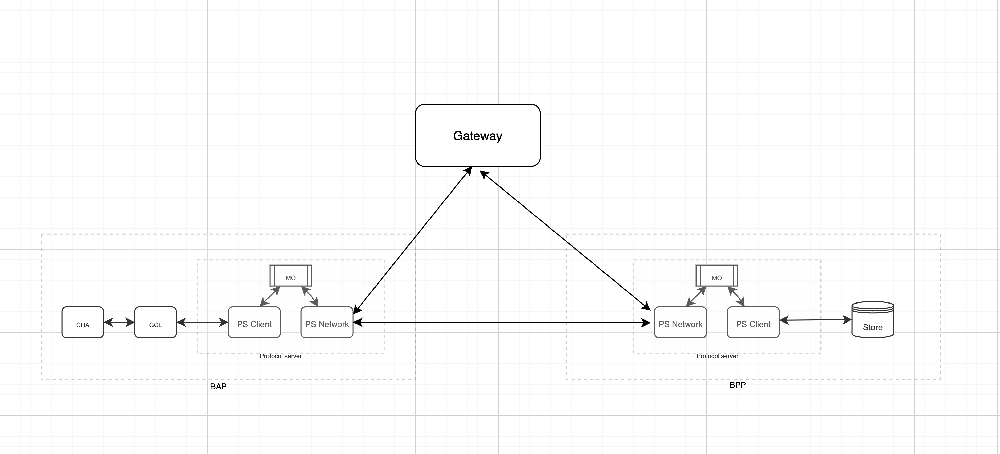

### Rest of the Endpoints

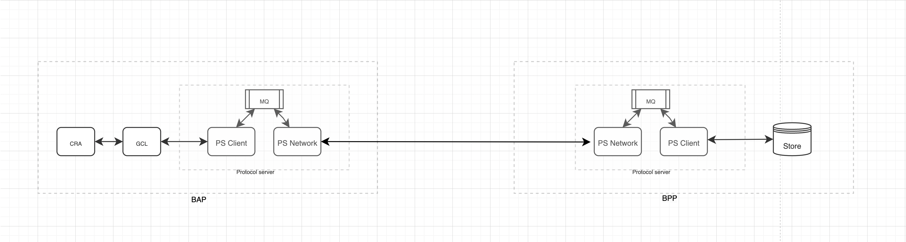

### Points to note

1. Search is the only endpoint where gateway is utilized
2. BAP network do a look up for all the available gateways and send the search request to 1st working gateway.
3. Once the gateway receives the request, it broadcast the request to all the possible BPPs
4. BPPs with available and relevant catalogs sends the catalogs to the BAP using on_search request

## Understanding the sequence and the logs

### Points to Note

- An acknowledgment is sent by the receiver in both forward and reverse flows.
- Only difference between search endpoint and others is the involvement of the gateway
- We are going to mention the flow of search below, others can be similarly understood by just removing the role of gateway
- Network participants interacts with each other using the action api (search, select, confirm) in forward flow and on_action apis (on_search,on_select, on_confirm) in reverse flow
- message_id statys the same for 1 whole interaction and can be used to track down the logs in both forward and reverse flows

## Forward flow

### Stage 1 - BAP-PS-Client

This is the first step in the whole forward flow. Protocol server can be divided into 2 parts

1. Client PS
2. Network PS

And this exist on both sides BAP and BPP

In this stage the request initiated from buyers side either through postman or any other client/user app hits the client part of BAP Protocol server.

Below is the screenshot provided for the first log that you will encounter related to a single end-to-end transaction.

Request from client log represents the request coming from an external buyer’s client (postman or any other app capable of making api calls)

Rest of the log is the payload coming from client  

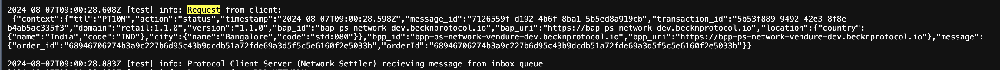

### Stage 2 - BAP-PS-Network

In this stage, after verifying the request BAP-PS-Client forwards the request to BAP-PS-Network which is the network part of BAP protocol server.

Following are some examples logs encountered 

1. Recieving messages from outbox queue

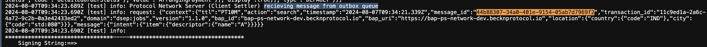

The network part of the protocol server gets the request from the client part using the rabbit mq (messaging queue)

YOU CAN TRACK THE REQUEST USING THE MESSAGE ID

1. Preparing the headers
    
    In case of search headers are prepared and a list of available gateways is fetched so that search request can be forwarded to first working gateway*
    
    In case of other request, gateway is not included as all these requests are p2p i.e the bap-netowork directly interacts with bpp
    
    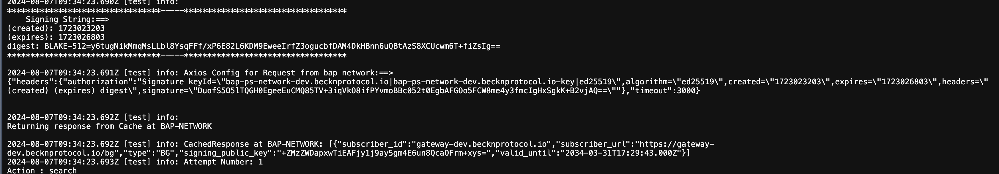
    
2. Request is sent to the gateway and it keeps on sending request until it finds a working gateway
    
    
    A working gateway will send status:ACK as a response to our request
    

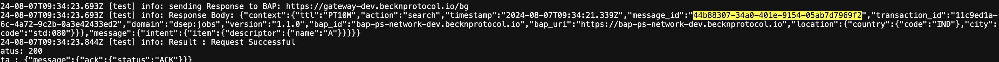

### Stage 3 - BPP-PS-Network

1. In case of search we will see a log `Request from BG`   . Again I am tracking everything using the message id. Message id stays the same for the whole journey.

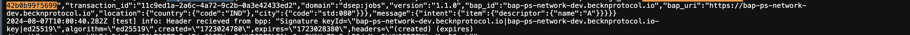

1. Validating the header and signature that exist inside the header
    
    As beckn follow the private-public key architecture. At every step the request is validated using the public key and the signature string is provided in the request header
    
    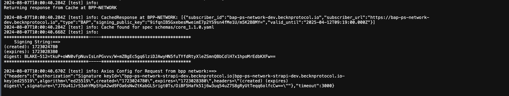
    

### Stage 2 - BPP-PS-Client

1. Bpp client gets the request from BPP network and then send the request to a webhook (Datastore). In response to this bpp client gets an acknowlegement in positive scenario

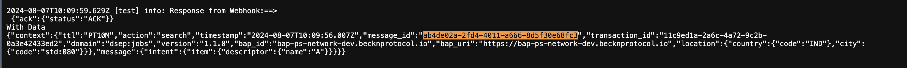

## Reverse Flow (on_action endpoints are used for all the communication)

### Stage 1 - BPP-PS-Client

1. Once we get the data from the datastore through the webhook(It calls the on_action api ), bpp client prepare a request and then send it to bpp network.

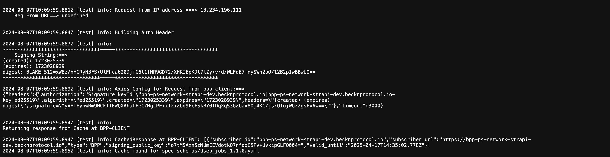

### Stage 2 - BPP-PS-Network

1. After getting the request from bap client, bpp network prepare the axios config with all the essential headers
    
    
    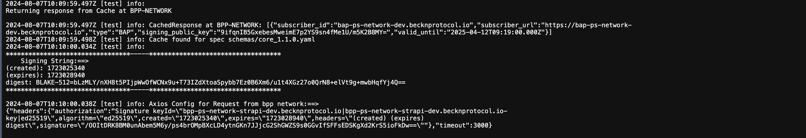
    

1. Once the axios request has been prepared, bpp network send the data to bap network. The initial log will be something like `sending Response to BAP: https://bap-ps-network-dev.becknprotocol.io` . Attaching the screenshot below for the whole logs
    
    
    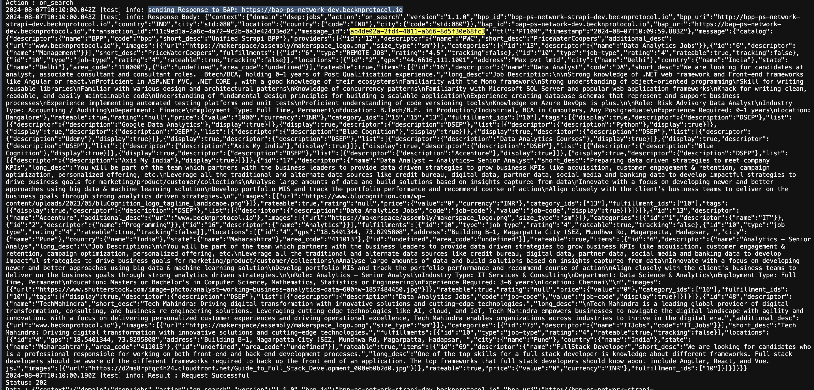
    

### Stage 3 - BAP-PS-Network

1. Bap network gets the request from Bpp network with the data and send the ack back. Request from BPP network

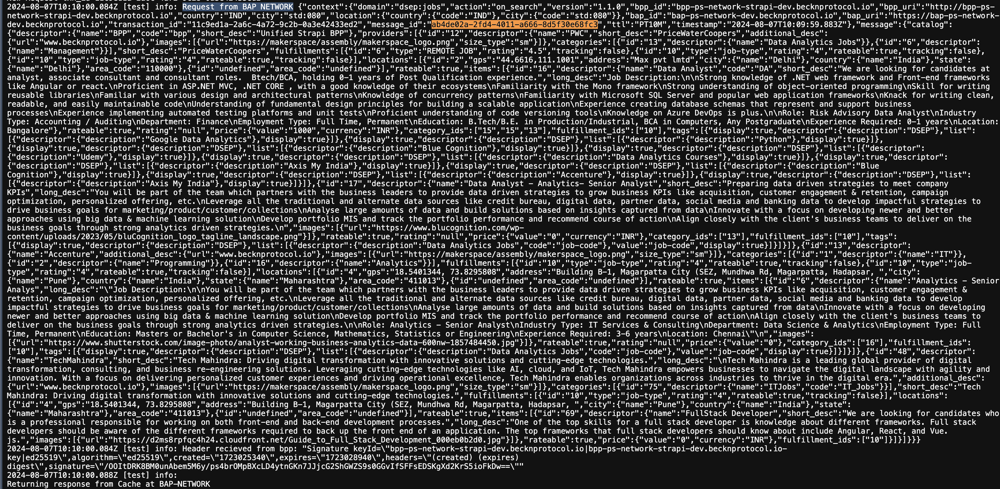

1. Bap network uploads the data or send the data to Bap client using Rabbit mq. You can check the log starting with something like `Sending response from BPP to inbox queue`
    
    Bap client and network and bpp client & network interacts with each other using a message queue call Rabbit mq. Uploading the screenshot for the whole log
    
    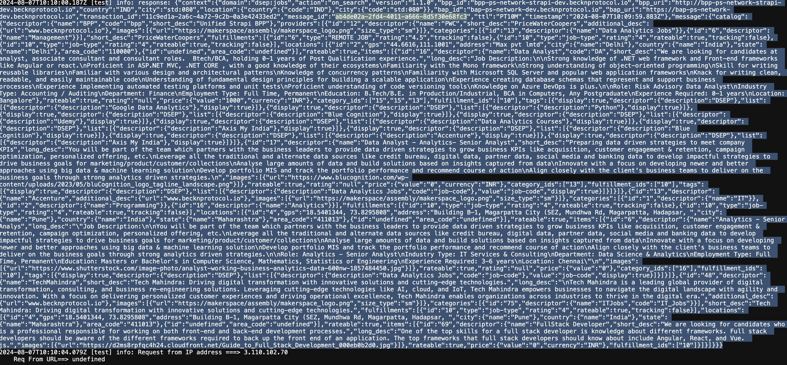
    

Stage 4 - BAP client

Bap client gets the data from Bap network throught rabbit mq. You can see a log on bap client something similar to `recieving message from inbox queue` . The whole log will look like below. Also pasting the screenshot

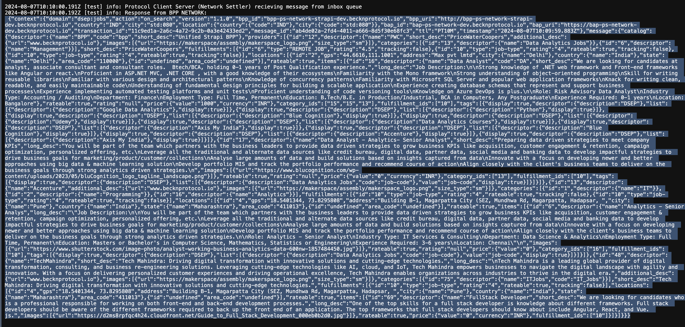

It send the data using on_action api to the client after this

## Some common question

### **I send a search request from BAP, but did not get a response, how do i troubleshoot the issue**

You need to follow the closest first strategy and start checking the logs from bpp client and move forward until you find the root cause. You can follow the order in which we explained the logs in this document

### I send a search request i got a NACK

NACK means that the request was not acknowledged by the reciever. In most scenarios you will get the reason in the response along with NACK status. You can use that message for debbuging the issue. Most likely there is something wrong with the payload you are sending or in the request itself. You can follow the step approach in this scenario also. Just check the logs of the closest entity.

For example if you requested the bap-client ps using postman and got a NACK. In case you don’t get the error details in the body, you can also check the bap client logs

### I send a search request, i got a schema validation error

You can check whether your payload follows the beckn specification. The error details might also be mentioned inside the response data. You will need to fix your payload