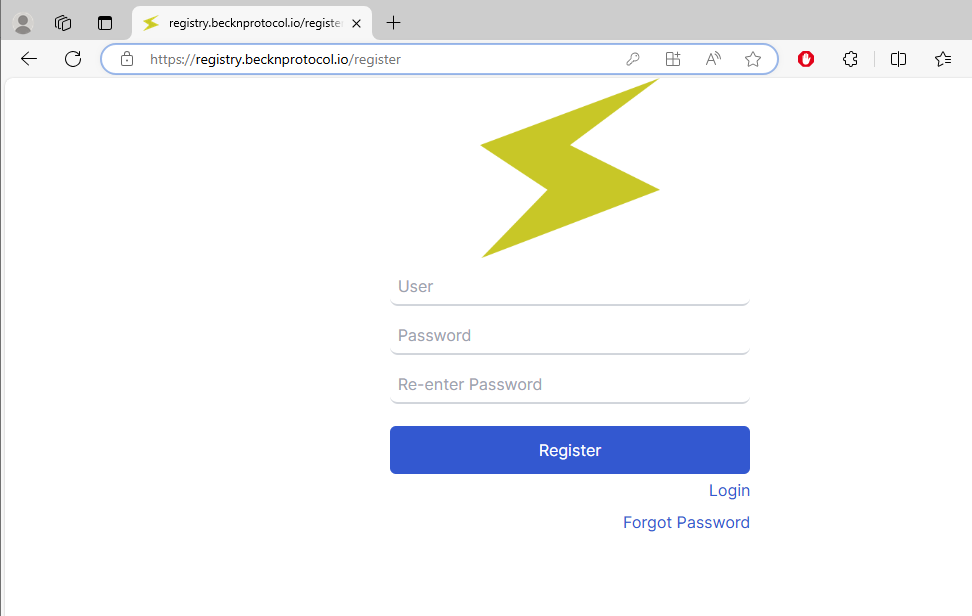
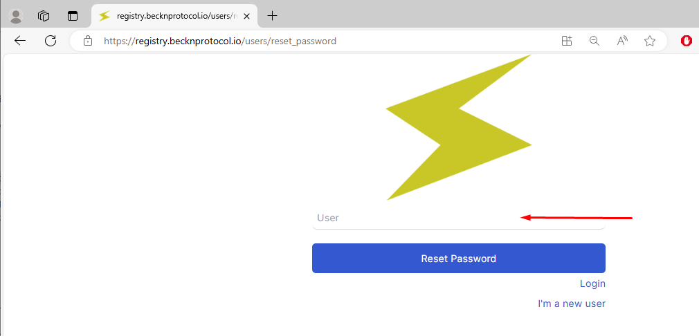
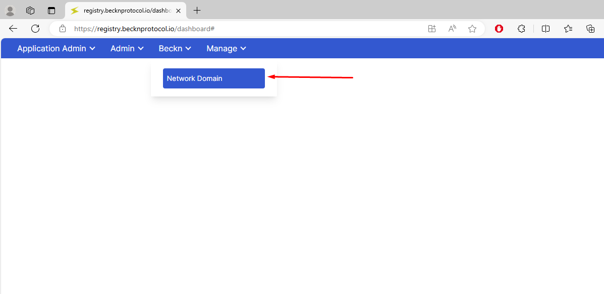
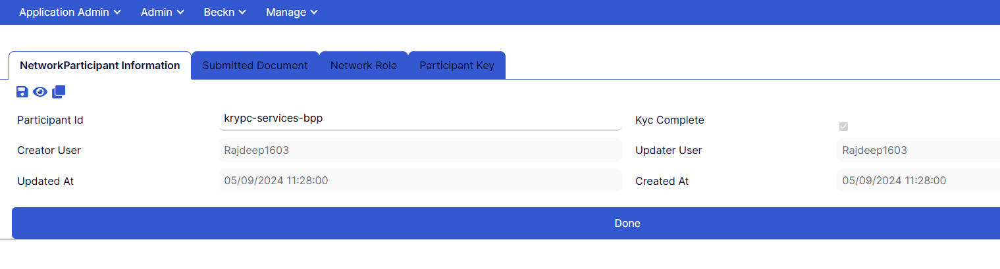
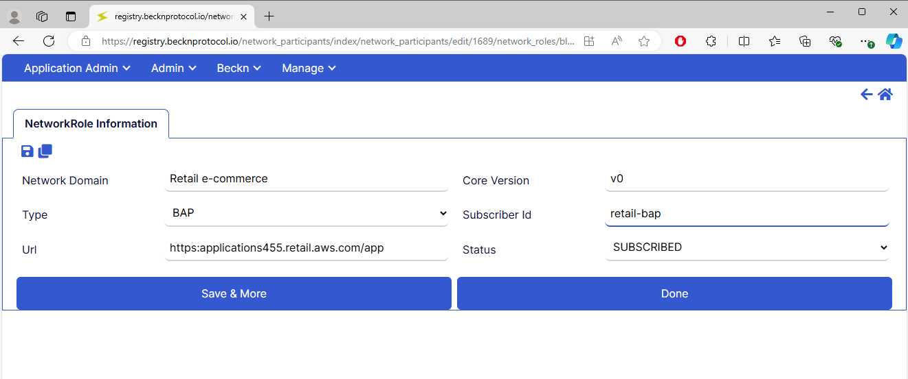
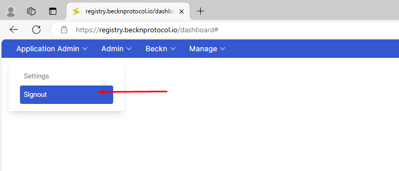

# Beckn Registry User Guide

In the Beckn ecosystem, the Registry serves as the foundational component for setting up a new network. The Registry is where all network participants register their public keys, and it acts as a lookup endpoint, enabling participants to discover and validate each other within the network.

## Create an Account

To create an account on the Beckn Registry, use the following link:

[Register](https://registry.becknprotocol.io/register)

## Login

Once your account is created, log in using the link below:

[Login](https://registry.becknprotocol.io/login)

## Forgot Password

If you forget your password, reset it by selecting the "Forgot Password" option on the login page. Enter your user details to proceed. If you encounter any issues, contact the Admin.

[Forgot Password](https://registry.becknprotocol.io/login)

## Create New Network Domain

1. Click on the "Beckn Menu" located on the toolbar and select "Network Domain" from the dropdown.

   

2. A list of already added network domains will appear. Click on the "Add New" option.

   

3. Fill in the "Name" and "Description" fields, then click "Save" and "Done."

   **Note:** The "Schema URL" field holds the URL of the protocol specification file, which outlines the technical standards and details that the system follows.

   

4. You can view, edit, duplicate, or delete the added domain by selecting the respective options.

   

## Create/Edit/View Network Participant

1. You will see a list of already added network participants.

   

2. Click on "Add New" to add a participant. You can also search for an existing network participant.

   

3. Enter the "Participant ID" and click "Save" and "Done."

   **Note:** The "KYC Complete" checkbox reflects the KYC (Know Your Customer) status. Documents can be submitted for verification in the 'Submitted Documents' tab, but the system allows participants to mark it complete by default. No further user action is needed.

   

4. The network participant record will be added to the list. You can now edit the record for further actions.

   

## Create/Edit/View Network Role

1. From the "Admin" menu bar, select "Network Participant" and choose the participant to which a role needs to be added.

2. Click "Edit," navigate to the "Network Role" tab, and click "Add New."

   

3. Choose the "Network Domain" from the dropdown, fill in the required fields, and click "Save" and "Done."

   **Notes:**
   - **Core Version:** This indicates the Beckn specification version supported. Currently, no validation against the Beckn Spec version is enforced, though it may be in the future.
   - **Status:** This shows the network role's current status, typically 'Initiated' or 'Subscribed.' No user action is required for other options.

   

4. In the "Operation Region" tab, specify the geographic region where the network participant operates. If operating globally, leave the field blank.

   

## Create/Edit/View Participant Key

1. Under "Network Participant," select the participant to edit.

2. Click on the "Participant Key" tab and click "Add New" to add a key.

   

3. Enter the "Key ID," "Signing Public Key," "Encryption Public Key," and other details. Select the "Valid From" and "To" dates, mark the "Verified" checkbox, and click "Save" and "Done."

   

4. The participant key record will now be displayed in the list.

   

## Logout

To log out, select "Admin" from the menu and then choose "Logout."

