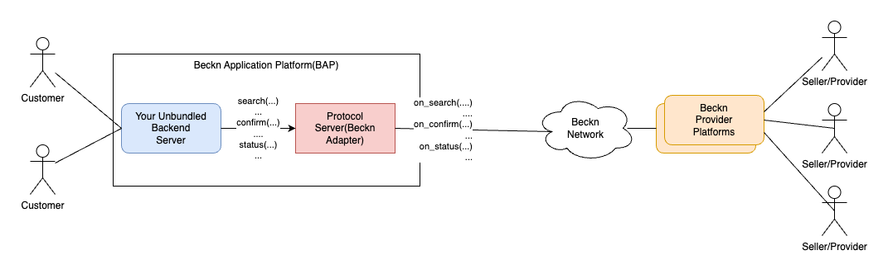
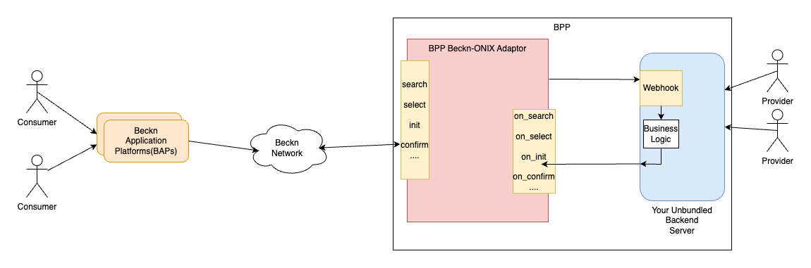

# Beckn Starter Kit

## Table of Contents

1. [Glossary](#glossary)
2. [Overview of Steps for Network Participants](#overview-of-steps-for-network-participants)
3. [Introduction to Open Networks](#introduction-to-open-networks)
4. [Introduction to Beckn Protocol](#introduction-to-beckn-protocol)
5. [Learning Resources](#learning-resources)
6. [Getting started with Beckn - NP's perspective](#getting-started-with-beckn---nps-perspective)
7. [Network Participant's journey](#network-participants-journey)
   7.1 [Unbundling the platform](#unbundling-the-platform)
   7.2 [Seeker Platform's journey](#seeker-platforms-journey)
   7.3 [Provider Platform's journey](#provider-platforms-journey)
8. [Network Facilitator's journey](#network-facilitator-journey)
9. [Going to Production - Network Participants](#going-to-production-network-participants)
10. [Beckn FAQ](#beckn-faq)
11. [Seeking Help](#seeking-help)
12. [Resources](#resources)

## Glossary

- **Beckn APIs:** APIs that are part of the Beckn protocol specifications and responsible for enabling two platforms (consumer & provider side) to discover & transact with each other in an Open Network. (Discovery-Order-Fulfillment-Post-fulfillment)

- **Beckn Application Platforms (BAP):** A consumer-facing infrastructure that captures consumers’ requests via its UI applications, converts them into Beckn-compliant schemas and APIs at the server side, and fires them at the network.

- **Beckn Gateway (BG):** Extremely lean and stateless routing servers. The purpose of this infrastructure is to optimize the discovery of BPPs by the BAPs by merely matching the context of the search.It multicasts search requests from the BAP to relevant BPPs.

- **Network Participants (NPs):** In the context of an "open network," a network participant typically refers to any individual, entity, or device that interacts with or is connected to the network.

- **Protocol Server:** Reference implementation of a Beckn Adapter. Beckn Adaptor helps Network Participants connect to Beckn Network. It performs functions of validation, authentication and assist communication between network participants.

- **Sandbox:** A controlled and isolated environment where software applications, code, or processes can run and be tested without affecting the broader system or other applications. Think of this environment as a playground.

- **Open Network:** A type of network characterized by its accessibility and inclusivity, where the infrastructure, protocols, and standards are available to a wide range of participants without restrictions.

## Overview of Steps for Network Participants

1. **Step 1:** Build understanding on Beckn protocol - Refer to the ["Introduction"](#introduction-to-beckn-protocol) section.

2. **Step 2:** Identify the sector or domain you want to solve the Discovery-Order-Fulfillment-Post Fulfillment (DOFP) for (e.g., Health, Mobility, Energy, Skilling, Agriculture).

3. **Step 3:** Define the role your platform will play as a Network Participant on an Open Network (BAP or BPP or a TSP).

4. **Step 4:** Define and visualize the outcomes you want to achieve with the selected Network Participant role using the "Outcome Visualization template".

5. **Step 5:** Register your platform on the Beckn sandbox by registering on the Beckn Registry for testing against other Network participants. The network facilitator will provide with

6. **Step 6:** Deploy ONIX as a prerequisite pre-API integration step and set up the protocol server for API integration and testing.

7. **Step 7:** Map your platform schema with the Beckn API schema relevant to the transaction.

8. **Step 8:** Refer to the domain-specific Implementation guide to integrate the Beckn API as per the selected Network Participant role.

9. **Step 9:** Test with Postman collection and against the protocol server.

10. **Step 10:** Test with other NPs on the network for one complete DOFP flow in the Beckn sandbox.

11. **Step 11:** Prepare for Go Live access if a live network instance is set up or ready.

## Introduction to Open Networks

Open networks allows **interoperability** and collaboration between different participants on the network. It is a powerful force and has boosted innovation and growth wherever it has been adopted. Starting with the internet , from http for information transfer to smtp for email, the web is full of examples of open networks and protocols.

While web as a network is open, the **economy on the web** has not been so. It is filled with platforms that centralise control. **Beckn** is an **open digital infrastructure** that allows creating of unbundled and decentralised digital market and an open playground for all commerce participants.

Beckn allows consumers, governments and business to unlock markets by enabling direct interactions among them while leveraging the power of the internet and other digital infrastructure. It is a set of **open specifications** that allow creation of open networks enabling commerce aware communication between participants. It helps transition from a platform based ecosystem to a open-protocol and open-network based interoperable ecosystem.


## Introduction to Beckn Protocol

Beckn protocol specification consists of the core APIs, the core schema, layer 2 schema, the communication protocol and the authentication and contract components.

> [!TIP]
> More on [Beckn Protocol Specification](https://developers.becknprotocol.io/docs/introduction/beckn-protocol-specification/)

### Core APIs

The **Core APIs** include **transaction APIs** that cover the **discovery, order, fulfillment and post-fulfillment** phases of an order lifecycle and are **asynchronous**.

Every end-to-end commerce transaction can be categorized through these four stages:

- **Discovery** — involves searching for a provider or a catalog. Once the catalog is retrieved, one can browse the catalog using various filters and parameters.

- **Order** — the consumer constructs the order by selecting various items or offers from a catalog; billing and shipping details are supplied, as well as any supporting credentials if required. A confirmed order marks the end of this stage.

- **Fulfillment** — the actual fulfillment of the order. This consists of events like delivery, tracking and, occasionally, cancelation. The completion of the delivery of an order marks the end of this stage.

- **Post-Fulfillment** — activities like providing rating, contacting support, or initiating a return


All transaction APIs are asynchronous, which means that the requested information is not returned immediately in the same session and that there is a callback mechanism in place through which it is obtained.


> [!TIP]
> More on [Core APIs](https://developers.becknprotocol.io/docs/introduction/transactional-layer/)

### Core Schema

The **Core Schema** specifies the structure of data in the commerce interactions and is written in the **OpenAPI** 3.0 specifications. It serves the purposes of validation and documentation. The schema organizes that data that is passed in each of the Core APIs into a several hierarchical component levels.


### Layer 2 Schema

Layer 2 Schema through taxonomies add domain-specific attributes to the elements of the Core schema. Also they provide a way to add additional network facilitator (defined below) defined rules to the Core Schema. It is achieved through definition of enumerations, required fields, allowed and default values, conditional schemas etc.

### Network Actors

The **primary actors** in Beckn-enabled networks include the

- Consumer facing platforms called **Beckn Application Platforms(BAP)**. A Beckn Application Platform (BAP) is a consumer-facing infrastructure which captures consumer's requests via its UI applications, converts them into beckn-compliant schemas and APIs at the server side, and fires them at the network.
- Seller facing platforms called **Beckn Provider Platforms(BPP)**. These are the platforms that maintain an active inventory, one or more catalogs of products and services, implement the supply logic and enable fulfillment of orders. The BPP can be a single provider with a Beckn API implementation or an aggregator of merchants.
- Registration platforms with data about network participants - **Registry**. The Registry has details on all network participants including their public key. Any receiver of an API request must authenticate the sender by looking up the network registry and verify the signature of the sender through the sender’s public key.
- Routing infrastructure called **Beckn Gateway** used during discovery phase(search). BGs are extremely lean and stateless routing servers. The purpose of this server is to optimize discovery of BPPs by the BAPs by merely matching the context of the search. The BG takes a request from the BAP, determines to which BPPs the message needs to be sent to (by looking up the registry) and multicasts the message only to them.

Usually the registry and the gateway are part of the network infrastructure and maintained by organisation called as **Network Facilitators**. Network Facilitators manage and govern the network. They help on-board network participants onto the network and can control who can transact on the network.

Similarly at organisation level, another actor in the ecosystem could be Technical Service Providers. These are organisations that might help the other Network Participants help setup and get onto Beckn Networks. Network participants can get onto Beckn Network themselves, following guides such as this document and other resources. Else they can take the help of TSPs for this purpose. This document assumes network participants are onboarding themselves onto the Beckn network.


> [!TIP]
> More on [Beckn Network Actors](https://developers.becknprotocol.io/docs/introduction/transactional-layer/)

## Learning resources

Use the following resources for a deeper understanding of the Beckn Ecosystem

- [Introduction to Beckn By Ravi Prakash - Video Playlist](https://www.youtube.com/watch?v=7Otfcy37-NE&list=PLBC6c8MLy9uVUIb1BOgdOa8tP4rX6c4aK&index=1) For a comprehensive understanding of the Beckn protocol, its origin, concepts and implementation details, refer to this Video Playlist by Ravi Prakash, a co-author of the Beckn Protocol.
- [Beckn Developers Guide](https://developers.becknprotocol.io/docs/introduction/introduction/) The Beckn Developers Guide, gives developers a quick overview of Beckn Protocol, the various components in the network, the APIs, schemas etc.
- [Beckn-ONIX installation videos](https://drive.google.com/drive/folders/1PJ6NMXu7abAO3omXlBHro5qtke8DPCbM?usp_dm=false). This link has detailed videos on Walkthrough of Beckn ONIX installation

## Getting started with Beckn - NP's perspective

[Beckn](https://github.com/beckn) is an open protocol that facilitates commerce transactions on open interoperable networks. This document guides participants new to the network to get up and running.

### Different Roles in an Open Network

#### Beckn Application Platforms (BAP)

**Description**: Beckn Application Platforms (BAPs) serve as the seeker or consumer side platforms in the network. They provide the interface for consumers to access information, products, or services from various sources.

**Key Characteristics**:

- Acquires customers as users
- Does NOT maintain an active inventory
- Provides a rich “resource-seeking” and buying experience
- Interfaces with Beckn Provider Platforms (BPPs) and Network Facilitators to place orders, track status, etc.

#### Beckn Provider Platforms (BPP)

**Description**: Beckn Provider Platforms (BPPs) operate on the supply side of the network. They maintain active inventories and catalogs, implement supply logic, and enable the fulfillment of orders.

**Key Characteristics**:

- Acquires businesses/service providers as users
- Maintains an active inventory/catalog of products or services
- Provides a rich “resource-providing” experience
- Interfaces with Beckn Application Platforms (BAPs) and Network Facilitators to publish catalogs, create orders, etc.

#### Network Facilitator

**Description**: Network Facilitators enable other organizations to join the network through technology, business, or onboarding services.

**Key Characteristics**:

- Provides technical, business, or onboarding services
- Facilitates other participants in joining and operating within the network

#### Technical Service Provider (TSP)

**Description**: Technical Service Providers (TSPs) offer specific technical solutions or support to network participants, such as hosting, integration, or development services, etc.

### Identify Your Role

Selecting your role within the Beckn network is the first step in your journey. Your role will define how you interact with other participants and what value you bring to the network.

- **Beckn Application Platforms (BAP)**: If you operate on the consumer side, facilitating access to services without maintaining an inventory.
- **Beckn Provider Platforms (BPP)**: If you manage inventories and supply products or services.
- **Network Facilitator**: If you help other organizations join and operate on the network.
- **Technical Service Provider (TSP)**: If you provide technical solutions or support to other network participants.

### Define Your Requirements and Success Definition Clearly - Outcome Visualization

This step is crucial for network participants to define the use cases they wish to enable on the network and to visualize the desired outcomes.

- **Identify the Use Case**: Determine the specific use case you want to enable on the network, such as a particular type of transaction, service, or user interaction.
- **Craft the End-to-End Transaction Flow**: Define the complete flow for an end-to-end transaction, from discovery to post-fulfillment.
- **Pick Relevant APIs**: Select the APIs applicable to your use case, ensuring they align with the intended user experience and functionality.

This process helps in scoping out the necessary functionality, UI, and backend integration requirements to enable an end-to-end transaction on the network.

_Refer to the [Outcome Visualization Template](https://docs.google.com/presentation/d/14OLgjGIVQnexu-MvtpY9Y87r1fQOPUOQU_ip1MMWIrw/edit#slide=id.g243ea7a9558_0_218) for detailed guidance._

### Map Your Journey as per the Role Selected & Outcome Visualization

After identifying your role and visualizing the outcomes, map out your implementation journey.

- **For Beckn Application Platforms (BAPs)**
- **For Beckn Provider Platforms (BPPs)**
- **For Network Facilitators**
- **For Technical Service Providers (TSPs)**

These steps will guide you through your integration process based on the role you have chosen.

## Network Participant's journey

### Unbundling the platform

If you are coming in with a platform that you already have, then probably it will have the following structure.

- A consumer service(app) that lets consumers search and initiate orders.
- A supplier/provider service(app) that lets suppliers get and fulfil orders.
- The platform itself connecting the two.

This is the high level picture of most platforms. The proposition that Beckn brings to the table is that by unbundling the consumer and the supplier side functionalities and having the network match the supply and demand instead of the platform, you open up opportunities to new customers and suppliers. The following diagram shows an example of unbundling in the Mobility space.


### Seeker Platform's Journey

As a Seeker Platform after you unbundle your Seeker side application you will probably have a customer facing application with a backend server providing the following:

- Ability to let customers discover an item or service
- Ability to let customers add items to cart or compose the order
- Ability to let customers order item or service
- Ability to let customers pay for the order
- Ability to let customers track the order to fulfillment
- Ability to let customers leave feedback on items, services and orders.

This unbundled application will now have to connect to the Beckn network for discovery, supply demand matching and communication with providers. **Beckn protocol** defines APIs, authentication and message format to help participants connect to the Beckn network. These APIs cover all aspects of **Discovery, Order, Fulfillment and Post Fulfillment** that are required in commerce tansactions. You can use an Adapter that implements the Beckn protocol to make your task easy. Beckn-ONIX initiative provides a reference implementation of such an adapter and is called the Protocol Server. The following diagram illustrates how your unbundled application might look when connected to the Beckn network



After unbundling, you will be calling the various API endpoints of the **Beckn Adapter** (The word Beckn Adapter and the reference implementation, Protocol Server[explained below] are used interchangeably in this document) to send messages to the Beckn Network. Internally, the Protocol Server is architected as two App servers. One (BAP-Client) exposes endpoints towards the client(you) while the other (BAP-Network) talks to the Beckn network.

For example if the user inputs his intent in the UI, you will have to translate the input into a format expected by the Search API and call the search API of the Protocol Server Client. By default the Protocol Server is configured to wait for the search results (it aggregates all the responses from the different providers) and return it back in the response, synchronously. (In advanced configurations this can be configured to be also asynchronous). You then proceed to show the search results to the user.

So one of the main tasks that needs to be done is to convert your inputs into Schema required by Beckn messages. This is called **Schema mapping** and we will come back to it soon.

In the diagram above and the explanation, we mentioned Beckn Adapter. The Beckn Adapter helps your backnend server send Beckn Requests to the Beckn network. Some of the functionalitites that are handled by it are

- Exposing REST endpoints that your application can call for the various order phases (search, select, init, confirm, status, cancel etc)
- Validating the requests sent by you to be complaint to Beckn core specification as well as any additional rules specified by the network operator (Layer 2 config)
- Signing the request with a private key, so it can be verified by the receiver using your public key
- Exposing on_xxxxx(on_search, on_select etc) endpoints on the Beckn Network side, so the BPPs can call it back with responses
- Waiting and aggregating responses in a synchronous fashion (Beckn by default relies on asynchronous messages. The Beckn Adapter wrap this in a simple call to make your application task easy)
- Reply back with ACK / NACK messages required by the protocol
- Provide logging, observability and other network operation functionality.

As you can see above, the use of Beckn Adapter reduces the burden on your application development significantly. Beckn-ONIX comes with a reference implementation of the Beckn Adapter called the Protocol Server.

#### Implementation Guide

As we saw in the previous section, the primary task in Seeker Application development will be to

- understand the message flow and data required to be sent in each message
- map that data to the Beckn schema for each message.
- similarly map the Beckn schema from response to extract the data we need

To help you with this task, the community and network facilitator will release implmentation guide for various domains, use cases and networks. Choose the right implementation guide for your case before proceeding further.

The implementation guide will contain the following sections:

1. It will explain the overall domain, the various use-case categories
2. Detailed use cases along with message flow diagrams
3. Example data and mapping to the Beckn Schema for the various messages required for each usecase category
4. Layer 2 Configuration file required to be installed for that network (more on this later)
5. Details on sandbox support (for seeker application developers) and postman collection (for provider application developers).

You can find some sample implementation guides [here](https://github.com/beckn/missions/blob/main/starter_kit_new/implementation_guides.md)

#### Open Source Assets

##### Protocol Server

The primary asset that will help the Seeker Application developers is the reference implementation of the Beckn Adapter called as the **Protocol Server**. This is available in the Beckn-ONIX reference implementation suite.

> [!NOTE]
> Based on our requirement the same Protocol Server application can be configured in two modes
>
> 1. BAP Protocol Server
> 2. BPP Protocol Server

Since we are building the Seeker platform we will be installing the protocol server in the BAP mode and is referred as the BAP-Protocol Server in the diagrams and during installation.

In the "Unbundle your platform" section, we saw the tasks performed by any Beckn Adapter. The Protocol Server performs all of these tasks. Internally, the Protocol Server is architected as two App servers. One (BAP-Client) exposes endpoints towards the client while the other (BAP-Network) talks to the Beckn network. The following diagram shows the structure of the BAP Protocol Server.


In addition to sending messages in the Beckn format, another key task the Protocol Server does with the messages is sign it so the receiver can verify that the message is originating from the indicated source and has not been tampered with. It signs the message with its private key and attaches a signature to the header. The receiver will lookup the registry for the public key of the sending participant and verify the signature. Refer to this [document](https://github.com/beckn/protocol-specifications/blob/master/docs/BECKN-006-Signing-Beckn-APIs-In-HTTP-Draft-01.md) for more details. The image below shows the format of the Authorization header that goes with a signed message.


The BAP Protocol Server exposes the following endpoints which your app can call

    - search, select, init, confirm, status, cancel, track, support, update, rating

These cover the Order transaction lifecycle (Refer to the image in the Introduction to Beckn section on how these map to the order lifecycle). The default implementation of the BAP Protocol Server will work sychronously and will return back when it has the answers from the network or times out.

#### Becknifying your application

With the help of the implementation guide, you start your implementation by

- Identifying the Beckn messages you will call on the BAP PS Client.
- Mapping the data from the customer into the data to be sent with the Beckn messages
- Mapping the data received from the network into the UI to be shown to the user.

With this done, you are ready to integrate your application to the Beckn network.

##### Installing Protocol Server with Beckn ONIX.

- The repository for Beckn-ONIX is [here](https://github.com/beckn/beckn-onix). Use the Installation Guide there for more details on the steps below. Some of the steps here are extracted from the installation guide.

##### Prerequisite

1. When we connecting our seeker app to the Beckn network, we are connecting as a Network Participant of the type BAP. In order for any other network participant to reach us, we need to have a publicly accessible URI for the BAP. This is also called as **Subscriber URI** in documentation. Similarly we need a ID for the BAP called the **Subscriber ID**. Typically (as convention) if we our primary domain is called "example.com", the BAP URI will be "https://bap-network.example.com" and the BAP ID will be "bap-network.example.com".
2. Create two subdomain entries. One as shown above for the BAP PS Network (https://bap-network.example.com) and another for BAP PS Client (https://bap-client.example.com). The URL for the BAP PS Client is optional in production as usually it and its caller (your Customer app backend server) can stay in the same VPC and you do not need any public URL. For the sake of this document, we will continue to have two web addresses.
3. Identify the system on which you will install the BAP Protocol Server. Usually this will be in the same VPC as the Customer App Backend server.
4. When we install the Protocol Server, BAP Protocol Server Client will run on port 5001 and BAP Protocol Server Network will run on port 5002. So we need to configure a reverse proxy on this machine, so the following mapping is done.

- BAP Client URI (e.g. https://bap-client.example.com) is mapped to port 5001
- BAP Network URI (e.g. https://bap-network.example.com) is mapped to port 5002

##### Installation

Use either the GUI or the CLI to install the Protocol Server BAP software. The following commands start the CLI installation.

```
$ git clone https://github.com/beckn/beckn-onix.git
$ cd beckn-onix/install
$ ./beckn_onix.sh
```

During installation, you are asked for three pieces of information.

1. Registry URL - The registry of the network you want to join. This information will be in the implementation guide. (During installation notice the instructions to see if we need to suffix /subscribers to the registry address)
2. Subscriber ID - The subscriber ID for the BAP Protocol Server (you decided in the Prerequisite section)
3. Subscriber URL - The subscriber URL for the BAP Protocol Server (you decided in the Prerequisite section)

The installation will install the Protocol Server and other required support software and register it with the registry.
The next step will be to install the required layer 2 configuration file (This process might be integrated into the installation soon). The link to this file will be in the implementation guide. Run the following command and paste the link when asked.

```
$ cd ../layer2
$ ./download_layer_2_config_bap.sh
```

Once this is done, you might have to contact the network facilitator to get yourself approved as a Network Participant.

##### Testing the installed protocol server using Postman

In case you want to test the installed Protocol Server before you integrate it with your application, you can do so with Postman. The implementation guide will have the required Postman collection. You can also find a bunch of Postman collections for different domains [here](https://github.com/beckn/beckn-sandbox/tree/main/artefacts).

Within each postman collection, there are usually collection variables defined. Change these variables, to change the following.

- The bap_subscriber_id should be the Subscriber ID from above (e.g. bap-network.example.com)
- The bap_subscriber_url should be the Subscriber URL from above (e.g. https://bap-network.example.com)
- The base_url should be the address of the BAP PS Client (e.g. https://bap-client.example.com)

The following diagram shows how Postman connects to your seeker side app. Further it also shows the existance of a Sandbox. Sandbox is a mock Seller side platform that is usually present in most trial networks and can help you to verify your Seeker Side application without having to write a corresponding Provider side application.


##### Replacing postman with your own app backend

Once you have tested with Postman, it is time to test directly calling the Protocol Server Endpoints from your application. You will be sending the Beckn requests (search, select etc ) to the BAP PS Client address (e.g. https://bap-client.example.com/search, https://bap-client.example.com/select etc). By default the BAP PS is configured to wait for response from the network and return back the responses synchronously.

> [!TIP]
> Use the following [troubleshooting guide](../troubleshoot.md) when you run into problems.

### Provider Platform's Journey

As a Provider Platform after you unbundle your Provider side application will probably have a supplier facing application with a backend server providing the following:

- Ability to return back catalog on search requests
- Ability to support order creation
- Ability to reconcile payment transaction details
- Ability to fulfill orders
- Ability to send order status
- Ability to cancel/update orders as required by user
- Ability to provide support and tracking information
- Ability to store rating and feedback

This unbundled application will now have to connect to the Beckn network to provide these functionalities to the customer. The tasks that Providers have to do to keep the catalog upto date, inventory management, setting shop policies etc, are not covered by Beckn. Beckn only covers the catalog and order management tasks towards the customer side.

**Beckn protocol** defines APIs, authentication and message format to help participants connect to the Beckn network. These APIs cover all aspects of **Discovery, Order, Fulfillment and Post Fulfillment** that are required in commerce tansactions. You can use an Adapter that implements the Beckn protocol to make your task easy. Beckn-ONIX initiative provides a reference implementation of such an adapter and is called the Protocol Server. The following diagram illustrates how your unbundled application might look when connected to the Beckn network



After unbundling, you will be listening to an endpoint in your software (called as webhook). On this endpoint you will receive all the Beckn messages (search, confirm, status etc). When you receive any such message, you have to do the following:

- Broadly check if the message is structurally alright and return back an HTTP 200 message with the following message `{ message: { ack: { status: 'ACK' } }`
- Process the message (e.g if it is a order confirmation - confirm message, create order in database, trigger payment verification etc ) and compose a response (e.g. on_confirm).
- Call the corresponding endpoint (e.g. on_confirm) on the **Beckn Adapter** (The word Beckn Adapter and the reference implementation, Protocol Server[explained below] are used interchangeably in this document).
- The Beckn Adapter will take care of returning the response message to the BAP(Customer facing App Platform) that sent the original message. The BAP will inform the user of order confirmation.

So one of the main tasks that needs to be done is to extract the data from Beckn Requests and similarly to map our data into Beckn Responses. This is called **Schema mapping** and we will come back to it soon.

In the diagram above and the explanation, we mentioned Beckn Adapter. The Beckn Adapter helps your backnend server communicate with the Beckn network. Some of the functionalitites that are handled by it are

- Calling your API server endpoing (webhook) when messages are sent to you on the Beckn Network
- Validating the requests sent to you and your responses to be compliant to Beckn core specification as well as any additional rules specified by the network operator (Layer 2 Config)
- When you receive a message from another participant, it verifies if the message was indeed from the said participant and has not been tampered. It uses the copy of the sender's public key present in the registry to do this.
- When you callback a response (e.g. on_select, on_confirm etc), it will sign the message with your private key and forward it to the recipient
- Provide logging, observability and other network operation functionality.

As you can see above, the use of Beckn Adapter reduces the burden on your application development significantly. Beckn-ONIX comes with a reference implementation of the Beckn Adapter called the Protocol Server.

#### Implementation Guide

As we saw in the previous section, the primary task in Provider Application development will be to

- understand the message flow and data format received in each message to extract the data from the request
- After processing the request, map the data we need to send back to Beckn format

To help you with this task, the community and network will release implmentation guide for various domains, use cases and networks. Choose the right implementation guide for your case before proceeding further.

The implementation guide will contain the following sections:

1. It will explain the overall domain, the various use-case categories
2. Detailed use cases along with message flow diagrams
3. Example data and mapping to the Beckn Schema for the various messages required for each usecase category
4. Layer 2 Configuration file required to be installed for that network (more on this later)
5. Details on sandbox support (for seeker application developers) and postman collection (for provider application developers).

#### Open Source Assets

##### Protocol Server

The primary asset that will help the Provider Application developers is the reference implementation of the Beckn Adapter called as the **Protocol Server**. This is available in the Beckn-ONIX reference implementation suite.

> [!NOTE]
> Based on our requirement the same Protocol Server application can be configured in two modes
>
> 1. BAP Protocol Server
> 2. BPP Protocol Server

Since we are building the provider platform, this protocol server needs to be installed in BPP mode and is referred as the BPP-Protocol Server in the diagrams and during installation.

In the "Unbundle your platform" section, we saw the tasks performed by any Beckn Adapter. The Protocol Server performs all of these tasks. Internally, the Protocol Server is architected as two App servers. One (BPP-Network) listens on the Beckn network for messages meant for you, while the other (BPP-Client) will call your server endpoint (webhook) as well as expose response endpoints (on_search, on_select etc ) that your software can call. The following diagram shows the structure of the BAP Protocol Server.


In addition to sending messages in the Beckn format, another key task the Protocol Server does with the messages is sign it so the receiver can verify that the message is originating from the indicated source and has not been tampered with. It signs the message with its private key and attaches a signature to the header. The receiver will lookup the registry for the public key of the sending participant and verify the signature. Refer to this [document](https://github.com/beckn/protocol-specifications/blob/master/docs/BECKN-006-Signing-Beckn-APIs-In-HTTP-Draft-01.md) for more details. The image below shows the format of the Authorization header that goes with a signed message.


The BPP Protocol Server calls your Provider Platform Software endpoint (webhook url) with messages from the Beckn Network. The same endpoint is called for all messages. You can differentiate the message by looking at the context.action field of the message json. The action field will have the following values

```
  search, select, init, confirm, status, cancel, track, support, update, rating
```

These cover the Order transaction lifecycle (Refer to the image in the Introduction to Beckn section on how these map to the order lifecycle). The default implementation of the BAP Protocol Server will work sychronously and will return back when it has the answers from the network or times out.

You return back an ack, process these messages and callback the corresponding endpoint (on_search, on_select etc) on the BPP PS Client server.

#### Becknifying your application

With the help of the implementation guide, you start your implementation by

- Listening to the webhook url for messages from Beckn Network.
- Identify the sent message by looking at the context.action field. Return an ACK indicating that you will respond later.
- Extract the data required for the action from the message
- Call the corresponding part of your Backend code that will deal with the message.
- Once you have a response, map the response to the Beckn format.
- Call the corresponding endpoint (on_search, on_select etc) on the BPP Protocol Server Client server.

With this done, you are ready to integrate your application to the Beckn network.

##### Installing Protocol Server with Beckn ONIX.

- The repository for Beckn-ONIX is [here](https://github.com/beckn/beckn-onix). Use the Installation Guide there for more details on the steps below. Some of the steps here are extracted from the installation guide.

##### Prerequisite

1. When we connecting our provider app to the Beckn network, we are connecting as a Network Participant of the type BPP. In order for any other network participant to reach us, we need to have a publicly accessible URI for the BPP. This is also called as **Subscriber URI** in documentation. Similarly we need a ID for the BPP called the **Subscriber ID**. Typically (as convention) if our primary domain is called "example.com", the BPP URI will be "https://bpp-network.example.com" and the BPP ID will be "bpp-network.example.com".
2. Create two subdomain entries. One as shown above for the BPP PS Network (https://bpp-network.example.com) and another for BPP PS Client (https://bpp-client.example.com). The URL for the BPP PS Client is optional in production as usually it and its caller (your Provider app backend server) can stay in the same VPC and you do not need any public URL. For the sake of this document, we will continue to have two web addresses.
3. Identify the system on which you will install the BPP Protocol Server. Usually this will be in the same VPC as the Provider App Backend server.
4. When we install the Protocol Server, BPP Protocol Server Client will run on port 6001 and BPP Protocol Server Network will run on port 6002. So we need to configure a reverse proxy on this machine, so the following mapping is done.

- BPP Client URI (e.g. https://bpp-client.example.com) is mapped to port 6001
- BPP Network URI (e.g. https://bpp-network.example.com) is mapped to port 6002

##### Installation

Use either the GUI or the CLI to install the Protocol Server BPP software. The following commands start the CLI installation.

```
$ git clone https://github.com/beckn/beckn-onix.git
$ cd beckn-onix/install
$ ./beckn_onix.sh
```

During installation, you are asked for four pieces of information.

1. Registry URL - The registry of the network you want to join. This information will be in the implementation guide. (During installation notice the instructions to see if we need to suffix /subscribers to the registry address)
2. Subscriber ID - The subscriber ID for the BPP Protocol Server (you decided in the Prerequisite section)
3. Subscriber URL - The subscriber URL for the BPP Protocol Server (you decided in the Prerequisite section)
4. Webhook URL - The url of the endpoint in your provider software where you will receive Beckn messages (All messages will be sent to same endpoint. Use the context.action field to differentiate individual messages)

The installation will install the Protocol Server and other required support software and register it with the registry.
The next step will be to install the required layer 2 configuration file (This process might be integrated into the installation soon). The link to this file will be in the implementation guide. Run the following command and paste the link when asked.

```
$ cd ../layer2
$ ./download_layer_2_config_bpp.sh
```

Once this is done, you might have to contact the network facilitator to get yourself approved as a Network Participant.

##### Testing the installed protocol server

In case you want to test the installed Protocol Server before proceeding, you can do so with Postman. The implementation guide will have the required Postman collection. You can also find a bunch of Postman collections for different domains [here](https://github.com/beckn/beckn-sandbox/tree/main/artefacts).

Within each postman collection, there are usually collection variables defined. Change these variables, to change the following.

- The bpp_subscriber_id should be the Subscriber ID from above (e.g. bpp-network.example.com)
- The bpp_subscriber_url should be the Subscriber URL from above (e.g. https://bpp-network.example.com)

The following diagram shows how Postman sends request to your provider side app. Further it also shows the existance of a public BAP. This is usually present in most trial networks and can help you to verify your Provider Side application without having to write a corresponding Seeker side application.


##### Building responses to requests

When you send requests from postman, you should see them arrive at your webhook endpoint. Once you start implementing the responses to them and callback, you will see them reach postman. You continue your development till the entire flow can be tested with Postman. Now you are ready to be integrated with real Seeker Apps.

> [!TIP]
> Use the following [troubleshooting guide](../troubleshoot.md) when you run into problems.

## Network facilitator Journey

Beckn protocol allows the unbundling of Platform type of application where the three tasks of customer operations, provider operations and the matching of customer to provider are unbundled. This creates a open network with new entrants being able to write software on the customer side (Beckn Application Platform) and provider side (Beckn Provider Platform). The task of bringing these participants together, allow them to discover each other, perform required complaince and regulation check for such networks etc is that of **Network Faciliator Organizations**. Some of the tasks of the Network Faciliator Organizations include:

- Conceptualize the network, its nature, nature of participants and the types of transactions allowed.
- Help network participants onboard onto the network
- Maintain required network level infrastructure such as registry, gateway as well as multiple environments (sandbox, pre-production, production etc)
- Define system level policies on allowed payment modes, reconcilliation, settlement etc required to ensure transaction integrity.
- Define policies on privacy, security, compliance and ensure participants are following them

### Registry and Gateway

**Registry** in a Beckn network holds details on the different network participants including their ID, URL, Public Key, Domains they operate in, Role (BAP, BPP, BG etc). It also provides a way for the Network Facilatoror Organization to include or exclude a participant from transaction. Every network participant when it receives a message, will lookup at the registry for the public key of the sender to ensure that the message was sent by the said party and has not been modified since sending. This authentication is the core of trust in the Beckn Network.

**Gateway** is a special server used to multicast search request sent by a BAP to all relevant BPPs in the network. It does this using only the context of the message. It uses the help of the Registry to do this task.

The diagram below shows the role of Registry and Gateway in a Beckn Network.


### Initial tasks

While this document limits itself to the Beckn tasks, the Journey of Network Facilitator begins with tasks such as

- Concept paper for a network, including explanation of the domain and the need for an open network
- Outcome visualizations of what kind of participants will come onto the network and the kind of transactions they can perform
- Website with introduction and instructions for Network Participants to start and transact on the network.
- Define rules and regulations that will apply to network participants including KYC requirements etc
- Decide on the number of environments the network will have (sandbox, pre-prod, production )etc as well as the process to follow to onboard network participants on each.
- Signup forms for the network participants
- Setup the actual environments (sandbox, pre-prod and production). Registry and Gateway will need to be installed in all of them. The process to do it (in each) is described in the next section.

### Installing Registry and Gateway

Beckn-ONIX provides a reference implementation of the Registry and the Gateway for any environment. This section details the process. The Beckn-ONIX repository can be found [here](https://github.com/beckn/beckn-onix). There is an Installation guide for both GUI and CLI installation there. This section uses some portion of the CLI User Guide.

#### Registry

**Prerequisites**

- You need to come up with a public URL for the registry. Typically since the network might have multiple environments, adding the environment into the URL is a common practice. For example if the base domain name is "example.com", then the registry URL for the sandbox environment could be "registry-sandbox.example.com", that for staging could be "registry-staging.example.com" and the one for production could be "registry.example.com".
- Create subdomain entry for the chosen url at your domain registrar and point the traffic to the machine where you want to install.
- On the machine you want to install the Registry Software, create a reverse proxy setting, so the traffic is diverted to port 3030. This is where the registry (to be installed next) will be running.

**Installation**

- Clone the Beckn-ONIX repository and run the installation

```
$ git clone https://github.com/beckn/beckn-onix.git
$ cd beckn-onix/install
$ ./beckn-onix.sh
```

- Choose setting up a new network as the option and Registry as the component to setup.
- The installation will ask for the address of the registry. Provide the address configured in the pre-requesites section.
- The installation will complete and the registry can be accessed in a browser using the URL provided. (Default username/password is root/root)

#### Gateway

**Prerequisites**

- You need to come up with a public URL for the gateway. Typically since the network might have multiple environments, adding the environment into the URL is a common practice. For example if the base domain name is "example.com", then the gateway URL for the sandbox environment could be "gateway-sandbox.example.com", that for staging could be "gateway-staging.example.com" and the one for production could be "gateway.example.com".
- Create subdomain entry for the chosen url at your domain registrar and point the traffic to the machine where you want to install.
- On the machine you want to install the Gateway Software, create a reverse proxy setting, so the traffic is diverted to port 4030. This is where the gateway (to be installed next) will be running.

**Installation**

- Clone the Beckn-ONIX repository and run the installation

```
$ git clone https://github.com/beckn/beckn-onix.git
$ cd beckn-onix/install
$ ./beckn-onix.sh
```

- Choose joining an existing network as the option and Gateway as the component to setup.
- The installation will ask for the address of the registry. Provide the address of the network registry.
- The installation will ask for the public address of the gateway. Provide the address configured in the pre-requisites section.
- The installation of gateway will complete.

The same procedure can be used to install the registry and gateway in other environments (staging, production etc). The process is the same except for the URL that can be arrived at for each envrionment as illustrated above.

## Going to production (Network Participants)

### Pre-production

1. Different networks will have different requirements for pre-prod. At a minimum, they might want you to submit logs for specific flows. Check your network website for details.
2. Register on Pre-production environment.
3. Test application with seeker/provider available on pre prod environment.

### Production preparedness

1. Sign required legal work for integration with production environment of the network.
2. Request for access to Production environment.

### Go-Live

1. Connect your platform(BAP/BPP) to the production network.
2. Setup support channel for users.
3. Create a dashboard to track updates and problems.
4. Monitor network and business stats.

## Migration

This section describes the process to follow to upgrade from non Beckn-ONIX installation of Protocol Server to a Beckn-ONIX based installation. It also describes the process of upgrading from one version of the software to another.

### Upgrade from non Beckn-ONIX version to Beckn-ONIX

If you had installed the components of a Beckn network using legacy installations, use the following steps to migrate to Beckn-ONIX

1. Write down all the subscription information relevant to the component (e.g. subscriber_id, subscriber_url, registry_url, webhook_url-for BPP PS). If the installed Beckn Adapter is the Protocol Server, most of these can be found in the default.yaml file within the config folder.
2. Stop the running instances of the Beckn Adapter (including support services such as Mongo, Rabbit and Redis). Previously Protocol Server used to be run using the pm2 service. So see pm2 list to see the instances running, in order to stop them.
3. Backup all the log and config data.
4. Ensure that the reverse proxies are all properly configured. The default ports used are

- BAP PS Client - 5001
- BAP PS Network - 5002
- BPP PS Client - 6001
- BPP PS Network - 6002

5. Clone the Beckn-ONIX repo and start installation. Refer to the GUI/CLI manual at the [repo](https://github.com/beckn/beckn-onix) for more details.

```
$ git clone https://github.com/beckn/beckn-onix.git
$ cd beckn-onix/install
$ ./beckn-onix.sh
```

6. Choose "Join an existing network" and the right option (BAP/BPP on what you are replacing).
7. Use the subscriber information that you copied from the older network in step 1 above.
8. Once the installation is done, run the script to download and install the layer 2 configuration for the domains. The download URL to use will be provided in the implementation guide for your network.

```
$ cd ../layer2
$ ./download_layer_2_config_bap.sh    or    download_layer_2_config_bpp.sh
```

9. Type the public key from the new installation and ensure that it is the same as that in the registry (either login to the registry or take the help of your network facilitator). In the code below it is shown for BAP. To make it work for BPP, replace bap-network with bpp-network.

```
$ docker exec -it bap-network cat config/default.yml | grep publicKey
```

### Upgrading existing Beckn-ONIX installation

If you already have a version of any of the components (BAP Protocol Server, BPP Protocol Server, Registry, Gateway) previously installed by Beckn-ONIX, use the following process to upgrade to the latest available. The example below shows the process to update the BAP Protocol Server. The process is identical for BPP Protocol Server and similar for Registry and Gateway.

1. Get the subscriber_id, subscriber_url, registry_url and webhook_url (for BPP Protocol Server) from existing installation

```
$ docker exec -it bap-network cat config/default.yml
```

2. Run the installation again to install the new components and give the noted down values when asked.

```
$ cd beckn-onix/install
$ docker compose -f docker-compose-bap.yml down
$ git pull origin main
$ ./beckn-onix.sh
```

3. The installation will complete.
4. Type the public key from the new installation and ensure that it is the same as that in the registry (either login to the registry or take the help of your network facilitator). In the code below it is shown for BAP. To make it work for BPP, replace bap-network with bpp-network. (There is a issue ticket in Beckn-ONIX repo to make this step optional.)

```
$ docker exec -it bap-network cat config/default.yml | grep publicKey
```

5. Using postman or any other method used by your business, ensure the setup is working as before.

## Seeking Help

### Beckn FAQ

Check if your question is part of the questions frequently asked by the community [here](../faq.md)

### Join an Existing Community:

Become a part of the Beckn Open Collective by joining the Discord channel. It's a vibrant community where members collaborate and discuss the development of open and decentralized ecosystems using the Beckn Protocol. You'll find various categories and sub-categories to explore, allowing you to connect with members who share your interests. [Click here to join the Discord channel](https://bit.ly/bocWebInvite).

### Tech Office Hours:

Connect with adopters, experts, and volunteers during our semi-weekly Tech Office Hours, designed to support our global community. These sessions are held every Tuesday and Thursday, offering a platform to address any questions related to protocol implementation. [Join the Google Meet call](https://meet.google.com/eep-nppm-xqz) during these times:

- Tuesday: 3:30 p.m. IST
- Thursday: 8:30 p.m. IST

### GitHub Discussion Forums:

Explore the Beckn GitHub repositories, where you'll find a wealth of resources that may assist you. [Join the conversation](https://github.com/beckn/protocol-specifications/discussions) by posting your queries and contributing to discussions.

## Resources

- [Experience the world of Beckn through experience center](https://experience.becknprotocol.io/)
- [Home of Beckn Protocol](https://becknprotocol.io/)
- [Beckn Developer Portal](https://developers.becknprotocol.io/)
- The [Beckn Glossary](../glossary.md) explains the most important terms that you come across in Beckn literature.
- [Beckn Protocol Specification repository](https://github.com/beckn/protocol-specifications)- Repository containing the core Beckn specification as well as discussions on some of the design choices.

### Important code repositories

- [Beckn Protocol core specifications](https://github.com/beckn/protocol-specifications) - This repository contains the core specifications and discussions around it.
- [Beckn-ONIX](https://github.com/beckn/beckn-onix) - Beckn-ONIX is a FIDE initiative to make installation and maintenance of Beckn networks easy.
- [Protocol Server](https://github.com/beckn/protocol-server) - The reference implementation of the Beckn Adapter
- [Registry](https://github.com/beckn/beckn-registry-app) - The reference implementation of the Beckn Registry
- [Gateway](https://github.com/beckn/beckn-gateway-app) - The reference implementation of the Beckn Gateway
- [Beckn Sandbox](https://github.com/beckn/beckn-sandbox) - A substitute for Provider Platform software; used for testing BAPs.
- [Beckn UI Building blocks](https://github.com/beckn/beckn-ui-workspace) - A monorepo containing all UI building blocks used in building the Beckn Experience center.
