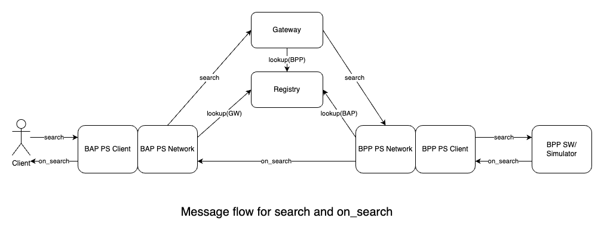
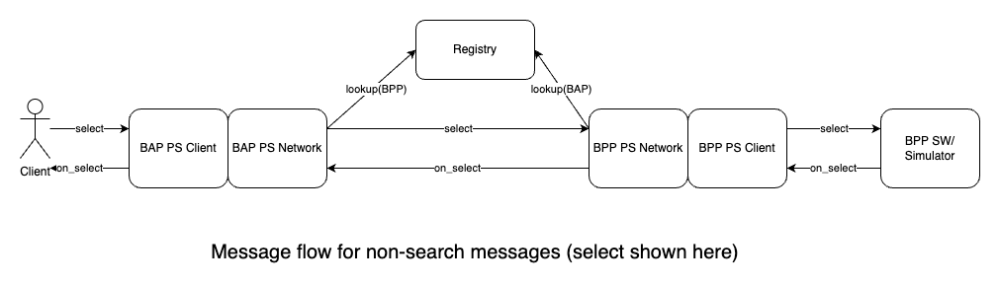
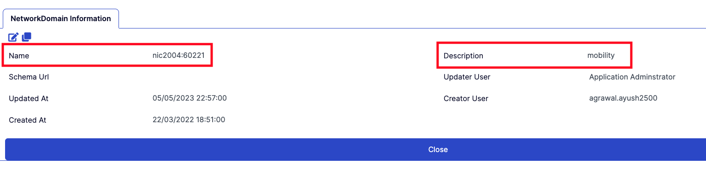

# Beckn Troubleshooting Guide

## Introduction

This document contains instructions to troubleshoot all aspects of the Beckn Network. It currently shows instructions for Protocol Server, Registry and Gateway.

## How to use the guide

The guide has multiple sections. The first section common has some design notes as well as problems common to all products. If you are unsure of the message flow in Beckn, look at the first sections of the Common section.

If you have problem with a particular product, check once in the common section and then the particular section for the product.

## Background

### Flow of messages in Beckn

This section summarizes the flow of messages in Beckn.


The following is the flow of a search message:

1. The message comes from the client/postman to BAP-PS-Client
2. The message goes through to the BAP-PS-Network.
3. The BAP-PS-Network requests the registry for the gateway address
4. The BAP-PS-Network signs and sends the search request to the gateway
5. The gateway requests the registry for the list of BPPs to multicast
6. The gateway multicasts the search request to the BPP.
7. Each BPP-PS-Network which receives the search message, looks up the public key of BAP on registry, verifies the message and forwards it to BPP-PS-Client
8. BPP-PS-Client calls the webhook configured with the search request
9. The BPP software or sandbox will call the BPP-PS-Client with the on_search response
10. The BPP-PS-Client sends the on_search response to BPP-PS-Network
11. The BPP-PS-Network signs the message and sends to the BAP-PS-Network
12. The BAP-PS-Network looks up the registry for the public key, verifies and passes the message back to BAP-PS-Client
13. The BAP-PS-Client aggregates the responses and passes it back to the waiting request.



The following is the flow of a rest of the P2P messages (select,init,confirm etc):

1. The message comes from the client/postman to BAP-PS-Client
2. The message goes through to the BAP-PS-Network.
3. The BAP-PS-Network signs and sends the search request to the BPP-PS-Network
4. The BPP-PS-Network which receives the message, looks up the public key of BAP on registry, verifies the message and forwards it to BPP-PS-Client
5. BPP-PS-Client calls the webhook configured with the request
6. The BPP software or sandbox will call the BPP-PS-Client with the on_xxxxx response
7. The BPP-PS-Client sends the on_xxxxx response to BPP-PS-Network
8. The BPP-PS-Network signs the message and sends to the BAP-PS-Network
9. The BAP-PS-Network looks up the registry for the public key, verifies and passes the message back to BAP-PS-Client
10. The BAP-PS-Client passes it back to the waiting request.

### Accessing logs

Note that some of the logs might be showing the timestamp in UTC. You can identify it with the letter Z at the end of the timestamp.

There are two ways to access logs.

1. The first will be to access them on the machine where they are running. This will require ssh access.

```
docker logs -f bap-client
docker logs -f bap-network
docker logs -f bpp-client
docker logs -f bpp-network
docker logs -f registry
docker logs -f gateway
```

- The docker logs for the registry and gateway are not very useful. Instead do the following for the registry

```
$ docker exec -it registry sh
$ cd tmp
$ tail -f java_info0.log.0
```

- Do the following for the gateway

```
$ docker exec -it gateway sh
$ cd tmp
$ tail -f java_info0.log.0

```

2. The second is through the web endpoint for each of the component. The protocol server supports the `/logs` endpoint. The gateway supports `/bg/log/0`. Add this to your corresponding URL. **Note that the logs for the protocol server append in the end and do not auto refresh in the browser. So refresh page always before checking**. So for example the following are the log locations of the cloud hosted BAP/BPP in the Beckn Open Collective envrionment. For your environment, you will have to use the right url.

```
BAP-PS-Client  - https://ps-bap-client.becknprotocol.io/logs
BAP-PS-Network  - https://ps-bap-network.becknprotocol.io/logs
BPP-PS-Network  - https://sandbox-bpp-network.becknprotocol.io/logs
BPP-PS-Client  - https://sandbox-bpp-client.becknprotocol.io/logs
Gateway  - https://gateway.becknprotocol.io/bg/log/0
```

### Interpreting logs
Refer to this [Log Interpretation Guide](./log-interpretation.md) for tips on interpreting logs.

## Common issues

### 1. When I type the address of the logs endpoint, I get a `This site cant be reached` error in the browser

Check if the address has been properly typed in the address bar. If you are setting up the network, make sure the subdomain entries in the domain registrar do not have any typographic error.

### 2. When I type the address of the registry/gateway/logs endpoint, I get `502 Bad Gateway` error and the page has the word Nginx in it.

This is usually due to either the Nginx not being configured properly or the docker container not being up. For example, if you get this error when you are trying to reach the registry, then it means that either the Nginx is not configured to proxy the request to the right port (3030) or the registry is not running at the port(3030). The nginx can be configured in different ways by system administrators. So check either the `/etc/nginx/sites-enabled` folder or the `/etc/nginx/conf.d` folder to see the configuration files and if it is proxying to the right port. Next check `docker ps` to see if the registry is up and in the docker output, check if the exposed port is alright.

### 3. Receiving a Webhook Response, but an Empty Response Appears in Postman  

There could be several reasons for this issue, but the first thing you should check is whether the transaction ID and message ID in the webhook response match those in the request it received. BAP uses the message ID to aggregate the request with the appropriate response. A mismatch in message IDs will result in an empty response because BAP cannot correlate the response with its original request and send it to the user. This typically occurs when developers hard-code the message ID and transaction ID in the webhook response.


### 4. I don't have the creds and its asking for it during the installation

Please open the registry url in the browser and create a new user. Those creds will be used during the installation. This step is a must to do before installation.


### 5. Getting error "docker: 'f' is not a docker command" during installation

If you encounter this error during installation, it means there is an issue with your Docker installation. Follow these steps to resolve:

1. Uninstall the current Docker installation:
   ```bash
   sudo apt-get remove docker docker-engine docker.io containerd runc
   ```

2. Re-install Docker following the official installation guide for your OS

3. After Docker is reinstalled, navigate to the beckn-onix repository and run:
   ```bash
   cd scripts
   ./package-manager.sh
   ```

This will properly set up the Docker environment and dependencies needed for installation.


## Troubleshooting Registry

### 1. Subscriber list call from BAP to the registry seems to be empty

When you create network domain in the registry, the actual domain name is the "Name" field and not the "Description" field. When you create network roles, the field shown for selection is description. However the real value that should be present in the request should be the name and not the description. For example in the image shown above, the context.domain should be nic2004:60221 and not "mobility".




### 2. Role permission not updated error during registry installation

If you encounter a role permission error during registry installation, follow these steps:

1. First check if the registry URL is accessible:
   - Verify DNS entries are correct
   - Check nginx configuration is properly set up
   - Try accessing the registry URL directly in browser

2. If registry URL is accessible but still getting the error, you can manually upload the role permission file:
   - Log into registry UI
   - Go to admin/role permission section
   - Upload the role permission file located in the scripts folder of beckn-onix repository
   - No need to reinstall the registry after manual upload


## Troubleshooting Gateway

### 1. Status 400 Cannot invoke "in.succinct.onet.core.adaptor.NetworkAdaptor$Domain.getExtensionPackage() because the return value of "in.succinc.onet.core.adaptor.NetworkAdaptor$Domains.get(String)is null" when sending message from BAP to Gateway

The domain field of the search request(context.domain), should be registered in the Registry. Refer to [Network Domain](https://github.com/beckn/missions/blob/main/docs/registry-user-guide.md#create-new-network-domain) section of the registry user guide on how to add one if it does not exist. Make sure the domain name is there in the registry. After you add the domain name to the registry (if it did not exist before), restart the gateway (The gateway picks up the configured domains at startup and seems to cache them). Also refer to this [earlier question](https://github.com/beckn/missions/blob/main/docs/troubleshoot.md#1-subscriber-list-call-from-bap-to-the-registry-seems-to-be-empty)

### 2. Search request does not reach BPP Network and in the Gateway logs it gives a Invalid key exeption. The key seems to be properly configured

Check the logs of the Gateway to see the response of the lookup with the registry. If the lookup is failing for some reason for the BAP public key, the gateway gives this error. You will know if this is the problem if you see a empty array in the gateway logs after the lookup request is logged. Fix it by identifying why the lookup is failing. Maybe some attribute is wrong (such as country - as was in this case).

### 3. How to set the country in the Gateway?

In the Gateway container, in the file /gateway/overrideProperties/config/swf.properties, set the in.succinct.onet.country.iso.3 and 
in.succinct.onet.country.iso.2 keys to the desired country. Make sure that the same entries are also done in the Registry and the network participants have their operating region set to this country. 

### 4. I did not update any software. I just restarted the machine with my gateway instance and after that the Gateway is crashing at bootup.

This is due to a known issue with older Gateway software. See details on the issue [here](https://github.com/beckn/beckn-onix/blob/main/docs/known_issues.md#gateway-is-not-working-after-restart). Solution is to update the gateway software. Details on how to do it are in the link above. 

### 5. Gateway service is restarting and its entry is not present in registry

If your gateway service keeps restarting and you notice its entry is missing from the registry, follow these troubleshooting steps:

1. First verify the DNS entries are correctly configured:
   - Check that the gateway domain points to the correct IP address
   - Verify DNS propagation using tools like `dig` or `nslookup`

2. Check the nginx configuration on the gateway server:
   - Ensure nginx is properly configured to proxy requests to the gateway service
   - Verify nginx logs for any connection errors
   - Make sure SSL certificates are valid if using HTTPS

3. Once DNS and nginx are confirmed working:
   - Try registering the gateway again in the registry
   - Check gateway logs for any startup errors
   - Ensure gateway has proper permissions to connect to registry

The gateway needs to be properly registered in the registry and accessible via its configured domain for the network to function correctly.


## Troubleshooting Protocol Server

### 1. 422 Layer 2 config file "<domain>_<network>_<1.1.0>.yaml" is not installed and it is marked as required in configuration"

Beckn-ONIX has made installation of the layer 2 config file as mandatory. You need to download and install this on both the BAP and BPP. Use the beckn-onix/layer2/download\*.sh scripts to install it on your BAP/BPP Protocol Server. You can get the layer 2 config file from your network or in repositories such as beckn-sandbox.

### 2. When I type the address of the BAP-Network in a browser, I get 'Cannot GET /' error

This in itself is not an error. The BAP-Network exposes endpoints to which you can send POST request. You are asking for GET in the browser. So just ignore this message. If you want to see logs, use the /logs endpoint.

### 3. Logs shows "invalid input .... libsodium-wrappers.js" when BAP-Protocol Server receives a message

Sometimes the "=" symbol at end of public key and "==" symbol at end of private key in the default/config.yml get missed out in some Operating Systems. We have not been able to identify why this happens. If it does, make sure public key ends with one equal and private with two equals. Also ensure that the public key matches with the entry in the registry.

### 4. Request is reaching the BPP Network, but not being passed on to the BPP Client

One of the primary reasons why the BPP Network will not pass on the request to BPP Client is because the signature of the message did not match. Carefully notice the BPP-Network log and see the BAP-ID and BAP Public key. Sometimes the public key will be different from the current BAP Public key due to the use of cache. If this is the case, in the machine that is running the BPP-Network, clear the redis cache using `docker exec -it redis redis-cli FLUSHALL`. Try the request again. This time, the BPP-Network should fetch the public key of the BAP from the registry and should get the latest key. 

### 5. Request is reaching the BAP Client, but not being returned to Postman

One of the reasons for this is that the message_id in the on_xxxxxx(on_search, on_init etc) is not matching the request you sent (usually due to wrong BPP SW or Simulator implementation). So the BAP Client does not have enough information to correlate the request to response and returns back empty response to Postman. 

### 6. Gateway Unable to Broadcast the Request to BPP or Unable to Connect to BPP Using HTTP

One of the reasons for this issue is that the latest version of the gateway uses HTTP/2 by default. If the target servers do not support HTTP/2 or lack a proxy server like Nginx (which automatically downgrades HTTP/2 requests to HTTP/1.1), the request may never reach the server (BPP in most cases).


## Using Beckn Support Bot for Troubleshooting

The Beckn Support Bot is an AI-powered assistant that can help you debug issues and understand error messages. Here's how to effectively use it:

1. Access the bot at [Beckn Support Bot](https://chatgpt.com/g/g-67e5227406c4819196cd9c9bb5a54eaf-beckn-support)

2. For troubleshooting help:
   - Share the exact error message you're seeing
   - Provide context about your setup (BAP/BPP, environment, etc.)
   - Include relevant logs if available
   - Describe what you've already tried

3. The bot can help with:
   - Interpreting error messages and logs
   - Suggesting common fixes for known issues
   - Pointing to relevant documentation
   - Explaining Beckn concepts and terminology
   - Recommending best practices

4. Tips for using the bot effectively:
   - Be specific in your questions
   - Provide as much context as possible
   - Follow up if you need clarification
   - Use the bot alongside other troubleshooting resources

Remember that while the bot provides helpful guidance, for critical production issues you should also engage with the Beckn community through official channels like Discord or Tech Office Hours.

