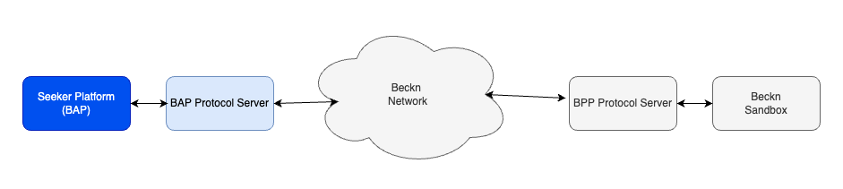
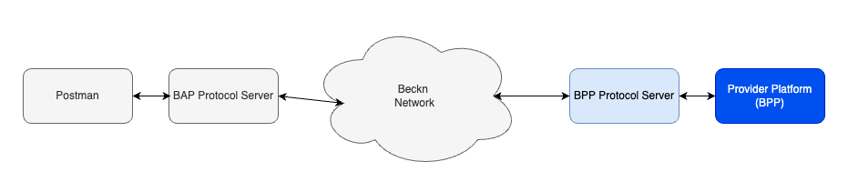

# Beckn Starter Kit

## Table of contents

1. [Beckn Glossary]_(#Beckn Glossary).
2. [Overview of steps for a Network Participants]
3. [Introduction](#introduction)
4. [Brief introduction to Beckn Network](#brief-introduction-to-beckn-network)
5. [Learning Resources](#learning-resources)
6. [Network Participant's journey](#network-participants-journey)
   - [Seeker Platform's Journey](#seeker-platform-journey---story-versionchecklist)
   - [Provider Platform's journey](#provider-platform-journey---story-versionchecklist)
7. [Implementation](#implementation)
   - [Concept of your application](#concept-of-your-application-and-its-place-in-network)
   - [API Integration](#api-integration)
     - [Understand the APIs](#understand-the-apis)
     - [Building and integrating the seeker platform](#building-and-integrating-the-seeker-platform)
     - [Building and integrating the provider platform](#building-and-integrating-the-provider-platform)
   - [Going to production](#going-to-production)
     - [Pre-Production](#pre-production)
     - [Production preparedness](#production-preparedness)
     - [Go live](#go-live)

## Glossary

[**beckn APIs** - APIs that are part of the beckn protocol specifications and responsible for enabling two platforms consumer & provider side to discover & transact with each other in an Open Network. (Discovery- Order - Fulfillment- Postfulfillemt)
**Beckn Application Platforms (BAP)** - Beckn Application Platform (BAP) is a consumer-facing infrastructure that captures consumers’ requests via its UI applications, converts them into beckn-compliant schemas and APIs at the server side, and fires them at the network.
**Beckn Application Platform (BAP)** -  is a consumer-facing infrastructure that captures consumers’ requests via its UI 
applications converts them into beckn-compliant schemas and APIs at the server side 
and fires them at the network.
**Beckn Gateway (BG)** - BGs are extremely lean and stateless routing servers. The purpose of this infrastructure is to optimize the discovery of BPPs by the BAPs by merely matching the context of the search.
**Network Participants (NPs)** - In the context of an "open network," a network participant typically refers to any individual, entity, or device that interacts with or is connected to the network.
**Protocol Server** - A server that is specifically designed to handle and implement communication protocols.
**Sandbox** - A controlled and isolated environment where software applications, code, or processes can run and be tested without affecting the broader system or other applications.
**Open Network** - An open network is a type of network that is characterized by its accessibility and inclusivity. It is a network where the infrastructure, protocols, and standards are made available to a wide range of participants, typically without restrictions. Open networks contrast with closed or proprietary networks, which have limited access and are often controlled by a single organization.

## Overview of steps for a Network Participants

**Step 1:** Building understanding on Beckn protocol - Refer to the "Introduction section"
**Step 2 :** Identify the sector or domain you want to solve the Discovery-Order-Fulfillment-Post Fulfillment (DOFP) for - Health, Mobility, Energy, Skilling, Agriculture etc
**Step 3:** Identify define the role you or your platform would want to play as a Network Participant on an Open Network network (BAP or BPP or a TSP)
**Step 4:** Define and visualise the outcomes you want to achieve with the selected Network Participant role with the help of the "Outcome Visualisation template". An outcome visualisation template will help you define the requirements and success factors for the transaction you are envisioning to enable on an Open network
**Step 5:** Register your platform on the beckn sandbox by registering on the beckn Registry that it can be tested against other Network participants and with the beckn gateway and registry and becomes discoverable
**Step 6:** Deploy ONIX as a pre-requisite pre-API integration step and setup the protocol server for API integration and testing in your local
**Step 7:**  Map your platform schema with the beckn API schema relevant for the transaction
**Step 8:** Refer to the respective domain specific Implemnetation guide to integrate/implement the beckn API as per the network Participant role selected. The implemnetation guide contains sample JSONS for request and responses
**Step 9:** Test with postman collection and against the protocol server
**Step 10:** Test with other NPs on the network for one complete DOFP flow in the Beckn sandbox
**Step 11:** Prepare for Go Live access if a live network instance has been setup or is ready

**Step 1 ## Introduction**

[Beckn](https://github.com/beckn) is an open protocol that facilitates commerce transactions on open interoperable networks. This document guides participants new to the network to get up and running. It contains the following sections.

- Brief introduction about Beckn and its terminologies.
- Learning resources that help you understand more about Beckn.
- Handy checklist for network participants.
- Implementation guides that will help build your software, integrate with Beckn and conduct transactions on it.
- Other resources.

## Brief introduction to Beckn Network

**Beckn (short for beckn protocol)** is an [open protocol](https://developers.becknprotocol.io/docs/introduction/introduction/) for decentralized commerce. It consists of several specifications for building open e-commerce networks across which sellers and their offers are universally discoverable from any Beckn-enabled app or platform. As a protocol, Beckn is multi-layered, with layer structure and organization resembling that of HTTP.

The foundation layer of a Beckn network is the **Specification layer**. Primarily it contains the Core APIs and Core Schema, communication protocol and authentication. These APIs cover the four stages of the lifecycle of a typical commerce transaction; namely **Discovery, Order, Fulfillment and Post-fulfillment.** Communication on the network happens in an asynchronous fashion.

The **registry infrastructure** layer stores detailed information about all network participants.

The **transaction layer** consists of **Beckn Application Platform (BAP)**, also called as the **Seeker Platform** in this document on one side and the **Beckn Provider Platforms(BPPs)**, also called as the **Provider Platform** in this document on the other side. The **Beckn Gateway(BG)** optimizes discovery of BPPs on the network. The BAP and BPP then transact in a peer-to-peer mode.

Refer to the next section for a detailed description of Beckn protocol and its APIs.

## Learning resources

Use the following resources to gain deeper knowledge about Beckn protocol and the ecosystem

- [Introduction to Beckn By Ravi Prakash - Video Playlist](https://www.youtube.com/watch?v=7Otfcy37-NE&list=PLBC6c8MLy9uVUIb1BOgdOa8tP4rX6c4aK&index=1)
- [Beckn Developers Guide](https://developers.becknprotocol.io/docs/introduction/introduction/)
- [Beckn Protocol Specification Respository](https://github.com/beckn/protocol-specifications)
- [Beckn Glossary](https://fide-official.atlassian.net/wiki/external/NzVlZmIxZWM5ODNlNDE5ZTg3NWZkOTljM2Q2NDQ4YjU)
- [Protocol Specification](https://github.com/beckn/protocol-specifications)
- [Beckn-Onix Repository](https://github.com/beckn/beckn-onix) Beckn-ONIX is an initiative to easily setup and maintain a Beckn network. This document uses the FIDE distribution of Beckn-ONIX as reference implementation.
- This link has detailed videos on [Walkthrough of Beckn ONIX installation](https://drive.google.com/drive/folders/1PJ6NMXu7abAO3omXlBHro5qtke8DPCbM?usp_dm=false)

## Network Participant's Journey

**Step 2** Identify the domain or sector you want to solve a problem with DOFP - Health, Mobility, retail etc
**Step 3** Identify define the role you or your platform would want to play as a Network Participant on an Open Network network (BAP or BPP or a TSP)

**Roles You Can Play**
**Beckn Application Platform** (Seeker or consumer side platform
1. Acquires customers as users
2. Does NOT maintain an active inventory
3. Provides rich, “resource seeking” with rich buying experience
4. Interfaces with BPPs and BGs to, place orders, track status etc.
   
**Beckn Provider Platform** (Seeker or consumer side platform
1. Acquires businesses/service providers as users
2. Maintains an active inventory/catalogue of product or services
3. Provides rich, “resource-providing”  experience
4. Interfaces with BAPs and BGs to, publish catalogs, create orders etc.

This section contains story version of your journey as a network participant (Seeker Platform/Provider Platform). It is written to give a quick flavor of tasks that are detailed in the latter sections of this document.

**Step 4** Outcome Visualisation
Define your requirements, transaction , functional flow and success factor clearly using the template here - https://docs.google.com/document/d/19UGVeUheEVKeC8JbATXiBJfEdwHehrY8sMsvolZYCK0/edit#heading=h.2bgtok41xod2

Find some sample outcome visualisation templates below -
Sample 1 - https://docs.google.com/document/d/1TQLuBa-TNPSb0ylry6fl7lMub2tfHySqgl03d1rIP7U/edit?usp=sharing

### Seeker Platform Journey - story version/checklist

This section describes the journey of a new Seeker Platform Participant

1. Get introduced to the network, the problem it solves and the various categories of use cases that it supports.
2. Look at sample outcome visualizations and use cases published by the network.
3. Imagine/identify the use cases that appeal to you as a Seeker Platform.
4. Imagine the outcome visualization of your flow.
5. Verify use case with Network support staff.
6. Learn Beckn Protocol, its API and schema.
7. With the help of implementation guide, formulate the flow and message content as postman collection.
8. Register yourself on the Sandbox.
9. Run your API flow from postman against the Beckn Sandbox on the sandbox environment.
10. Wireframe UI and develop the UI and non-beckn functionality of Seeker Platform.
11. Install the Protocol Server, install layer 2 config and connect it to the sandbox.
12. Test the connection from UI all the way to sandbox and back.
13. Check process to get onto the pre-prod network.
14. Test application with other providers on pre-prod network.
15. Check process to get onto the prod network.
16. Setup a observability server and route the logs to it.
17. Migrate the app to production network.
18. Setup support infrastructure for customers.
19. Launch the product with supporting website etc.
20. Monitor adoption and health of application using observability dashboard.

### Provider Platform Journey - story version/checklist

This section describes the journey of a new Seeker Platform Participant

1. Get introduced to the network, the problem it solves, the opportunity it presents etc.
2. Check the outcome visualizations of the use case categories.
3. Choose use cases that appeal to you as a provider.
4. Imagine outcome visualization of your idea and get vetted with network support staff.
5. Learn Beckn Protocol, its API and Schema.
6. Go through the implementation guide for your use case category. Understand the API, schemas and flow involved.
7. Create required endpoints and message packets.
8. Sign up for sandbox access.
9. Install the Protocol Server and install the layer 2 configs.
10. Hook up your software with the sandbox environment.
11. Try the use case with postman collection provided by the network.
12. Complete/integrate the shop software including order processing, backend integration required etc.
13. Check requirements for pre-prod and connect your software to pre-prod network.
14. Transact with other seeker side software on pre-prod and ensure inter-operability.
15. Check and take software to production environment.
16. Install and configure a network observability software.
17. Ensure catalog is visible and order process is working fine.
18. Monitor transactions and component health on observability software.

## Implementation

This section provides guidance on implementinng your software and taking it to production. You start your journey by choosing the network on which you want to build your application. Different domains have different open networks. Once you have decided on your network, the network will provide you an **implementation guide**. This implementation guide will have the following sections.

- Outcome visualization - This will contain the stories of user experience of the use cases.
- Flow diagram - Flow diagrams will illustrate the flow of messages on the Beckn network corresponding to the use cases.
- API Mapping and sample JSON Schemas - Detailed API requests and responses corresponding to the flow diagrams above.
- Taxonomy, layer 2 configs and rules - Details on the enumerations and other layer 2 config corresponding to the use case.
- Additional instructions and notes to help in implemenation.

With the implementation guide in hand, your journey starts.

### Concept of your application and its place in network

You begin the journey by identifying the network you join.

1. From the implementation guide, understand Domain specific use cases and outcomve visualizations.
2. Identify the use case(s) you want in your application.
3. Identify the roles your application will take (Seeker Platform/Provider platform).
4. Get use case validated with network facilitators.
5. Identify the tech resources required to implement use case.

### API Integration

API Integration will involve

- Understanding the APIs.
- Building and integrating your platform with the network.

#### Understand the APIs

This involves following tasks.

1. Understand the [Beckn Protocol API (DOFP)](https://developers.becknprotocol.io/docs/introduction/beckn-protocol-specification/). You would have already done this if you finished the learning section above. Also refer to [General Beckn message flow and error handling](https://github.com/beckn/missions/blob/starter_kit/template/new_open_network/ack_nack.md) for details on error handling.
2. Second is to understand the specific usecases detailed in your implementation guide.
3. Third is to understand any network specific non-Beckn API (optional and if required, will be listed in implementation guide).

#### Building and integrating the seeker platform

If you are writing the seeker platform software, the following are the steps you can follow to build and integrate your application with the network.

1. Identify the use cases from above section that are close to the functionality you plan for your application.
2. Design and develop the UI that implements the flow you need. Typically you will have a API server that this UI talks to and it is called the Seeker Platform in the diagram below.
3. The API server should construct the required JSON message packets required for the different endpoints shown in the API section above.
4. Setup the API and the UI.
5. Develop non-beckn functionality (such as login, profile, order history etc).
6. Register in sandbox environment of the network (Your network website will have the details. Typically they will have a form that you might have to fill and the team will then contact you will the sandbox details).
7. Setup the hardware for the Beckn Adapter. Benchmark document will have the minimum configuration for your requirements.
8. Setup required subdomains and reverse proxy[Setup subdomains and proxy](https://github.com/beckn/beckn-onix/blob/main/docs/user_guide.md#appendix-a---registering-or-adding-domain-or-subdomains).
9. Install the BAP Beckn Adapter using [Beckn-ONIX](https://github.com/beckn/beckn-onix)
10. [Download and install layer 2 config file](https://github.com/beckn/beckn-onix/blob/main/docs/user_guide.md#downloading-layer-2-configuration-for-a-domain) - The address from where to install will be specified in the implementation guide.
11. Check with your network tech support to enable your BAP Protocol Server and change its state to _subscribed_ in the registry.
12. Once enabled, you can transact on the Beckn Network. Typically the sandbox environment will have the rest of the components you need to test your software. In the diagram below,
    - you write the Seeker Platform(dark blue)
    - install the BAP Protocol Server (light blue)
    - the remaining components are provided by the sandbox enviornment

#### Building and integrating the provider platform

If you are writing the provider platform software, the following are the steps you can follow to build and integrate your application with the network.

1. Identify the use cases from above section that are close to the functionality you plan for your application.
2. Design and develop the component that accepts the Beckn requests and interacts with your software to do transactions. It has to be a endpoint(it is called as webhook_url in the description below) which receives all the Beckn requests (search, select etc). This endpoint can either exist outside of your marketplace/shop software or within it. That is a design decision that will have to be taken by you based on the design of your existing marketplace/shop software. This component is also responsible for sending back the responses to a the Beckn Adaptor.
3. Register in sandbox environment of the network (Your network website will have the details. Typically they will have a form that you might have to fill and the team will then contact you will the sandbox details).
4. Setup the hardware for the Beckn Adapter. Benchmark document will have the minimum configuration for your requirements.
5. Setup required subdomains and reverse proxy[Setup subdomains and proxy](https://github.com/beckn/beckn-onix/blob/main/docs/user_guide.md#appendix-a---registering-or-adding-domain-or-subdomains).
6. Install the BPP Beckn Adapter using [Beckn-ONIX](https://github.com/beckn/beckn-onix)
7. [Download and install layer 2 config file](https://github.com/beckn/beckn-onix/blob/main/docs/user_guide.md#downloading-layer-2-configuration-for-a-domain) - The address from where to install will be specified in the implementation guide.
8. Check with your network tech support to enable your BPP Protocol Server and change its state to _Subscribed_ in the registry.
9. Once enabled, you can transact on the Beckn Network. Typically the sandbox environment will have the rest of the components you need to test your software. In the diagram below,

   - you write the Provider Platform(dark blue) - Here the component you wrote above in point 2 as well as your marketplace/shop software is together shown as Provider Platform.
   - install the BPP Protocol Server (light blue).
   - the remaining components are provided by the sandbox enviornment.
   - Use the postman collection to test your Provider Platform.

### Going to production

#### Pre-production

1. Different networks will have different requirements for pre-prod. At a minimum, they might want you to submit logs for specific flows. Check your network website for details.
2. Register on Pre-production environment.
3. Test application with seeker/provider available on pre prod environment.

#### Production preparedness

1. Sign required legal work for integration with production environment of the network.
2. Request for access to Production environment.

#### Go-Live

1. Connect your platform(BAP/BPP) to the production network.
2. Setup support channel for users.
3. Create a dashboard to track updates and problems.
4. Monitor network and business stats.

## Appendix

### Appendix-A Migrating to Beckn-ONIX from existing implementation

**Note: After the launch of beckn-onix, it has been decided that FIDE will support only beckn-onix enabled networks. Incase if you are on a legacy or non beckn-onix network, its important you migrate to beckn-onix.**

If you had installed the components of a Beckn network using legacy installations, use the following steps to migrate to Beckn-ONIX

1. Write down all the subscription information relevant to the component (e.g. subscriber_id, subscriber_url, registry_url, webhook_url) etc. If the installed Beckn Adapter is the Protocoll Server, most of these can be found in the default.yaml file within the config folder.
2. Stop the running instances of the Beckn Adapter (including support services such as Mongo, Rabbit and Redis)
3. Backup all the log and config data
4. Install the BAP Beckn Adapter using [Beckn-ONIX](https://github.com/beckn/beckn-onix). Use the credentials that you copied from the older network in step 1 above.
5. [Download and install layer 2 config file](https://github.com/beckn/beckn-onix/blob/main/docs/user_guide.md#downloading-layer-2-configuration-for-a-domain) - The address from where to install will be specified in the implementation guide provided by your network.

## References

Check out our website, blog, and live projects for a comprehensive overview: 
Website 🌐 : https://becknprotocol.io/
Blog✍️ : https://becknprotocol.io/blog/
Live Projects🛠️ : https://becknprotocol.io/projects/

## Joining Beckn Community

we have thriving community on the dicord, inorder to learn more about beckn, or you want to connect with a beckn expert, Please join the beckn open collective discord channel
https://discord.com/invite/pbayfsrMR9
