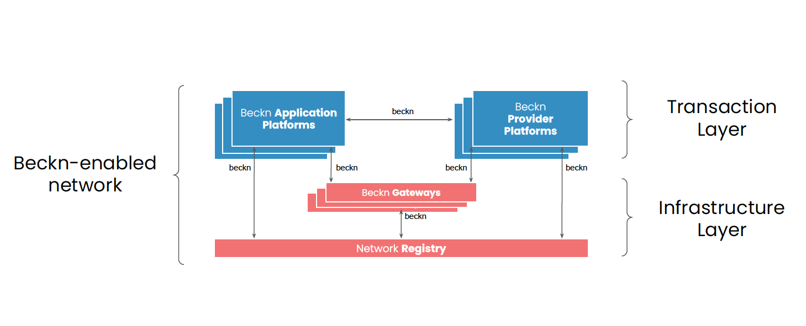

## Network facilitator Journey

Beckn protocol allows the unbundling of Platform type of application where the three tasks of customer operations, provider operations and the matching of customer to provider are unbundled. This creates a open network with new entrants being able to write software on the customer side (Beckn Application Platform) and provider side (Beckn Provider Platform). The task of bringing these participants together, allow them to discover each other, perform required complaince and regulation check for such networks etc is that of **Network Faciliator Organizations**. Some of the tasks of the Network Faciliator Organizations include:

- Conceptualize the network, its nature, nature of participants and the types of transactions allowed.
- Help network participants onboard onto the network
- Maintain required network level infrastructure such as registry, gateway as well as multiple environments (sandbox, pre-production, production etc)
- Define system level policies on allowed payment modes, reconcilliation, settlement etc required to ensure transaction integrity.
- Define policies on privacy, security, compliance and ensure participants are following them

### Registry and Gateway

**Registry** in a Beckn network holds details on the different network participants including their ID, URL, Public Key, Domains they operate in, Role (BAP, BPP, BG etc). It also provides a way for the Network Facilatoror Organization to include or exclude a participant from transaction. Every network participant when it receives a message, will lookup at the registry for the public key of the sender to ensure that the message was sent by the said party and has not been modified since sending. This authentication is the core of trust in the Beckn Network.

**Gateway** is a special server used to multicast search request sent by a BAP to all relevant BPPs in the network. It does this using only the context of the message. It uses the help of the Registry to do this task.

The diagram below shows the role of Registry and Gateway in a Beckn Network.



### Initial tasks

While this document limits itself to the Beckn tasks, the Journey of Network Facilitator begins with tasks such as

- Concept paper for a network, including explanation of the domain and the need for an open network
- Outcome visualizations of what kind of participants will come onto the network and the kind of transactions they can perform
- Website with introduction and instructions for Network Participants to start and transact on the network.
- Define rules and regulations that will apply to network participants including KYC requirements etc
- Decide on the number of environments the network will have (sandbox, pre-prod, production )etc as well as the process to follow to onboard network participants on each.
- Signup forms for the network participants
- Setup the actual environments (sandbox, pre-prod and production). Registry and Gateway will need to be installed in all of them. The process to do it (in each) is described in the next section.

### Installing Registry and Gateway

Beckn-ONIX provides a reference implementation of the Registry and the Gateway for any environment. This section details the process. The Beckn-ONIX repository can be found [here](https://github.com/beckn/beckn-onix). There is an Installation guide for both GUI and CLI installation there. This section uses some portion of the CLI User Guide.

#### Registry

**Prerequisites**

- You need to come up with a public URL for the registry. Typically since the network might have multiple environments, adding the environment into the URL is a common practice. For example if the base domain name is "example.com", then the registry URL for the sandbox environment could be "registry-sandbox.example.com", that for staging could be "registry-staging.example.com" and the one for production could be "registry.example.com".
- Create subdomain entry for the chosen url at your domain registrar and point the traffic to the machine where you want to install.
- On the machine you want to install the Registry Software, create a reverse proxy setting, so the traffic is diverted to port 3030. This is where the registry (to be installed next) will be running.

**Installation**

- Clone the Beckn-ONIX repository and run the installation

```
$ git clone https://github.com/beckn/beckn-onix.git
$ cd beckn-onix/install
$ ./beckn-onix.sh
```

- Choose setting up a new network as the option and Registry as the component to setup.
- The installation will ask for the address of the registry. Provide the address configured in the pre-requesites section.
- The installation will complete and the registry can be accessed in a browser using the URL provided. (Default username/password is root/root)

#### Gateway

**Prerequisites**

- You need to come up with a public URL for the gateway. Typically since the network might have multiple environments, adding the environment into the URL is a common practice. For example if the base domain name is "example.com", then the gateway URL for the sandbox environment could be "gateway-sandbox.example.com", that for staging could be "gateway-staging.example.com" and the one for production could be "gateway.example.com".
- Create subdomain entry for the chosen url at your domain registrar and point the traffic to the machine where you want to install.
- On the machine you want to install the Gateway Software, create a reverse proxy setting, so the traffic is diverted to port 4030. This is where the gateway (to be installed next) will be running.

**Installation**

- Clone the Beckn-ONIX repository and run the installation

```
$ git clone https://github.com/beckn/beckn-onix.git
$ cd beckn-onix/install
$ ./beckn-onix.sh
```

- Choose joining an existing network as the option and Gateway as the component to setup.
- The installation will ask for the address of the registry. Provide the address of the network registry.
- The installation will ask for the public address of the gateway. Provide the address configured in the pre-requisites section.
- The installation of gateway will complete.

The same procedure can be used to install the registry and gateway in other environments (staging, production etc). The process is the same except for the URL that can be arrived at for each envrionment as illustrated above.
