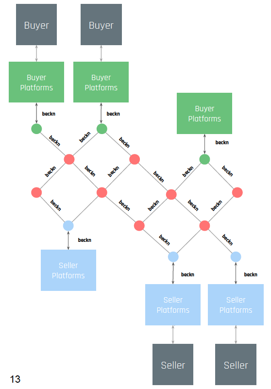
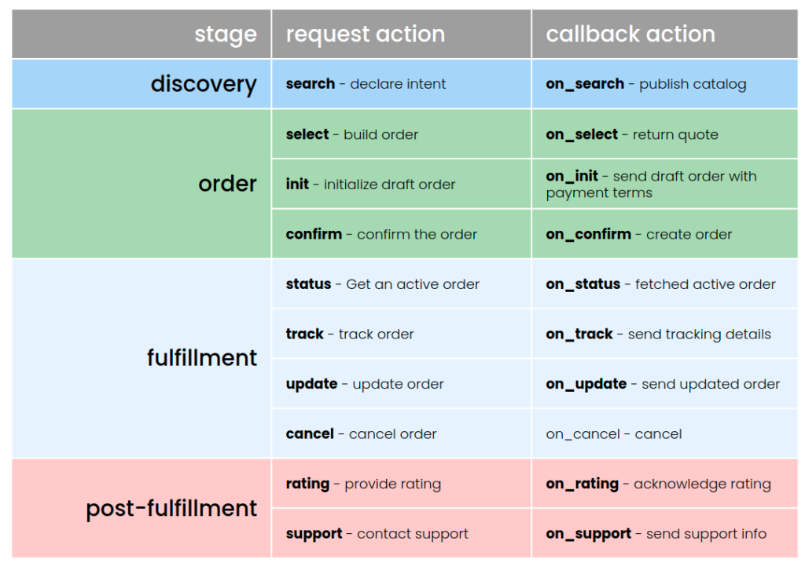
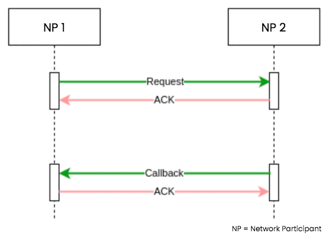
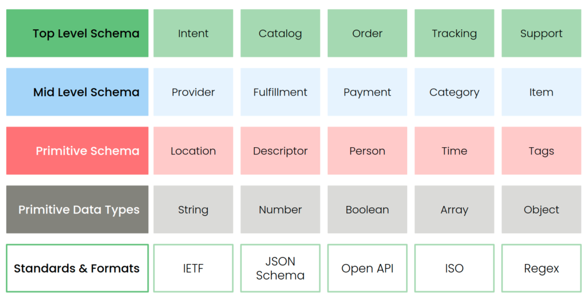
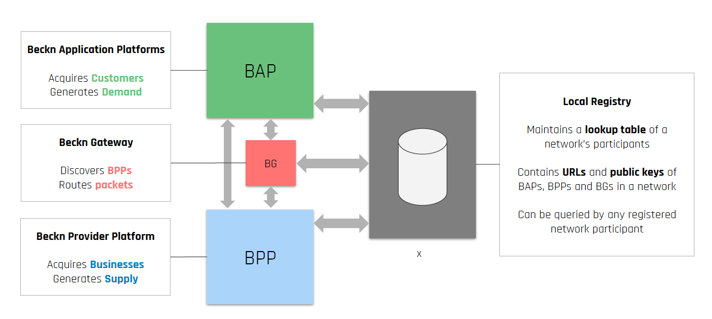

## Understanding Open Networks

Open networks allows **interoperability** and collaboration between different participants on the network. It is a powerful force and has boosted innovation and growth wherever it has been adopted. Starting with the internet , from http for information transfer to smtp for email, the web is full of examples of open networks and protocols.

While web as a network is open, the **economy on the web** has not been so. It is filled with platforms that centralise control. **Beckn** is an **open digital infrastructure** that allows creating of unbundled and decentralised digital market and an open playground for all commerce participants.

Beckn allows consumers, governments and business to unlock markets by enabling direct interactions among them while leveraging the power of the internet and other digital infrastructure. It is a set of **open specifications** that allow creation of open networks enabling commerce aware communication between participants. It helps transition from a platform based ecosystem to a open-protocol and open-network based interoperable ecosystem.

## Introduction to Beckn Protocol

Beckn protocol specification consists of the core APIs, the core schema, layer 2 schema, the communication protocol and the authentication and contract components.

### Core APIs

The **Core APIs** include **transaction APIs** that cover the **discovery, order, fulfillment and post-fulfillment** phases of an order lifecycle and are **asynchronous**.

Every end-to-end commerce transaction can be categorized through these four stages:

- **Discovery** — involves searching for a provider or a catalog. Once the catalog is retrieved, one can browse the catalog using various filters and parameters.

- **Order** — the consumer constructs the order by selecting various items or offers from a catalog; billing and shipping details are supplied, as well as any supporting credentials if required. A confirmed order marks the end of this stage.

- **Fulfillment** — the actual fulfillment of the order. This consists of events like delivery, tracking and, occasionally, cancelation. The completion of the delivery of an order marks the end of this stage.

- **Post-Fulfillment** — activities like providing rating, contacting support, or initiating a return

All transaction APIs are asynchronous, which means that the requested information is not returned immediately in the same session and that there is a callback mechanism in place through which it is obtained.

### Core Schema

The **Core Schema** specifies the structure of data in the commerce interactions and is written in the **OpenAPI** 3.0 specifications. It serves the purposes of validation and documentation. The schema organizes that data that is passed in each of the Core APIs into a several hierarchical component levels.

### Layer 2 Schema

Layer 2 Schema through taxonomies add domain-specific attributes to the elements of the Core schema. Also they provide a way to add additional network facilitator (defined below) defined rules to the Core Schema. It is achieved through definition of enumerations, required fields, allowed and default values, conditional schemas etc.

### Network Actors

The **primary actors** in Beckn-enabled networks include the

- Consumer facing platforms called **Beckn Application Platforms(BAP)**. A Beckn Application Platform (BAP) is a consumer-facing infrastructure which captures consumer's requests via its UI applications, converts them into beckn-compliant schemas and APIs at the server side, and fires them at the network.
- Seller facing platforms called **Beckn Provider Platforms(BPP)**. These are the platforms that maintain an active inventory, one or more catalogs of products and services, implement the supply logic and enable fulfillment of orders. The BPP can be a single provider with a Beckn API implementation or an aggregator of merchants.
- Registration platforms with data about network participants - **Registry**. The Registry has details on all network participants including their public key. Any receiver of an API request must authenticate the sender by looking up the network registry and verify the signature of the sender through the sender’s public key.
- Routing infrastructure called **Beckn Gateway** used during discovery phase(search). BGs are extremely lean and stateless routing servers. The purpose of this server is to optimize discovery of BPPs by the BAPs by merely matching the context of the search. The BG takes a request from the BAP, determines to which BPPs the message needs to be sent to (by looking up the registry) and multicasts the message only to them.

Usually the registry and the gateway are part of the network infrastructure and maintained by organisation called as **Network Facilitators**. Network Facilitators manage and govern the network. They help on-board network participants onto the network and can control who can transact on the network.

Similarly at organisation level, another actor in the ecosystem could be Technical Service Providers. These are organisations that might help the other Network Participants help setup and get onto Beckn Networks. Network participants can get onto Beckn Network themselves, following guides such as this document and other resources. Else they can take the help of TSPs for this purpose. This document assumes network participants are onboarding themselves onto the Beckn network.

## Learning resources

Use the following resources for a deeper understanding of the Beckn Ecosystem

- [Introduction to Beckn By Ravi Prakash - Video Playlist](https://www.youtube.com/watch?v=7Otfcy37-NE&list=PLBC6c8MLy9uVUIb1BOgdOa8tP4rX6c4aK&index=1) For a comprehensive understanding of the Beckn protocol, its origin, concepts and implementation details, refer to this Video Playlist by Ravi Prakash, a co-author of the Beckn Protocol.
- [Beckn Developers Guide](https://developers.becknprotocol.io/docs/introduction/introduction/) The Beckn Developers Guide, gives developers a quick overview of Beckn Protocol, the various components in the network, the APIs, schemas etc. 
- The [Beckn Glossary](https://fide-official.atlassian.net/wiki/external/NzVlZmIxZWM5ODNlNDE5ZTg3NWZkOTljM2Q2NDQ4YjU) explains the most important terms that you come across in Beckn literature.
- [Beckn-Onix Repository](https://github.com/beckn/beckn-onix) Beckn-ONIX is an initiative to ease setup and maintain a Beckn network. This document uses the FIDE distribution of Beckn-ONIX as reference implementation. This link is for the repository with Beckn-ONIX files.
- [Beckn-ONIX installation videos](https://drive.google.com/drive/folders/1PJ6NMXu7abAO3omXlBHro5qtke8DPCbM?usp_dm=false). This link has detailed videos on Walkthrough of Beckn ONIX installation
- [Beckn Protocol Specification repository](https://github.com/beckn/protocol-specifications)- Repository containing the core Beckn specification as well as discussions on some of the design choices.
