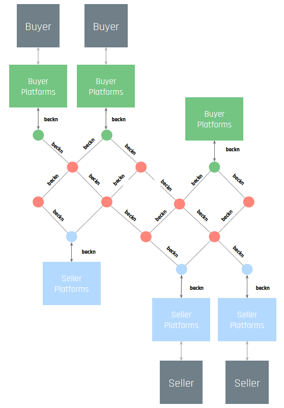

## Understanding Open Networks

Open networks allows **interoperability** and collaboration between different participants on the network. It is a powerful force and has boosted innovation and growth wherever it has been adopted. Starting with the internet ,http for information transfer to smtp for email, the web is full of examples of open networks and protocols.

While web as a network is open, the **economy on the web** has not been so. It is filled with platforms that centralise control. **Beckn** is an **open digital infrastructure** that allows creating of unbundled and decentralised digital market and an open playground for all commerce participants.

Beckn allows consumers, governments and business to unlock markets by enabling direct interactions among them while leveraging the power of the internet and other digital infrastructure. It is a set of **open specifications** that allow creation of open networks enabling commerce aware communication between participants. It helps transition from a platform based ecosystem to a open protocol and network based interoperable ecosystem.

## Introduction to Beckn Protocol

Beckn protocol specification consists of the core APIs, the core schema, domain taxanomy, the communication protocol and the authentication and contract component.

The **Core APIs** include **transaction APIs** that cover the **discovery, order, fulfillment and post-fulfillment** phases of an order lifecycle and are **asynchronous**.

The **Core Schema** specifies the structure of data in the commerce interactions and is written in the **OpenAPI** 3.0 specifications. It has objects in increasing levels of complexity.

The **primary actors** in Beckn-enabled networks include the

- Consumer facing platforms called **Beckn Application Platforms(BAP)**
- Seller facing platforms called **Beckn Provider Platforms(BPP)**
- Registration platforms with data about network participants - **Registry**
- Routing infrastructure called **Gateway** used during discovery phase

