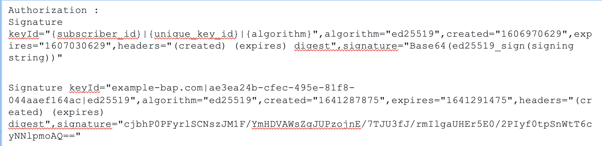

## Provider Platform's Journey

### Unbundle Your Platform

If you are coming in with a platform that you already have, then probably it will have the following structure. - A consumer service(app) that lets consumers search and initiate orders. - A supplier/provider service(app) that lets suppliers get and fulfil orders. - The platform itself connecting the two.

This is the high level picture of most platforms. The proposition that Beckn brings to the table is that by unbundling the consumer and the supplier side functionalities and having the network match the supply and demand instead of the platform, you open up opportunities to new customers and suppliers.


As a Provider Platform after you unbundle your Provider side application will probably have a supplier facing application with a backend server providing the following:

- Ability to return back catalog on search requests
- Ability to support order creation
- Ability to reconcile payment transaction details
- Ability to fulfill orders
- Ability to send order status
- Ability to cancel/update orders as required by user
- Ability to provide support and tracking information
- Ability to store rating and feedback

This unbundled application will now have to connect to the Beckn network to provide these functionalities to the customer. The tasks that Providers have to do to keep the catalog upto date, inventory management, setting shop policies etc, are not covered by Beckn. Beckn only covers the catalog and order management tasks towards the customer side.

**Beckn protocol** defines APIs, authentication and message format to help participants connect to the Beckn network. These APIs cover all aspects of **Discovery, Order, Fulfillment and Post Fulfillment** that are required in commerce tansactions. You can use an Adapter that implements the Beckn protocol to make your task easy. Beckn-ONIX initiative provides a reference implementation of such an adapter and is called the Protocol Server. The following diagram illustrates how your unbundled application might look when connected to the Beckn network


After unbundling, you will be listening to an endpoint in your software (called as webhook). On this endpoint you will receive all the Beckn messages (search, confirm, status etc). When you receive any such message, you have to do the following:

- Broadly check if the message is structurally alright and return back an HTTP 200 ACK message
- Process the message (e.g if it is a order confirmation - confirm message, create order in database, trigger payment verification etc ) and compose a response (e.g. on_confirm).
- Call the corresponding endpoint (e.g. on_confirm) on the **Beckn Adapter** (The word Beckn Adapter and the reference implementation, Protocol Server[explained below] are used interchangeably in this document).
- The Beckn Adapter will take care of returning the response message to the BAP(Customer facing App Platform) that sent the original message. The BAP will inform the user of order confirmation.

So one of the main tasks that needs to be done is to extract the data from Beckn Requests and similarly to map our data into Beckn Responses. This is called **Schema mapping** and we will come back to it soon.

In the diagram above and the explanation, we mentioned Beckn Adapter. The Beckn Adapter helps your backnend server communicate with the Beckn network. Some of the functionalitites that are handled by it are

- Calling your API server endpoing (webhook) when messages are sent to you on the Beckn Network
- Validating the requests sent to you and your responses to be compliant to Beckn core specification as well as any additional rules specified by the network operator (Layer 2 Config)
- When you receive a message from another participant, it verifies if the message was indeed from the said participant and has not been tampered. It uses the copy of the sender's public key present in the registry to do this.
- When you callback a response (e.g. on_select, on_confirm etc), it will sign the message with your private key and forward it to the recipient
- Provide logging, observability and other network operation functionality.

As you can see above, the use of Beckn Adapter reduces the burden on your application development significantly. Beckn-ONIX comes with a reference implementation of the Beckn Adapter called the Protocol Server.

### Implementation Guide

As we saw in the previous section, the primary task in Provider Application development will be to

- understand the message flow and data format received in each message to extract the data from the request
- After processing the request, map the data we need to send back to Beckn format

To help you with this task, the community and network will release implmentation guide for various domains, use cases and networks. Choose the right implementation guide for your case before proceeding further.

The implementation guide will contain the following sections:

1. It will explain the overall domain, the various use-case categories
2. Detailed use cases along with message flow diagrams
3. Example data and mapping to the Beckn Schema for the various messages required for each usecase category
4. Layer 2 Configuration file required to be installed for that network (more on this later)
5. Details on sandbox support (for seeker application developers) and postman collection (for provider application developers).

### Open Source Assets

#### Protocol Server

The primary asset that will help the Provider Application developers is the reference implementation of the Beckn Adapter called as the **Protocol Server**. This is available in the Beckn-ONIX reference implementation suite. Since this protocol server is helpful in integrating the Beckn Provider platform(BPP), this is also referred as the BPP-Protocol Server in the diagrams and during installation.

In the "Unbundle your platform" section, we saw the tasks performed by any Beckn Adapter. The Protocol Server performs all of these tasks. Internally, the Protocol Server is architected as two App servers. One (BPP-Network) listens on the Beckn network for messages meant for you, while the other (BPP-Client) will call your server endpoint (webhook) as well as expose response endpoints (on_search, on_select etc ) that your software can call. The following diagram shows the structure of the BAP Protocol Server.


In addition to sending messages in the Beckn format, another key task the Protocol Server does with the messages is sign it so the receiver can verify that the message is originating from the indicated source and has not been tampered with. It signs the message with its private key and attaches a signature to the header. The receiver will lookup the registry for the public key of the sending participant and verify the signature. Refer to this [document](https://github.com/beckn/protocol-specifications/blob/master/docs/BECKN-006-Signing-Beckn-APIs-In-HTTP-Draft-01.md) for more details. The image below shows the format of the Authorization header that goes with a signed message.



The BPP Protocol Server calls your Provider Platform Software endpoint (webhook url) with messages from the Beckn Network. The same endpoint is called for all messages. You can differentiate the message by looking at the context.action field of the message json. The action field will have the following values

    - search, select, init, confirm, status, cancel, track, support, update, rating

These cover the Order transaction lifecycle (Refer to the image in the Introduction to Beckn section on how these map to the order lifecycle). The default implementation of the BAP Protocol Server will work sychronously and will return back when it has the answers from the network or times out.

You return back an ack, process these messages and callback the corresponding endpoint (on_search, on_select etc) on the BPP PS Client server.

### Becknifying your application

With the help of the implementation guide, you start your implementation by

- Listening to the webhook url for messages from Beckn Network.
- Identify the sent message by looking at the context.action field. Return an ACK indicating that you will respond later.
- Extract the data required for the action from the message
- Call the corresponding part of your Backend code that will deal with the message.
- Once you have a response, map the response to the Beckn format.
- Call the corresponding endpoint (on_search, on_select etc) on the BPP Protocol Server Client server.

With this done, you are ready to integrate your application to the Beckn network.

#### Installing Protocol Server with Beckn ONIX.

- The repository for Beckn-ONIX is [here](https://github.com/beckn/beckn-onix). Use the Installation Guide there for more details on the steps below. Some of the steps here are extracted from the installation guide.

#### Prerequisite

1. When we connecting our provider app to the Beckn network, we are connecting as a Network Participant of the type BPP. In order for any other network participant to reach us, we need to have a publicly accessible URI for the BPP. This is also called as **Subscriber URI** in documentation. Similarly we need a ID for the BPP called the **Subscriber ID**. Typically (as convention) if our primary domain is called "example.com", the BPP URI will be "https://bpp-network.example.com" and the BPP ID will be "bpp-network.example.com".
2. Create two subdomain entries. One as shown above for the BPP PS Network (https://bpp-network.example.com) and another for BPP PS Client (https://bpp-client.example.com). The URL for the BPP PS Client is optional in production as usually it and its caller (your Provider app backend server) can stay in the same VPC and you do not need any public URL. For the sake of this document, we will continue to have two web addresses.
3. Identify the system on which you will install the BPP Protocol Server. Usually this will be in the same VPC as the Provider App Backend server.
4. When we install the Protocol Server, BPP Protocol Server Client will run on port 6001 and BPP Protocol Server Network will run on port 6002. So we need to configure a reverse proxy on this machine, so the following mapping is done.

- BPP Client URI (e.g. https://bpp-client.example.com) is mapped to port 6001
- BPP Network URI (e.g. https://bpp-network.example.com) is mapped to port 6002

#### Installation

Use either the GUI or the CLI to install the Protocol Server BPP software. The following commands start the CLI installation.

```
$ git clone https://github.com/beckn/beckn-onix.git
$ cd beckn-onix/install
$ ./beckn_onix.sh
```

During installation, you are asked for four pieces of information.

1. Registry URL - The registry of the network you want to join. This information will be in the implementation guide. (During installation notice the instructions to see if we need to suffix /subscribers to the registry address)
2. Subscriber ID - The subscriber ID for the BPP Protocol Server (you decided in the Prerequisite section)
3. Subscriber URL - The subscriber URL for the BPP Protocol Server (you decided in the Prerequisite section)
4. Webhook URL - The url of the endpoint in your provider software where you will receive Beckn messages (All messages will be sent to same endpoint. Use the context.action field to differentiate individual messages)

The installation will install the Protocol Server and other required support software and register it with the registry.
The next step will be to install the required layer 2 configuration file (This process might be integrated into the installation soon). The link to this file will be in the implementation guide. Run the following command and paste the link when asked.

```
$ cd ../layer2
$ ./download_layer_2_config_bpp.sh
```

Once this is done, you might have to contact the network facilitator to get yourself approved as a Network Participant.

#### Testing the installed protocol server

In case you want to test the installed Protocol Server before proceeding, you can do so with Postman. The implementation guide will have the required Postman collection. You can also find a bunch of Postman collections for different domains [here](https://github.com/beckn/beckn-sandbox/tree/main/artefacts).

Within each postman collection, there are usually collection variables defined. Change these variables, to change the following.

- The bpp_subscriber_id should be the Subscriber ID from above (e.g. bpp-network.example.com)
- The bpp_subscriber_url should be the Subscriber URL from above (e.g. https://bpp-network.example.com)

The following diagram shows how Postman sends request to your provider side app. Further it also shows the existance of a public BAP. This is usually present in most trial networks and can help you to verify your Provider Side application without having to write a corresponding Seeker side application.


#### Building responses to requests

When you send requests from postman, you should see them arrive at your webhook endpoint. Once you start implementing the responses to them and callback, you will see them reach postman. You continue your development till the entire flow can be tested with Postman. Now you are ready to be integrated with real Seeker Apps.

### Troubleshooting guide

TODO: Add link to common troubleshooting guide.
