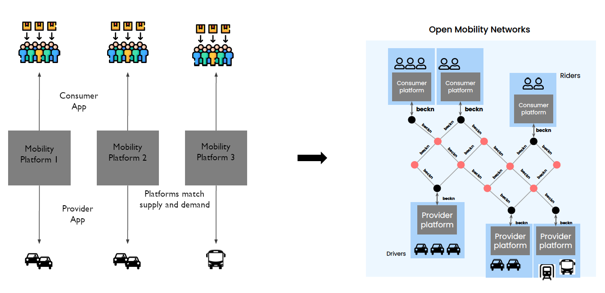
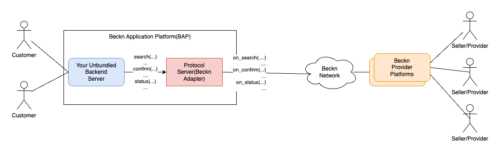
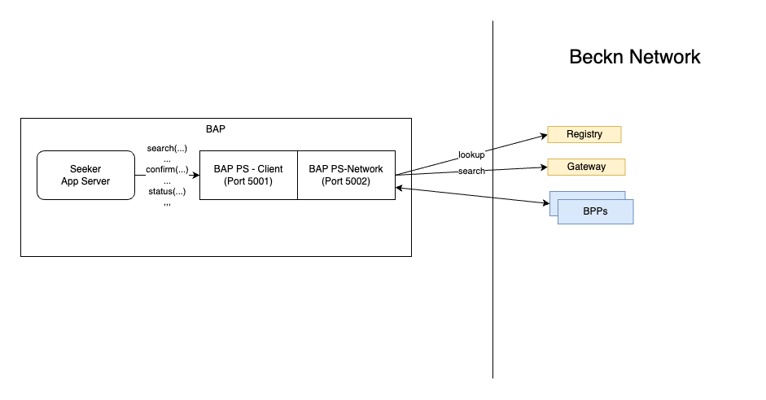
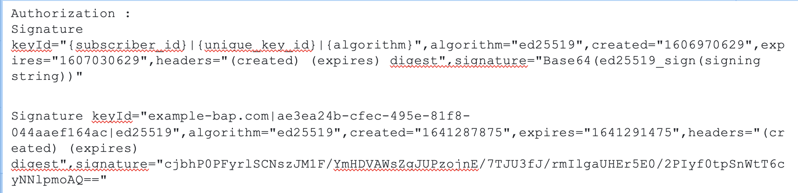
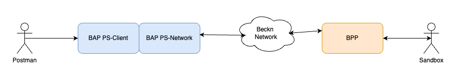

## Seeker Platform's Journey

### Unbundle Your Platform

If you are coming in with a platform that you already have, then probably it will have the following structure. - A consumer service(app) that lets consumers search and initiate orders. - A supplier/provider service(app) that lets suppliers get and fulfil orders. - The platform itself connecting the two.

This is the high level picture of most platforms. The proposition that Beckn brings to the table is that by unbundling the consumer and the supplier side functionalities and having the network match the supply and demand instead of the platform, you open up opportunities to new customers and suppliers.

As a Seeker Platform after you unbundle your Seeker side application will probably have a customer facing application with a backend server providing the following:

- Ability to let customers discover an item or service
- Ability to let customers add items to cart or compose the order
- Ability to let customers order item or service
- Ability to let customers pay for the order
- Ability to let customers track the order to fulfillment
- Ability to let customers leave feedback on items, services and orders.

This unbundled application will now have to connect to the Beckn network for discovery, supply demand matching and communication with providers. **Beckn protocol** defines APIs, authentication and message format to help participants connect to the Beckn network. These APIs cover all aspects of **Discovery, Order, Fulfillment and Post Fulfillment** that are required in commerce tansactions. You can use an Adapter that implements the Beckn protocol to make your task easy. Beckn-ONIX initiative provides a reference implementation of such an adapter and is called the Protocol Server. The following diagram illustrates how your unbundled application might look when connected to the Beckn network

After unbundling, you will be calling the various Beckn API endpoints of the **Beckn Adapter** to send those to the Beckn Network. For example if the user inputs his intent in the UI, you will have to translate the input into a format expected by the Beckn Search API and call the search API of the Beckn Adapter( The word Beckn Adapter and the reference implementation, Protocol Server) are used interchangeably in this document. By default the Beckn Adapter is configured to fetch the search results and return back in the response (In advanced configurations this can be configured to be also asynchronous). You then proceed to show the search results to the user.

So one of the main tasks that needs to be done is to convert your inputs into Schema required by Beckn messages. This is called **Schema mapping** and we will come back to it soon.

In the diagram above and the explanation, we mentioned Beckn Adapter. The Beckn Adapter helps your backnend server send Beckn Requests to the Beckn network. Some of the functionalitites that is hadled by it are

- Exposing REST endpoints that your backend server can call for the various order phases (search, select, init, confirm, status, cancel etc)
- Validating the requests sent by you to be complaint to Beckn core specification as well as any additional rules specified by the network operator (Layer 2 config)
- Signing the request with a private key, so it can be verified by the receiver using your public key
- Waiting and sending back responses in a synchronous fashion (Beckn by default relies on asynchronous messages. The Beckn Adapter wrap this in a simple call to make your backend server task easy)
- Provide logging, observability and other network operation functionality.

As you can see above, the use of Beckn Adapter reduces the burden on your application development significantly. Beckn-ONIX comes with a reference implementation of the Beckn Adapter called the Protocol Server.

### Implementation Guide

As we saw in the previous section, the primary task in Seeker Application development will be to - understand the message flow and data required to be sent in each message - map that data to the Beckn schema for each message.

To help you with this task, the community and network will release implmentation guide for various domains, use cases and networks. Choose the right implementation guide for your case before proceeding further.

The implementation guide will contain the following sections:

1. It will explain the overall domain, the various use-case categories
2. Detailed use cases along with message flow diagrams
3. Example data and mapping to the Beckn Schema for the various messages required for each usecase category
4. Layer 2 Configuration file required to be installed for that network (more on this later)
5. Details on sandbox support (for seeker application developers) and postman collection (for provider application developers).

### Open Source Assets

#### Protocol Server

The primary asset that will help the Seeker Application developers is the reference implementation of the Beckn Adapter called as the **Protocol Server**. This is available in the Beckn-ONIX reference implementation suite. Since this protocol server is helpful in integrating the Consumer side application platform(BAP), this is also referred as the BAP-Protocol Server in the diagrams and during installation.

In the "Unbundle your platform" section, we saw the tasks performed by any Beckn Adapter. The Protocol Server performs all of these tasks. Internally, the Protocol Server is architected as two App servers. One (BAP-Client) exposes endpoints towards the client while the other (BAP-Network) talks to the Beckn network. The following diagram shows the structure of the BAP Protocol Server.

In addition to sending messages in the Beckn format, another key task the Protocol Server does with the messages is sign it so the receiver can verify that the message is originating from the indicated source and has not been tampered with. It signs the message with its private key and attaches a signature to the header. The receiver will lookup the registry for the public key of the sending participant and verify the signature. Refer to this [document](https://github.com/beckn/protocol-specifications/blob/master/docs/BECKN-006-Signing-Beckn-APIs-In-HTTP-Draft-01.md) for more details. The image below shows the format of the Authorization header that goes with a signed message.

The BAP Protocol Server exposes the following endpoints which your app can call

    - search, select, init, confirm, status, cancel, track, support, update, rating

These cover the Order transaction lifecycle (Refer to the image in the Introduction to Beckn section on how these map to the order lifecycle). The default implementation of the BAP Protocol Server will work sychronously and will return back when it has the answers from the network or times out.

### Becknifying your application

With the help of the implementation guide, you start your implementation by - Identifying the Beckn messages you will call on the BAP PS Client. - Mapping the data from the customer into the data to be sent with the Beckn messages - Mapping the data received from the network into the UI to be shown to the user.

With this done, you are ready to integrate your application to the Beckn network.

#### Installing Protocol Server with Beckn ONIX.

- The repository for Beckn-ONIX is [here](https://github.com/beckn/beckn-onix). Use the Installation Guide there for more details on the steps below. Some of the steps here are extracted from the installation guide.

#### Prerequisite

1. When we connecting our seeker app to the Beckn network, we are connecting as a Network Participant of the type BAP. In order for any other network participant to reach us, we need to have a publicly accessible URI for the BAP. This is also called as **Subscriber URI** in documentation. Similarly we need a ID for the BAP called the **Subscriber ID**. Typically (as convention) if we are a company called "example.com", the BAP URI will be "https://bap-network.example.com" and the BAP ID will be "bap-network.example.com".
2. Create two subdomain entries. One as shown above for the BAP PS Network (https://bap-network.example.com) and another for BAP PS Client (https://bap-client.example.com). The URL for the BAP PS Client is optional in production as usually it and its caller (your Customer app backend server) can stay in the same VPC and you do not need any public URL. For the sake of this document, we will continue to have two web addresses.
3. Identify the system on which you will install the BAP Protocol Server. Usually this will be in the same VPC as the Customer App Backend server.
4. When we install the Protocol Server, BAP Protocol Server Client will run on port 5001 and BAP Protocol Server Network will run on port 5002. So we need to configure a reverse proxy on this machine, so the following mapping is done.

- BAP Client URI (e.g. https://bap-client.example.com) is mapped to port 5001
- BAP Network URI (e.g. https://bap-network.example.com) is mapped to port 5002

#### Installation

Use either the GUI or the CLI to install the Protocol Server BAP software. During installation, we are asked for three pieces of information.

1. Registry URL - The registry of the network you want to join. This information will be in the implementation guide. (During installation notice the instructions to see if we need to suffix /subscribers to the registry address)
2. Subscriber ID - The subscriber ID for the BAP Protocol Server (you decided in the Prerequisite section)
3. Subscriber URL - The subscriber URL for the BAP Protocol Server (you decided in the Prerequisite section)

The installation will install the Protocol Server and other required support software and register it with the registry. Once this is done, you might have to contact the network facilitator to get yourself approved as a Network Participant.

#### Testing the installed protocol server using Postman

In case you want to test the installed Protocol Server before you integrate it with your application, you can do so with Postman. The implementation guide will have the required Postman collection. You can also find a bunch of Postman collections for different domains [here](https://github.com/beckn/beckn-sandbox/tree/main/artefacts).

Within each postman collection, there are usually collection variables defined. Change these variables, to change the following.

- The bap_subscriber_id should be the Subscriber ID from above (e.g. bap-network.example.com)
- The bap_subscriber_url should be the Subscriber URL from above (e.g. https://bap-network.example.com)
- The base_url should be the address of the BAP PS Client (e.g. https://bap-client.example.com)

The following diagram shows how Postman connects to your seeker side app. Further it also shows the existance of a Sandbox. Sandbox is a mock Seller side platform that is usually present in most trial networks and can help you to verify your Seeker Side application without having to write a corresponding Provider side application.

#### Replacing postman with your own app backend

Once you have tested with Postman, it is time to test directly calling the Protocol Server Endpoints from your application. You will be sending the Beckn requests (search, select etc ) to the BAP PS Client address (e.g. https://bap-client.example.com/search, https://bap-client.example.com/select etc). By default the BAP PS is configured to wait for response from the network and return back the responses synchronously.

### Troubleshooting guide

TODO: Add link to common troubleshooting guide.
