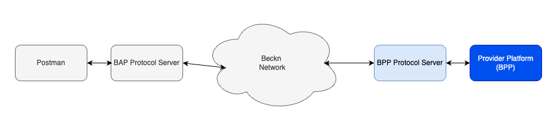

# Beckn Starter Kit

## Introduction

[Beckn](https://github.com/beckn) is an open protocol that facilitates commerce transactions on open interoperable networks. This document guides participants new to the network to get up and running. It contains the following sections

- Brief introduction about Beckn and its terminologies
- Learning resources that help you understand more about Beckn
- Handy checklist for network participants
- Implementation guides that will help build your software, integrate with Beckn and conduct transactions on it
- Other resources

## Brief introduction to Beckn Network

**Beckn (short for beckn protocol)** is an [open protocol](https://developers.becknprotocol.io/docs/introduction/introduction/) for decentralized commerce. It consists of several specifications for building open e-commerce networks across which sellers and their offers are universally discoverable from any Beckn-enabled app or platform. As a protocol, Beckn is multi-layered, with layer structure and organization resembling that of HTTP.

The foundation layer of a Beckn network is the Specification layer.
[TODO: Complete this section]

## Learning resources

Use the following resources to gain deeper knowledge about Beckn protocol and the ecosystem

[Introduction to Beckn By Ravi Prakash - Video Playlist](https://www.youtube.com/watch?v=7Otfcy37-NE&list=PLBC6c8MLy9uVUIb1BOgdOa8tP4rX6c4aK&index=1)
[Online Introduction to Beckn for developers](https://developers.becknprotocol.io/docs/introduction/introduction/)
[Walkthrough of Beckn ONIX installation](TODO: Link to Mishal's videos)

Beckn Developers guide: https://developers.becknprotocol.io

## Beckn Resources for reference

Protocol Specification: https://github.com/beckn/protocol-specifications

Beckn-Onix: https://github.com/beckn/beckn-onix

## Checklist and stories for network participants

This section contains story version of your journey as a network participant (Seeker Platform/Provider Platform). It is written to give a quick flavor of tasks that are detailed in the latter sections of this document

### Seeker Platform Journey - story version

This section describes the journey of a new Seeker Platform Participant

1. Get introduced to the network, the problem it solves and the various categories of use cases that it supports.
2. Look at sample outcome visualizations and use cases published by the network
3. Imagine/identify the use cases that appeal to you as a Seeker Platform.
4. Imagine the outcome visualization of your flow
5. Verify use case with Network support staff
6. Learn Beckn Protocol, its API and schema
7. With the help of implementation guide, formulate the flow and message content as postman collection
8. Register yourself on the Sandbox
9. Run your API flow from postman against the Beckn Sandbox on the sandbox environment
10. Wireframe UI and develop the UI and non-beckn functionality of Seeker Platform
11. Install the Protocol Server, install layer 2 config and connect it to the sandbox
12. Test the connection from UI all the way to sandbox and back.
13. Check process to get onto the pre-prod network
14. Test application with other providers on pre-prod network
15. Check process to get onto the prod network
16. Setup a observability server and route the logs to it.
17. Migrate the app to production network
18. Setup support infrastructure for customers
19. Launch the product with supporting website etc
20. Monitor adoption and health of application using observability dashboard
21. Congratulate self on job well done

### Provider Platform Journey - story version

This section describes the journey of a new Seeker Platform Participant

1. Get introduced to the network, the problem it solves, the opportunity it presents etc.
2. Check the outcome visualizations of the use case categories.
3. Choose use cases that appeal to you as a provider.
4. Imagine outcome visualization of your idea and get vetted with network support staff
5. Learn Beckn Protocol, its API and Schema
6. Go through the implementation guide for your use case category. Understand the API, schemas and flow involved.
7. Create required endpoints and message packets
8. Sign up for sandbox access
9. Install the Protocol Server and install the layer 2 configs
10. Hook up your software with the sandbox environment
11. Try the use case with postman collection provided by the network
12. Complete/integrate the shop software including order processing, backend integration required etc
13. Check requirements for pre-prod and connect your software to pre-prod network
14. Transact with other seeker side software on pre-prod and ensure inter-operability
15. Check and take software to production environment
16. Install and configure a network observability software
17. Ensure catalog is visible and order process is working fine
18. Monitor transactions and component health on observability software
19. Congratulate on a job well done

## Implemenation

This section provides guidance on implementinng your software and taking it to production. To help you with this, the network will provide you an **implementation guide**. This implementation guide will have the following sections

- Outcome visualization - This will contain the stories of user experience of the use cases
- Flow diagram - Flow diagrams will illustrate the flow of messages on the Beckn network corresponding to the use cases
- API Mapping and sample JSON Schemas - Detailed API requests and responses corresponding to the flow diagrams above
- Taxonomy, layer 2 configs and rules - Details on the enumerations and other layer 2 config corresponding to the use case
- Additional instructions and notes to help in implemenation.

With the implementation guide in hand, your journey starts.

### Concept of your application and its place in network

You begin the journey by identifying the network you join.

1. From the implementation guide, understand Domain specific use cases and outcomve visualizations
2. Identify the use case(s) you want in your application
3. Identify the roles
4. Get use case validated with network facilitators
5. Identify the tech resources required to implement use case

### API Integration

#### Understand the APIs

This involves following parts.

1. Understand the [Beckn Protocol API(DOFP)](https://developers.becknprotocol.io/docs/introduction/beckn-protocol-specification/). You would have already done this if you finished the learning section above. Also refer to [General Beckn message flow and error handling](TODO: Add link to the document) for details on error handling
2. Second is to understand the specific usecases detailed in your implementation guide
3. Third is to understand any network specific non-Beckn API (optional and if required, will be listed in implementation guide)

#### Integrating the seeker platform

If you are writing the seeker platform software, the following are the steps you can follow to build and integrate your application.

1. Identify the use cases from above section that are close to the functionality you plan for your application.
2. Design and develop the UI that implements the flow you need. Typically you will have a API server that this UI talks to and it is called the Seeker Platform in the diagram below.
3. The API server should construct the required JSON message packets required for the different endpoints shown in the API section above.
4. Setup the API and the UI
5. Develop non-beckn functionality (such as login, profile, order history etc)
6. Register in sandbox environment of the network (Your network website will have the details)
7. Setup the hardware for the Beckn Adapter. Benchmark document will have the minimum configuration for your requirements.
8. Setup required subdomains and reverse proxy[Setup subdomains and proxy](https://github.com/beckn/beckn-onix/blob/main/docs/user_guide.md#appendix-a---registering-or-adding-domain-or-subdomains)
9. Install the BAP Beckn Adapter using [Beckn-ONIX](https://github.com/beckn/beckn-onix)
10. [Download and install layer 2 config file](https://github.com/beckn/beckn-onix/blob/main/docs/user_guide.md#downloading-layer-2-configuration-for-a-domain) - The address from where to install will be specified in the implementation guide
11. Check with your network tech support to enable your BAP Protocol Server in the registry.
12. Once enabled, you can transact on the Beckn Network. Typically the sandbox environment will have the rest of the components you need to test your software. In the diagram below,
    - you write the Seeker Platform(dark blue)
    - install the BAP Protocol Server (light blue)
    - the remaining components are provided by the sandbox enviornment

#### Integrating the provider platform

If you are writing the provider platform software, the following are the steps you can follow to build and integrate your application.

1. Identify the use cases from above section that are close to the functionality you plan for your application.
2. Design and develop the component that accepts the Beckn requests and interacts with your software to do transactions. It has to be a endpoint(it is called as webhook_url in the description below) which receives all the Beckn requests (search, select etc). This endpoint can either exist outside of your marketplace/shop software or within it. That is a design decision that will have to be taken by you based on the design of your existing marketplace/shop software. This component is also responsible for sending back the responses to a the Beckn Adaptor.
3. Register in sandbox environment of the network (Your network website will have the details)
4. Setup the hardware for the Beckn Adapter. Benchmark document will have the minimum configuration for your requirements.
5. Setup required subdomains and reverse proxy[Setup subdomains and proxy](https://github.com/beckn/beckn-onix/blob/main/docs/user_guide.md#appendix-a---registering-or-adding-domain-or-subdomains)
6. Install the BPP Beckn Adapter using [Beckn-ONIX](https://github.com/beckn/beckn-onix)
7. [Download and install layer 2 config file](https://github.com/beckn/beckn-onix/blob/main/docs/user_guide.md#downloading-layer-2-configuration-for-a-domain) - The address from where to install will be specified in the implementation guide
8. Check with your network tech support to enable your BPP Protocol Server in the registry.
9. Once enabled, you can transact on the Beckn Network. Typically the sandbox environment will have the rest of the components you need to test your software. In the diagram below,

   - you write the Provider Platform(dark blue) - Here the component you wrote above in point 2 as well as your marketplace/shop software is together shown as Provider Platform
   - install the BPP Protocol Server (light blue)
   - the remaining components are provided by the sandbox enviornment
   - Use the postman collection to test your Provider Platform

### Pre-production

1. Different networks will have different requirements for pre-prod. At a minimum, they might want you to submit logs for specific flows. Check your network website for details
2. Register on Pre-production environment
3. Test application with seeker/provider available on pre prod environment

### Production preparedness

1. Sign required legal work for integration with network
2. Request for access to Production environment

### Go-Live

1. Connect your platform(BAP/BPP) to the production network
2. Setup support channel for users
3. Create a dashboard to track updates and problems
4. Monitor network and business stats

## Other Resources

- [Beckn Developer Resources](https://developers.becknprotocol.io/docs/introduction/introduction/)
- [Beckn Protocol Specification Respository](https://github.com/beckn/protocol-specifications)
- [Beckn Glossary](TODO: Add a public link)
- [Beckn FAQ](TODO: Add a public link)
