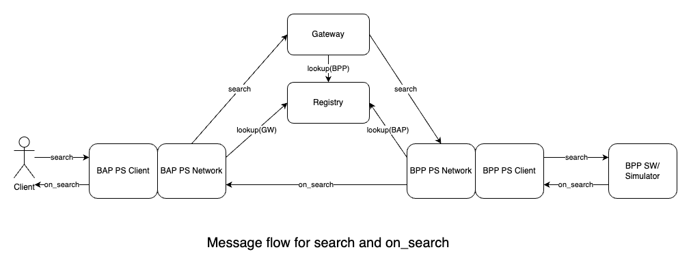
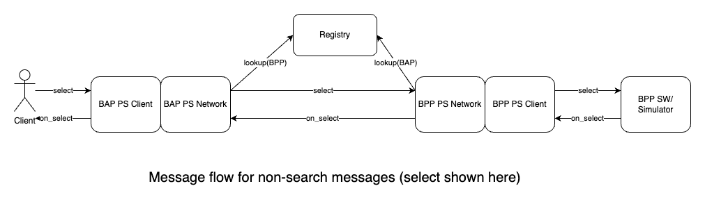
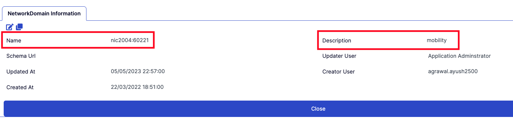

## Table of contents

## Introduction

This document contains instructions to troubleshoot all aspects of the Beckn Network. It currently shows instructions for Protocol Server, Registry and Gateway.

## How to use the guide

The guide has multiple sections. The first section common has some design notes as well as problems common to all products. If you are unsure of the message flow in Beckn, look at the first sections of the Common section.

If you have problem with a particular product, check once in the common section and then the particular section for the product.

## Common

### Flow of messages in Beckn

This section summarizes the flow of messages in Beckn.


The following is the flow of a search message:

1. The message comes from the client/postman to BAP-PS-Client
2. The message goes through to the BAP-PS-Network.
3. The BAP-PS-Network requests the registry for the gateway address
4. The BAP-PS-Network signs and sends the search request to the gateway
5. The gateway requests the registry for the list of BPPs to multicast
6. The gateway multicasts the search request to the BPP.
7. Each BPP-PS-Network which receives the search message, looks up the public key of BAP on registry, verifies the message and forwards it to BPP-PS-Client
8. BPP-PS-Client calls the webhook configured with the search request
9. The BPP software or sandbox will call the BPP-PS-Client with the on_search response
10. The BPP-PS-Client sends the on_search response to BPP-PS-Network
11. The BPP-PS-Network signs the message and sends to the BAP-PS-Network
12. The BAP-PS-Network looks up the registry for the public key, verifies and passes the message back to BAP-PS-Client
13. The BAP-PS-Client aggregates the responses and passes it back to the waiting request.



The following is the flow of a rest of the P2P messages (select,init,confirm etc):

1. The message comes from the client/postman to BAP-PS-Client
2. The message goes through to the BAP-PS-Network.
3. The BAP-PS-Network signs and sends the search request to the BPP-PS-Network
4. The BPP-PS-Network which receives the message, looks up the public key of BAP on registry, verifies the message and forwards it to BPP-PS-Client
5. BPP-PS-Client calls the webhook configured with the request
6. The BPP software or sandbox will call the BPP-PS-Client with the on_xxxxx response
7. The BPP-PS-Client sends the on_xxxxx response to BPP-PS-Network
8. The BPP-PS-Network signs the message and sends to the BAP-PS-Network
9. The BAP-PS-Network looks up the registry for the public key, verifies and passes the message back to BAP-PS-Client
10. The BAP-PS-Client passes it back to the waiting request.

### Accessing logs

Note that some of the logs might be showing the timestamp in UTC. You can identify it with the letter Z at the end of the timestamp.

There are two ways to access logs.

1. The first will be to access them on the machine where they are running. This will require ssh access.

```
docker logs -f bap-client
docker logs -f bap-network
docker logs -f bpp-client
docker logs -f bpp-network
docker logs -f registry
docker logs -f gateway
```

- The docker logs for the registry and gateway are not very useful. Instead do the following for the registry

```
$ docker exec -it registry sh
$ cd tmp
$ tail -f java_info0.log.0
```

- Do the following for the gateway

```
$ docker exec -it gateway sh
$ cd tmp
$ tail -f java_info0.log.0

```

2. The second is through the web endpoint for each of the component. The protocol server supports the `/logs` endpoint. The gateway supports `/bg/log/0`. Add this to your corresponding URL. **Note that the logs for the protocol server append in the end and do not auto refresh in the browser. So refresh page always before checking**. So for example the following are the log locations of the cloud hosted BAP/BPP in the Beckn Open Collective envrionment. For your environment, you will have to use the right url.

```
BAP-PS-Client  - https://ps-bap-client.becknprotocol.io/logs
BAP-PS-Network  - https://ps-bap-network.becknprotocol.io/logs
BPP-PS-Network  - https://sandbox-bpp-network.becknprotocol.io/logs
BPP-PS-Client  - https://sandbox-bpp-client.becknprotocol.io/logs
Gateway  - https://gateway.becknprotocol.io/bg/log/0
```

### Common problems

**Prob: When I type the address of the logs endpoint, I get a `This site cant be reached` error in the browser**
**Sol:** Check if the address has been properly typed in the address bar

**Prob: When I type the address of the registry/gateway/logs endpoint, I get `502 Bad Gateway` error and the page has the word Nginx in it.**
**Sol:** This is usually due to either the Nginx not being configured properly or the docker container not being up. For example, if you get this error when you are trying to reach the registry, then it means that either the Nginx is not configured to proxy the request to the right port (3030) or the registry is not running at the port(3030). The nginx can be configured in different ways by system administrators. So check either the `/etc/nginx/sites-enabled` folder or the `/etc/nginx/conf.d` folder to see the configuration files and if it is proxying to the right port. Next check `docker ps` to see if the registry is up and in the docker output, check if the exposed port is alright.

## Troubleshooting Registry

**Prob: Subscriber list call from BAP to the registry seems to be empty**
**Sol:** When you create network domain in the registry, the actual domain name is the "Name" field and not the "Description" field. When you create network roles, the field shown for selection is description. However the real value that should be present in the request should be the name and not the description. For example in the image shown above, the context.domain should be nic2004:60221 and not "mobility".



## Troubleshooting Gateway

**Prob: Status 400 Cannot invoke "in.succinct.onet.core.adaptor.NetworkAdaptor$Domain.getExtensionPackage() because the return value of "in.succinc.onet.core.adaptor.NetworkAdaptor$Domains.get(String)is null" when sending message from BAP to Gateway**
**Sol:** Newer versions of Gateway are caching the domain names from bootup. So if the domain is later added to registry, it is not able to get it. Restart the gateway and the error should go.

## Troubleshooting Protocol Server

**Prob: 422 Layer 2 config file "ev-charging_uei_1.1.0.yaml" is not installed and it is marked as required in configuration"**
**Sol:** Beckn-ONIX has made installation of the layer 2 config file as mandatory. You need to download and install this on both the BAP and BPP. Use the beckn-onix/layer2/download\*.sh scripts to install it on your BAP/BPP Protocol Server. You can get the layer 2 config file from your network or in repositories such as beckn-sandbox.

**Prob: When I type the address of the BAP-Network in a browser, I get 'Cannot GET /' error**
**Sol:** This in itself is not an error. The BAP-Network exposes endpoints to which you can send POST request. You are asking for GET in the browser. So just ignore this message. If you want to see logs, use the /logs endpoint.

**Prob: Logs shows "invalid input .... libsodium-wrappers.js" when BAP-Protocol Server receives a message**
**Sol:** Sometimes the "=" symbol at end of public key and "==" symbol at end of private key in the default/config.yml get missed out in some Operating Systems. We have not been able to identify why this happens. If it does, make sure public key ends with one equal and private with two equals. Also ensure that the public key matches with the entry in the registry.
